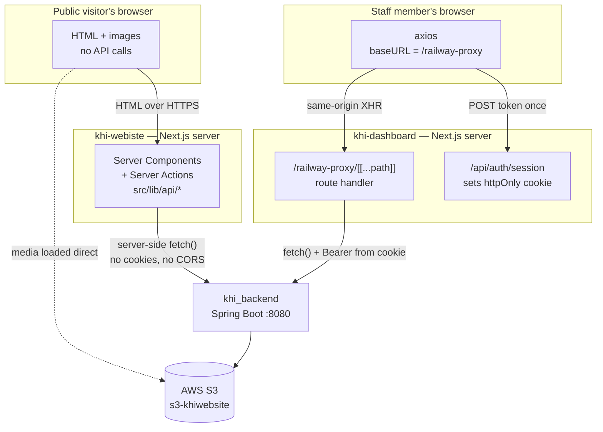
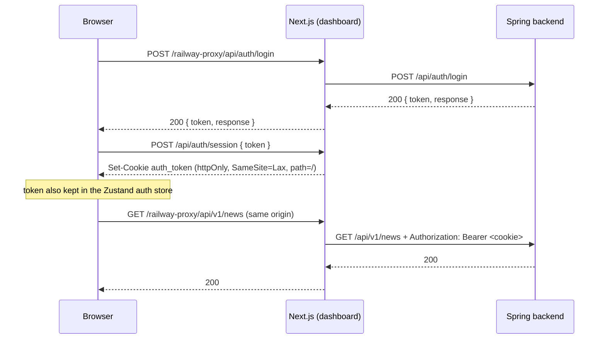
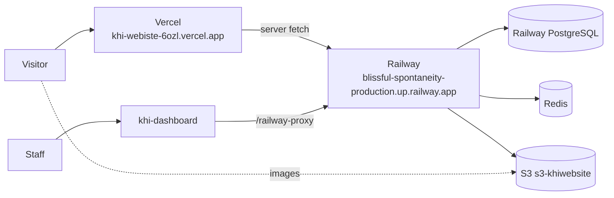

# Backend ↔ Frontend Integration

> **Audience:** anyone who has to run, change or debug the KHI stack as a whole ·
> **Scope:** how `khi_backend` connects to the two KHI frontends — the public website and the admin
> dashboard — on this Mac and in production ·
> **Sources read:** `src/main/resources/application.yaml`, `pom.xml`,
> `user/configs/SecurityConfig.java`, `user/configs/AppCorsProperties.java`,
> `khi_app/config/S3Config.java`, `user/api/UserAPI.java`, and, in the frontend repos,
> `khi-webiste/src/lib/api/*`, `khi-webiste/next.config.ts`,
> `khi-dashboard/app/railway-proxy/[[...path]]/route.ts`,
> `khi-dashboard/app/api/auth/session/route.ts`, `khi-dashboard/lib/axios.ts` ·
> **Verified:** 2026-09-01

Every other document in `docs/` describes the backend from the inside: what an endpoint accepts,
what a table holds, which role may call what. This one describes the **seams** — the places where
the Spring application stops and a Next.js application begins. It exists because the two frontends
connect in two completely different ways, and almost every "it works locally but not on Vercel"
problem in this project comes from applying one frontend's rules to the other.

---

## 1. The three repositories on this Mac

| Repository | Path on this machine | Stack | Git remote | Branch |
|---|---|---|---|---|
| **Backend (this repo)** | `~/Desktop/khi_backend` | Spring Boot 4.0.2 · Java 21 · PostgreSQL · Redis · S3 | `github.com/khi-krd/khi-backend` | `main` |
| **Public website** | `~/Desktop/khi-webiste` | Next.js 16 (App Router) · React 19 · next-intl · Tailwind 4 · pnpm | `github.com/khi-krd/khi-webiste` | `design-fix-test` |
| **Admin dashboard** | `~/Desktop/khi-dashboard` | Next.js (App Router) · React · TanStack Query/Table · Zustand · TipTap | `github.com/khi-krd/khi-dashboard` | `main` |

There is a fourth folder, `~/Desktop/khi-web-frontend` (remote `akararkan/khi-frontend`, last commit
April 2026, Vite + React). It is the **previous** public site, superseded by `khi-webiste`. It is
still the reason `http://localhost:5173` and `https://khi-frontend-*.vercel.app` appear in the CORS
allowlist. Do not develop against it.

The backend exposes 18 controller classes — 15 `*Controller` in `khi_app/api/**` plus
`UserAPI`, `UserProfileAPI` and `SessionAPI` in `user/api/` — under two path families:
`/api/v1/**` for content and `/api/auth/**` + `/api/user/**` + `/api/users/**` for identity.

---

## 2. Two frontends, two different wirings

This is the single most important diagram in this file.



Read it as two sentences:

**The public website never talks to the backend from a browser.** `src/lib/api/client.ts` and
`src/lib/api/config.ts` both start with `import "server-only"`, which makes the build fail if that
code is ever pulled into a client bundle. Every CMS read happens inside a React Server Component or
a Server Action running on the Next.js server. The consequence: the website needs **no CORS entry,
no token, and no cookie**. `API_BASE_URL` is a server-only variable and is deliberately *not*
prefixed `NEXT_PUBLIC_`, so the backend's origin never reaches the visitor's browser.

**The dashboard always talks to the backend from a browser, but never directly.**
`lib/axios.ts` sets `baseURL` to `process.env.NEXT_PUBLIC_API_URL`, which is the literal path
`/railway-proxy`. Every call is therefore same-origin; the Next.js route handler at
`app/railway-proxy/[[...path]]/route.ts` forwards it to `API_PROXY_TARGET`. The consequence: the
dashboard also needs **no CORS entry**, because from the browser's point of view there is no
cross-origin request at all.

So the CORS allowlist in `application.yaml` currently protects neither production frontend. It
matters for direct-to-backend clients: Swagger UI on another origin, the legacy Vite app, curl in a
browser console, and any future frontend that decides to skip the proxy.

---

## 3. The public website — `khi-webiste`

### How a page is built

1. A request for `/ckb/news` reaches the Next.js server.
2. The route's Server Component calls something like `getNewsPage()` in `src/lib/api/news.ts`.
3. That calls `apiFetchPage()` / `apiFetch()` in `src/lib/api/client.ts`.
4. `client.ts` resolves the path against `API_BASE_URL`, `fetch`es it, and **validates the JSON with
   a Zod schema** from `src/types/` (e.g. `src/types/news.ts`).
5. HTML is streamed to the visitor. Images and video posters point straight at S3.

### The three response shapes the client understands

`unwrapApiPayload()` in `client.ts` accepts all three, in this order:

| Shape returned by Spring | What the client does |
|---|---|
| `{ "success": true, "data": … }` | unwraps to `data`; `success: false` becomes `null` |
| A Spring `Page` — `{ content, totalElements, totalPages, number, size, … }` | parsed by `PageShellSchema`, items validated one by one |
| A bare DTO or array | passed through to the schema |

**Item-level tolerance is deliberate.** `parsePageItems()` validates each element separately, so one
malformed record drops out of the grid instead of blanking the whole page. In development the
mismatch is logged as `[api] Zod parse failed for <path>: <field>: <message>`. In production it is
silent. If a field you just added to a DTO does not appear on the site, this is almost always why —
the Zod schema in `src/types/` has not been updated. (`src/lib/schemas/` is a different thing —
it holds the react-hook-form validation schemas for the contact and donation forms.)

**Failures are soft.** Every helper returns `null` on a non-2xx response, a JSON error, or a schema
miss. The website renders an empty section rather than a 500. That is good for visitors and bad for
debugging, so when a section is mysteriously empty, check the backend response first with `curl`.

### Caching and on-demand revalidation

`API_REVALIDATE_SECONDS` drives the whole policy, parsed in `parseCachePolicy()`:

| Value | Behaviour |
|---|---|
| unset, `0`, `no-store` | `cache: "no-store"` — every page render re-reads the backend. This is the current local and production value. |
| positive integer *n* | Next.js ISR with a `revalidate: n` window plus cache tags. |

With ISR enabled, the backend can push a cache bust: `POST /api/revalidate` on the website with
header `x-revalidation-secret: <REVALIDATION_SECRET>` and a body of `{ "tags": [...], "paths": [...] }`.
The route compares the secret in constant time, rejects absolute paths and `..` traversal, and can
optionally purge Cloudflare when `CLOUDFLARE_ZONE_ID` and `CLOUDFLARE_API_TOKEN` are both set. Today
that hook is unused because the TTL is `0` — turn the TTL on *first*, then wire the publish hook.

### Writes from the public site

Only two, both Server Actions in `src/lib/actions/` — so the visitor's browser still never sees the
backend:

| Action | Backend endpoint | Security rule |
|---|---|---|
| `submitContactFormAction` | `POST /api/v1/contact/messages` | `permitAll()` |
| `submitFinancialDonationAction` | `POST /api/v1/donations/financial` | `permitAll()` |
| `submitArchiveDonationAction` | `POST /api/v1/donations/archive` | `permitAll()` |

`SecurityConfig` permits exactly these three POSTs anonymously and makes the matching `GET` and
`PATCH` admin-only. Reading submissions is a dashboard job; creating them is a website job.

### Media

The backend stores uploads in S3 bucket `s3-khiwebsite`, region `us-east-1`, under
`khi-web-folders/` (`aws.s3.*` in `application.yaml`) and returns absolute S3 URLs in its DTOs.
`next.config.ts` sets `images.unoptimized: true` with `remotePatterns: [{ protocol: "https",
hostname: "**" }]`, so `next/image` serves the original URL untouched instead of proxying it through
`/_next/image`. `NEXT_PUBLIC_MEDIA_HOST` (`s3-khiwebsite.s3.us-east-1.amazonaws.com`) is used for
PDF-worker hints and media-URL resolution, not for access control.

This differs sharply from the Archive Platform backend, which never hands an S3 URL to a browser.
Here, an S3 object URL **is** the public contract, so the bucket's object ACL / bucket policy is what
keeps media reachable.

---

## 4. The admin dashboard — `khi-dashboard`

### The proxy

`app/railway-proxy/[[...path]]/route.ts` is a catch-all handler that:

- refuses with `502 {"error":"API_PROXY_TARGET is not set"}` when the env var is missing;
- forwards only `content-type`, `accept` and `accept-language` — deliberately **not** `Host` or
  `Origin`, so `fetch()` sets a `Host` the Railway router accepts;
- replaces `Authorization` with `Bearer <auth_token cookie>` when that cookie exists, and otherwise
  passes the client's own `Authorization` header through;
- **streams** request bodies (`init.body = req.body`, `duplex: "half"`) instead of buffering, because
  media uploads run to ~500 MB and `await req.arrayBuffer()` would OOM the Node process;
- copies response headers except `set-cookie` and hop-by-hop headers, re-appends `Set-Cookie`
  through `getSetCookie()`, and adds `Server-Timing: upstream;desc="backend";dur=<ms>` so real
  backend latency is visible in DevTools → Network → Timing.

### The login handshake

The backend's `POST /api/auth/login` returns a `Token` — `{ "token": "...", "response": "..." }` —
and *also* sets the JWT cookie server-side via `JwtCookieService` (`withAuthCookie(...)` in
`UserAPI`). That cookie is configured entirely from env: `JWT_COOKIE_NAME`, `JWT_COOKIE_SECURE`,
`JWT_COOKIE_HTTP_ONLY`, `JWT_COOKIE_SAME_SITE`, `JWT_COOKIE_PATH`, `JWT_COOKIE_MAX_AGE`.

The dashboard does not rely on that cookie, because it is set for the *backend's* origin and the
browser only ever sees the dashboard's origin. Instead:



Two details worth remembering:

- **`expiresIn` is not sent.** `app/api/auth/session/route.ts` reads `rec.expiresIn` if it is a
  positive number and otherwise defaults the cookie to 7 days. The backend's `Token` DTO has no such
  field, so the 7-day default is what actually applies — while `JWT_EXPIRATION_MS` governs the token
  itself. If the JWT lifetime is shorter than 7 days, the cookie outlives the token and the user gets
  a 401 that the axios interceptor turns into a forced re-login.
- **Two token stores.** `lib/axios.ts` also attaches `Authorization` from the Zustand store, but the
  proxy overwrites it with the cookie value whenever the cookie exists. The cookie is the source of
  truth; the store is what survives a soft navigation.

On any non-login `401`, the axios response interceptor clears the auth store, shows a Sorani toast,
and fires a `keepalive` `DELETE /api/auth/session` to clear the cookie.

### Language

`lib/axios.ts` pins `Accept-Language: ckb` on every request. `message` is the only field the backend
localises (`src/main/resources/i18n/messages_{en,ckb,kmr}.properties` via `I18nConfig`), and without
this header Spring picks its own default — which is how an English sentence once surfaced in a
Sorani-only dashboard toast. The public website carries `ckb.json` and `ku.json` in `messages/` and
handles its own copy through next-intl.

### Multipart

`lib/axios.ts` deletes the default `Content-Type: application/json` when the payload is a
`FormData`, so the browser can set the multipart boundary. The backend accepts these through
`MultipartJsonConfig`, with Tomcat and Spring both raised to 1 GB
(`spring.servlet.multipart.max-file-size`, `server.tomcat.max-swallow-size`,
`max-http-form-post-size`). If a large upload dies, check the reverse proxy in front of Spring
before suspecting the app.

---

## 5. CORS — the exact rules

```
app.cors.allowed-origins:
  https://khi-dashboard-production.up.railway.app
  https://khi-website-production.up.railway.app
  https://khi-frontend.vercel.app
  https://khi-frontend-*.vercel.app
  http://localhost:5173
  http://localhost:3000
```

- Bound to `AppCorsProperties` (`@ConfigurationProperties("app.cors")`), split on commas, trimmed.
- Applied in `SecurityConfig.corsConfigurationSource()` with
  **`setAllowedOriginPatterns(...)`**, not `setAllowedOrigins(...)` — which is why the
  `khi-frontend-*.vercel.app` wildcard works and why `allow-credentials: true` is legal alongside it.
- `OPTIONS /**` is `permitAll()`, so preflights are never blocked by authorization rules.
- Registered for `/**` through a `UrlBasedCorsConfigurationSource`.

`khi_app/config/CorsConfig.java` is an empty `@Configuration` class. It configures nothing; the real
CORS setup lives in `SecurityConfig`. Do not add a second source there — two CORS configurations
produce duplicate `Access-Control-Allow-Origin` headers, which browsers reject.

Note what is **absent**: `https://khi-webiste-6ozl.vercel.app`. That is correct, per §2 — the live
site never issues a browser request to the backend.

---

## 6. Environment variables — the complete matrix

### Backend (`~/Desktop/khi_backend`)

There is no `.env` in this repo and none is committed (`.gitignore` line `.env`), and the IntelliJ run
configuration `.idea/runConfigurations/Main.xml` defines no environment block. `spring-dotenv`
(`me.paulschwarz:spring-dotenv:4.0.0`) is on the classpath, so the supported way to run locally is a
`.env` file at the repository root — see §7 for a ready template.

| Variable | Required | Used by |
|---|---|---|
| `PGHOST`, `PGPORT`, `PGDATABASE`, `PGUSER`, `PGPASSWORD` | yes | `spring.datasource.*` — no defaults, startup fails without them |
| `JWT_SECRET` | yes | HMAC signing key. Rotating it invalidates every issued token. |
| `JWT_EXPIRATION_MS` | yes | token lifetime |
| `JWT_COOKIE_NAME` / `_SECURE` / `_HTTP_ONLY` / `_SAME_SITE` / `_PATH` / `_MAX_AGE` | yes | `JwtCookieService`; no defaults in `application.yaml` |
| `REDIS_HOST` / `REDIS_PORT` / `REDIS_PASSWORD` | no | default `localhost` / `6379` / empty |
| `AWS_ACCESS_KEY_ID`, `AWS_SECRET_ACCESS_KEY` | effectively yes | `S3Config` uses `DefaultCredentialsProvider`, so env vars, `~/.aws/credentials`, or an instance role all work |

The bucket itself is **not** env-driven here: `aws.s3.region: us-east-1`, `bucket: s3-khiwebsite`,
`base-folder: khi-web-folders` are hardcoded in `application.yaml`. Changing environment means
editing that file.

### Public website (`~/Desktop/khi-webiste/.env`)

| Variable | Scope | Current value on this Mac |
|---|---|---|
| `API_BASE_URL` | runtime, **server only** | `https://blissful-spontaneity-production.up.railway.app` |
| `NEXT_PUBLIC_SITE_URL` | build-time | `https://khi-webiste-6ozl.vercel.app` |
| `API_REVALIDATE_SECONDS` | runtime | `0` (no-store) |
| `REVALIDATION_SECRET` | runtime | unset — required only when the TTL is positive |
| `NEXT_PUBLIC_MEDIA_HOST` | build-time | `s3-khiwebsite.s3.us-east-1.amazonaws.com` |
| `CLOUDFLARE_ZONE_ID`, `CLOUDFLARE_API_TOKEN` | runtime | unset (edge purge skipped) |
| `NEXT_PUBLIC_ENABLE_BORDER_RADIUS`, `NEXT_PUBLIC_BORDER_RADIUS` | build-time | `false`, `m` |
| `ENABLE_HSTS` | build-time | unset |

Local development points at the **Railway** backend, not at `localhost:8080`. Point it at your local
backend by setting `API_BASE_URL=http://localhost:8080` in `.env.local`.

### Dashboard (`~/Desktop/khi-dashboard/.env.local`)

| Variable | Scope | Current value |
|---|---|---|
| `API_PROXY_TARGET` | runtime, **server only** | `https://blissful-spontaneity-production.up.railway.app` |
| `NEXT_PUBLIC_API_URL` | build-time | `/railway-proxy` |
| `NEXT_PUBLIC_SITE_URL` | build-time | `https://khi-webiste-6ozl.vercel.app` |
| `NEXT_PUBLIC_SITE_LABEL` | build-time | `KHI` |

`NEXT_PUBLIC_*` values are **inlined at build time**. Changing one in a running container does
nothing; you must rebuild. `API_PROXY_TARGET` is read per request and can be changed by restart
alone — and must never be given a `NEXT_PUBLIC_` prefix.

---

## 7. Running the whole stack locally on this Mac

### What is already installed here

| Tool | Status on this machine |
|---|---|
| JDK | OpenJDK **25.0.2** at `~/Library/Java/JavaVirtualMachines/openjdk-25.0.2` — the only JDK present |
| Maven | 3.9.14 (Homebrew) — plus `./mvnw` in the repo |
| Node | v24.13.0 · pnpm 10.33.0 · npm 11.6.2 |
| PostgreSQL | `postgresql@18` via Homebrew, **running**, listening on `127.0.0.1:5432` |
| Databases | `khi_web_db` ← this backend · `khi_archive_platform_db` ← the archive backend · `irc` |
| Redis | **No `redis-server` binary.** Port 6379 is served by a Docker container. |
| Docker | `/usr/local/bin/docker` |

`pom.xml` sets `<java.version>21</java.version>`, and the Spring Boot parent turns that into
`maven.compiler.release=21`. Building on JDK 25 is therefore fine — the bytecode targets 21 — but the
*runtime* is 25. If you hit a library that misbehaves on 25, install a JDK 21 and select it in
IntelliJ rather than lowering `java.version`.

### Step 1 — PostgreSQL

```bash
brew services list                      # postgresql@18 should read "started"
brew services start postgresql@18       # if it does not
/opt/homebrew/opt/postgresql@18/bin/psql -l | grep khi_web_db
```

`ddl-auto: update` means Hibernate creates and alters tables at startup — there is no Flyway or
Liquibase in this project. Read [`database/MIGRATIONS.md`](database/MIGRATIONS.md) **before** editing
an entity; `update` never drops or narrows a column, so a rename silently leaves the old one behind.

### Step 2 — Redis

`spring.cache.type: redis` is not optional: with no Redis reachable, cache operations fail and
startup or first request errors out. There is no local Redis binary, so use Docker:

```bash
docker run -d --name khi-redis -p 6379:6379 redis:7-alpine
docker start khi-redis          # on later days
```

Keys are namespaced `khi:` with a 10-minute default TTL (`spring.cache.redis.*`).

### Step 3 — backend `.env`

Create `~/Desktop/khi_backend/.env` (gitignored). This template matches the local Postgres above:

```dotenv
# PostgreSQL — local Homebrew postgresql@18
PGHOST=localhost
PGPORT=5432
PGDATABASE=khi_web_db
PGUSER=khi
PGPASSWORD=

# JWT — any long random string locally; must stay stable across restarts
JWT_SECRET=<at least 32 random characters>
JWT_EXPIRATION_MS=86400000
JWT_COOKIE_NAME=auth_token
JWT_COOKIE_SECURE=false          # false over plain http://localhost
JWT_COOKIE_HTTP_ONLY=true
JWT_COOKIE_SAME_SITE=Lax
JWT_COOKIE_PATH=/
JWT_COOKIE_MAX_AGE=86400

# Redis — the Docker container from step 2
REDIS_HOST=localhost
REDIS_PORT=6379
REDIS_PASSWORD=

# AWS — needed for any upload or media read
AWS_ACCESS_KEY_ID=<key>
AWS_SECRET_ACCESS_KEY=<secret>
```

`JWT_COOKIE_SECURE=true` on `http://localhost` makes the browser drop the cookie silently. Set it
`false` locally and `true` in production.

### Step 4 — run the backend

```bash
cd ~/Desktop/khi_backend
./mvnw spring-boot:run
```

Verify:

```bash
curl -s "localhost:8080/api/v1/news?page=0&size=1" | head -40
open http://localhost:8080/swagger-ui.html
```

`GET /api/v1/**` is `permitAll()`, so the first call needs no token. Swagger is permitted too, and
reads `packages-to-scan: ak.dev.khi_backend`, `paths-to-match: /api/**`; `persist-authorization: true`
keeps a pasted Bearer token across reloads.

`spring-boot-starter-actuator` is on the classpath, but `SecurityConfig` has no matcher for
`/actuator/**` and there is no `management:` block in `application.yaml` — so the health endpoint
falls through to `anyRequest().authenticated()` and answers **401**. Do not use it as a liveness
probe without first permitting it explicitly.

### Step 5 — run the public website

```bash
cd ~/Desktop/khi-webiste
printf 'API_BASE_URL=http://localhost:8080\n' > .env.local   # override the Railway default
pnpm install
pnpm dev                     # http://localhost:3000
```

`.env.local` takes precedence over `.env` in Next.js, so this leaves the committed-style `.env`
untouched. Useful companions: `pnpm typecheck`, `pnpm test` (Vitest), `pnpm check:i18n` (ckb/ku key
parity), `pnpm validate:api` (schemas against a live backend).

### Step 6 — run the dashboard

```bash
cd ~/Desktop/khi-dashboard
# .env.local: API_PROXY_TARGET=http://localhost:8080
pnpm install
pnpm dev -- -p 3001          # 3000 is taken by the website
```

`NEXT_PUBLIC_API_URL=/railway-proxy` stays as-is — it is a same-origin path, so the port change needs
no other edit. Because the dashboard proxies, the backend's CORS list is irrelevant here even on
`:3001`.

### Port map

| Port | Process | Notes |
|---|---|---|
| 5432 | PostgreSQL 18 | Homebrew service, loopback only |
| 6379 | Redis | Docker container |
| 8080 | `khi_backend` | `server.port`, not overridable by env in this repo |
| 3000 | `khi-webiste` | `next dev` |
| 3001 | `khi-dashboard` | `next dev -p 3001` |
| 5173 | *(in use)* | the Archive Platform frontend's Vite dev server |

---

## 8. Production topology



- `server.forward-headers-strategy: framework` makes Spring trust Railway's `X-Forwarded-*`, so
  generated URLs and `secure` cookie decisions use the external scheme.
- The session cookie `KHI_SESSION` is declared `secure: true` / `SameSite=Lax` in
  `application.yaml`, but `SecurityConfig` is `SessionCreationPolicy.STATELESS` — no HTTP session is
  created, so that block is inert today. Authentication is the JWT alone.
- The website ships `output: "standalone"` with a Dockerfile and docker-compose, intended to sit
  behind a TLS-terminating proxy; `ENABLE_HSTS` is opt-in for exactly that reason.
- CSP on the website is `Content-Security-Policy-Report-Only`. Making it enforcing requires nonces
  first, because Next.js emits inline bootstrap scripts and `featured-hero.tsx` injects inline JSON-LD.

---

## 9. Adding a field or endpoint end to end

A change that has to reach the public site touches four places. Missing step 3 is the usual cause of
"the API returns it but the site doesn't show it".

1. **Backend** — entity → DTO → service → controller. Decide the security rule in
   `SecurityConfig` (public read vs. `EMPLOYEE+` write vs. `ADMIN+` delete) and document it in
   `docs/external/` or `docs/internal/` — never both.
2. **Backend schema** — `ddl-auto: update` will add the column at startup. For a rename or a type
   change, read [`database/MIGRATIONS.md`](database/MIGRATIONS.md) and write the SQL by hand.
3. **Website Zod schema** — add the field to the matching `khi-webiste/src/types/*.ts`. Until you do,
   `parsePageItems()` drops the record or `apiFetch` returns `null`, and the section renders empty
   with no error.
4. **Website/dashboard UI** — the component, plus `messages/ckb.json` and `messages/ku.json` on the
   website (`pnpm check:i18n` enforces parity).

For a dashboard-only change, step 3 becomes the TanStack Query hook under `khi-dashboard/hooks/` and
the fetcher under `khi-dashboard/lib/`.

---

## 10. Troubleshooting

| Symptom | Most likely cause |
|---|---|
| Website section renders empty, no error | Zod schema mismatch. Run `pnpm dev` and watch for `[api] Zod parse failed for …`. |
| Every website section is empty | `API_BASE_URL` unset — `getApiBaseUrl()` returns `null` and every helper short-circuits to `null`. |
| Dashboard: `502 {"error":"API_PROXY_TARGET is not set"}` | Missing env var in `.env.local`, or set at runtime after a build that needed it. |
| Dashboard 401-loops right after login | Cookie/JWT lifetime mismatch (§4), or `JWT_COOKIE_SECURE=true` over plain `http://localhost`. |
| Dashboard shows English toasts | `Accept-Language` header lost — check the proxy still forwards `accept-language`. |
| CORS error from a browser tool | Origin not in `app.cors.allowed-origins`. Patterns support `*`; exact scheme and port are required. |
| Backend fails at startup with a Redis error | No Redis on 6379 — `docker start khi-redis`. |
| Backend fails at startup with a datasource error | `.env` missing or `PG*` incomplete; `spring.datasource.url` has no defaults. |
| Large upload fails at ~1 GB | Spring and Tomcat both cap at 1 GB here; the reverse proxy usually caps lower. |
| A `NEXT_PUBLIC_*` change has no effect | It is inlined at build time. Rebuild. |
| Website shows stale content after a CMS edit | Only possible when `API_REVALIDATE_SECONDS > 0`. Either wait out the TTL or call `POST /api/revalidate`. |

---

## See also

- [`README.md`](README.md) — the documentation index
- [`external/README.md`](external/README.md) — the 80 endpoints the website may call anonymously
- [`internal/AUTH_SESSIONS_API.md`](internal/AUTH_SESSIONS_API.md) — the login and session model behind §4
- [`database/MIGRATIONS.md`](database/MIGRATIONS.md) — read before changing an entity
- [`diagrams/UML_COMPONENT.md`](diagrams/UML_COMPONENT.md) — the filter chain and deployment view
- `../CHANGELOG.md` — release history
