# Entity relationship diagrams

This file draws the physical tables of the KHI Backend PostgreSQL database and the edges between
them. It is a companion to [`SCHEMA.md`](./SCHEMA.md), which carries the full column-by-column
detail. Here the goal is shape: what owns what, which side the foreign key lives on, and which
references are real database constraints versus conventions the application maintains by hand.

The database has **83 tables**. There is no Flyway or Liquibase in `pom.xml`;
[`application.yaml`](../../src/main/resources/application.yaml) sets
`spring.jpa.hibernate.ddl-auto: update`, so the live schema is whatever Hibernate infers from the
JPA entity classes and applies at startup. The entity classes are the source of truth, and every
cardinality below was read from them rather than from a database dump.

A legend for the crow's-foot notation is at the bottom, under
[Reading this diagram](#reading-this-diagram).

---

## System overview

Aggregate roots only, with the edges that cross a domain boundary. The striking thing about this
schema is how few of those there are: only `publishment_topics` is shared between domains. There
is no foreign key anywhere from content to `users_tbl` — no table in the application records which
account created or changed a row, and the identity tables are an island.

```mermaid
erDiagram
    users_tbl {
        bigint user_id PK "derived name"
        varchar username UK
        varchar email UK
        varchar role "enum as string"
    }

    about_pages {
        bigint id PK
        varchar slug_ckb UK
        boolean featured "highlights on its own page"
    }

    contact_pages {
        bigint id PK
        varchar slug_ckb UK
        varchar office_type "free text"
    }

    services {
        bigint id PK
        varchar service_type
        boolean active "nullable in the DDL"
        boolean featured "highlights on its own page"
    }

    news {
        bigint id PK
        bigint category_id FK
        bigint sub_category_id FK
        boolean featured "feeds the homepage rail"
    }

    projects {
        bigint id PK
        varchar status "enum as string"
        varchar created_by "extends AuditableEntity"
        boolean featured "feeds the homepage rail"
    }

    publishment_topics {
        bigint id PK
        varchar entity_type "VIDEO SOUND IMAGE or WRITING"
        varchar name_ckb
        varchar name_kmr
    }

    videos {
        bigint id PK
        bigint topic_id FK
        varchar video_type "FILM or VIDEO_CLIP"
        boolean featured "feeds the homepage rail"
    }

    sound_tracks {
        bigint id PK
        bigint topic_id FK
        varchar track_state "SINGLE or MULTI"
        boolean featured "feeds the homepage rail"
    }

    image_collections {
        bigint id PK
        bigint topic_id FK
        varchar collection_type "SINGLE GALLERY or PHOTO_STORY"
        boolean featured "feeds the homepage rail"
    }

    writings {
        bigint id PK
        bigint topic_id FK
        bigint parent_book_id FK "self reference for series"
        boolean featured "feeds the homepage rail"
    }

    site_settings {
        bigint id PK
        integer max_featured_slides "default 7 - caps the rail"
        varchar logo_url
    }

    featured_items {
        bigint id PK
        varchar type "polymorphic target kind"
        varchar slug "polymorphic target handle"
        boolean active "table is never read or written"
    }

    publishment_topics ||--o{ videos : "topic_id"
    publishment_topics ||--o{ sound_tracks : "topic_id"
    publishment_topics ||--o{ image_collections : "topic_id"
    publishment_topics ||--o{ writings : "topic_id"
    writings ||--o{ writings : "parent_book_id"
```

Two edges deliberately absent from the picture, because they are not foreign keys:

- `services` names partner organisations through the `service_partners.partner_id` element
  collection, which is a bare `bigint` with no constraint pointing at `partners`.
- `site_settings.max_featured_slides` caps the homepage carousel across six content tables plus
  `donation_settings`, but it does that in Java at write time. See
  [The featured rail](#the-featured-rail).

---

## Identity and access

Three tables, one foreign key. `sessions` holds one row per issued JWT; the `session_id` value is
embedded as a claim and re-checked on every request, which is what makes per-device revocation
possible. `token_blacklist` holds whole signed JWTs revoked before their natural expiry and has no
link to `users_tbl` at all — logout inserts the token string and nothing else.

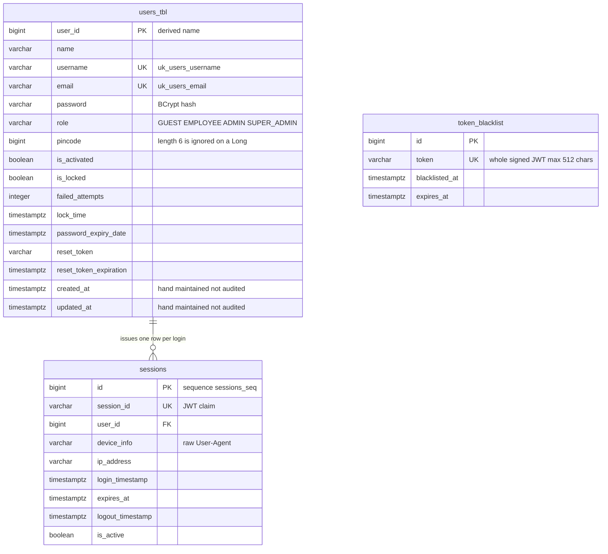

- `sessions.user_id` is `NOT NULL`, has no cascade, no `orphanRemoval` and no `ON DELETE` clause.
  Deleting a user works only through `UserService.deleteUser` and `UserProfileService.deleteAccount`,
  which remove the session rows in Java first. A `DELETE` from any other path fails on the FK.
- `sessions.user_id` is not indexed. PostgreSQL does not auto-index foreign key columns.
- Neither table is ever pruned; there is no `@Scheduled` anywhere in `src`.

Sources: [`User.java`](../../src/main/java/ak/dev/khi_backend/user/model/User.java),
[`Session.java`](../../src/main/java/ak/dev/khi_backend/user/model/Session.java),
[`TokenBlacklist.java`](../../src/main/java/ak/dev/khi_backend/user/model/TokenBlacklist.java).

---

## About, Contact and Services

`about_pages` and `contact_pages` are flat: both languages sit as parallel column pairs on one row,
produced by embedding `AboutContent` / `ContactContent` twice with `@AttributeOverrides`. Neither
has a child table. `about_pages.stats` is a `jsonb` array of `StatItem` objects, which is not a
table either.

`services` is the only member of this group with children, and it is the only bilingual model in
the whole schema that puts translations in child rows rather than column pairs.

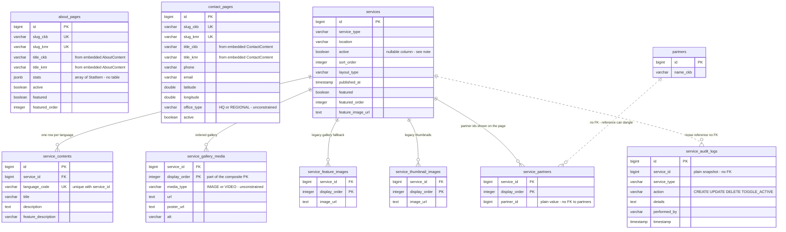

- `service_contents` is unique on `service_id + language_code` via `uq_service_content_lang`.
  `language_code` is a free-text `varchar(10)` validated only by `@Pattern("^[A-Z]{2,5}$")`. It is
  deliberately not the `Language` enum, so no `CHECK` constraint restricts it to `CKB` / `KMR`.
- `services.active` is a Java primitive `boolean` declared `@Column(name = "active")` with the
  default `nullable = true`, so Hibernate emits a nullable column. A `NULL` there makes every read
  of the row throw — the exact failure that
  [`scripts/sql/2026-08-17-featured-about-service-donation.sql`](../../scripts/sql/2026-08-17-featured-about-service-donation.sql)
  was written to repair. `featured` on the same entity was hardened; `active` was not.
- The four element collections carry `@OrderColumn`, so their primary key is the pair
  `service_id + display_order`. `service_partners` is the one that dangles: deleting a partner
  leaves the id behind with nothing to resolve it against.

Sources: [`About.java`](../../src/main/java/ak/dev/khi_backend/khi_app/model/about/About.java),
[`Contact.java`](../../src/main/java/ak/dev/khi_backend/khi_app/model/contact/Contact.java),
[`Service.java`](../../src/main/java/ak/dev/khi_backend/khi_app/model/service/Service.java),
[`ServiceContent.java`](../../src/main/java/ak/dev/khi_backend/khi_app/model/service/ServiceContent.java),
[`ServiceMedia.java`](../../src/main/java/ak/dev/khi_backend/khi_app/model/service/ServiceMedia.java),
[`ServiceAuditLog.java`](../../src/main/java/ak/dev/khi_backend/khi_app/model/service/ServiceAuditLog.java).

---

## News

An article carries both languages as column pairs from the embedded `NewsContent`, plus a `jsonb`
media gallery, plus five unordered element-collection side tables. Category and sub-category are
both mandatory, and both are separate foreign keys on `news` — the sub-category is not reached
through the category.

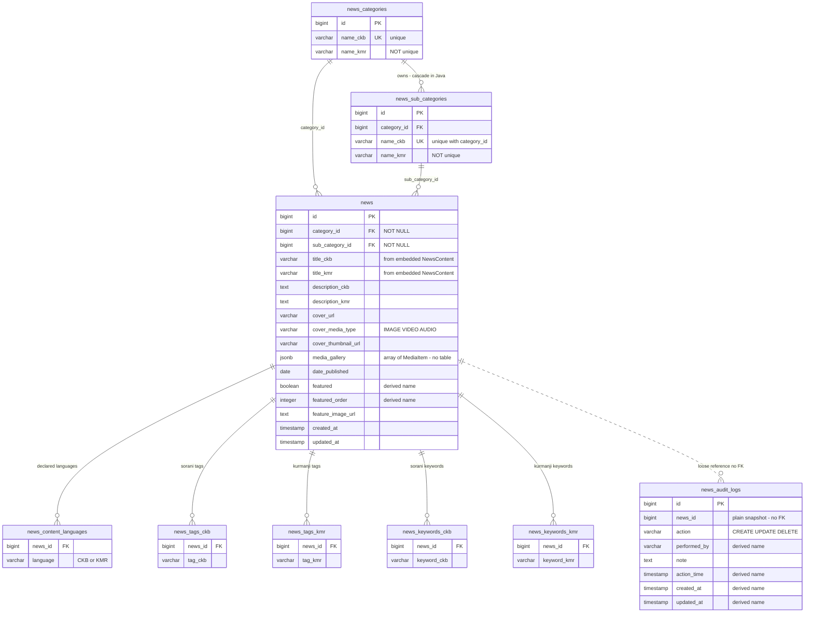

- Both category foreign keys are `optional = false` with no cascade. Deleting a category that
  still has articles raises a foreign key violation.
- `news_categories.name_kmr` is not unique, yet `NewsCategoryRepository.findByNameKmr` returns an
  `Optional`. Two categories sharing a Kurmanji name make that query throw
  `NonUniqueResultException`. The same exposure applies to
  `NewsSubCategoryRepository.findByCategoryAndNameKmr`, since only `category_id + name_ckb` is unique.
- `news_content_languages` is a `Set<Language>` element collection. Because it is unordered,
  Hibernate emits only the foreign key on it — no primary key and no unique constraint. Uniqueness
  is a Java-side `Set` guarantee, not a database one. The same is true of the four tag and keyword
  tables.
- `news_audit_logs` has no index at all, not even on `news_id`.

Sources: [`News.java`](../../src/main/java/ak/dev/khi_backend/khi_app/model/news/News.java),
[`NewsCategory.java`](../../src/main/java/ak/dev/khi_backend/khi_app/model/news/NewsCategory.java),
[`NewsSubCategory.java`](../../src/main/java/ak/dev/khi_backend/khi_app/model/news/NewsSubCategory.java),
[`NewsContent.java`](../../src/main/java/ak/dev/khi_backend/khi_app/model/news/NewsContent.java),
[`NewsAuditLog.java`](../../src/main/java/ak/dev/khi_backend/khi_app/model/news/NewsAuditLog.java).

---

## Projects

Projects are the only aggregate in the schema that normalises tags and keywords into a shared
vocabulary. `project_tags` and `project_keywords` hold one row per distinct name across both
languages, and four separate join tables connect them per language. It is also the only entity
that extends `AuditableEntity`, and `project_log` is the only place in the schema with a real
database-level `ON DELETE CASCADE`.

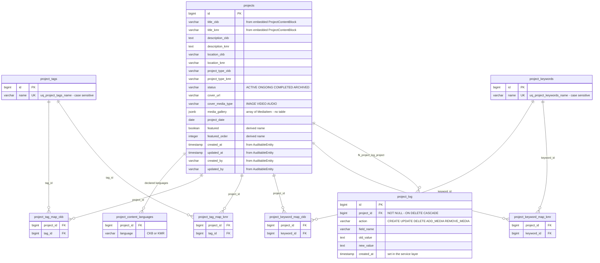

Collapsed to logical cardinality, the four join tables are two many-to-many pairs:

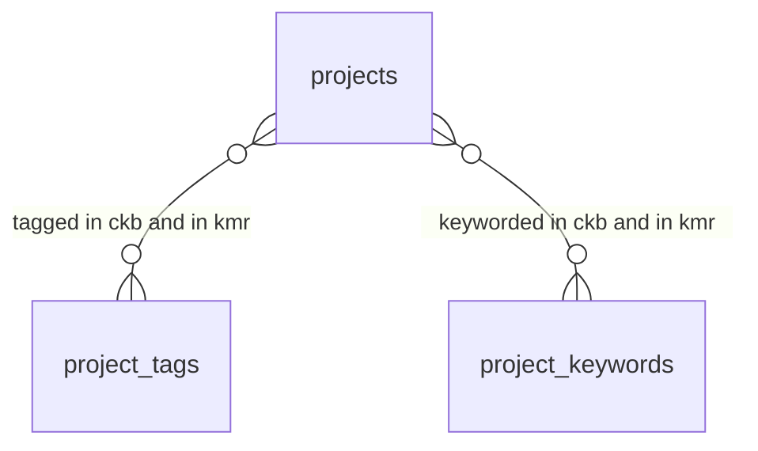

- `project_tags.name` and `project_keywords.name` are unique but **case sensitive**, while the
  repositories look them up with `findByNameIgnoreCase` returning an `Optional`. `Health` and
  `health` can both be stored, after which the lookup throws `NonUniqueResultException`.
- `project_log` carries `@OnDelete(OnDeleteAction.CASCADE)`, which puts `ON DELETE CASCADE` in the
  generated DDL. Under `ddl-auto: update` Hibernate will not add that clause to a foreign key that
  already exists without it, so verify it against the live database before relying on it.
- `project_log.created_at` is `NOT NULL` and is set by the service layer with no lifecycle
  callback. A caller that forgets hits a not-null violation.

Sources: [`Project.java`](../../src/main/java/ak/dev/khi_backend/khi_app/model/project/Project.java),
[`ProjectTag.java`](../../src/main/java/ak/dev/khi_backend/khi_app/model/project/ProjectTag.java),
[`ProjectKeyword.java`](../../src/main/java/ak/dev/khi_backend/khi_app/model/project/ProjectKeyword.java),
[`ProjectLog.java`](../../src/main/java/ak/dev/khi_backend/khi_app/model/project/ProjectLog.java),
[`AuditableEntity.java`](../../src/main/java/ak/dev/khi_backend/khi_app/model/audit/AuditableEntity.java).

---

## Videos

A video is either a `FILM`, whose uploaded files live in the ordered `video_source_files` side
table with one row flagged `is_main` and mirrored onto `videos.source_*` columns, or a
`VIDEO_CLIP`, whose parts live in `video_clip_items` as real entities with their own ids. Cast and
highlight clips are ordered embeddable collections; tags, keywords and languages are unordered
`Set` collections.

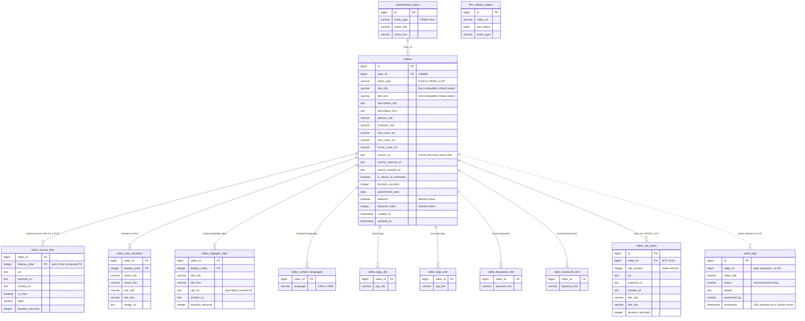

- `video_clip_items.video_id` is `NOT NULL` and `optional = false`; the parent collection is
  `CascadeType.ALL` with `orphanRemoval = true`, so deletes are issued by Hibernate, not by the
  database. There is no `ON DELETE CASCADE` on that foreign key.
- `videos.topic_id` is nullable with no `ON DELETE` action. Deleting a referenced topic fails on
  the foreign key; `VideoRepository.findByTopicId` exists so the service can unlink first. Video is
  the only one of the four publishment types with that helper.
- `film_reklam_videos` is a singleton by convention only — it is read with
  `findTopByOrderByIdAsc()` and nothing stops a second row.

Sources: [`Video.java`](../../src/main/java/ak/dev/khi_backend/khi_app/model/publishment/video/Video.java),
[`VideoSourceFile.java`](../../src/main/java/ak/dev/khi_backend/khi_app/model/publishment/video/VideoSourceFile.java),
[`VideoCastMember.java`](../../src/main/java/ak/dev/khi_backend/khi_app/model/publishment/video/VideoCastMember.java),
[`VideoHighlightClip.java`](../../src/main/java/ak/dev/khi_backend/khi_app/model/publishment/video/VideoHighlightClip.java),
[`VideoClipItem.java`](../../src/main/java/ak/dev/khi_backend/khi_app/model/publishment/video/VideoClipItem.java),
[`VideoLog.java`](../../src/main/java/ak/dev/khi_backend/khi_app/model/publishment/video/VideoLog.java),
[`FilmReklamVideo.java`](../../src/main/java/ak/dev/khi_backend/khi_app/model/publishment/video/FilmReklamVideo.java).

---

## Sound tracks

The deepest hierarchy in the schema: a track owns audio files, and each audio file owns brochure
images. Attachments hang off the track rather than off a file. `sound_track_logs` is the only log
table in the schema that declares a real foreign key to its parent and then never populates it.

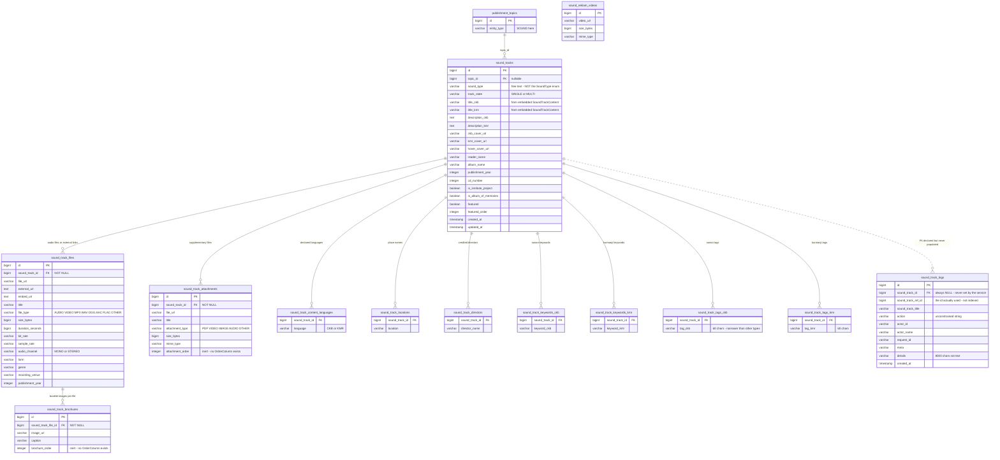

- **`sound_track_logs.sound_track_id` is dead.** `SoundTrackService.createLog()` builds every log
  row with `soundTrackRefId` and `soundTrackTitle` only, and never sets the `soundTrack`
  association. The column is `NULL` in every row, `idx_stlog_soundtrack` indexes nothing, and
  `SoundTrackLogRepository.findBySoundTrackId(Long)` — which Spring Data resolves to that foreign
  key column — always returns an empty list. Per-track history has to be read from
  `sound_track_ref_id`, which has no index.
- `brochure_order` and `attachment_order` are never read or written by Hibernate. Both parent
  collections use `@OrderBy("id ASC")`; there is no `@OrderColumn` anywhere, despite javadoc on
  both entities claiming otherwise. Display order is really insertion order by id.
- `sound_tracks.sound_type` is a free-text `varchar(100)`. The `SoundType` enum with values `LAWK`
  and `HAIRAN` exists in `enums/publishment/` and is referenced by nothing.

Sources: [`SoundTrack.java`](../../src/main/java/ak/dev/khi_backend/khi_app/model/publishment/sound/SoundTrack.java),
[`SoundTrackFile.java`](../../src/main/java/ak/dev/khi_backend/khi_app/model/publishment/sound/SoundTrackFile.java),
[`SoundTrackBrochure.java`](../../src/main/java/ak/dev/khi_backend/khi_app/model/publishment/sound/SoundTrackBrochure.java),
[`SoundTrackAttachment.java`](../../src/main/java/ak/dev/khi_backend/khi_app/model/publishment/sound/SoundTrackAttachment.java),
[`SoundTrackLog.java`](../../src/main/java/ak/dev/khi_backend/khi_app/model/publishment/sound/SoundTrackLog.java),
[`SoundReklamVideo.java`](../../src/main/java/ak/dev/khi_backend/khi_app/model/publishment/sound/SoundReklamVideo.java).

---

## Image collections

The simplest publishment shape: one collection, one ordered list of images, and the usual
tag / keyword / language side tables. `image_album_items` is a real entity with file metadata
extracted at upload time.

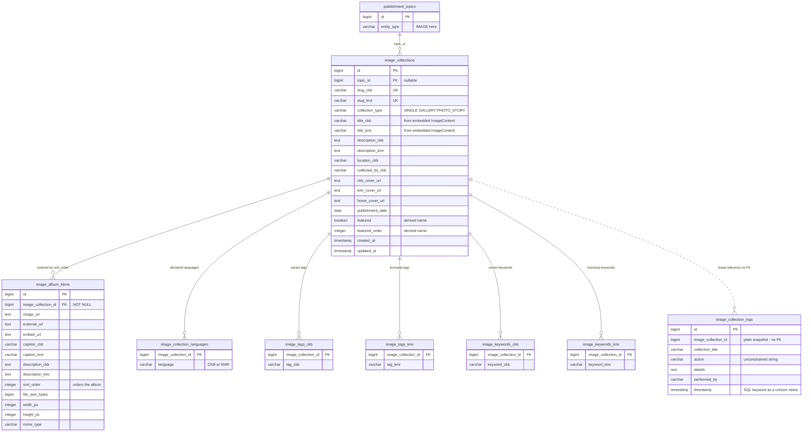

- The `ImageCollection` javadoc contains a hand-written migration snippet that would add
  `fk_img_coll_topic ... ON DELETE SET NULL`. Hibernate never generates that, so the behaviour
  exists only if someone ran the snippet against the live database. As mapped, deleting a
  referenced topic fails on the foreign key.

Sources: [`ImageCollection.java`](../../src/main/java/ak/dev/khi_backend/khi_app/model/publishment/image/ImageCollection.java),
[`ImageAlbumItem.java`](../../src/main/java/ak/dev/khi_backend/khi_app/model/publishment/image/ImageAlbumItem.java),
[`ImageCollectionLog.java`](../../src/main/java/ak/dev/khi_backend/khi_app/model/publishment/image/ImageCollectionLog.java).

---

## Writings and topics

`writings` is the only self-referencing table in the schema: `parent_book_id` links a volume to the
book that opens a series. `publishment_topics` is drawn here in full because it is shared by all
four publishment types, discriminated by the free-text `entity_type` column rather than by
separate tables.

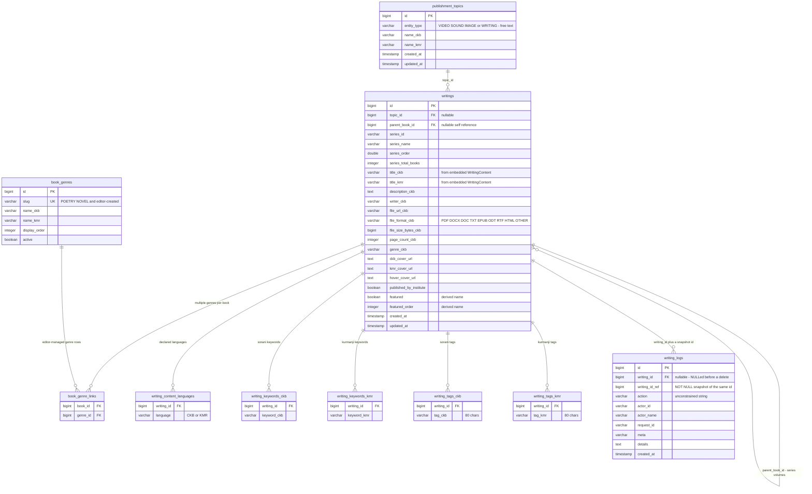

- The series self-reference has no cascade on either side and no `orphanRemoval`. Deleting a parent
  volume that still has children violates the foreign key, and nothing NULLs the children first.
- `writing_logs` is the one log table in the publishment group whose foreign key is actually
  populated. `WritingService` calls `writingLogRepository.detachFromWriting(id)` to NULL
  `writing_id` before deleting the book, keeping the log rows alive via the `writing_id_ref`
  snapshot.
- Genres are editor-managed `book_genres` rows since 2026-09-03 (CRUD at `/api/v1/book-genres`,
  see [`../BOOK_GENRES.md`](../BOOK_GENRES.md)); the old enum collection table
  `writing_book_genres` survives in live databases only as a frozen rollback snapshot and is not
  drawn here. The migration folded the enum's legacy aliases (`POLITICAL` → `POLITICS`,
  `ACADEMIC` → `EDUCATIONAL`, `ESSAY` → `OTHER`) into the canonical rows.

Sources: [`Writing.java`](../../src/main/java/ak/dev/khi_backend/khi_app/model/publishment/writing/Writing.java),
[`WritingContent.java`](../../src/main/java/ak/dev/khi_backend/khi_app/model/publishment/writing/WritingContent.java),
[`WritingLog.java`](../../src/main/java/ak/dev/khi_backend/khi_app/model/publishment/writing/WritingLog.java),
[`PublishmentTopic.java`](../../src/main/java/ak/dev/khi_backend/khi_app/model/publishment/topic/PublishmentTopic.java).

---

## Site configuration

Everything the CMS uses to dress the site around the content. Only one foreign key exists in the
whole group: `nav_menu_links.item_id`. The rest are independent lists ordered by `display_order`
and filtered on `active`.

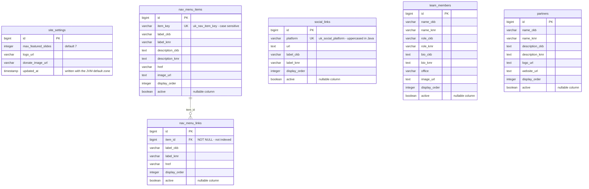

- `nav_menu_items` to `nav_menu_links` is `cascade = ALL` with `orphanRemoval = true`, and
  `NavMenuService.apply()` clears the list on every parent save. Every link is therefore deleted
  and re-inserted on update, so link ids are **not stable**. A raw SQL `DELETE` on the parent still
  fails on the foreign key, because the cascade lives in Hibernate rather than in the DDL.
  `nav_menu_links.item_id` has no index.
- `site_settings` is a singleton by convention only, read with `findFirstByOrderByIdAsc()`. Nothing
  in the database enforces a single row; extra rows are silently ignored rather than rejected.
- `nav_menu_items.item_key` uniqueness is case sensitive in the database but the application checks
  `existsByItemKeyIgnoreCase` and lowercases through `normalizeKey()`. A hand-inserted `News`
  alongside an existing `news` satisfies the constraint while breaking the stable-handle contract.
- Every `active` flag in this group is a Java primitive `boolean` declared without
  `nullable = false`, so Hibernate generates a nullable column. That is the exact shape that caused
  the production outage the manual SQL patch repairs — a `NULL` cannot map into a primitive and
  every read of the row throws.

Sources: [`SiteSettings.java`](../../src/main/java/ak/dev/khi_backend/khi_app/model/site/SiteSettings.java),
[`NavMenuItem.java`](../../src/main/java/ak/dev/khi_backend/khi_app/model/site/NavMenuItem.java),
[`NavMenuLink.java`](../../src/main/java/ak/dev/khi_backend/khi_app/model/site/NavMenuLink.java),
[`SocialLink.java`](../../src/main/java/ak/dev/khi_backend/khi_app/model/site/SocialLink.java),
[`TeamMember.java`](../../src/main/java/ak/dev/khi_backend/khi_app/model/site/TeamMember.java),
[`Partner.java`](../../src/main/java/ak/dev/khi_backend/khi_app/model/site/Partner.java).

---

## Engagement

Inbound submissions from the public site, the donation page configuration, and the dead
`featured_items` table. **There is not a single foreign key in this group.** Every edge drawn below
is dotted because it exists only as a rule inside `SiteContentService`.

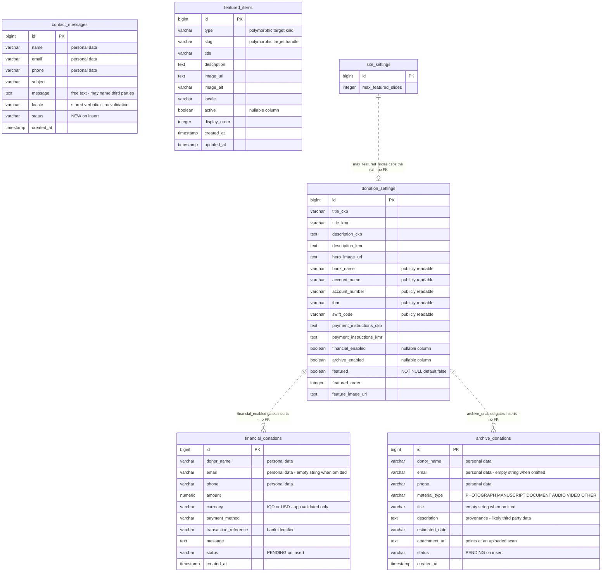

- `NOT NULL` does not mean "present" here. `SiteContentService.orEmpty()` writes `''` rather than
  `NULL` for `financial_donations.email`, `archive_donations.email`, `archive_donations.title` and
  `archive_donations.description`, all of which are `NOT NULL` columns whose API fields are
  optional. Any reporting or de-duplication over these columns must treat `''` as missing.
- The three `status` columns are plain `String`, not `@Enumerated`. There is no database default
  and no check constraint. Inserts hardcode the initial value; only
  `PATCH /api/v1/.../{id}/status` validates against `SiteContentService.SUBMISSION_STATUSES`.
- Read access to the three personal-data tables is admin-only, but that is enforced purely by rule
  ordering in `SecurityConfig`: the explicit `hasAnyRole('ADMIN','SUPER_ADMIN')` matchers sit above
  a blanket `.requestMatchers(HttpMethod.GET, "/api/v1/**").permitAll()`. The controller methods
  carry no `@PreAuthorize`. Reordering that blanket rule would expose all three tables publicly.
- `donation_settings` is read with `donationSettingsRepository.findAll().stream().findFirst()` —
  no `ORDER BY` at all. If a second row ever appears, which one wins is whatever PostgreSQL
  returns first.
- There is no retention policy, no soft delete and no anonymisation path on any of the three
  submission tables.

Sources: [`ContactMessage.java`](../../src/main/java/ak/dev/khi_backend/khi_app/model/site/ContactMessage.java),
[`FinancialDonation.java`](../../src/main/java/ak/dev/khi_backend/khi_app/model/site/FinancialDonation.java),
[`ArchiveDonation.java`](../../src/main/java/ak/dev/khi_backend/khi_app/model/site/ArchiveDonation.java),
[`DonationSettings.java`](../../src/main/java/ak/dev/khi_backend/khi_app/model/site/DonationSettings.java),
[`FeaturedItem.java`](../../src/main/java/ak/dev/khi_backend/khi_app/model/site/FeaturedItem.java),
[`SiteContentService.java`](../../src/main/java/ak/dev/khi_backend/khi_app/service/site/SiteContentService.java).

---

## The featured rail

Two different things share the word "featured" in this schema, and only one of them is live.

### What actually runs

The homepage carousel is computed in memory. `SiteContentService.getFeatured(locale)` pools every
row flagged `featured = true` across six content tables plus the singleton `donation_settings` row,
sorts globally by `featured_order` with ties broken by newest id first, truncates to
`site_settings.max_featured_slides` (default 7) and renumbers `display_order` from 1.

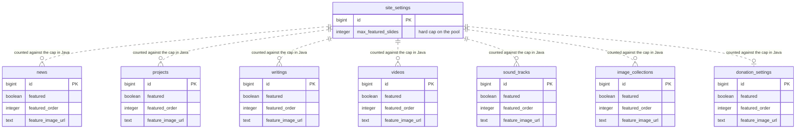

The cap is enforced at write time only: each `setXFeatured` method calls `countAllFeatured()` and
refuses to turn the flag on once the pool is full. Nothing stops a direct SQL `UPDATE` from
flagging a hundred rows; the read side would simply truncate to seven.

`about_pages.featured` and `services.featured` look identical but are **not** part of this pool.
Their flag is a page-level highlight — the band at the top of `/services`, the lead record on
`/about` — so they never enter the carousel and take no share of `max_featured_slides`.

### What `featured_items` was meant to be

`featured_items` is a denormalised slide table with a polymorphic target expressed as the string
pair `(type, slug)`. There is no `entity_id` or `target_id` column, so the numeric primary key of
the target is never stored at all.

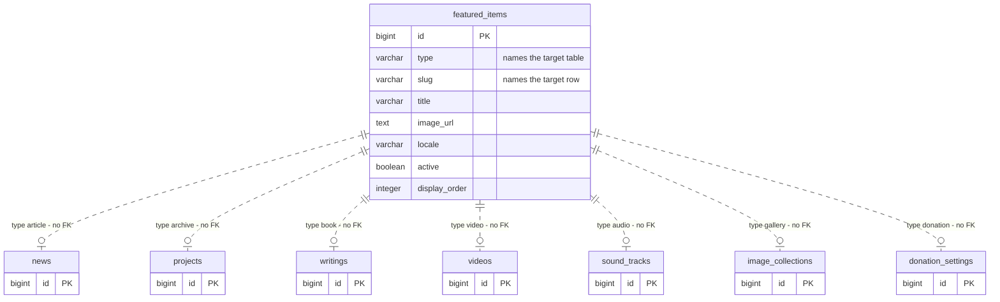

| `type` value | Target table | What `slug` holds |
| --- | --- | --- |
| `article` | `news` | the numeric id as a string |
| `archive` | `projects` | the numeric id as a string |
| `book` | `writings` | the numeric id as a string |
| `video` | `videos` | the numeric id as a string |
| `audio` | `sound_tracks` | the numeric id as a string |
| `gallery` | `image_collections` | `slug_ckb` or `slug_kmr`, falling back to the id |
| `donation` | `donation_settings` | the literal string `donation` |

**Is the reference enforced?** By neither the database nor the application.

- No foreign key exists, and none could: the target table varies per row, so there is nothing for
  a single constraint to point at.
- Unlike the usual polymorphic pattern, there is no application-side validation either, because
  **nothing reads or writes this table**. `FeaturedItem` is a real `@Entity`, so `ddl-auto: update`
  creates `featured_items` and its index in PostgreSQL, but `FeaturedItemRepository` is injected
  into no service, controller or configuration class. A repository-wide search for `FeaturedItem`
  matches only the entity and its own repository interface.
- There is also no unique constraint on `(type, slug)`, so the same target could be featured twice.
- `SecurityConfig` reserves `/api/v1/featured/**` for admin `POST`/`PUT`/`DELETE`, but no such
  handler exists.

The `type` values in the table above are the ones the live `FeaturedResponse` DTO emits from
`SiteContentService.featuredSlide()`. They are what this column would need to hold if the table
were ever revived. The table is always empty in a fresh database and stale wherever rows were
hand-inserted. A decision is needed: drop the entity, or wire it up.

---

## Reading this diagram

Every diagram above is a Mermaid `erDiagram` block, which GitHub renders natively.

### Crow's-foot notation

The symbol at each end of a relationship describes that end's cardinality. Read the left symbol as
"how many rows of the left table" and the right symbol as "how many rows of the right table".

| Notation | Meaning |
| --- | --- |
| `\|\|--o{` | one-to-many, optional on the many side — one parent row, zero or more children |
| `\|\|--\|{` | one-to-many, mandatory — one parent row, one or more children |
| `\|\|--\|\|` | one-to-one, mandatory both sides |
| `\|\|--o\|` | one-to-zero-or-one |
| `}o--o{` | many-to-many |

Broken down, each end is built from two characters:

| Symbol | Reads as |
| --- | --- |
| `\|\|` | exactly one |
| `\|{` | one or more |
| `o\|` | zero or one |
| `o{` | zero or more |

### Solid versus dashed

| Line | Meaning in this document |
| --- | --- |
| `--` solid | **Identifying.** The child row is part of the parent's identity: it has no primary key of its own, or its primary key includes the parent's foreign key. Every `@ElementCollection` side table is drawn this way. |
| `..` dashed | **Non-identifying.** The two tables each have their own surrogate primary key and the child can be addressed independently — or, where the label says so, the reference is not a foreign key at all. |

Two important qualifications:

- Ordered element collections carry `@OrderColumn`, so their primary key really is
  `(owner_id, display_order)` — genuinely identifying. **Unordered `Set` element collections get
  no primary key and no unique constraint from Hibernate, only the foreign key.** They are drawn
  solid because the rows have no independent identity, but be aware that duplicate rows are
  physically possible for anything writing outside JPA. If uniqueness matters, add
  `PRIMARY KEY (owner_id, value)` by hand; `ddl-auto: update` will never add one.
- Dashed lines labelled "loose reference no FK" or "no FK" are not constraints. They mark a column
  that holds another table's id as a plain value, with nothing stopping it from dangling. The log
  tables use this deliberately so their rows survive a hard delete of the parent.

### Key markers

| Marker | Meaning |
| --- | --- |
| `PK` | Primary key. On collection tables it marks the ordering column that completes the composite key with the owner's foreign key. |
| `FK` | Foreign key — a real constraint in the generated DDL. Columns that hold another table's id without a constraint are annotated in their comment instead and carry no `FK` marker. |
| `UK` | Unique constraint. The comment names it where the entity declares a name. |

### Type names

Mermaid requires single-token types, so the diagrams write `varchar` rather than `varchar(255)` and
`timestamp` rather than `timestamp with time zone`. Lengths and precisions are in
[`SCHEMA.md`](./SCHEMA.md).

`timestamptz` appears only in the identity diagram. Under Spring Boot 4.0.2 and Hibernate 7.2.x a
Java `Instant` resolves to JDBC `TIMESTAMP_UTC`, which PostgreSQL renders as
`timestamp with time zone`; a `LocalDateTime` maps to bare `timestamp`. The identity tables use
`Instant`, everything else uses `LocalDateTime`. Because `ddl-auto: update` adds missing columns
but never alters an existing column's type, a database first created by an older Hibernate may
still have plain `timestamp` there.

### Derived names

Physical names shown here were read from `@Table`, `@Column`, `@JoinColumn`, `@CollectionTable` and
`@JoinTable` wherever those are declared. Where a name had to be derived, the attribute comment
says `derived name`.† Single-word Java fields such as `id`, `name`, `action`, `href`, `status` and
`active` produce an identical column name and are not marked.

† physical name derived from Hibernate's snake-case physical naming strategy, not declared in the
entity.

---

## Corrections against the survey catalogue

Every cardinality above was re-read from the entity classes. Three notes where the drawing differs
from, or sharpens, the catalogue this document was built on.

1. **`writing_logs` has two id columns, not one.** The catalogue lists only the foreign key
   `writing_id`. The entity also declares `@Column(name = "writing_id_ref", nullable = false)`
   holding the same id as a snapshot
   ([`WritingLog.java:74`](../../src/main/java/ak/dev/khi_backend/khi_app/model/publishment/writing/WritingLog.java)).
   That second column is what makes `detachFromWriting(id)` safe: the foreign key can be NULLed
   before the book is deleted without losing which book the row describes. The cardinality is
   unchanged; the diagram shows both columns.

2. **About and Service do not "bypass" the featured cap — they are excluded from the carousel by
   design.** The catalogue records `setAboutFeatured` / `setServiceFeatured` as skipping the
   `countAllFeatured()` check, framed as an inconsistency. The code says otherwise: `getFeatured()`
   pools six content tables plus `donation_settings` and deliberately does not collect About or
   Service, because their flag is a page-level highlight rather than a hero slide
   ([`SiteContentService.java:126-130`](../../src/main/java/ak/dev/khi_backend/khi_app/service/site/SiteContentService.java)).
   Skipping the cap check is the correct consequence of that, not a defect. The featured rail
   diagram reflects seven sources, not nine.

3. **`sound_track_logs` genuinely has both a foreign key and a snapshot column, and only the
   snapshot works.** The catalogue notes the foreign key is never populated; the diagram makes the
   consequence explicit, because `sound_track_ref_id` is the column that actually carries the
   reference and it has no index while the dead `sound_track_id` does
   (`idx_stlog_soundtrack`).

No cardinality in the catalogue was found to be wrong. The `NO ACTION` delete behaviour it records
throughout is confirmed: `project_log` is the only foreign key in the schema with a database-level
`ON DELETE CASCADE`, and every other parent-child delete is issued by Hibernate rather than by
PostgreSQL.
