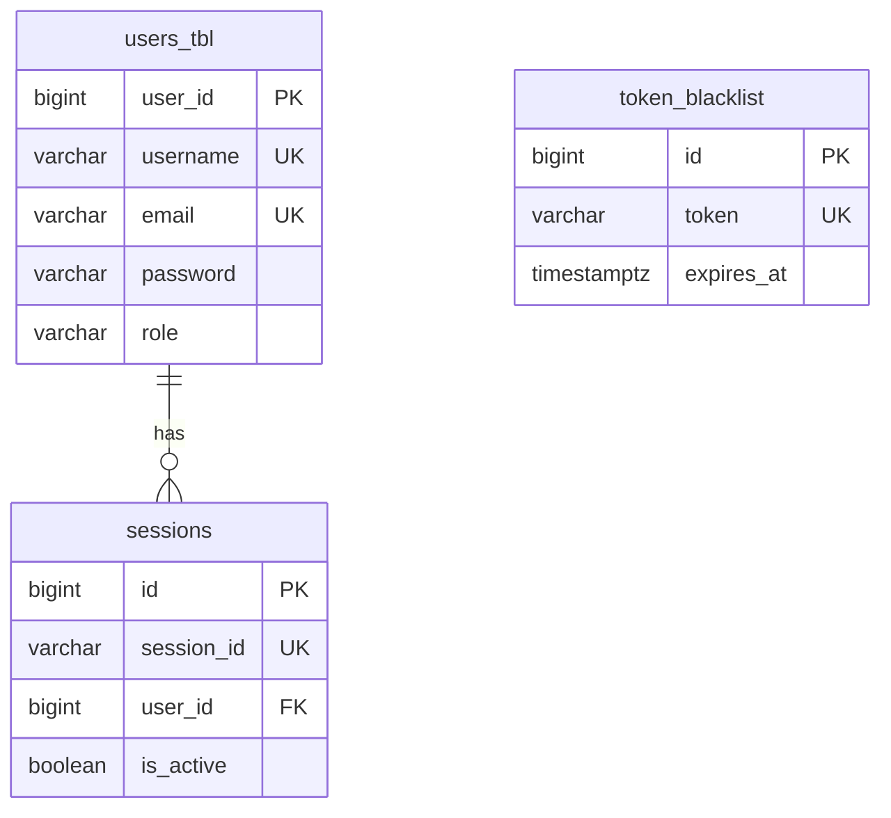
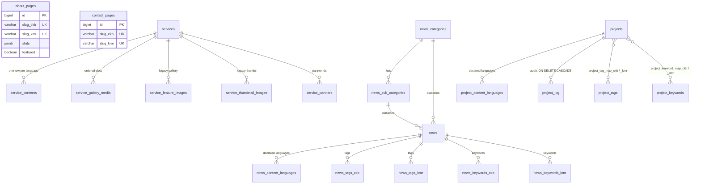
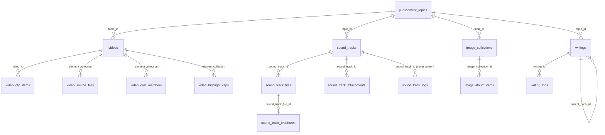
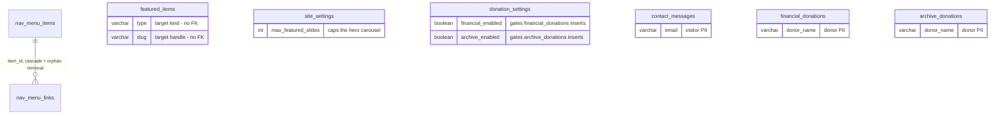

# Database Schema

The KHI Backend stores everything in a single PostgreSQL database. There is no database-first
design document that the code was written against. The tables, columns, indexes, unique
constraints, check constraints and foreign keys described below are all generated by Hibernate
from the JPA entity classes at application startup, because
`src/main/resources/application.yaml` sets `spring.jpa.hibernate.ddl-auto: update`. The entity
classes are therefore the single source of truth for this schema, and every table section below
links to the class it comes from.

The repository does check in a DDL script,
[`schema.sql`](schema.sql), but it is build output rather than
input: it is the DDL Hibernate derives from those same entity classes, regenerated by
[`../../scripts/render-schema.sh`](../../scripts/render-schema.sh). Nothing executes it at
startup. Use it to provision a fresh database or to diff against an existing one.

There is no migration tool. `pom.xml` contains neither Flyway nor Liquibase, so nothing records
which schema version a given environment is on and nothing can roll a change back. The one
hand-written SQL file in the repository,
[`../../scripts/sql/2026-08-17-featured-about-service-donation.sql`](../../scripts/sql/2026-08-17-featured-about-service-donation.sql),
is a production repair rather than a migration; see [`MIGRATIONS.md`](MIGRATIONS.md) for what it
does and why it was needed. This matters when reading the tables below, because `ddl-auto: update`
only ever *adds*: it creates missing tables, adds missing columns and creates missing indexes, but
it never drops a column, never narrows or widens an existing column's type, never tightens an
existing column's nullability, and never adds a missing `ON DELETE` clause or check constraint to a
constraint that already exists. What follows is what a fresh database gets; a long-lived database
can legitimately differ, and the places where that is most likely are called out per table.

Everything in this document was checked against the DDL that Hibernate 7.2 actually generates for
this project's compiled entity classes under the PostgreSQL dialect: **85 tables, 623 columns**, 84
indexes, one sequence, and exactly one database-level `ON DELETE CASCADE`.

## Conventions

**Physical names.** Where an entity declares `@Table(name = …)`, `@Column(name = …)`,
`@JoinColumn(name = …)` or `@CollectionTable(name = …)`, that literal name is used. Where it does
not, Hibernate derives the name from the Java identifier by converting camelCase to snake_case:
entity `SoundTrackFile` becomes table `sound_track_file`, field `createdAt` becomes column
`created_at`, field `isActive` becomes column `is_active`. Derived names are marked `†` throughout.

> † physical name derived from Hibernate's SpringPhysicalNamingStrategy, not declared in the entity.

One correction to that footnote, which is kept in the prescribed wording above because it is the
convention this documentation set uses: Spring Boot 4.0 no longer wires
`SpringPhysicalNamingStrategy`. It wires Hibernate's own `PhysicalNamingStrategySnakeCaseImpl`
(verified in `HibernateProperties$Naming` in `spring-boot-hibernate-4.0.2.jar`). The camelCase →
snake_case result is identical, so no derived name in this document changes.

**Primary keys and id generation.** Every one of the 85 tables has a primary key. Entity tables use
`@GeneratedValue(strategy = IDENTITY)`, which PostgreSQL renders as
`bigint generated by default as identity`. The single exception is `sessions`, which uses
`GenerationType.AUTO`; on Hibernate 7 that resolves to the sequence `sessions_seq` † with the
default allocation size of 50, so session ids arrive in blocks of 50 and gaps are normal.
Side tables get composite keys, generated as follows:

- an `@ElementCollection List` with an `@OrderColumn` gets `PRIMARY KEY (owner_id, display_order)`;
- an `@ElementCollection Set` of a basic or enum element whose element column is `nullable = false`
  gets `PRIMARY KEY (owner_id, element_column)` — every such collection in this schema qualifies, so
  duplicate rows are rejected by the database and not only by the in-memory `Set`;
- a `@ManyToMany` join table gets `PRIMARY KEY (owner_id, target_id)`.

**Timestamps.** The application sets `hibernate.jdbc.time_zone=UTC`, so every timestamp is UTC.
`LocalDateTime` maps to `timestamp(6)` and `Instant` maps to `timestamp(6) with time zone`. For
readability the column tables below write these as `timestamp` and `timestamptz` respectively.
Only the three Identity and Access tables use `Instant`; everything else uses `LocalDateTime`.
`LocalDate` maps to `date`. Because `ddl-auto: update` never alters an existing column's type, a
database first created by an older Hibernate may still have a plain `timestamp` where this document
says `timestamptz`.

**Enum storage.** Every `@Enumerated` mapping in this schema is `EnumType.STRING` — there is no
`ORDINAL` mapping anywhere, and no enum is stored as an integer. Hibernate 7 also emits a `CHECK`
constraint listing the allowed values, but only in the `CREATE TABLE` statement, so a table that
already existed before the enum column was added will not have one. A large number of status-like
columns are *not* enum-mapped at all and are plain `varchar` validated only in Java, or not at all.
All of them are listed in [Enum reference](#enum-reference).

**Other type mappings.** `Long`/`long` → `bigint`, `Integer`/`int` → `integer`,
`Boolean`/`boolean` → `boolean`, `BigDecimal` → `numeric(19,2)`, `Double` → `float(53)` (which is
PostgreSQL's `double precision`, and is written that way below),
`@Column(columnDefinition = "TEXT")` → `text`, `@JdbcTypeCode(SqlTypes.JSON)` → `jsonb`.

**Primitive booleans and nullability.** This is the one mapping rule worth memorising, because
getting it wrong has already caused a production outage. A Java primitive `boolean` field with **no**
`@Column` annotation is generated as `boolean not null`. The same field **with** an explicit
`@Column(name = …)` that omits `nullable` is generated as a plain nullable `boolean`, because the
explicit annotation supplies the JPA default of `nullable = true`. A `NULL` in such a column cannot
be read back into a Java primitive, so every read of that row throws. Three columns in the schema
are in that state today: `services.active`, `donation_settings.financial_enabled` and
`donation_settings.archive_enabled`.

**Reading the Null column.** `no` means the generated DDL says `not null`; `yes` means it does not.
This is the constraint the mapping asks for, not a guarantee about a long-lived database: a column
`ddl-auto: update` adds to a table that already has rows arrives nullable and is never tightened
afterwards.

**Reading the Default column.** `—` means no default of any kind. `identity` means a PostgreSQL
identity column. `` `false` (DB) `` means a real `DEFAULT` clause in the DDL — this comes only from
`@ColumnDefault`, and only three columns in the schema have one (`about_pages.featured`,
`services.featured`, `donation_settings.featured`). Anything written as `` `x` (app) `` is a value
the application assigns when the caller supplies none — a field initialiser, a `@PrePersist` hook,
`@CreationTimestamp`/`@UpdateTimestamp`, or the service layer. There is no DDL default behind it, so
a direct `INSERT` that omits the column gets `NULL`.

**Reading the Key column.** `PK`, `FK -> other_table.column`, `UQ` (unique constraint), `IDX`
(covered by a declared index), or empty.

**Bilingual content.** Almost all content is stored in Sorani (CKB) and Kurmanji (KMR), and the
schema does it in two structurally incompatible ways:

- *Parallel columns.* An `@Embeddable` content block is embedded twice on the same entity with
  `@AttributeOverrides`, producing `title_ckb` / `title_kmr`, `description_ckb` / `description_kmr`
  and so on directly on the owning table. The embeddable never becomes a table of its own. About,
  Contact, News, Project, Video, Sound, Image and Writing all use this pattern, as do the smaller
  Site tables, which simply declare the `_ckb` / `_kmr` pairs by hand.
- *Child rows.* Service is the only module that keeps one row per language, in `service_contents`,
  keyed by `(service_id, language_code)`. Adding a third language there is a data change; adding one
  anywhere else is a schema change.

Independently of both, most content types carry a `*_content_languages` side table holding a
`Set<Language>`. That records which languages an item *declares* content for, which is a statement
of intent and is not constrained against whether the `_ckb` / `_kmr` columns are actually filled in.

**Element collections, embeddables and join tables.** An `@Embeddable` used with `@Embedded`
flattens into the owning table and produces no table of its own. An `@Embeddable` used as the
element type of an `@ElementCollection` produces a side table whose rows have no identity of their
own. All four `@ManyToMany` associations in the schema declare an explicit `@JoinTable`, so no join
table name is derived.

**Foreign keys.** Every foreign key in the schema is a plain `REFERENCES` constraint with no
`ON DELETE` action, with exactly one exception: `fk_project_log_project` on `project_log`, which
carries `on delete cascade` from `@OnDelete(OnDeleteAction.CASCADE)`. Where a table section says
"cascade" or "orphan removal", that behaviour lives in JPA — Hibernate issues the child `DELETE`
statements itself before deleting the parent. Raw SQL that deletes a parent row will hit the foreign
key instead.

## Shared audit columns

[`AuditableEntity`](../../src/main/java/ak/dev/khi_backend/khi_app/model/audit/AuditableEntity.java)
is a `@MappedSuperclass`, not an entity, so it has no table. Any entity that extends it inherits the
four columns below into its own table.

| Column | Type | Null | Default | Key | Description |
| --- | --- | --- | --- | --- | --- |
| `created_at` † | `timestamp` | no | `now()` (app) | | `@CreatedDate`, `updatable = false`. Written by Spring Data's `AuditingEntityListener` on persist. |
| `updated_at` † | `timestamp` | no | `now()` (app) | | `@LastModifiedDate`. Rewritten on every flush that dirties the row. |
| `created_by` † | `varchar(120)` | yes | `SYSTEM` (app) | | `@CreatedBy`, `updatable = false`. The username of the acting account, as free text. |
| `updated_by` † | `varchar(120)` | yes | `SYSTEM` (app) | | `@LastModifiedBy`. Same free-text username. |

Auditing is switched on by
[`AuditingConfig`](../../src/main/java/ak/dev/khi_backend/khi_app/config/AuditingConfig.java)
(`@EnableJpaAuditing(auditorAwareRef = "auditorAware")`) and the actor is resolved by
[`AuditorAwareImpl`](../../src/main/java/ak/dev/khi_backend/khi_app/config/AuditorAwareImpl.java),
which returns `Authentication.getName()` — the value of `users_tbl.username` — or the literal
string `SYSTEM` when the request is unauthenticated or anonymous.

**Exactly one entity extends `AuditableEntity`: `Project`.** So `projects` is the only table in the
whole schema with `created_by` / `updated_by` columns, and the only one whose timestamps come from
Spring Data auditing. Those four columns are not repeated in the `projects` section below.

Every other table either has no timestamps at all, or declares its own `created_at` / `updated_at`
and fills them from `@CreationTimestamp` / `@UpdateTimestamp`, from a hand-written `@PrePersist` /
`@PreUpdate` hook, or from the service layer. The per-table sections say which. Note also that
`created_by` / `updated_by` are free-text usernames, not foreign keys — nothing in the schema
references `users_tbl` except `sessions`.

## Table index

85 tables. Names in **bold** are the main table of a module; the rest are side tables, join tables
and logs.

| Table | Section | Purpose |
| --- | --- | --- |
| [`about_pages`](#about_pages) | Core Content | **About page**; both languages as parallel columns, stats as `jsonb`, homepage featured flag. |
| [`archive_donations`](#archive_donations) | Site | Offers to donate archive material. Donor personal data. |
| [`book_genre_links`](#book_genre_links) | Publishment | Join table: which genres each book carries. |
| [`book_genres`](#book_genres) | Publishment | Editor-managed book genres (slug + bilingual names) — replaces the `BookGenre` enum. |
| [`contact_messages`](#contact_messages) | Site | Inbound public contact-form messages. Visitor personal data. |
| [`contact_pages`](#contact_pages) | Core Content | **Contact page**; bilingual copy plus language-agnostic phone, email and map details. |
| [`donation_settings`](#donation_settings) | Site | Singleton-by-convention donation page config, including the institute's bank details. |
| [`donation_type_cards`](#donation_type_cards) | Site | "What can I donate?" picture cards on the donate page, CMS-managed. |
| [`featured_items`](#featured_items) | Site | Denormalised homepage hero slides with a polymorphic `(type, slug)` target. Created by Hibernate, unused at runtime. |
| [`film_reklam_videos`](#film_reklam_videos) | Publishment | Singleton background video for the homepage Film section. |
| [`financial_donations`](#financial_donations) | Site | Financial donation pledges. Donor personal data and payment references. |
| [`image_album_items`](#image_album_items) | Publishment | One image inside a collection, with bilingual captions and file metadata. |
| [`image_collection_languages`](#image_collection_languages) | Publishment | Languages an image collection's captions exist in. |
| [`image_collection_logs`](#image_collection_logs) | Publishment | Snapshot audit trail for image collections; no foreign key. |
| [`image_collections`](#image_collections) | Publishment | **Image publishment**: single image, gallery, or photo story. |
| [`image_keywords_ckb`](#image_keywords_ckb) | Publishment | Sorani search keywords for an image collection. |
| [`image_keywords_kmr`](#image_keywords_kmr) | Publishment | Kurmanji search keywords for an image collection. |
| [`image_tags_ckb`](#image_tags_ckb) | Publishment | Sorani tags for an image collection. |
| [`image_tags_kmr`](#image_tags_kmr) | Publishment | Kurmanji tags for an image collection. |
| [`nav_menu_items`](#nav_menu_items) | Site | **Top-level hamburger menu entries**, keyed by a stable `item_key`. |
| [`nav_menu_links`](#nav_menu_links) | Site | Secondary links under a menu item; replaced wholesale on every parent save. |
| [`news`](#news) | Core Content | **News article**; bilingual columns, `jsonb` media gallery, mandatory category and sub-category. |
| [`news_audit_logs`](#news_audit_logs) | Core Content | Append-only CRUD trail for news. No foreign key and no indexes. |
| [`news_categories`](#news_categories) | Core Content | Top-level news category, bilingual by column pair. |
| [`news_content_languages`](#news_content_languages) | Core Content | Languages an article declares content for. |
| [`news_keywords_ckb`](#news_keywords_ckb) | Core Content | Per-article Sorani SEO keywords. |
| [`news_keywords_kmr`](#news_keywords_kmr) | Core Content | Per-article Kurmanji SEO keywords. |
| [`news_sub_categories`](#news_sub_categories) | Core Content | Second-level category, owned by exactly one category. |
| [`news_tags_ckb`](#news_tags_ckb) | Core Content | Per-article Sorani tags, as raw strings. |
| [`news_tags_kmr`](#news_tags_kmr) | Core Content | Per-article Kurmanji tags. |
| [`partners`](#partners) | Site | Bilingual partner and sponsor organisations for the About page. |
| [`project_content_languages`](#project_content_languages) | Core Content | Languages a project declares content for. |
| [`project_keyword_map_ckb`](#project_keyword_map_ckb) | Core Content | Join table for a project's Sorani keywords. |
| [`project_keyword_map_kmr`](#project_keyword_map_kmr) | Core Content | Join table for a project's Kurmanji keywords. |
| [`project_keywords`](#project_keywords) | Core Content | Shared keyword vocabulary, one row per distinct name. |
| [`project_log`](#project_log) | Core Content | Field-level change log for projects. The only table with a database-level `ON DELETE CASCADE`. |
| [`project_tag_map_ckb`](#project_tag_map_ckb) | Core Content | Join table for a project's Sorani tags. |
| [`project_tag_map_kmr`](#project_tag_map_kmr) | Core Content | Join table for a project's Kurmanji tags. |
| [`project_tags`](#project_tags) | Core Content | Shared tag vocabulary, one row per distinct name. |
| [`projects`](#projects) | Core Content | **Project record**; bilingual columns, `jsonb` media gallery, status enum. The only audited table. |
| [`publishment_topics`](#publishment_topics) | Publishment | **Shared bilingual topic registry** for all four publishment types. |
| [`service_audit_logs`](#service_audit_logs) | Core Content | Append-only CRUD trail for services; parent id is a snapshot, not a foreign key. |
| [`service_contents`](#service_contents) | Core Content | One row per language per service. The only child-row bilingual model in the schema. |
| [`service_feature_images`](#service_feature_images) | Core Content | Legacy gallery fallback, used only when `service_gallery_media` is empty. |
| [`service_gallery_media`](#service_gallery_media) | Core Content | Ordered gallery; each slot independently an image or a video. |
| [`service_partners`](#service_partners) | Core Content | Partner ids shown on a service. `partner_id` is a bare number with no foreign key. |
| [`service_thumbnail_images`](#service_thumbnail_images) | Core Content | Legacy thumbnail list, same fallback role. |
| [`services`](#services) | Core Content | **One institute service.** Carries no bilingual text itself. |
| [`sessions`](#sessions) | Identity | One row per issued JWT, which is what makes per-device revocation possible. |
| [`site_settings`](#site_settings) | Site | **Singleton-by-convention branding row**, including the homepage carousel cap. |
| [`social_links`](#social_links) | Site | One row per social platform shown in the footer. |
| [`sound_reklam_videos`](#sound_reklam_videos) | Publishment | Singleton background video for the homepage Sound section. |
| [`sound_track_attachments`](#sound_track_attachments) | Publishment | Supplementary file attached to a whole track. |
| [`sound_track_brochures`](#sound_track_brochures) | Publishment | Brochure or booklet image attached to one audio file. |
| [`sound_track_content_languages`](#sound_track_content_languages) | Publishment | Languages a sound track's content exists in. |
| [`sound_track_directors`](#sound_track_directors) | Publishment | Directors credited on a sound track. |
| [`sound_track_files`](#sound_track_files) | Publishment | One audio file or external link belonging to a track. |
| [`sound_track_keywords_ckb`](#sound_track_keywords_ckb) | Publishment | Sorani search keywords for a sound track. |
| [`sound_track_keywords_kmr`](#sound_track_keywords_kmr) | Publishment | Kurmanji search keywords for a sound track. |
| [`sound_track_locations`](#sound_track_locations) | Publishment | Language-agnostic place names associated with a track. |
| [`sound_track_logs`](#sound_track_logs) | Publishment | Audit trail for sound tracks. Its foreign key is never populated. |
| [`sound_track_tags_ckb`](#sound_track_tags_ckb) | Publishment | Sorani tags for a sound track. |
| [`sound_track_tags_kmr`](#sound_track_tags_kmr) | Publishment | Kurmanji tags for a sound track. |
| [`sound_tracks`](#sound_tracks) | Publishment | **Sound publishment**: a single track or a multi-track album. |
| [`team_members`](#team_members) | Site | Bilingual staff profiles for the About page. No link to `users_tbl`. |
| [`token_blacklist`](#token_blacklist) | Identity | JWTs revoked before their natural expiry. Checked on every authenticated request. |
| [`users_tbl`](#users_tbl) | Identity | **Account record**: credentials, role, lock state, password expiry, reset token. |
| [`video_cast_members`](#video_cast_members) | Publishment | Ordered bilingual cast list for a video. |
| [`video_clip_items`](#video_clip_items) | Publishment | One clip inside a `VIDEO_CLIP` video. |
| [`video_content_languages`](#video_content_languages) | Publishment | Languages a video's content exists in. |
| [`video_highlight_clips`](#video_highlight_clips) | Publishment | Ordered highlight and teaser clips shown alongside a video. |
| [`video_keywords_ckb`](#video_keywords_ckb) | Publishment | Sorani search keywords for a video. |
| [`video_keywords_kmr`](#video_keywords_kmr) | Publishment | Kurmanji search keywords for a video. |
| [`video_logs`](#video_logs) | Publishment | Snapshot audit trail for videos; no foreign key. |
| [`video_source_files`](#video_source_files) | Publishment | Ordered list of every uploaded source file for a film. |
| [`video_tags_ckb`](#video_tags_ckb) | Publishment | Sorani tags for a video. |
| [`video_tags_kmr`](#video_tags_kmr) | Publishment | Kurmanji tags for a video. |
| [`videos`](#videos) | Publishment | **Video publishment**: a film, or a set of video clips. |
| [`writing_book_genres`](#writing_book_genres) | Publishment | **Frozen legacy** enum genres per book — migrated into `book_genre_links`, kept as a rollback snapshot, no longer generated. |
| [`writing_content_languages`](#writing_content_languages) | Publishment | Languages a book's content exists in. |
| [`writing_keywords_ckb`](#writing_keywords_ckb) | Publishment | Sorani search keywords for a book. |
| [`writing_keywords_kmr`](#writing_keywords_kmr) | Publishment | Kurmanji search keywords for a book. |
| [`writing_logs`](#writing_logs) | Publishment | Audit trail for books. The only log table whose foreign key is populated. |
| [`writing_tags_ckb`](#writing_tags_ckb) | Publishment | Sorani tags for a book. |
| [`writing_tags_kmr`](#writing_tags_kmr) | Publishment | Kurmanji tags for a book. |
| [`writings`](#writings) | Publishment | **Writing / Book publishment**, bilingual, with self-referencing series support. |

## Identity and Access

Three tables carry everything the application knows about who a caller is and whether they are
still allowed in: `users_tbl` holds the account itself (credentials, role, lock state, password
reset state), `sessions` records one row per successful login so a device can be listed and
revoked, and `token_blacklist` stores JWTs that were explicitly logged out before their natural
expiry. Authentication is stateless JWT — the token is the credential — so these tables are not a
server-side session store in the servlet sense; they exist so a token can be revoked and so a user
can see where they are logged in.

None of the three entities extends `AuditableEntity`, so none of them carries the shared audit
block described under [Shared audit columns](#shared-audit-columns). `users_tbl` has its own
`created_at` and `updated_at` columns that the service layer sets by hand; `sessions` and
`token_blacklist` have no audit columns at all. These are also the only three tables that store
`Instant` rather than `LocalDateTime`, which is why their timestamp columns are `timestamptz`.



`token_blacklist` has no foreign key to `users_tbl` — it is keyed by the raw JWT string only, so it
is drawn unconnected on purpose.

### users_tbl

The account record. It is both the JPA entity and the Spring Security `UserDetails` implementation,
so the lock, activation and password-expiry columns are read directly by the authentication filter
on every request.

Source: [`../../src/main/java/ak/dev/khi_backend/user/model/User.java`](../../src/main/java/ak/dev/khi_backend/user/model/User.java)

| Column | Type | Null | Default | Key | Description |
| --- | --- | --- | --- | --- | --- |
| `user_id` † | `bigint` | no | identity | PK | Generated by `GenerationType.IDENTITY`, so a PostgreSQL identity column (`bigserial` equivalent). |
| `name` | `varchar(120)` | no | — |  | Display name. Personal data. |
| `profile_image` | `varchar(500)` | yes | — |  | Full public S3 URL of the avatar. Older rows may still hold a local relative path such as `uploads/profile-images/<uuid>.jpg`. |
| `username` | `varchar(80)` | no | — | UQ | Login identifier. Constraint `uk_users_username`. Personal data. |
| `email` | `varchar(160)` | no | — | UQ | Login identifier and password-reset target. Constraint `uk_users_email`. Stored lower-cased and trimmed by `UserValidator`. Personal data. |
| `password` | `varchar(255)` | no | — |  | BCrypt hash (`BCryptPasswordEncoder`, default strength 10, `$2a$10$…`, 60 chars). Never a plaintext password. `@JsonIgnore` keeps it out of API responses. |
| `role` | `varchar(30)` | no | — |  | `@Enumerated(EnumType.STRING)`. One of `GUEST`, `EMPLOYEE`, `ADMIN`, `SUPER_ADMIN`. |
| `pincode` | `bigint` | yes | — |  | Numeric PIN supplied at registration. Stored in clear as a number — see Notes. |
| `is_activated` | `boolean` | no | `true` (app) |  | Backs `UserDetails.isEnabled()`. A `false` value blocks login. |
| `reset_token` | `varchar(120)` | yes | — |  | Random UUID issued by the forgot-password flow, cleared on successful reset. `@JsonIgnore`. Secret. |
| `reset_token_expiration` | `timestamptz` † | yes | — |  | Issue time + 30 minutes. `@JsonIgnore`. |
| `created_at` | `timestamptz` † | yes | — |  | Set explicitly by `UserService` at registration. Not managed by Spring Data auditing. |
| `updated_at` | `timestamptz` † | yes | — |  | Set explicitly on every service-layer write. Not managed by Spring Data auditing. |
| `failed_attempts` | `integer` | no | `0` (app) |  | Consecutive failed logins. Reset to 0 on success. Mapped from a primitive `int`. |
| `lock_time` | `timestamptz` † | yes | — |  | When the account was locked. `@JsonIgnore`. |
| `is_locked` | `boolean` | no | `false` (app) |  | Set once `failed_attempts` reaches 5 (`SecurityConstants.MAX_FAILED_ATTEMPTS`). Auto-cleared 1 minute later (`LOCK_DURATION_MINUTES`) on the next login attempt. |
| `password_expiry_date` | `timestamptz` † | yes | — |  | Last password change + 90 days. A past value makes `isCredentialsNonExpired()` false and blocks login. |

**Relationships**

- Out: none. `users_tbl` holds no foreign keys.
- In: `sessions.user_id -> users_tbl.user_id` (one user to many sessions). No other table in the
  schema references `users_tbl` — the audit columns elsewhere store the username as free text, not
  as a foreign key.

**Indexes and constraints**

- `PRIMARY KEY (user_id)`.
- `uk_users_username UNIQUE (username)` — declared both as a table-level `@UniqueConstraint` with
  that name and as `unique = true` on the column; both describe the same single-column uniqueness
  and Hibernate collapses them into one constraint.
- `uk_users_email UNIQUE (email)` — same arrangement.
- No other index is declared. The unique constraints give the two indexes the repository actually
  needs: `findByUsername`, `findByEmail`, and the combined
  `findByUsernameOrEmailExact` all hit them. The case-insensitive fallback
  `findByUsernameOrEmailIgnoreCase` uses `LOWER(username)` / `LOWER(email)` and therefore cannot
  use those indexes — it is a sequential scan. It only runs when the exact-match query missed, but
  a functional index on `LOWER(email)` would be the fix if that path ever gets hot.
  See [`../../src/main/java/ak/dev/khi_backend/user/repo/UserRepository.java`](../../src/main/java/ak/dev/khi_backend/user/repo/UserRepository.java).

**Notes**

- Table name is declared: `@Table(name = "users_tbl")`. It is the only table in this group whose
  name does not match its entity name.
- Personal data: `name`, `username`, `email`, `profile_image`, `pincode`. Credentials and secrets:
  `password` (hashed), `reset_token`. A GDPR-style erasure has to touch this row plus every
  `sessions` row for the user, and separately the `created_by` / `updated_by` username strings
  scattered across other tables.
- `pincode` is annotated `@Column(name = "pincode", length = 6)` on a `Long` field. `length` only
  applies to character types, so it is ignored — the column is a plain `bigint` with no six-digit
  constraint, and nothing validates the length at the DTO layer either. The value is also stored
  unhashed, unlike `password`.
- `role` defaults to `GUEST` for self-registration; `POST /api/users` (admin-created users) may set
  any of the four values.
- Deleting a user is a two-step service operation: sessions are deleted first, then the user. There
  is no database-level cascade — see the `sessions` notes.

### sessions

One row per issued JWT. `JwtTokenProvider.generateToken` inserts a row before signing the token and
embeds the row's `session_id` as a JWT claim; every authenticated request then re-reads the row to
confirm the session is still active and unexpired. Revoking a row therefore invalidates the token
immediately, which is what makes "log out this device" work against otherwise stateless JWTs.

Source: [`../../src/main/java/ak/dev/khi_backend/user/model/Session.java`](../../src/main/java/ak/dev/khi_backend/user/model/Session.java)

| Column | Type | Null | Default | Key | Description |
| --- | --- | --- | --- | --- | --- |
| `id` † | `bigint` | no | sequence `sessions_seq` † | PK | `GenerationType.AUTO`, which on Hibernate 7 + PostgreSQL means a sequence, not an identity column. |
| `session_id` | `varchar(255)` † | no | — | UQ | Random UUID string, also carried in the JWT `sessionId` claim. The lookup key for every request. |
| `user_id` | `bigint` | no | — | FK -> users_tbl.user_id | Owning account. `@ManyToOne(fetch = LAZY)`. |
| `device_info` | `varchar(255)` † | yes | — |  | Raw `User-Agent` header from the login request. Personal data. |
| `ip_address` | `varchar(255)` † | yes | — |  | `request.getRemoteAddr()` at login. Personal data. |
| `login_timestamp` | `timestamptz` † | no | — |  | When the session (and its token) was created. |
| `expires_at` | `timestamptz` † | no | — |  | Login time + `jwt.expiration-ms`. Mirrors the JWT `exp` claim. |
| `is_active` | `boolean` | no | `true` (app) |  | Set to `false` on logout or explicit revocation. A `false` row makes the matching token fail validation. |
| `logout_timestamp` | `timestamptz` † | yes | — |  | Set when the session is revoked or logged out. Null for sessions that simply expired. |

**Relationships**

- Out: `user_id -> users_tbl.user_id`, many sessions to one user. `@JoinColumn(name = "user_id", nullable = false)`.
  No `cascade` and no `orphanRemoval` are declared, and there is no `ON DELETE` clause — the FK is
  created with PostgreSQL's default `NO ACTION`. Child rows are removed in Java, by
  `UserService.deleteUser` and `UserProfileService.deleteAccount`, which call
  `sessionRepository.deleteAll(sessionRepository.findByUser(user))` before deleting the user.
- In: none.

**Indexes and constraints**

- `PRIMARY KEY (id)`.
- `UNIQUE (session_id)` — from `unique = true` on the column; the constraint name is generated by
  Hibernate, not declared.
- No index on `user_id`. PostgreSQL does not index foreign key columns automatically, and
  `SessionRepository.findByUser` and `findByUserAndIsActive` both filter on it (the latter also on
  `is_active`). An index on `(user_id, is_active)` is the obvious candidate — every call to
  `GET /api/auth/sessions/getAllSessions` and every account deletion scans the table without it.
  See [`../../src/main/java/ak/dev/khi_backend/user/repo/SessionRepository.java`](../../src/main/java/ak/dev/khi_backend/user/repo/SessionRepository.java).

**Notes**

- Table name is declared: `@Table(name = "sessions")`.
- `GenerationType.AUTO` here is inconsistent with the `IDENTITY` used by `User` and
  `TokenBlacklist`. Under Hibernate 6+ it resolves to a sequence generator with the default
  allocation size of 50, so ids arrive in blocks of 50 and gaps in the id sequence are normal.
- Personal data: `ip_address` and `device_info` are a per-login location and device trail tied to a
  named account. This is the most privacy-sensitive table of the three.
- Rows are never deleted when they expire — only flagged inactive on an explicit logout. There is no
  scheduled cleanup anywhere in the codebase, so the table grows by one row per login forever.
- `device_info` stores the `User-Agent` verbatim into a 255-character column. Long agent strings
  exist in the wild and would fail the insert, which happens inside token generation — that is, at
  login.

### token_blacklist

Tokens that were revoked before expiry. `TokenService.blacklistToken` writes the row on logout, and
the JWT filter checks this table on every authenticated request before it will trust a token.

Source: [`../../src/main/java/ak/dev/khi_backend/user/model/TokenBlacklist.java`](../../src/main/java/ak/dev/khi_backend/user/model/TokenBlacklist.java)

| Column | Type | Null | Default | Key | Description |
| --- | --- | --- | --- | --- | --- |
| `id` † | `bigint` | no | identity | PK | `GenerationType.IDENTITY`. |
| `token` | `varchar(512)` | no | — | UQ | The complete signed JWT string, stored verbatim. |
| `blacklisted_at` | `timestamptz` † | no | — |  | When the token was revoked. |
| `expires_at` | `timestamptz` † | no | — |  | The token's own `exp` claim, so a cleanup job could tell when the row stops mattering. Falls back to the revocation time if the claim cannot be read. |

**Relationships**

None. There is no foreign key to `users_tbl`; the row is identified by the token string alone. The
owning user can only be recovered by decoding the stored JWT.

**Indexes and constraints**

- `PRIMARY KEY (id)`.
- `UNIQUE (token)` — from `unique = true` on the column, name generated by Hibernate. This is the
  index that `TokenBlacklistRepository.findByToken` uses, and it is on the hot path of every
  authenticated request.

**Notes**

- Table name is declared: `@Table(name = "token_blacklist")`.
- Personal data: none directly, but `token` is a bearer credential and the JWT payload is only
  base64-encoded, not encrypted — anyone who can read this table can read the username, user id,
  role and authorities of everyone who has logged out, and could replay any row whose `expires_at`
  is still in the future. Treat it as sensitive.
- Nothing ever deletes rows here. Once `expires_at` has passed a row is dead weight, but there is no
  scheduled purge, so the table grows by one row per logout indefinitely and the unique index on a
  512-character column grows with it.
- A JWT longer than 512 characters cannot be blacklisted — the insert fails. The current token
  carries issuer, audience, subject, `id`, `ROLE`, an `authorities` array and `sessionId`, which
  lands comfortably under the limit today, but adding permissions to a role widens the token.

## Core Content

The five editorial modules — About, Contact, Service, News, Project — hold everything an admin
writes and the public site reads. They share a vocabulary (bilingual CKB/KMR text, a `featured`
flag for the homepage carousel, Tiptap HTML bodies whose media already points at S3) but they do
**not** share a shape: About, Contact, News and Project use the parallel-column pattern, while
Service is the one module in the whole schema that uses child rows, in `service_contents`. Both
patterns are described under [Conventions](#conventions); the difference is the single most
important thing to know before writing a query against this group.

Of the 27 tables in this group only `projects` extends `AuditableEntity`. Every other table here
carries its own timestamp columns, or none, and none of them records `created_by` / `updated_by`.



`service_audit_logs` and `news_audit_logs` are deliberately drawn outside the diagram: they store
the parent id as a plain `bigint` with no foreign key, so the log outlives a hard delete.

---

### about_pages

The About page. One row per page; the CMS normally keeps a single row, but the table is a list —
`display_order` and `active` exist so several About pages can coexist. Both languages live on the
same row.

Source: [`../../src/main/java/ak/dev/khi_backend/khi_app/model/about/About.java`](../../src/main/java/ak/dev/khi_backend/khi_app/model/about/About.java)

| Column | Type | Null | Default | Key | Description |
| --- | --- | --- | --- | --- | --- |
| `id` † | `bigint` | no | identity | PK | `GenerationType.IDENTITY` — a PostgreSQL identity column. |
| `slug_ckb` | `varchar(200)` | no | — | UQ, IDX | Sorani route identifier. `unique = true` plus a separate `idx_about_slug_ckb`. `@NotBlank`. |
| `slug_kmr` | `varchar(200)` | yes | — | UQ, IDX | Kurmanji route identifier. Nullable — a page may be CKB-only — but unique when present. |
| `active` † | `boolean` | no | `true` (app) | IDX | Soft-disable toggle. Primitive `boolean` with no `@Column`, so Hibernate emits `not null`. `idx_about_active`. |
| `display_order` | `integer` | yes | `0` (app) |  | Sort key for `findAllByActiveTrueOrderByDisplayOrderAsc`. |
| `title_ckb` | `varchar(300)` | yes | — |  | From the embedded `AboutContent.title`. |
| `subtitle_ckb` | `varchar(500)` | yes | — |  | From `AboutContent.subtitle`. |
| `meta_description_ckb` | `varchar(2500)` | yes | — |  | From `AboutContent.metaDescription` — see Notes, the override changes the type. |
| `body_ckb` | `text` | yes | — |  | Tiptap HTML. All inline images / video / audio / downloads live here as S3 URLs. |
| `title_kmr` | `varchar(300)` | yes | — |  | Second copy of the same embeddable. |
| `subtitle_kmr` | `varchar(500)` | yes | — |  |  |
| `meta_description_kmr` | `varchar(2500)` | yes | — |  |  |
| `body_kmr` | `text` | yes | — |  |  |
| `stats` | `jsonb` | yes | — |  | Ordered array of `{labelCkb, labelKmr, value}`. Mapped with `@JdbcTypeCode(SqlTypes.JSON)`. |
| `founder_name_ckb` | `varchar(300)` | yes | — |  |  |
| `founder_name_kmr` | `varchar(300)` | yes | — |  |  |
| `founder_bio_ckb` | `text` | yes | — |  |  |
| `founder_bio_kmr` | `text` | yes | — |  |  |
| `founder_image_url` | `text` | yes | — |  | S3 URL. |
| `hero_video_url` | `text` | yes | — |  | S3 URL. |
| `hero_poster_url` | `text` | yes | — |  | Still frame for `hero_video_url`. |
| `featured` | `boolean` | no | `false` (DB) |  | Homepage carousel flag. Declared `nullable = false` with `@ColumnDefault("false")` on purpose — see Notes. |
| `featured_order` | `integer` | yes | — |  | Lower first; `NULL` sorts last via `COALESCE(..., 2147483647)`. Cleared when `featured` goes off. |
| `feature_image_url` | `text` | yes | — |  | The only picture a slide can use — About has no cover column. Required while `featured` is true. |
| `created_at` | `timestamp` | yes | — |  | `@CreationTimestamp`, `updatable = false`. `LocalDateTime`; the app runs with `hibernate.jdbc.time_zone=UTC`. |
| `updated_at` | `timestamp` | yes | — |  | `@UpdateTimestamp`. |

**Relationships**

- Out: none. `about_pages` holds no foreign keys.
- In: none. Nothing references an About page.

**Indexes and constraints**

- `PRIMARY KEY (id)`.
- `UNIQUE (slug_ckb)`, `UNIQUE (slug_kmr)` — both from `unique = true` on the column, unnamed, so
  Hibernate generates the constraint names.
- `idx_about_slug_ckb (slug_ckb)`, `idx_about_slug_kmr (slug_kmr)`, `idx_about_active (active)` —
  all declared in `@Table(indexes = …)`. The two slug indexes duplicate the unique constraints'
  implicit indexes.
- `AboutRepository.findBySlugCkbOrSlugKmr` is an `OR` across two indexed columns; PostgreSQL can
  serve it with a bitmap OR of both indexes. `existsBySlugCkb` / `existsBySlugKmr` back the
  service-layer uniqueness check that also rejects `slugCkb == slugKmr`.

**Notes**

- Table name declared: `@Table(name = "about_pages")`.
- `AboutContent` is **not** an entity. It is `@Embeddable` and is embedded twice with
  `@AttributeOverrides`, which is what produces the `*_ckb` / `*_kmr` column pairs. There is no
  `about_content` table.
- `StatItem` is **not** an entity and not `@Embeddable` either — it is a plain `Serializable` POJO
  serialised into the `stats` `jsonb` column. Nothing at the database level validates its shape.
- The `metaDescription` override supplies `length = 2500` but no `columnDefinition`, which drops
  the embeddable's `columnDefinition = "TEXT"`. The result is `varchar(2500)`, not `text` — a
  longer meta description fails at insert time. `body` keeps its `TEXT` because its override
  repeats `columnDefinition`.
- The comment on `featured` in the entity records why the DB default exists: `ddl-auto: update`
  cannot add a `NOT NULL` column to a table that already has rows, and a nullable boolean column
  leaves old rows `NULL`, which Hibernate cannot map into a primitive `boolean` — every read of
  the table then fails. `@ColumnDefault("false")` makes the `ALTER TABLE` succeed with a backfill.
- Featuring an About page is *not* capped by `SiteSettings.maxFeaturedSlides`
  (`SiteContentService.setAboutFeatured` skips the count check that News and Project apply), but it
  does reject turning `featured` on while `feature_image_url` is blank.

---

### contact_pages

The Contact page. Same one-row-per-page, both-languages-on-one-row shape as `about_pages`, plus a
block of language-agnostic contact details (phone, email, map coordinates).

Source: [`../../src/main/java/ak/dev/khi_backend/khi_app/model/contact/Contact.java`](../../src/main/java/ak/dev/khi_backend/khi_app/model/contact/Contact.java)

| Column | Type | Null | Default | Key | Description |
| --- | --- | --- | --- | --- | --- |
| `id` † | `bigint` | no | identity | PK | `GenerationType.IDENTITY`. |
| `slug_ckb` | `varchar(200)` | no | — | UQ, IDX | Sorani route identifier. `@NotBlank`. |
| `slug_kmr` | `varchar(200)` | yes | — | UQ, IDX | Kurmanji route identifier. Nullable, unique when present. |
| `active` † | `boolean` | no | `true` (app) | IDX | Primitive `boolean` with no `@Column`, so `not null`. |
| `display_order` | `integer` | yes | `0` (app) |  |  |
| `title_ckb` | `varchar(300)` | yes | — |  | From the embedded `ContactContent`. |
| `subtitle_ckb` | `varchar(500)` | yes | — |  |  |
| `address_ckb` | `varchar(500)` | yes | — |  | Physical address, Sorani. |
| `working_hours_ckb` | `varchar(300)` | yes | — |  |  |
| `description_ckb` | `text` | yes | — |  | Tiptap HTML; the only place Contact media lives. |
| `title_kmr` | `varchar(300)` | yes | — |  | Second copy of the same embeddable. |
| `subtitle_kmr` | `varchar(500)` | yes | — |  |  |
| `address_kmr` | `varchar(500)` | yes | — |  |  |
| `working_hours_kmr` | `varchar(300)` | yes | — |  |  |
| `description_kmr` | `text` | yes | — |  |  |
| `phone` | `varchar(60)` | yes | — |  | Free text, e.g. `+964 770 123 4567`. |
| `secondary_phone` | `varchar(60)` | yes | — |  |  |
| `email` | `varchar(200)` | yes | — |  | Not validated at the entity level. |
| `map_embed_url` | `text` | yes | — |  | Google Maps (or any iframe-compatible) embed URL. |
| `latitude` | `double precision` | yes | — |  | Java `Double`; Hibernate emits `float(53)`. |
| `longitude` | `double precision` | yes | — |  |  |
| `hero_image_url` | `text` | yes | — |  | S3 URL. The only media column Contact still has. |
| `office_type` | `varchar(40)` | yes | — |  | `HQ` or `REGIONAL` by convention. Deliberately plain text, not an enum, so new office types need no schema change — and therefore nothing enforces the two values. |
| `badge_ckb` | `varchar(200)` | yes | — |  | Short label rendered on the office card. |
| `badge_kmr` | `varchar(200)` | yes | — |  |  |
| `created_at` | `timestamp` | yes | — |  | `@CreationTimestamp`, `updatable = false`. |
| `updated_at` | `timestamp` | yes | — |  | `@UpdateTimestamp`. |

**Relationships**

- Out: none.
- In: none. Note that [`contact_messages`](#contact_messages) (the public enquiry form) is
  unrelated to this table — it does not reference a contact page.

**Indexes and constraints**

- `PRIMARY KEY (id)`, `UNIQUE (slug_ckb)`, `UNIQUE (slug_kmr)`.
- `idx_contact_slug_ckb (slug_ckb)`, `idx_contact_slug_kmr (slug_kmr)`,
  `idx_contact_active (active)`.
- `ContactRepository` is the smallest in this group: two slug lookups, the `OR` lookup, and the
  active-ordered page. No featured query — Contact is the one editorial module with no `featured`
  column at all.

**Notes**

- Table name declared: `@Table(name = "contact_pages")`.
- `ContactContent` is **not** an entity. `@Embeddable`, embedded twice with `@AttributeOverrides`.
  No `contact_content` table exists.
- Unlike About, Contact has no featured columns and never appears in the homepage carousel.

---

### services

One institute service (training, event, programme, …). Bilingual text is *not* on this row — it
lives in `service_contents`, one row per language.

Source: [`../../src/main/java/ak/dev/khi_backend/khi_app/model/service/Service.java`](../../src/main/java/ak/dev/khi_backend/khi_app/model/service/Service.java)

| Column | Type | Null | Default | Key | Description |
| --- | --- | --- | --- | --- | --- |
| `id` † | `bigint` | no | identity | PK | `GenerationType.IDENTITY`. |
| `service_type` | `varchar(100)` | no | — | IDX | Free-text type label so admins can invent types without a code change. `@NotBlank`. Matched case-insensitively by the repository, which defeats `idx_service_type`. |
| `location` | `varchar(200)` | yes | — |  | Physical or virtual location; null when not applicable. |
| `active` | `boolean` | yes | `true` (app) | IDX | Visibility toggle. Mapped from a primitive `boolean` but declared `@Column(name = "active")` with the default `nullable = true` — see Notes, this is a live hazard. |
| `published_at` | `timestamp` | yes | — | IDX | Explicit publish timestamp. Null means never formally published. |
| `sort_order` | `integer` | yes | — | IDX | Explicit nav order, lower first; null sorts last. |
| `layout_type` | `varchar(80)` | yes | — |  | Front-end layout hint. |
| `hero_video_url` | `text` | yes | — |  | S3 URL. |
| `hero_poster_url` | `text` | yes | — |  | Still frame for the hero video. |
| `nav_anchor_id` | `varchar(160)` | yes | — |  | Anchor slug for the single-page Services route. Uniqueness is enforced in Java only — see Notes. |
| `featured` | `boolean` | no | `false` (DB) |  | Homepage carousel flag. `nullable = false` + `@ColumnDefault("false")`, same reasoning as `about_pages.featured`. |
| `featured_order` | `integer` | yes | — |  | Lower first, nulls last. Cleared when `featured` goes off. |
| `feature_image_url` | `text` | yes | — |  | Slide picture; falls back to the first `service_gallery_media` image. |
| `created_at` | `timestamp` | yes | — |  | `@CreationTimestamp`, `updatable = false`. |
| `updated_at` | `timestamp` | yes | — |  | `@UpdateTimestamp`. |

**Relationships**

- Out: none.
- In:
  - `service_contents.service_id -> services.id` — one service to many language rows.
    `@OneToMany(mappedBy = "service", cascade = ALL, orphanRemoval = true, fetch = LAZY)`, so
    deleting a service deletes its content rows through Hibernate, not through the database.
  - `service_gallery_media.service_id`, `service_feature_images.service_id`,
    `service_thumbnail_images.service_id`, `service_partners.service_id` — four
    `@ElementCollection` side tables, all owned by this row and all cleared with it.

**Indexes and constraints**

- `PRIMARY KEY (id)`.
- `idx_service_type (service_type)`, `idx_service_active (active)`,
  `idx_service_published_at (published_at)`, `idx_service_sort_order (sort_order)`.
- No unique constraint anywhere on this table.
- The listing queries in
  [`../../src/main/java/ak/dev/khi_backend/khi_app/repository/service/ServiceRepository.java`](../../src/main/java/ak/dev/khi_backend/khi_app/repository/service/ServiceRepository.java)
  all order by `COALESCE(s.sortOrder, 2147483647) ASC, s.publishedAt DESC, s.createdAt DESC`. The
  `COALESCE` makes `idx_service_sort_order` unusable for the sort; a partial or expression index
  (`COALESCE(sort_order, 2147483647)`) would be the fix if the table ever grows.
- `findActiveIdsByType` compares `lower(s.serviceType) = lower(:serviceType)`, which also cannot use
  `idx_service_type`. A functional index on `lower(service_type)` would.

**Notes**

- Table name declared: `@Table(name = "services")`. The entity class is `Service`, which collides
  by name with `org.springframework.stereotype.Service`; `SiteContentService` has to refer to it by
  fully-qualified name.
- **`active` is nullable and mapped to a primitive.** This is exactly the failure mode the
  2026-08-17 repair script was written for — a `NULL` in a primitive-backed boolean column makes
  every read of the row throw. `featured` was fixed by adding `nullable = false` and a DB default;
  `active` was not. Rows created before the column existed, or inserted by hand, will break reads.
- The `service_media_collections` / `service_media_files` tables described in older code comments no
  longer exist. Media is inline in `service_contents.description` (Tiptap HTML) or in
  `service_gallery_media`.
- `nav_anchor_id` uniqueness is checked with `existsByNavAnchorIdIgnoreCase` before save. There is
  no unique index behind it, so two concurrent writes can both pass the check.

---

### service_contents

One row per language per service. This is the only module in the group that models languages as
rows rather than as parallel columns, which is what makes adding a third language a data change
rather than a schema change.

Source: [`../../src/main/java/ak/dev/khi_backend/khi_app/model/service/ServiceContent.java`](../../src/main/java/ak/dev/khi_backend/khi_app/model/service/ServiceContent.java)

| Column | Type | Null | Default | Key | Description |
| --- | --- | --- | --- | --- | --- |
| `id` † | `bigint` | no | identity | PK | `GenerationType.IDENTITY`. |
| `service_id` | `bigint` | no | — | FK -> services.id | Owning service. `@ManyToOne(fetch = LAZY)`, `@JoinColumn(name = "service_id", nullable = false)`. |
| `language_code` | `varchar(10)` | no | — | UQ, IDX | `"CKB"` or `"KMR"` today. Plain `String`, **not** the `Language` enum — see Notes. |
| `title` | `varchar(300)` | no | — |  | Localised service title. Also the homepage slide title. |
| `description` | `text` | yes | — |  | Tiptap HTML. The only place service media lives. |
| `feature_description` | `varchar(1000)` | yes | — |  | Short plain-text slide copy. When blank, the featured mapper falls back to a tag-stripped excerpt of `description`. Added by hand in the 2026-08-17 script. |

**Relationships**

- Out: `service_id -> services.id`, many contents to one service. No `ON DELETE` clause on the FK
  — the parent's `cascade = ALL, orphanRemoval = true` deletes children from Java.
- In: none.

**Indexes and constraints**

- `PRIMARY KEY (id)`.
- `uq_service_content_lang UNIQUE (service_id, language_code)` — named, declared. This is the
  constraint that guarantees one row per language per service; it also serves
  `findByServiceIdAndLanguageCode` and `existsByServiceIdAndLanguageCode`.
- `idx_service_content_service_id (service_id)` and `idx_service_content_lang (language_code)` are
  both declared, and both are redundant with the unique constraint's composite index for the
  queries the repository actually issues.

**Notes**

- Table name declared: `@Table(name = "service_contents")`.
- `language_code` is validated only by `@Pattern(regexp = "^[A-Z]{2,5}$")`, so `"EN"`, `"AR"`, or
  `"ZZZZZ"` are all accepted by the entity. Nothing ties it to the `Language` enum that News and
  Project use, and there is no `CHECK` constraint. Adding a language is intentional and free; a
  typo is equally free.
- The global search query joins `s.contents` and searches `title` and `description` with
  `LIKE lower('%…%')`, which is a full scan of this table. There is no full-text index.

---

### service_gallery_media

The recommended ordered gallery for a service. One row per slot; every slot is independently an
image or a video, so a video can sit at any position.

Source: [`../../src/main/java/ak/dev/khi_backend/khi_app/model/service/ServiceMedia.java`](../../src/main/java/ak/dev/khi_backend/khi_app/model/service/ServiceMedia.java)

| Column | Type | Null | Default | Key | Description |
| --- | --- | --- | --- | --- | --- |
| `service_id` | `bigint` | no | — | PK, FK -> services.id | Owning service. |
| `display_order` | `integer` | no | — | PK | `@OrderColumn` — the zero-based list position, maintained by Hibernate. |
| `media_type` | `varchar(10)` | yes | — |  | `"IMAGE"` or `"VIDEO"`. Plain string, not an enum, so unconstrained. |
| `url` | `text` | yes | — |  | S3 URL of the image or video file. Required in practice when a slot exists. |
| `poster_url` | `text` | yes | — |  | Poster frame; recommended for `VIDEO` slots. |
| `alt` | `varchar(500)` | yes | — |  | Accessibility text. |

**Relationships**

- Out: `service_id -> services.id`. Element-collection FK, no `ON DELETE` clause; Hibernate deletes
  and re-inserts the whole collection on change.
- In: none.

**Indexes and constraints**

- `PRIMARY KEY (service_id, display_order)` † — Hibernate builds this automatically for an
  `@ElementCollection` `List` with an `@OrderColumn`.
- The FK gives PostgreSQL no index of its own; the composite primary key covers `service_id`
  lookups. `@BatchSize(50)` on the field means a page of services loads all their slots in one
  `IN` query.

**Notes**

- Table name declared: `@CollectionTable(name = "service_gallery_media")`. `ServiceMedia` is
  `@Embeddable`, **not** an entity — the table exists because of the `@ElementCollection`, and the
  rows have no identity of their own.
- Because the primary key includes `display_order`, reordering the gallery rewrites primary-key
  values. That is normal for `@OrderColumn` collections but means these rows are not stable targets
  for anything external to reference.

---

### service_feature_images

Legacy gallery fallback — a plain ordered list of image URLs, used only when
`service_gallery_media` is empty for that service.

Source: [`../../src/main/java/ak/dev/khi_backend/khi_app/model/service/Service.java`](../../src/main/java/ak/dev/khi_backend/khi_app/model/service/Service.java)

| Column | Type | Null | Default | Key | Description |
| --- | --- | --- | --- | --- | --- |
| `service_id` | `bigint` | no | — | PK, FK -> services.id | Owning service. |
| `display_order` | `integer` | no | — | PK | `@OrderColumn` list position. |
| `image_url` | `text` | yes | — |  | S3 URL. |

**Relationships**

- Out: `service_id -> services.id`. Element collection, deleted with the parent from Java.
- In: none.

**Indexes and constraints**

- `PRIMARY KEY (service_id, display_order)` †. No other index.

**Notes**

- Kept only for records created before `service_gallery_media` existed. New writes should go to the
  gallery table.

---

### service_thumbnail_images

Legacy thumbnail list, same shape and same fallback role as `service_feature_images`.

Source: [`../../src/main/java/ak/dev/khi_backend/khi_app/model/service/Service.java`](../../src/main/java/ak/dev/khi_backend/khi_app/model/service/Service.java)

| Column | Type | Null | Default | Key | Description |
| --- | --- | --- | --- | --- | --- |
| `service_id` | `bigint` | no | — | PK, FK -> services.id | Owning service. |
| `display_order` | `integer` | no | — | PK | `@OrderColumn` list position. |
| `image_url` | `text` | yes | — |  | S3 URL. |

**Relationships**

- Out: `service_id -> services.id`. Element collection.
- In: none.

**Indexes and constraints**

- `PRIMARY KEY (service_id, display_order)` †.

---

### service_partners

The partner organisations shown on a service. Stores partner ids as bare numbers.

Source: [`../../src/main/java/ak/dev/khi_backend/khi_app/model/service/Service.java`](../../src/main/java/ak/dev/khi_backend/khi_app/model/service/Service.java)

| Column | Type | Null | Default | Key | Description |
| --- | --- | --- | --- | --- | --- |
| `service_id` | `bigint` | no | — | PK, FK -> services.id | Owning service. |
| `display_order` | `integer` | no | — | PK | `@OrderColumn` list position. |
| `partner_id` | `bigint` | yes | — |  | Id of a row in [`partners`](#partners). **Not** a foreign key. |

**Relationships**

- Out: `service_id -> services.id` is a real FK. `partner_id` is a `List<Long>` element, so no FK
  is generated and nothing stops it pointing at a deleted or non-existent partner.
- In: none.

**Indexes and constraints**

- `PRIMARY KEY (service_id, display_order)` †.

**Notes**

- The missing FK on `partner_id` is worth knowing before deleting rows from `partners` — the
  reference will simply dangle and the service page will render a gap.

---

### service_audit_logs

Append-only trail of service CRUD. The service id and type are stored as snapshots so a log row
survives a hard delete of the service.

Source: [`../../src/main/java/ak/dev/khi_backend/khi_app/model/service/ServiceAuditLog.java`](../../src/main/java/ak/dev/khi_backend/khi_app/model/service/ServiceAuditLog.java)

| Column | Type | Null | Default | Key | Description |
| --- | --- | --- | --- | --- | --- |
| `id` † | `bigint` | no | identity | PK | `GenerationType.IDENTITY`. |
| `service_id` | `bigint` | no | — | IDX | Id of the service acted on. Plain `Long`, **no** foreign key. |
| `service_type` | `varchar(100)` | yes | — |  | Snapshot of `services.service_type` at the time of the action. |
| `action` | `varchar(30)` | no | — | IDX | `CREATE`, `UPDATE`, `DELETE`, or `TOGGLE_ACTIVE`. Free text, not an enum. |
| `details` | `text` | yes | — |  | Human-readable description of the change. |
| `performed_by` | `varchar(150)` | yes | — |  | Actor name. Populated by the service layer, not by Spring Data auditing. |
| `request_id` | `varchar(120)` | yes | — |  | Trace id for correlating with application logs. |
| `timestamp` | `timestamp` | no | `now()` (app) | IDX | When the action happened. |

**Relationships**

- Out: none — `service_id` is deliberately not a foreign key.
- In: none.

**Indexes and constraints**

- `PRIMARY KEY (id)`.
- `idx_sal_service_id (service_id)`, `idx_sal_action (action)`, `idx_sal_timestamp (timestamp)`.
- `findByServiceIdOrderByTimestampDesc` uses `idx_sal_service_id` and then sorts; a composite
  `(service_id, timestamp DESC)` index would serve it in one pass.

**Notes**

- Table name declared: `@Table(name = "service_audit_logs")`.
- `timestamp` is a reserved word in some dialects but not in PostgreSQL as a column name, so it is
  emitted unquoted and works.
- This table grows without bound; nothing prunes it.

---

### news

A news article. Both languages sit on the same row through two embedded `NewsContent` blocks.
Category and sub-category are mandatory.

Source: [`../../src/main/java/ak/dev/khi_backend/khi_app/model/news/News.java`](../../src/main/java/ak/dev/khi_backend/khi_app/model/news/News.java)

| Column | Type | Null | Default | Key | Description |
| --- | --- | --- | --- | --- | --- |
| `id` † | `bigint` | no | identity | PK | `GenerationType.IDENTITY`. |
| `title_ckb` | `varchar(250)` | yes | — |  | From the embedded `NewsContent.title`. |
| `description_ckb` | `text` | yes | — |  | Tiptap HTML. Inline media lives here. |
| `title_kmr` | `varchar(250)` | yes | — |  | Second copy of the same embeddable. |
| `description_kmr` | `text` | yes | — |  |  |
| `cover_url` | `varchar(1024)` | yes | — |  | Card cover asset. Originally image-only; now any of the three kinds. |
| `cover_media_type` | `varchar(16)` | yes | `IMAGE` (app) |  | `@Enumerated(EnumType.STRING)` over `MediaKind`: `IMAGE`, `VIDEO`, `AUDIO`. Hibernate emits a `CHECK` constraint at table-create time. |
| `cover_thumbnail_url` | `varchar(1024)` | yes | — |  | Poster (video) or cover art (audio) for `cover_url`. |
| `media_gallery` | `jsonb` | yes | — |  | Ordered array of `MediaItem` — `{url, kind, thumbnailUrl, captionCkb, captionKmr, sortOrder}`. `@JdbcTypeCode(SqlTypes.JSON)`. |
| `date_published` | `date` | yes | today (app) | IDX | `LocalDate`. The primary sort key for every listing. |
| `category_id` | `bigint` | no | — | FK -> news_categories.id | `@ManyToOne(optional = false)`. |
| `sub_category_id` | `bigint` | no | — | FK -> news_sub_categories.id | `@ManyToOne(optional = false)`. Not constrained to be a child of `category_id`. |
| `featured` † | `boolean` | no | — |  | Homepage carousel flag. Primitive `boolean` with no `@Column` — see Notes. |
| `featured_order` † | `integer` | yes | — |  | Lower first, nulls last. |
| `feature_image_url` | `text` | yes | — |  | Slide picture; falls back to `cover_url` when null. |
| `created_at` | `timestamp` | no | `now()` (app) | IDX | Set in `@PrePersist`, `updatable = false`. Not Spring Data auditing. |
| `updated_at` | `timestamp` | no | `now()` (app) |  | Set in `@PrePersist` / `@PreUpdate`. |

**Relationships**

- Out:
  - `category_id -> news_categories.id`, many news to one category. No cascade, no `ON DELETE`
    clause, so PostgreSQL defaults to `NO ACTION` — deleting a category that still has articles
    raises a foreign-key violation.
  - `sub_category_id -> news_sub_categories.id`, same arrangement.
- In: five `@ElementCollection` side tables keyed on `news_id` — `news_content_languages`,
  `news_tags_ckb`, `news_tags_kmr`, `news_keywords_ckb`, `news_keywords_kmr`. All are owned by the
  article and rewritten wholesale when it is saved.

**Indexes and constraints**

- `PRIMARY KEY (id)`.
- `idx_news_date_published (date_published DESC)` † and `idx_news_created_at (created_at DESC)` †
  — declared as `columnList = "datePublished DESC"` / `"createdAt DESC"`, i.e. with the Java
  property names. Hibernate runs index column tokens through the physical naming strategy, so they
  resolve to `date_published` and `created_at` and the indexes are correct; but the tokens are not
  checked against the table's real columns, so a rename of the `@Column(name = …)` alone would
  leave a silently wrong index.
- No unique constraint. Nothing prevents two articles with identical titles and dates.
- The tag/keyword/global search queries in
  [`../../src/main/java/ak/dev/khi_backend/khi_app/repository/news/NewsRepository.java`](../../src/main/java/ak/dev/khi_backend/khi_app/repository/news/NewsRepository.java)
  use `lower(x) LIKE lower('%…%')` against the side tables and the embedded text columns. None of
  these can use an index. The repository comments propose
  `CREATE INDEX idx_news_tag_ckb ON news_tags_ckb(lower(tag_ckb))` and three siblings — those
  indexes are **not** created by Hibernate and do not exist unless someone ran the DDL by hand.

**Notes**

- Table name declared: `@Table(name = "news")`.
- `NewsContent` is **not** an entity. `@Embeddable`, embedded twice with `@AttributeOverrides`.
- `MediaItem` is **not** an entity or an embeddable — a plain `Serializable` POJO stored as a
  `jsonb` array element. Its `kind` field is a `MediaKind` serialised as a JSON string; no database
  constraint applies inside the JSON.
- `featured` has no `@Column`, so Hibernate emits `featured boolean not null` **with no default**.
  Under `ddl-auto: update`, adding a `NOT NULL` column with no default to a table that already has
  rows fails; Hibernate logs the failure and carries on, which leaves the column missing. About and
  Service were given `@ColumnDefault("false")` for exactly this reason and were repaired by the
  2026-08-17 script; News and Project were not covered by either fix.
- The old `news_media` table referenced in repository comments no longer exists.

---

### news_content_languages

Which languages an article declares content for. A `Set<Language>` element collection, so it is a
statement of intent that is separate from whether `title_ckb` / `title_kmr` are actually filled in.

Source: [`../../src/main/java/ak/dev/khi_backend/khi_app/model/news/News.java`](../../src/main/java/ak/dev/khi_backend/khi_app/model/news/News.java)

| Column | Type | Null | Default | Key | Description |
| --- | --- | --- | --- | --- | --- |
| `news_id` | `bigint` | no | — | PK, FK -> news.id | Owning article. |
| `language` | `varchar(10)` | no | — | PK | `@Enumerated(EnumType.STRING)` over `Language`: `CKB`, `KMR`. `CHECK` constraint emitted at table-create time. |

**Relationships**

- Out: `news_id -> news.id`. Element collection; rows are deleted with the article by Hibernate.
- In: none.

**Indexes and constraints**

- `PRIMARY KEY (news_id, language)` † — Hibernate builds this for a `Set` element collection whose
  element column is `nullable = false`. It is what enforces "one row per language per article".

**Notes**

- Table name declared: `@CollectionTable(name = "news_content_languages")`.
- This is the closest News gets to a `(parent_id, language)` unique constraint. The article's actual
  bilingual text is in the `*_ckb` / `*_kmr` columns of `news` and is not constrained by this table.

---

### news_tags_ckb

Sorani tags for an article. `Set<String>`, so tags are per-article strings, not shared rows — the
opposite of the Project model, which normalises tags into `project_tags`.

Source: [`../../src/main/java/ak/dev/khi_backend/khi_app/model/news/News.java`](../../src/main/java/ak/dev/khi_backend/khi_app/model/news/News.java)

| Column | Type | Null | Default | Key | Description |
| --- | --- | --- | --- | --- | --- |
| `news_id` | `bigint` | no | — | PK, FK -> news.id | Owning article. |
| `tag_ckb` | `varchar(80)` | no | — | PK | The tag text. |

**Relationships**

- Out: `news_id -> news.id`. Element collection.
- In: none.

**Indexes and constraints**

- `PRIMARY KEY (news_id, tag_ckb)` † — a `Set` with a non-nullable element column, so the pair is
  unique and duplicates within one article are impossible.
- No index on `tag_ckb` alone, and the search query wraps it in `lower(...) LIKE '%…%'` anyway.

---

### news_tags_kmr

Kurmanji tags. Identical shape to `news_tags_ckb`; the two lists are independent and nothing keeps
them the same length.

Source: [`../../src/main/java/ak/dev/khi_backend/khi_app/model/news/News.java`](../../src/main/java/ak/dev/khi_backend/khi_app/model/news/News.java)

| Column | Type | Null | Default | Key | Description |
| --- | --- | --- | --- | --- | --- |
| `news_id` | `bigint` | no | — | PK, FK -> news.id | Owning article. |
| `tag_kmr` | `varchar(80)` | no | — | PK | The tag text. |

**Relationships**

- Out: `news_id -> news.id`. Element collection.
- In: none.

**Indexes and constraints**

- `PRIMARY KEY (news_id, tag_kmr)` †.

---

### news_keywords_ckb

Sorani SEO keywords. Same element-collection pattern as the tag tables, with a longer column.

Source: [`../../src/main/java/ak/dev/khi_backend/khi_app/model/news/News.java`](../../src/main/java/ak/dev/khi_backend/khi_app/model/news/News.java)

| Column | Type | Null | Default | Key | Description |
| --- | --- | --- | --- | --- | --- |
| `news_id` | `bigint` | no | — | PK, FK -> news.id | Owning article. |
| `keyword_ckb` | `varchar(120)` | no | — | PK | The keyword text. |

**Relationships**

- Out: `news_id -> news.id`. Element collection.
- In: none.

**Indexes and constraints**

- `PRIMARY KEY (news_id, keyword_ckb)` †.

---

### news_keywords_kmr

Kurmanji SEO keywords.

Source: [`../../src/main/java/ak/dev/khi_backend/khi_app/model/news/News.java`](../../src/main/java/ak/dev/khi_backend/khi_app/model/news/News.java)

| Column | Type | Null | Default | Key | Description |
| --- | --- | --- | --- | --- | --- |
| `news_id` | `bigint` | no | — | PK, FK -> news.id | Owning article. |
| `keyword_kmr` | `varchar(120)` | no | — | PK | The keyword text. |

**Relationships**

- Out: `news_id -> news.id`. Element collection.
- In: none.

**Indexes and constraints**

- `PRIMARY KEY (news_id, keyword_kmr)` †.

---

### news_categories

Top-level news category. Bilingual by column pair, not by child row.

Source: [`../../src/main/java/ak/dev/khi_backend/khi_app/model/news/NewsCategory.java`](../../src/main/java/ak/dev/khi_backend/khi_app/model/news/NewsCategory.java)

| Column | Type | Null | Default | Key | Description |
| --- | --- | --- | --- | --- | --- |
| `id` † | `bigint` | no | identity | PK | `GenerationType.IDENTITY`. |
| `name_ckb` | `varchar(120)` | no | — | UQ, IDX | Sorani name. `unique = true`. |
| `name_kmr` | `varchar(120)` | no | — |  | Kurmanji name. **Not** unique — see Notes. |

**Relationships**

- Out: none.
- In:
  - `news_sub_categories.category_id -> news_categories.id`. The inverse side is
    `@OneToMany(mappedBy = "category", cascade = ALL, orphanRemoval = true)`, so removing a
    subcategory from the collection deletes the row.
  - `news.category_id -> news_categories.id`. No cascade — see Notes.

**Indexes and constraints**

- `PRIMARY KEY (id)`, `UNIQUE (name_ckb)`.
- `idx_news_category_name_ckb (name_ckb)` — declared, and redundant with the unique constraint's
  implicit index.

**Notes**

- Table name declared: `@Table(name = "news_categories")`.
- `NewsCategoryRepository.findByNameKmr` returns `Optional<NewsCategory>` but `name_kmr` has no
  unique constraint. Two categories with the same Kurmanji name make that query throw
  `NonUniqueResultException` at runtime.
- Deleting a category cascades to its subcategories through JPA, but `news.category_id` and
  `news.sub_category_id` are plain foreign keys with no `ON DELETE` clause. Deleting a category
  that still has articles fails at the database with a foreign-key violation, and the JPA cascade
  makes that failure happen partway through.
- `@BatchSize(50)` on the class means a page of articles loads all their categories in one `IN`
  query.

---

### news_sub_categories

Second-level news category, always owned by exactly one category.

Source: [`../../src/main/java/ak/dev/khi_backend/khi_app/model/news/NewsSubCategory.java`](../../src/main/java/ak/dev/khi_backend/khi_app/model/news/NewsSubCategory.java)

| Column | Type | Null | Default | Key | Description |
| --- | --- | --- | --- | --- | --- |
| `id` † | `bigint` | no | identity | PK | `GenerationType.IDENTITY`. |
| `category_id` | `bigint` | no | — | FK -> news_categories.id, UQ | Parent category. `@ManyToOne(optional = false)`. |
| `name_ckb` | `varchar(120)` | no | — | UQ, IDX | Sorani name. Unique **within** a category. |
| `name_kmr` | `varchar(120)` | no | — |  | Kurmanji name. No uniqueness at all. |

**Relationships**

- Out: `category_id -> news_categories.id`, many subcategories to one category. No `ON DELETE`
  clause; the parent's `cascade = ALL, orphanRemoval = true` handles deletion from Java.
- In: `news.sub_category_id -> news_sub_categories.id`. Nothing checks that an article's
  subcategory actually belongs to its category — the two foreign keys are independent.

**Indexes and constraints**

- `PRIMARY KEY (id)`.
- `UNIQUE (category_id, name_ckb)` — declared as `@UniqueConstraint(columnNames = {...})` with **no
  `name`**, so Hibernate generates an opaque constraint name such as `UK…`. Naming it would make it
  addressable in a future manual migration.
- `idx_news_sub_category_name_ckb (name_ckb)`.

**Notes**

- Table name declared: `@Table(name = "news_sub_categories")`.
- `findByCategoryAndNameKmr` has the same `NonUniqueResultException` exposure as its category-level
  counterpart, since `(category_id, name_kmr)` is not unique.

---

### news_audit_logs

Append-only trail of news CRUD. Like the service log, it stores the parent id as a plain number so
the entry survives a hard delete.

Source: [`../../src/main/java/ak/dev/khi_backend/khi_app/model/news/NewsAuditLog.java`](../../src/main/java/ak/dev/khi_backend/khi_app/model/news/NewsAuditLog.java)

| Column | Type | Null | Default | Key | Description |
| --- | --- | --- | --- | --- | --- |
| `id` † | `bigint` | no | identity | PK | `GenerationType.IDENTITY`. |
| `news_id` | `bigint` | no | — |  | Id of the article acted on. Plain `Long`, **no** foreign key. |
| `action` † | `varchar(20)` | no | — |  | `CREATE`, `UPDATE`, or `DELETE`. Free text, not an enum. |
| `performed_by` † | `varchar(150)` | yes | — |  | Actor name, set by the service layer. |
| `note` † | `text` | yes | — |  | Optional description of the change. |
| `action_time` † | `timestamp` | yes | `now()` (app) |  | When the action happened. Defaults to the creation time. |
| `created_at` † | `timestamp` | no | `now()` (app) |  | `updatable = false`. |
| `updated_at` † | `timestamp` | no | `now()` (app) |  |  |

**Relationships**

- Out: none — `news_id` is deliberately not a foreign key.
- In: none.

**Indexes and constraints**

- `PRIMARY KEY (id)`. **No index at all** on `news_id`, `action`, or any timestamp — the service
  log has three, this one has none, and `NewsAuditLogRepository` declares no query methods beyond
  the `JpaRepository` defaults.

**Notes**

- Table name declared: `@Table(name = "news_audit_logs")`. Every column name here is derived.
- `action_time`, `created_at`, and `updated_at` all hold the same value on insert; `action_time`
  exists only for backwards compatibility.

---

### projects

A project record. Both languages on one row via two embedded `ProjectContentBlock`s. This is the
only table in the group that extends `AuditableEntity`.

Source: [`../../src/main/java/ak/dev/khi_backend/khi_app/model/project/Project.java`](../../src/main/java/ak/dev/khi_backend/khi_app/model/project/Project.java)

| Column | Type | Null | Default | Key | Description |
| --- | --- | --- | --- | --- | --- |
| `id` † | `bigint` | no | identity | PK | `GenerationType.IDENTITY`. |
| `title_ckb` | `varchar(255)` | yes | — |  | From the embedded `ProjectContentBlock.title`. |
| `description_ckb` | `text` | yes | — |  | Tiptap HTML; inline media lives here. |
| `location_ckb` | `varchar(255)` | yes | — |  |  |
| `title_kmr` | `varchar(255)` | yes | — |  | Second copy of the same embeddable. |
| `description_kmr` | `text` | yes | — |  |  |
| `location_kmr` | `varchar(255)` | yes | — |  |  |
| `project_type_ckb` | `varchar(128)` | yes | — | IDX | Free-text type label, Sorani. |
| `project_type_kmr` | `varchar(128)` | yes | — | IDX | Free-text type label, Kurmanji. |
| `status` | `varchar(32)` | no | `ONGOING` (app) | IDX | `@Enumerated(EnumType.STRING)` over `ProjectStatus`: `ACTIVE`, `ONGOING`, `COMPLETED`, `ARCHIVED`. `CHECK` constraint emitted at table-create time. |
| `project_date` | `date` | yes | — | IDX | `LocalDate`. |
| `cover_url` | `varchar(1024)` | yes | — |  | Card cover asset. |
| `cover_media_type` | `varchar(16)` | yes | `IMAGE` (app) |  | `@Enumerated(EnumType.STRING)` over `MediaKind`: `IMAGE`, `VIDEO`, `AUDIO`. |
| `cover_thumbnail_url` | `varchar(1024)` | yes | — |  | Poster (video) or cover art (audio). |
| `media_gallery` | `jsonb` | yes | — |  | Ordered array of `MediaItem`. `@JdbcTypeCode(SqlTypes.JSON)`. |
| `featured` † | `boolean` | no | — |  | Homepage carousel flag. Primitive `boolean` with no `@Column` — same `NOT NULL`-without-default hazard as `news.featured`. |
| `featured_order` † | `integer` | yes | — |  | Lower first, nulls last. |
| `feature_image_url` | `text` | yes | — |  | Slide picture; falls back to `cover_url`. |

Plus the shared audit block — `projects` extends `AuditableEntity`, so it also carries
`created_at`, `updated_at`, `created_by` and `updated_by`, documented once under
[Shared audit columns](#shared-audit-columns) and not repeated here.

**Relationships**

- Out: none. `projects` holds no foreign keys of its own; all its associations are owning sides
  expressed in join tables and element-collection tables.
- In:
  - `project_content_languages.project_id` — element collection of declared languages.
  - `project_tag_map_ckb.project_id`, `project_tag_map_kmr.project_id` — many-to-many to
    `project_tags`.
  - `project_keyword_map_ckb.project_id`, `project_keyword_map_kmr.project_id` — many-to-many to
    `project_keywords`.
  - `project_log.project_id` — `ON DELETE CASCADE`, the only database-level cascade in this group.

**Indexes and constraints**

- `PRIMARY KEY (id)`.
- `idx_projects_type_ckb (project_type_ckb)`, `idx_projects_type_kmr (project_type_kmr)`,
  `idx_projects_status (status)`, `idx_projects_date (project_date)` — all declared with correct
  physical column names.
- No unique constraint. Projects have no slug.
- Every listing query in
  [`../../src/main/java/ak/dev/khi_backend/khi_app/repository/project/ProjectRepository.java`](../../src/main/java/ak/dev/khi_backend/khi_app/repository/project/ProjectRepository.java)
  orders by `p.id DESC` — so none of the four declared indexes is used for sorting, only for
  filtering, and none of the repository methods currently filters on type, status, or date.

**Notes**

- Table name declared: `@Table(name = "projects")`.
- `ProjectContentBlock` is **not** an entity. `@Embeddable`, embedded twice with
  `@AttributeOverrides`, which is why there is no `project_content_block` table.
- Unlike News, Project normalises tags and keywords into shared `project_tags` /
  `project_keywords` rows joined through four map tables. Both modules solve the same problem two
  different ways.
- `Project` uses Lombok `@Builder` on a class that extends `AuditableEntity`; the generated builder
  cannot set the inherited audit fields. That is harmless because `AuditingEntityListener`
  populates them on persist, but a builder-constructed `Project` has null audit fields until it is
  saved.
- The old `project_media` table referenced in code comments no longer exists.

---

### project_content_languages

Which languages a project declares content for. Same element-collection pattern as
`news_content_languages`.

Source: [`../../src/main/java/ak/dev/khi_backend/khi_app/model/project/Project.java`](../../src/main/java/ak/dev/khi_backend/khi_app/model/project/Project.java)

| Column | Type | Null | Default | Key | Description |
| --- | --- | --- | --- | --- | --- |
| `project_id` | `bigint` | no | — | PK, FK -> projects.id | Owning project. |
| `language` | `varchar(10)` | no | — | PK | `@Enumerated(EnumType.STRING)` over `Language`: `CKB`, `KMR`. `CHECK` constraint emitted at table-create time. |

**Relationships**

- Out: `project_id -> projects.id`. Element collection, deleted with the project by Hibernate. Note
  that the FK has no `ON DELETE CASCADE`, unlike `project_log`.
- In: none.

**Indexes and constraints**

- `PRIMARY KEY (project_id, language)` † — the `(parent_id, language)` uniqueness for this module.

---

### project_tags

Shared tag vocabulary. One row per distinct tag name across all projects and both languages.

Source: [`../../src/main/java/ak/dev/khi_backend/khi_app/model/project/ProjectTag.java`](../../src/main/java/ak/dev/khi_backend/khi_app/model/project/ProjectTag.java)

| Column | Type | Null | Default | Key | Description |
| --- | --- | --- | --- | --- | --- |
| `id` † | `bigint` | no | identity | PK | `GenerationType.IDENTITY`. |
| `name` † | `varchar(128)` | no | — | UQ | The tag text. |

**Relationships**

- Out: none.
- In: `project_tag_map_ckb.tag_id` and `project_tag_map_kmr.tag_id`. A single tag row can be reached
  from either map table, so the CKB/KMR split lives in the map, not in the vocabulary.

**Indexes and constraints**

- `PRIMARY KEY (id)`.
- `uq_project_tags_name UNIQUE (name)` — named and declared.

**Notes**

- `ProjectTagRepository.findByNameIgnoreCase` and `findAllByNameIgnoreCaseIn` are the lookup path,
  but the unique constraint is case-**sensitive**. `"Health"` and `"health"` can both be inserted,
  after which `findByNameIgnoreCase` throws `NonUniqueResultException`. A unique index on
  `lower(name)` would close that gap.

---

### project_keywords

Shared keyword vocabulary. Same design as `project_tags` with a longer name column.

Source: [`../../src/main/java/ak/dev/khi_backend/khi_app/model/project/ProjectKeyword.java`](../../src/main/java/ak/dev/khi_backend/khi_app/model/project/ProjectKeyword.java)

| Column | Type | Null | Default | Key | Description |
| --- | --- | --- | --- | --- | --- |
| `id` † | `bigint` | no | identity | PK | `GenerationType.IDENTITY`. |
| `name` † | `varchar(191)` | no | — | UQ | The keyword text. The 191 length is a MySQL utf8mb4 index-limit habit; it has no meaning on PostgreSQL. |

**Relationships**

- Out: none.
- In: `project_keyword_map_ckb.keyword_id` and `project_keyword_map_kmr.keyword_id`.

**Indexes and constraints**

- `PRIMARY KEY (id)`.
- `uq_project_keywords_name UNIQUE (name)` — named and declared. Case-sensitive, with the same
  `findByNameIgnoreCase` exposure as `project_tags`.

---

### project_tag_map_ckb

Join table for a project's Sorani tags.

Source: [`../../src/main/java/ak/dev/khi_backend/khi_app/model/project/Project.java`](../../src/main/java/ak/dev/khi_backend/khi_app/model/project/Project.java)

| Column | Type | Null | Default | Key | Description |
| --- | --- | --- | --- | --- | --- |
| `project_id` | `bigint` | no | — | PK, FK -> projects.id |  |
| `tag_id` | `bigint` | no | — | PK, FK -> project_tags.id |  |

**Relationships**

- Out: `project_id -> projects.id` and `tag_id -> project_tags.id`. Unidirectional
  `@ManyToMany` with an explicit `@JoinTable`; no cascade and no `ON DELETE` clause on either FK.
- In: none.

**Indexes and constraints**

- `PRIMARY KEY (project_id, tag_id)` † — Hibernate's default for a `Set`-valued many-to-many.
- Only `project_id` is covered by the composite key's leading column. A reverse lookup ("which
  projects use this tag") scans, so an index on `tag_id` would help if that query ever appears.

**Notes**

- Deleting a project does not clear this table at the database level. Hibernate deletes the join
  rows first when it deletes the entity; a raw `DELETE FROM projects` would fail on the foreign key.

---

### project_tag_map_kmr

Join table for a project's Kurmanji tags. Identical to `project_tag_map_ckb` and pointing at the
same `project_tags` vocabulary.

Source: [`../../src/main/java/ak/dev/khi_backend/khi_app/model/project/Project.java`](../../src/main/java/ak/dev/khi_backend/khi_app/model/project/Project.java)

| Column | Type | Null | Default | Key | Description |
| --- | --- | --- | --- | --- | --- |
| `project_id` | `bigint` | no | — | PK, FK -> projects.id |  |
| `tag_id` | `bigint` | no | — | PK, FK -> project_tags.id |  |

**Relationships**

- Out: `project_id -> projects.id`, `tag_id -> project_tags.id`.
- In: none.

**Indexes and constraints**

- `PRIMARY KEY (project_id, tag_id)` †.

---

### project_keyword_map_ckb

Join table for a project's Sorani keywords.

Source: [`../../src/main/java/ak/dev/khi_backend/khi_app/model/project/Project.java`](../../src/main/java/ak/dev/khi_backend/khi_app/model/project/Project.java)

| Column | Type | Null | Default | Key | Description |
| --- | --- | --- | --- | --- | --- |
| `project_id` | `bigint` | no | — | PK, FK -> projects.id |  |
| `keyword_id` | `bigint` | no | — | PK, FK -> project_keywords.id |  |

**Relationships**

- Out: `project_id -> projects.id`, `keyword_id -> project_keywords.id`.
- In: none.

**Indexes and constraints**

- `PRIMARY KEY (project_id, keyword_id)` †.

---

### project_keyword_map_kmr

Join table for a project's Kurmanji keywords.

Source: [`../../src/main/java/ak/dev/khi_backend/khi_app/model/project/Project.java`](../../src/main/java/ak/dev/khi_backend/khi_app/model/project/Project.java)

| Column | Type | Null | Default | Key | Description |
| --- | --- | --- | --- | --- | --- |
| `project_id` | `bigint` | no | — | PK, FK -> projects.id |  |
| `keyword_id` | `bigint` | no | — | PK, FK -> project_keywords.id |  |

**Relationships**

- Out: `project_id -> projects.id`, `keyword_id -> project_keywords.id`.
- In: none.

**Indexes and constraints**

- `PRIMARY KEY (project_id, keyword_id)` †.

---

### project_log

Field-level change log for projects. Unlike the News and Service audit tables, this one holds a
real foreign key to its parent and is cascaded away by the database.

Source: [`../../src/main/java/ak/dev/khi_backend/khi_app/model/project/ProjectLog.java`](../../src/main/java/ak/dev/khi_backend/khi_app/model/project/ProjectLog.java)

| Column | Type | Null | Default | Key | Description |
| --- | --- | --- | --- | --- | --- |
| `id` † | `bigint` | no | identity | PK | `GenerationType.IDENTITY`. |
| `project_id` | `bigint` | no | — | FK -> projects.id, IDX | `@ManyToOne(fetch = LAZY)` with a named FK `fk_project_log_project` and `@OnDelete(CASCADE)`. |
| `action` † | `varchar(50)` | no | — | IDX | `CREATE`, `UPDATE`, `DELETE`, `ADD_MEDIA`, `REMOVE_MEDIA`, … Free text, not an enum. |
| `field_name` | `varchar(50)` | yes | — |  | Which field changed; `SUMMARY` for general entries. |
| `old_value` | `text` | yes | — |  | Value before the change. |
| `new_value` | `text` | yes | — |  | Value after the change. |
| `created_at` | `timestamp` | no | — | IDX | Set by the service layer — there is no `@PrePersist` and no `@CreationTimestamp` here, so a caller that forgets to set it hits a `NOT NULL` violation. |

**Relationships**

- Out: `project_id -> projects.id`, many logs to one project. The FK is emitted as
  `... references projects on delete cascade`, so deleting a project row removes its logs in the
  database. `ProjectLogRepository` also offers bulk `deleteByProject` / `deleteByProjectId` JPQL
  deletes for the cases where the cascade is not wanted or not yet in place.
- In: none.

**Indexes and constraints**

- `PRIMARY KEY (id)`.
- `idx_project_log_project_id (project_id)`, `idx_project_log_action (action)`,
  `idx_project_log_created_at (created_at)`.
- `findByProjectOrderByCreatedAtDesc` uses the project index then sorts; a composite
  `(project_id, created_at DESC)` would serve it in one pass.

**Notes**

- Table name declared: `@Table(name = "project_log")` — singular, unlike every other table in this
  group. It is the only log table in the group with a real foreign key, and the only place in the
  group where `ON DELETE CASCADE` appears.
- Under `ddl-auto: update` the `ON DELETE CASCADE` clause is only applied when the foreign key is
  created. If the constraint already exists without it, Hibernate will not alter it — verify
  against the live database before relying on the cascade.

---

### MediaItem is not a table

[`../../src/main/java/ak/dev/khi_backend/khi_app/model/media/MediaItem.java`](../../src/main/java/ak/dev/khi_backend/khi_app/model/media/MediaItem.java)
carries no JPA annotations at all — no `@Entity`, no `@Embeddable`, no `@Table`. It is a plain
Lombok POJO implementing `Serializable`, with fields `url`, `kind`, `thumbnailUrl`, `captionCkb`,
`captionKmr`, `sortOrder`. **Hibernate creates no `media_item` table for it and never will.**

It exists only as the element type of a JSON-serialised list. `News` and `Project` each declare:

```java
@JdbcTypeCode(SqlTypes.JSON)
@Column(name = "media_gallery", columnDefinition = "jsonb")
private List<MediaItem> mediaGallery = new ArrayList<>();
```

so the whole gallery lives inside one `jsonb` column on the owning row — `news.media_gallery` and
`projects.media_gallery`, both documented above. Order and shape are preserved by the JSON array; there is no join table and no per-asset primary key, so an individual
gallery entry cannot be referenced, indexed, or constrained from SQL. The `kind` field serialises as
the string name of the `MediaKind` enum (`IMAGE`, `VIDEO`, `AUDIO`).

Two further points worth knowing:

- A **second, unrelated** class also called `MediaItem` is nested inside
  [`../../src/main/java/ak/dev/khi_backend/khi_app/dto/service/ServiceDTOs.java`](../../src/main/java/ak/dev/khi_backend/khi_app/dto/service/ServiceDTOs.java).
  It is a DTO for the Services module and shares nothing with this one but the name.
- About, Contact and Service deliberately do not use this type; they embed media inline in their
  bilingual Tiptap description HTML instead.

## Publishment (Video, Sound, Image, Writing)

The publishment group holds the four public content types the institute publishes — films and
video clips, sound tracks, image collections, and writings/books — plus the shared topic registry
they all point at. Each of the four has the same shape: one main table carrying bilingual (CKB /
KMR) text flattened out of an `@Embeddable`, a fan of small side tables for tags, keywords and
content languages, one or more child tables for the actual media files, and a log table. Two extra
singleton tables (`film_reklam_videos`, `sound_reklam_videos`) hold the background videos for the
homepage Film and Sound sections. 42 physical tables in total.

No entity in this group extends `AuditableEntity`. Each declares its own `created_at` /
`updated_at` pair and populates it from `@PrePersist` / `@PreUpdate`, and there are no
`created_by` / `updated_by` columns anywhere in the group — "who did it" is recorded only in the
four log tables, and only as a free-text actor name with no link to `users_tbl`.

### Classes in the publishment package that are not tables

Eight classes under `model/publishment/` look like entities but are not:

| Class | What it really is | Physical result |
| --- | --- | --- |
| `VideoContent` | `@Embeddable` | Flattened twice into `videos` as `*_ckb` / `*_kmr` columns |
| `SoundTrackContent` | `@Embeddable` | Flattened twice into `sound_tracks` |
| `ImageContent` | `@Embeddable` | Flattened twice into `image_collections` |
| `WritingContent` | `@Embeddable` | Flattened twice into `writings` |
| `VideoSourceFile` | `@Embeddable` used as `@ElementCollection` | Side table `video_source_files` |
| `VideoCastMember` | `@Embeddable` used as `@ElementCollection` | Side table `video_cast_members` |
| `VideoHighlightClip` | `@Embeddable` used as `@ElementCollection` | Side table `video_highlight_clips` |
| `VideoType` | plain Java `enum` | `varchar(20)` column `videos.video_type` |

Nothing in this group is serialised to a blob or a JSON column.

### Relationship map



`video_logs` and `image_collection_logs` are deliberately absent from the diagram: they store a
bare `bigint` id, not a foreign key.

### publishment_topics

Shared topic registry for all four publishment types. A topic is a bilingual name plus an
`entity_type` discriminator, so "Sound topics" and "Video topics" never mix in one lookup.

Source: [`../../src/main/java/ak/dev/khi_backend/khi_app/model/publishment/topic/PublishmentTopic.java`](../../src/main/java/ak/dev/khi_backend/khi_app/model/publishment/topic/PublishmentTopic.java)

| Column | Type | Null | Default | Key | Description |
| --- | --- | --- | --- | --- | --- |
| `id` | `bigint` | no | identity | PK | Surrogate key |
| `entity_type` | `varchar(20)` | no | — | IDX | Which publishment type owns this topic: `VIDEO`, `SOUND`, `IMAGE`, `WRITING` |
| `name_ckb` | `varchar(300)` | yes | — | IDX | Topic name in Sorani |
| `name_kmr` | `varchar(300)` | yes | — | IDX | Topic name in Kurmanji |
| `created_at` | `timestamp` | no | `now()` (app) |  | Set in `@PrePersist`; `updatable = false` |
| `updated_at` | `timestamp` | no | `now()` (app) |  | Refreshed in `@PreUpdate` |

**Relationships**

- Out: none.
- In: `videos.topic_id`, `sound_tracks.topic_id`, `image_collections.topic_id`,
  `writings.topic_id` — four many-to-one references, all nullable, all `FetchType.LAZY`, no
  cascade.

**Indexes and constraints**

`idx_topic_entity_type (entity_type)`, `idx_topic_name_ckb (entity_type, name_ckb)`,
`idx_topic_name_kmr (entity_type, name_kmr)`.

**Notes**

`entity_type` is free text, not an enum, and there is no `CHECK` constraint — a typo like
`"Video"` silently creates a topic no lookup will find. There is also no unique constraint on
`(entity_type, name_ckb)`, so near-duplicate topics are possible; the repository exposes only
`findByEntityType`, and de-duplication is left to the admin UI. `@BatchSize(size = 50)` is
declared on the class so a page of publishments loads all their topics in one `IN` query.

### videos

Main table for the Video publishment. One row is either a `FILM` (single source, mirrored into the
`source_*` columns) or a `VIDEO_CLIP` (an ordered set of `video_clip_items`).

Source: [`../../src/main/java/ak/dev/khi_backend/khi_app/model/publishment/video/Video.java`](../../src/main/java/ak/dev/khi_backend/khi_app/model/publishment/video/Video.java)

| Column | Type | Null | Default | Key | Description |
| --- | --- | --- | --- | --- | --- |
| `id` | `bigint` | no | identity | PK | Surrogate key |
| `ckb_cover_url` | `varchar(1000)` | yes | — |  | Sorani cover image (S3 public URL) |
| `kmr_cover_url` | `varchar(1000)` | yes | — |  | Kurmanji cover image (S3 public URL) |
| `hover_cover_url` | `varchar(1000)` | yes | — |  | Hover overlay image (S3 public URL) |
| `video_type` | `varchar(20)` | no | — | IDX | `VideoType` as string: `FILM`, `VIDEO_CLIP` |
| `is_album_of_memories` | `boolean` | no | `false` (app) | IDX | Java field is `albumOfMemories`; only meaningful for `VIDEO_CLIP` |
| `topic_id` | `bigint` | yes | — | FK -> publishment_topics.id | Subject of the video |
| `title_ckb` | `varchar(300)` | yes | — | IDX | From embedded `VideoContent.title` |
| `description_ckb` | `text` | yes | — |  | From embedded `VideoContent.description` |
| `location_ckb` | `varchar(250)` | yes | — |  | From embedded `VideoContent.location` |
| `director_ckb` | `varchar(250)` | yes | — |  | From embedded `VideoContent.director` |
| `producer_ckb` | `varchar(250)` | yes | — |  | From embedded `VideoContent.producer` |
| `title_kmr` | `varchar(300)` | yes | — | IDX | Kurmanji half of the same embeddable |
| `description_kmr` | `text` | yes | — |  | Kurmanji description |
| `location_kmr` | `varchar(250)` | yes | — |  | Kurmanji location |
| `director_kmr` | `varchar(250)` | yes | — |  | Kurmanji director |
| `producer_kmr` | `varchar(250)` | yes | — |  | Kurmanji producer |
| `source_url` | `text` | yes | — |  | Main hosted file (S3 public URL); mirror of the flagged row in `video_source_files` |
| `source_external_url` | `text` | yes | — |  | Main external page link (YouTube watch, Vimeo) |
| `source_embed_url` | `text` | yes | — |  | Main embeddable iframe URL |
| `file_format` | `varchar(20)` | yes | — |  | Container label, e.g. `mp4` |
| `duration_seconds` | `integer` | yes | — |  | Runtime |
| `publishment_date` | `date` | yes | — | IDX | Publication date |
| `resolution` | `varchar(20)` | yes | — |  | e.g. `1080p` |
| `file_size_mb` | `double precision` | yes | — |  | Size in MB |
| `created_at` | `timestamp` | no | `now()` (app) |  | `updatable = false` |
| `updated_at` | `timestamp` | no | `now()` (app) |  | Refreshed in `@PreUpdate` |
| `featured` † | `boolean` | no | `false` (app) |  | Homepage carousel flag |
| `featured_order` † | `integer` | yes | — |  | Sort position within the carousel |
| `feature_image_url` | `text` | yes | — |  | Wide hero image (S3 public URL); falls back to the cover when null |

**Relationships**

- Out: `topic_id -> publishment_topics.id` (many-to-one, LAZY, nullable, no cascade).
- In: `video_clip_items.video_id` (one-to-many, `CascadeType.ALL` + `orphanRemoval`, ordered by
  `clipNumber ASC`); eight collection tables keyed on `video_id` (`video_source_files`,
  `video_cast_members`, `video_highlight_clips`, `video_content_languages`, `video_tags_ckb`,
  `video_tags_kmr`, `video_keywords_ckb`, `video_keywords_kmr`). `video_logs` references a video
  only by a loose `bigint`.

**Indexes and constraints**

`idx_video_type (video_type)`, `idx_video_album (is_album_of_memories)`, `idx_video_pub_date
(publishment_date)`, `idx_video_topic (topic_id)`, `idx_video_title_ckb (title_ckb)`,
`idx_video_title_kmr (title_kmr)`.

**Notes**

The `source_*` columns are a denormalised mirror kept for backward compatibility — the
authoritative list is `video_source_files`, and `getMainSource()` picks the row flagged `is_main`
(or the first one). Nothing in the database enforces "exactly one main source", or that a `FILM`
has no clip items, or that a `VIDEO_CLIP` leaves `source_url` empty. The class javadoc claims
`@BatchSize(size = 25)` is on "every `@ElementCollection`"; `castMembers` and `highlightClips` in
fact have no `@BatchSize`, so those two still load one query per video.

### video_source_files

Ordered list of every uploaded source file for a `FILM`-type video. `@ElementCollection` of the
`VideoSourceFile` embeddable — no entity, no surrogate key.

Source: [`../../src/main/java/ak/dev/khi_backend/khi_app/model/publishment/video/VideoSourceFile.java`](../../src/main/java/ak/dev/khi_backend/khi_app/model/publishment/video/VideoSourceFile.java)

| Column | Type | Null | Default | Key | Description |
| --- | --- | --- | --- | --- | --- |
| `video_id` | `bigint` | no | — | PK, FK -> videos.id | Owning video |
| `display_order` | `integer` | no | — | PK | `@OrderColumn` position in the list |
| `url` | `text` | yes | — |  | Direct hosted file (S3 public URL) |
| `external_url` | `text` | yes | — |  | External page link |
| `embed_url` | `text` | yes | — |  | Embeddable iframe URL |
| `is_main` | `boolean` | no | `false` (app) |  | True for the primary source |
| `label` | `varchar(300)` | yes | — |  | Friendly label, e.g. "Part 1", "Trailer" |
| `duration_seconds` | `integer` | yes | — |  | Per-source runtime |

**Relationships**

- Out: `video_id -> videos.id`.
- In: none.

**Indexes and constraints**

For an `@OrderColumn`-indexed element collection Hibernate generates the composite primary key
`(video_id, display_order)` plus the FK on `video_id`. No other index.

**Notes**

Because the order column is part of the key, reordering rewrites rows rather than updating one
column. Nothing enforces a single `is_main = true` row per video.

### video_cast_members

Ordered cast list for a video. `@ElementCollection` of the `VideoCastMember` embeddable.

Source: [`../../src/main/java/ak/dev/khi_backend/khi_app/model/publishment/video/VideoCastMember.java`](../../src/main/java/ak/dev/khi_backend/khi_app/model/publishment/video/VideoCastMember.java)

| Column | Type | Null | Default | Key | Description |
| --- | --- | --- | --- | --- | --- |
| `video_id` | `bigint` | no | — | PK, FK -> videos.id | Owning video |
| `display_order` | `integer` | no | — | PK | `@OrderColumn` position |
| `name_ckb` | `varchar(300)` | yes | — |  | Cast member name, Sorani |
| `name_kmr` | `varchar(300)` | yes | — |  | Cast member name, Kurmanji |
| `role_ckb` | `varchar(300)` | yes | — |  | Role, Sorani |
| `role_kmr` | `varchar(300)` | yes | — |  | Role, Kurmanji |
| `image_url` | `text` | yes | — |  | Portrait image (S3 public URL) |

**Relationships**

- Out: `video_id -> videos.id`.
- In: none.

**Indexes and constraints**

Composite primary key `(video_id, display_order)`, FK on `video_id`.

**Notes**

No `@BatchSize`, so a page of N videos costs N extra queries when this collection is touched.

### video_highlight_clips

Ordered highlight/teaser clips shown alongside a video. `@ElementCollection` of the
`VideoHighlightClip` embeddable.

Source: [`../../src/main/java/ak/dev/khi_backend/khi_app/model/publishment/video/VideoHighlightClip.java`](../../src/main/java/ak/dev/khi_backend/khi_app/model/publishment/video/VideoHighlightClip.java)

| Column | Type | Null | Default | Key | Description |
| --- | --- | --- | --- | --- | --- |
| `video_id` | `bigint` | no | — | PK, FK -> videos.id | Owning video |
| `display_order` | `integer` | no | — | PK | `@OrderColumn` position |
| `title_ckb` | `varchar(300)` | yes | — |  | Clip title, Sorani |
| `title_kmr` | `varchar(300)` | yes | — |  | Clip title, Kurmanji |
| `clip_url` | `text` | yes | — |  | Hosted clip (S3 public URL); Java field is `url` |
| `embed_url` | `text` | yes | — |  | Embeddable iframe URL |
| `duration_seconds` | `integer` | yes | — |  | Clip runtime |

**Relationships**

- Out: `video_id -> videos.id`.
- In: none.

**Indexes and constraints**

Composite primary key `(video_id, display_order)`, FK on `video_id`.

**Notes**

The column is `clip_url`, not `url` — the embeddable renames the field explicitly to avoid
colliding with `video_source_files.url`. Like the cast list, this collection has no `@BatchSize`.

### video_content_languages

Which languages a video's content exists in. `@ElementCollection` of the `Language` enum.

Source: [`../../src/main/java/ak/dev/khi_backend/khi_app/model/publishment/video/Video.java`](../../src/main/java/ak/dev/khi_backend/khi_app/model/publishment/video/Video.java)

| Column | Type | Null | Default | Key | Description |
| --- | --- | --- | --- | --- | --- |
| `video_id` | `bigint` | no | — | PK, FK -> videos.id | Owning video |
| `language` | `varchar(10)` | no | — | PK | `Language` as string: `CKB`, `KMR` |

**Relationships**

- Out: `video_id -> videos.id`.
- In: none.

**Indexes and constraints**

`PRIMARY KEY (video_id, language)` † — Hibernate generates it for a `Set` element collection whose
element column is `nullable = false`, and its leading column serves the FK lookup on `video_id`.

**Notes**

Fetched `EAGER`, with `@BatchSize(size = 25)`. As with every unordered `Set` element collection in
this group, Hibernate generates no primary key and no unique constraint, so duplicate `(video_id,
language)` rows are physically possible if written outside JPA — the `Set` semantics are enforced
in memory.

### video_tags_ckb

Sorani tag strings for a video. `@ElementCollection` of `String`.

Source: [`../../src/main/java/ak/dev/khi_backend/khi_app/model/publishment/video/Video.java`](../../src/main/java/ak/dev/khi_backend/khi_app/model/publishment/video/Video.java)

| Column | Type | Null | Default | Key | Description |
| --- | --- | --- | --- | --- | --- |
| `video_id` | `bigint` | no | — | PK, FK -> videos.id | Owning video |
| `tag_ckb` | `varchar(100)` | no | — | PK | Free-text tag, Sorani |

**Relationships**

- Out: `video_id -> videos.id`.
- In: none.

**Indexes and constraints**

`PRIMARY KEY (video_id, tag_ckb)` † — Hibernate generates it for a `Set` element collection whose
element column is `nullable = false`, and its leading column serves the FK lookup on `video_id`.
No index on `tag_ckb`.

**Notes**

`VideoRepository.searchByTag` filters with `LOWER(t) LIKE LOWER(CONCAT('%', :tag, '%'))` against
this table, so every tag search is a sequential scan. Because the pattern has a leading wildcard,
a plain b-tree on `lower(tag_ckb)` would not help — a `pg_trgm` GIN index is the only index shape
that serves this query.

### video_tags_kmr

Kurmanji tag strings for a video. `@ElementCollection` of `String`.

Source: [`../../src/main/java/ak/dev/khi_backend/khi_app/model/publishment/video/Video.java`](../../src/main/java/ak/dev/khi_backend/khi_app/model/publishment/video/Video.java)

| Column | Type | Null | Default | Key | Description |
| --- | --- | --- | --- | --- | --- |
| `video_id` | `bigint` | no | — | PK, FK -> videos.id | Owning video |
| `tag_kmr` | `varchar(100)` | no | — | PK | Free-text tag, Kurmanji |

**Relationships**

- Out: `video_id -> videos.id`.
- In: none.

**Indexes and constraints**

`PRIMARY KEY (video_id, tag_kmr)` † — Hibernate generates it for a `Set` element collection whose
element column is `nullable = false`, and its leading column serves the FK lookup on `video_id`.

### video_keywords_ckb

Sorani search keywords for a video. `@ElementCollection` of `String`.

Source: [`../../src/main/java/ak/dev/khi_backend/khi_app/model/publishment/video/Video.java`](../../src/main/java/ak/dev/khi_backend/khi_app/model/publishment/video/Video.java)

| Column | Type | Null | Default | Key | Description |
| --- | --- | --- | --- | --- | --- |
| `video_id` | `bigint` | no | — | PK, FK -> videos.id | Owning video |
| `keyword_ckb` | `varchar(150)` | no | — | PK | Free-text keyword, Sorani |

**Relationships**

- Out: `video_id -> videos.id`.
- In: none.

**Indexes and constraints**

`PRIMARY KEY (video_id, keyword_ckb)` † — Hibernate generates it for a `Set` element collection
whose element column is `nullable = false`, and its leading column serves the FK lookup on
`video_id`. `searchByKeyword` and `findIdsByGlobalSearch` scan this table with a
leading-wildcard `lower(...) LIKE`; a `pg_trgm` GIN index on `keyword_ckb` is the index candidate.

### video_keywords_kmr

Kurmanji search keywords for a video. `@ElementCollection` of `String`.

Source: [`../../src/main/java/ak/dev/khi_backend/khi_app/model/publishment/video/Video.java`](../../src/main/java/ak/dev/khi_backend/khi_app/model/publishment/video/Video.java)

| Column | Type | Null | Default | Key | Description |
| --- | --- | --- | --- | --- | --- |
| `video_id` | `bigint` | no | — | PK, FK -> videos.id | Owning video |
| `keyword_kmr` | `varchar(150)` | no | — | PK | Free-text keyword, Kurmanji |

**Relationships**

- Out: `video_id -> videos.id`.
- In: none.

**Indexes and constraints**

`PRIMARY KEY (video_id, keyword_kmr)` † — Hibernate generates it for a `Set` element collection
whose element column is `nullable = false`, and its leading column serves the FK lookup on
`video_id`.

### video_clip_items

One clip inside a `VIDEO_CLIP` video. A real entity with its own id, unlike the embeddable-backed
side tables above.

Source: [`../../src/main/java/ak/dev/khi_backend/khi_app/model/publishment/video/VideoClipItem.java`](../../src/main/java/ak/dev/khi_backend/khi_app/model/publishment/video/VideoClipItem.java)

| Column | Type | Null | Default | Key | Description |
| --- | --- | --- | --- | --- | --- |
| `id` | `bigint` | no | identity | PK | Surrogate key |
| `video_id` | `bigint` | no | — | FK -> videos.id | Parent video (`optional = false`) |
| `url` | `text` | yes | — |  | Hosted clip file (S3 public URL) |
| `external_url` | `text` | yes | — |  | External watch page |
| `embed_url` | `text` | yes | — |  | Embeddable iframe URL |
| `clip_number` | `integer` | yes | — | IDX | Sequence within the collection |
| `duration_seconds` | `integer` | yes | — |  | Clip runtime |
| `resolution` | `varchar(20)` | yes | — |  | e.g. `1080p` |
| `file_format` | `varchar(20)` | yes | — |  | e.g. `mp4` |
| `file_size_mb` | `double precision` | yes | — |  | Size in MB |
| `title_ckb` | `varchar(300)` | yes | — |  | Clip title, Sorani |
| `title_kmr` | `varchar(300)` | yes | — |  | Clip title, Kurmanji |
| `description_ckb` | `text` | yes | — |  | Clip description, Sorani |
| `description_kmr` | `text` | yes | — |  | Clip description, Kurmanji |

**Relationships**

- Out: `video_id -> videos.id` (many-to-one, LAZY, `NOT NULL`).
- In: none. The parent side is `Video.videoClipItems`, `CascadeType.ALL` with `orphanRemoval =
  true`, ordered by `clipNumber ASC` — removing a clip from the list deletes the row.

**Indexes and constraints**

`idx_clip_video_id (video_id)`, `idx_clip_clip_number (clip_number)`.

**Notes**

`clip_number` is nullable and not unique per video, so gaps and ties are possible and the
`@OrderBy` result is then non-deterministic. The javadoc says at least one of the three URL
columns must be provided; that is a service-layer rule, not a `CHECK` constraint.

### video_logs

Audit trail for video create/update/delete. Snapshot-only: it stores the video id as a plain
number so rows survive a hard delete.

Source: [`../../src/main/java/ak/dev/khi_backend/khi_app/model/publishment/video/VideoLog.java`](../../src/main/java/ak/dev/khi_backend/khi_app/model/publishment/video/VideoLog.java)

| Column | Type | Null | Default | Key | Description |
| --- | --- | --- | --- | --- | --- |
| `id` | `bigint` | no | identity | PK | Surrogate key |
| `video_id` | `bigint` | yes | — | IDX | Id of the affected video — a value, **not** a foreign key |
| `video_title` | `varchar(300)` | yes | — |  | Title snapshot at the time of the action |
| `action` | `varchar(30)` | no | — | IDX | Free text: `CREATED`, `UPDATED`, `DELETED` |
| `details` | `text` | yes | — |  | Human-readable description of the change |
| `performed_by` | `varchar(150)` | yes | — |  | Actor name; no link to the user table |
| `timestamp` | `timestamp` | no | `now()` (app) | IDX | Set in `@PrePersist` when null |

**Relationships**

- Out: none — `video_id` is deliberately unconstrained.
- In: none.

**Indexes and constraints**

`idx_vlog_video_id (video_id)`, `idx_vlog_action (action)`, `idx_vlog_timestamp (timestamp)`.

**Notes**

`action` is an unconstrained string, so a typo produces a log row no filter will find. `timestamp`
is a SQL keyword; PostgreSQL accepts it unquoted as a column name, but it will need quoting in
some tools. The repository only reads by `video_id` or by timestamp, both indexed.

### film_reklam_videos

The single site-wide background video that loops behind the homepage Film section.

Source: [`../../src/main/java/ak/dev/khi_backend/khi_app/model/publishment/video/FilmReklamVideo.java`](../../src/main/java/ak/dev/khi_backend/khi_app/model/publishment/video/FilmReklamVideo.java)

| Column | Type | Null | Default | Key | Description |
| --- | --- | --- | --- | --- | --- |
| `id` | `bigint` | no | identity | PK | Surrogate key |
| `video_url` | `varchar(1200)` | no | — |  | Hosted video (S3 public URL) |
| `size_bytes` | `bigint` | no | `0` (app) |  | File size; Java `long` primitive |
| `mime_type` | `varchar(100)` | yes | — |  | e.g. `video/mp4` |
| `created_at` | `timestamp` | no | `now()` (app) |  | `updatable = false` |
| `updated_at` | `timestamp` | no | `now()` (app) |  | Refreshed in `@PreUpdate` |

**Relationships**

- Out: none.
- In: none.

**Indexes and constraints**

Primary key only.

**Notes**

Singleton by convention. The repository reads it with `findTopByOrderByIdAsc()` and the service
keeps one row, but nothing in the database prevents a second. Structurally identical to
`sound_reklam_videos`.

### sound_tracks

Main table for the Sound publishment. A track is either `SINGLE` (one audio file) or `MULTI`
(an album with a CD number and a track count).

Source: [`../../src/main/java/ak/dev/khi_backend/khi_app/model/publishment/sound/SoundTrack.java`](../../src/main/java/ak/dev/khi_backend/khi_app/model/publishment/sound/SoundTrack.java)

| Column | Type | Null | Default | Key | Description |
| --- | --- | --- | --- | --- | --- |
| `id` | `bigint` | no | identity | PK | Surrogate key |
| `ckb_cover_url` | `varchar(1000)` | yes | — |  | Sorani cover (S3 public URL) |
| `kmr_cover_url` | `varchar(1000)` | yes | — |  | Kurmanji cover (S3 public URL) |
| `hover_cover_url` | `varchar(1000)` | yes | — |  | Hover overlay (S3 public URL) |
| `sound_type` | `varchar(100)` | no | — | IDX | Free-text category. **Not** enum-mapped — see notes |
| `track_state` | `varchar(10)` | no | — | IDX | `TrackState` as string: `SINGLE`, `MULTI` |
| `is_album_of_memories` | `boolean` | no | `false` (app) | IDX | Java field `albumOfMemories`; meaningful with `MULTI` |
| `topic_id` | `bigint` | yes | — | FK -> publishment_topics.id | Subject of the track |
| `title_ckb` | `varchar(200)` | yes | — |  | From embedded `SoundTrackContent.title` |
| `description_ckb` | `text` | yes | — |  | From embedded `SoundTrackContent.description` |
| `title_kmr` | `varchar(200)` | yes | — |  | Kurmanji title |
| `description_kmr` | `text` | yes | — |  | Kurmanji description |
| `reader_name` | `varchar(255)` | yes | — |  | Reader / performer; Java field `reader` |
| `terms` | `varchar(200)` | yes | — |  | Terms / dialect label |
| `is_institute_project` | `boolean` | no | `false` (app) |  | Java field `thisProjectOfInstitute` |
| `album_name` | `varchar(300)` | yes | — |  | Album title for `MULTI` tracks |
| `publishment_year` | `integer` | yes | — |  | Album-level publication year |
| `cd_number` | `integer` | yes | — |  | Disc number within the album |
| `total_tracks` | `integer` | yes | — |  | Declared track count |
| `created_at` | `timestamp` | no | `now()` (app) | IDX | `updatable = false` |
| `updated_at` | `timestamp` | no | `now()` (app) | IDX | Refreshed in `@PreUpdate` |
| `featured` | `boolean` | no | `false` (app) |  | Homepage carousel flag |
| `featured_order` | `integer` | yes | — |  | Sort position in the carousel |
| `feature_image_url` | `text` | yes | — |  | Wide hero image (S3 public URL) |

**Relationships**

- Out: `topic_id -> publishment_topics.id` (many-to-one, LAZY, nullable).
- In: `sound_track_files.sound_track_id` and `sound_track_attachments.sound_track_id` (both
  one-to-many, `CascadeType.ALL` + `orphanRemoval`, ordered by `id ASC`);
  `sound_track_logs.sound_track_id` (nullable many-to-one, never populated — see that table);
  seven collection tables keyed on `sound_track_id` (`sound_track_content_languages`,
  `sound_track_locations`, `sound_track_directors`, `sound_track_keywords_ckb`,
  `sound_track_keywords_kmr`, `sound_track_tags_ckb`, `sound_track_tags_kmr`).

**Indexes and constraints**

`idx_soundtrack_type (sound_type)`, `idx_soundtrack_state (track_state)`, `idx_soundtrack_album
(is_album_of_memories)`, `idx_soundtrack_topic (topic_id)`, `idx_soundtrack_created_at
(created_at)`, `idx_soundtrack_updated_at (updated_at)`.

**Notes**

`sound_type` is the odd one out. A `SoundType` enum (`LAWK`, `HAIRAN`) exists in
`enums/publishment/`, but this column is mapped as a plain `String` with `length = 100`, so any
value at all can be stored and the enum is decorative here. Worse, `findIdsBySoundType` filters
with `lower(s.soundType) = lower(:soundType)`, which a plain b-tree index on `sound_type` cannot
serve — the repository comment claiming "Hits idx_soundtrack_type" is wrong; an expression index
on `lower(sound_type)` would be needed. Both `files` and `attachments` are mapped as `Set`, not
`List`, specifically to dodge Hibernate's `MultipleBagFetchException` when the detail query
fetches both.

### sound_track_content_languages

Languages a sound track's content exists in. `@ElementCollection` of the `Language` enum.

Source: [`../../src/main/java/ak/dev/khi_backend/khi_app/model/publishment/sound/SoundTrack.java`](../../src/main/java/ak/dev/khi_backend/khi_app/model/publishment/sound/SoundTrack.java)

| Column | Type | Null | Default | Key | Description |
| --- | --- | --- | --- | --- | --- |
| `sound_track_id` | `bigint` | no | — | PK, FK -> sound_tracks.id | Owning track |
| `language` | `varchar(10)` | no | — | PK | `Language` as string: `CKB`, `KMR` |

**Relationships**

- Out: `sound_track_id -> sound_tracks.id`.
- In: none.

**Indexes and constraints**

`PRIMARY KEY (sound_track_id, language)` † — Hibernate generates it for a `Set` element collection
whose element column is `nullable = false`, and its leading column serves the FK lookup on
`sound_track_id`.

### sound_track_locations

Places associated with a sound track (recording or collection locations). `@ElementCollection` of
`String`.

Source: [`../../src/main/java/ak/dev/khi_backend/khi_app/model/publishment/sound/SoundTrack.java`](../../src/main/java/ak/dev/khi_backend/khi_app/model/publishment/sound/SoundTrack.java)

| Column | Type | Null | Default | Key | Description |
| --- | --- | --- | --- | --- | --- |
| `sound_track_id` | `bigint` | no | — | PK, FK -> sound_tracks.id | Owning track |
| `location` | `varchar(255)` | no | — | PK | Free-text place name |

**Relationships**

- Out: `sound_track_id -> sound_tracks.id`.
- In: none.

**Indexes and constraints**

`PRIMARY KEY (sound_track_id, location)` † — Hibernate generates it for a `Set` element collection
whose element column is `nullable = false`, and its leading column serves the FK lookup on
`sound_track_id`.

**Notes**

Unlike the other publishments, Sound keeps locations in a side table rather than as `location_ckb`
/ `location_kmr` columns — these values are language-agnostic free text.

### sound_track_directors

Directors credited on a sound track. `@ElementCollection` of `String`.

Source: [`../../src/main/java/ak/dev/khi_backend/khi_app/model/publishment/sound/SoundTrack.java`](../../src/main/java/ak/dev/khi_backend/khi_app/model/publishment/sound/SoundTrack.java)

| Column | Type | Null | Default | Key | Description |
| --- | --- | --- | --- | --- | --- |
| `sound_track_id` | `bigint` | no | — | PK, FK -> sound_tracks.id | Owning track |
| `director_name` | `varchar(255)` | no | — | PK | Director name, free text |

**Relationships**

- Out: `sound_track_id -> sound_tracks.id`.
- In: none.

**Indexes and constraints**

`PRIMARY KEY (sound_track_id, director_name)` † — Hibernate generates it for a `Set` element
collection whose element column is `nullable = false`, and its leading column serves the FK lookup
on `sound_track_id`.

### sound_track_keywords_ckb

Sorani search keywords for a sound track. `@ElementCollection` of `String`.

Source: [`../../src/main/java/ak/dev/khi_backend/khi_app/model/publishment/sound/SoundTrack.java`](../../src/main/java/ak/dev/khi_backend/khi_app/model/publishment/sound/SoundTrack.java)

| Column | Type | Null | Default | Key | Description |
| --- | --- | --- | --- | --- | --- |
| `sound_track_id` | `bigint` | no | — | PK, FK -> sound_tracks.id | Owning track |
| `keyword_ckb` | `varchar(100)` | no | — | PK | Free-text keyword, Sorani |

**Relationships**

- Out: `sound_track_id -> sound_tracks.id`.
- In: none.

**Indexes and constraints**

`PRIMARY KEY (sound_track_id, keyword_ckb)` † — Hibernate generates it for a `Set` element
collection whose element column is `nullable = false`, and its leading column serves the FK lookup
on `sound_track_id`. `findIdsByKeyword` and `findIdsByGlobalSearch` scan this table with a
leading-wildcard `lower(...) LIKE`; a `pg_trgm` GIN index on `keyword_ckb` is the index candidate.

### sound_track_keywords_kmr

Kurmanji search keywords for a sound track. `@ElementCollection` of `String`.

Source: [`../../src/main/java/ak/dev/khi_backend/khi_app/model/publishment/sound/SoundTrack.java`](../../src/main/java/ak/dev/khi_backend/khi_app/model/publishment/sound/SoundTrack.java)

| Column | Type | Null | Default | Key | Description |
| --- | --- | --- | --- | --- | --- |
| `sound_track_id` | `bigint` | no | — | PK, FK -> sound_tracks.id | Owning track |
| `keyword_kmr` | `varchar(100)` | no | — | PK | Free-text keyword, Kurmanji |

**Relationships**

- Out: `sound_track_id -> sound_tracks.id`.
- In: none.

**Indexes and constraints**

`PRIMARY KEY (sound_track_id, keyword_kmr)` † — Hibernate generates it for a `Set` element
collection whose element column is `nullable = false`, and its leading column serves the FK lookup
on `sound_track_id`.

### sound_track_tags_ckb

Sorani tags for a sound track. `@ElementCollection` of `String`.

Source: [`../../src/main/java/ak/dev/khi_backend/khi_app/model/publishment/sound/SoundTrack.java`](../../src/main/java/ak/dev/khi_backend/khi_app/model/publishment/sound/SoundTrack.java)

| Column | Type | Null | Default | Key | Description |
| --- | --- | --- | --- | --- | --- |
| `sound_track_id` | `bigint` | no | — | PK, FK -> sound_tracks.id | Owning track |
| `tag_ckb` | `varchar(60)` | no | — | PK | Free-text tag, Sorani |

**Relationships**

- Out: `sound_track_id -> sound_tracks.id`.
- In: none.

**Indexes and constraints**

`PRIMARY KEY (sound_track_id, tag_ckb)` † — Hibernate generates it for a `Set` element collection
whose element column is `nullable = false`, and its leading column serves the FK lookup on
`sound_track_id`.

**Notes**

60 characters, narrower than the 100-character tag columns used by Video and Image. Worth knowing
before copying a tag from one publishment type to another.

### sound_track_tags_kmr

Kurmanji tags for a sound track. `@ElementCollection` of `String`.

Source: [`../../src/main/java/ak/dev/khi_backend/khi_app/model/publishment/sound/SoundTrack.java`](../../src/main/java/ak/dev/khi_backend/khi_app/model/publishment/sound/SoundTrack.java)

| Column | Type | Null | Default | Key | Description |
| --- | --- | --- | --- | --- | --- |
| `sound_track_id` | `bigint` | no | — | PK, FK -> sound_tracks.id | Owning track |
| `tag_kmr` | `varchar(60)` | no | — | PK | Free-text tag, Kurmanji |

**Relationships**

- Out: `sound_track_id -> sound_tracks.id`.
- In: none.

**Indexes and constraints**

`PRIMARY KEY (sound_track_id, tag_kmr)` † — Hibernate generates it for a `Set` element collection
whose element column is `nullable = false`, and its leading column serves the FK lookup on
`sound_track_id`.

### sound_track_files

One audio file (or external link) belonging to a sound track, with its technical and content
metadata.

Source: [`../../src/main/java/ak/dev/khi_backend/khi_app/model/publishment/sound/SoundTrackFile.java`](../../src/main/java/ak/dev/khi_backend/khi_app/model/publishment/sound/SoundTrackFile.java)

| Column | Type | Null | Default | Key | Description |
| --- | --- | --- | --- | --- | --- |
| `id` | `bigint` | no | identity | PK | Surrogate key |
| `file_url` | `varchar(1200)` | yes | — |  | Hosted audio file (S3 public URL) |
| `external_url` | `text` | yes | — |  | External page link (YouTube, SoundCloud) |
| `embed_url` | `text` | yes | — |  | Embeddable iframe URL |
| `title` | `varchar(300)` | yes | — |  | Title of this individual file |
| `file_type` | `varchar(10)` | no | — | IDX | `FileType` as string: `AUDIO`, `VIDEO`, `MP3`, `WAV`, `OGG`, `AAC`, `FLAC`, `OTHER` |
| `publishment_year` | `integer` | yes | — |  | Year this file was published |
| `file_format` | `varchar(50)` | yes | — |  | Free-text container label, e.g. `MP3`, `FLAC` |
| `size_bytes` | `bigint` | no | `0` (app) |  | Set by the service on upload; Java `long` |
| `duration_seconds` | `bigint` | no | `0` (app) |  | Set by the service on upload; Java `long` |
| `bit_rate` | `varchar(50)` | yes | — |  | Label, e.g. `24-bit`, `320 kbps` |
| `sample_rate` | `varchar(50)` | yes | — |  | Label, e.g. `44100 Hz` |
| `audio_channel` | `varchar(10)` | yes | — |  | `AudioChannel` as string: `MONO`, `STEREO` |
| `form` | `varchar(150)` | yes | — |  | Musical/linguistic form, free text |
| `genre` | `varchar(100)` | yes | — |  | Genre label, free text |
| `recording_venue` | `varchar(500)` | yes | — |  | Where the sound was recorded |
| `sound_track_id` | `bigint` | no | — | FK -> sound_tracks.id | Owning track (`optional = false`) |

**Relationships**

- Out: `sound_track_id -> sound_tracks.id` (many-to-one, LAZY, `NOT NULL`).
- In: `sound_track_brochures.sound_track_file_id` (one-to-many, `CascadeType.ALL` +
  `orphanRemoval`, ordered by `id ASC`).

**Indexes and constraints**

`idx_sound_file_type (file_type)`, `idx_sound_file_track (sound_track_id)`.

**Notes**

`file_type` is enum-backed but `file_format` next to it is free text — the same information is
representable twice, in two different columns, with two different vocabularies.
`getDurationMinutes()` is a computed getter, not a column.

### sound_track_brochures

A brochure or booklet image attached to one audio file — front cover, back cover, inner pages.

Source: [`../../src/main/java/ak/dev/khi_backend/khi_app/model/publishment/sound/SoundTrackBrochure.java`](../../src/main/java/ak/dev/khi_backend/khi_app/model/publishment/sound/SoundTrackBrochure.java)

| Column | Type | Null | Default | Key | Description |
| --- | --- | --- | --- | --- | --- |
| `id` | `bigint` | no | identity | PK | Surrogate key |
| `image_url` | `varchar(1200)` | no | — |  | Brochure image (S3 public URL) |
| `caption` | `varchar(300)` | yes | — |  | Label, e.g. "Front Cover" |
| `brochure_order` | `integer` | yes | — |  | Intended position — see notes |
| `sound_track_file_id` | `bigint` | no | — | FK -> sound_track_files.id | Owning file (`optional = false`) |

**Relationships**

- Out: `sound_track_file_id -> sound_track_files.id` (many-to-one, LAZY, `NOT NULL`).
- In: none.

**Indexes and constraints**

`idx_brochure_file (sound_track_file_id)`.

**Notes**

The javadoc on both this class and its field says the order is "managed automatically by
`@OrderColumn("brochure_order")` on `SoundTrackFile.brochures`". There is no `@OrderColumn` — the
parent uses `@OrderBy("id ASC")`. So `brochure_order` is an ordinary nullable column that
Hibernate never reads or writes, and display order is really insertion order by id.

### sound_track_attachments

A supplementary file attached to a whole sound track — PDF booklet, promo video, lyric sheet.

Source: [`../../src/main/java/ak/dev/khi_backend/khi_app/model/publishment/sound/SoundTrackAttachment.java`](../../src/main/java/ak/dev/khi_backend/khi_app/model/publishment/sound/SoundTrackAttachment.java)

| Column | Type | Null | Default | Key | Description |
| --- | --- | --- | --- | --- | --- |
| `id` | `bigint` | no | identity | PK | Surrogate key |
| `file_url` | `varchar(1200)` | no | — |  | Attachment file (S3 public URL) |
| `title` | `varchar(300)` | yes | — |  | Label, e.g. "Album Booklet" |
| `attachment_type` | `varchar(20)` | no | — | IDX | `AttachmentType` as string: `PDF`, `VIDEO`, `IMAGE`, `AUDIO`, `OTHER` |
| `size_bytes` | `bigint` | no | `0` (app) |  | File size; Java `long` |
| `mime_type` | `varchar(100)` | yes | — |  | e.g. `application/pdf` |
| `attachment_order` | `integer` | yes | — |  | Intended position — see notes |
| `sound_track_id` | `bigint` | no | — | FK -> sound_tracks.id | Owning track (`optional = false`) |

**Relationships**

- Out: `sound_track_id -> sound_tracks.id` (many-to-one, LAZY, `NOT NULL`).
- In: none.

**Indexes and constraints**

`idx_attachment_track (sound_track_id)`, `idx_attachment_type (attachment_type)`.

**Notes**

Same defect as `brochure_order` — the javadoc promises `@OrderColumn("attachment_order")` on
`SoundTrack.attachments`, but the parent is a `Set` with `@OrderBy("id ASC")`, so
`attachment_order` is inert.

### sound_track_logs

Audit trail for sound track operations. Carries both a real FK and a snapshot id.

Source: [`../../src/main/java/ak/dev/khi_backend/khi_app/model/publishment/sound/SoundTrackLog.java`](../../src/main/java/ak/dev/khi_backend/khi_app/model/publishment/sound/SoundTrackLog.java)

| Column | Type | Null | Default | Key | Description |
| --- | --- | --- | --- | --- | --- |
| `id` | `bigint` | no | identity | PK | Surrogate key |
| `sound_track_id` | `bigint` | yes | — | FK -> sound_tracks.id, IDX | Live reference — never populated, see notes |
| `sound_track_ref_id` | `bigint` | yes | — |  | Snapshot of the track id; survives a hard delete |
| `sound_track_title` | `varchar(300)` | yes | — |  | Title snapshot |
| `action` † | `varchar(40)` | no | — | IDX | Free text: `CREATED`, `UPDATED`, `DELETED`, `FILE_ADDED`, … |
| `actor_id` | `varchar(120)` | yes | — |  | User id of the actor |
| `actor_name` | `varchar(200)` | yes | — |  | Display name; the service always writes `"system"` |
| `request_id` | `varchar(120)` | yes | — |  | Trace id |
| `meta` | `varchar(1000)` | yes | — |  | Free-form metadata (ip, device) |
| `details` | `varchar(8000)` | yes | — |  | Change summary; `varchar`, not `text` |
| `created_at` | `timestamp` | no | `now()` (app) | IDX | Set in `@PrePersist` when null |

**Relationships**

- Out: `sound_track_id -> sound_tracks.id` (many-to-one, LAZY, nullable, no cascade).
- In: none.

**Indexes and constraints**

`idx_stlog_soundtrack (sound_track_id)`, `idx_stlog_action (action)`, `idx_stlog_created_at
(created_at)`.

**Notes**

`SoundTrackService.createLog(...)` builds every log row with `soundTrackRefId` and
`soundTrackTitle` only — it never sets the `soundTrack` association. `sound_track_id` is therefore
NULL in every row, `idx_stlog_soundtrack` indexes nothing useful, and
`SoundTrackLogRepository.findBySoundTrackId(...)`, which resolves to that column, always returns
an empty list. Anything that wants a track's history has to query `sound_track_ref_id`, which has
no index. `details` is `varchar(8000)`, while the equivalent column on `writing_logs` and
`video_logs` is `text` — a long JSON detail blob will be rejected here and accepted there.

### sound_reklam_videos

The single site-wide background video for the homepage Sound section.

Source: [`../../src/main/java/ak/dev/khi_backend/khi_app/model/publishment/sound/SoundReklamVideo.java`](../../src/main/java/ak/dev/khi_backend/khi_app/model/publishment/sound/SoundReklamVideo.java)

| Column | Type | Null | Default | Key | Description |
| --- | --- | --- | --- | --- | --- |
| `id` | `bigint` | no | identity | PK | Surrogate key |
| `video_url` | `varchar(1200)` | no | — |  | Hosted video (S3 public URL) |
| `size_bytes` | `bigint` | no | `0` (app) |  | File size; Java `long` |
| `mime_type` | `varchar(100)` | yes | — |  | e.g. `video/mp4` |
| `created_at` | `timestamp` | no | `now()` (app) |  | `updatable = false` |
| `updated_at` | `timestamp` | no | `now()` (app) |  | Refreshed in `@PreUpdate` |

**Relationships**

- Out: none.
- In: none.

**Indexes and constraints**

Primary key only.

**Notes**

Singleton by convention only, read with `findTopByOrderByIdAsc()`. Column-for-column identical to
`film_reklam_videos`.

### image_collections

Main table for the Image publishment: a single photo, a gallery, or a photo story.

Source: [`../../src/main/java/ak/dev/khi_backend/khi_app/model/publishment/image/ImageCollection.java`](../../src/main/java/ak/dev/khi_backend/khi_app/model/publishment/image/ImageCollection.java)

| Column | Type | Null | Default | Key | Description |
| --- | --- | --- | --- | --- | --- |
| `id` | `bigint` | no | identity | PK | Surrogate key |
| `slug_ckb` | `varchar(240)` | yes | — | UQ | URL slug, Sorani |
| `slug_kmr` | `varchar(240)` | yes | — | UQ | URL slug, Kurmanji |
| `collection_type` | `varchar(20)` | no | — | IDX | `ImageCollectionType` as string: `SINGLE`, `GALLERY`, `PHOTO_STORY` |
| `ckb_cover_url` | `text` | yes | — |  | Sorani cover (S3 public URL) |
| `kmr_cover_url` | `text` | yes | — |  | Kurmanji cover (S3 public URL) |
| `hover_cover_url` | `text` | yes | — |  | Hover overlay (S3 public URL) |
| `topic_id` | `bigint` | yes | — | FK -> publishment_topics.id, IDX | Subject of the collection |
| `title_ckb` | `varchar(300)` | yes | — | IDX | From embedded `ImageContent.title` |
| `description_ckb` | `text` | yes | — |  | From embedded `ImageContent.description` |
| `location_ckb` | `varchar(250)` | yes | — |  | From embedded `ImageContent.location` |
| `collected_by_ckb` | `varchar(250)` | yes | — |  | From embedded `ImageContent.collectedBy` |
| `title_kmr` | `varchar(300)` | yes | — | IDX | Kurmanji title |
| `description_kmr` | `text` | yes | — |  | Kurmanji description |
| `location_kmr` | `varchar(250)` | yes | — |  | Kurmanji location |
| `collected_by_kmr` | `varchar(250)` | yes | — |  | Kurmanji collector |
| `publishment_date` | `date` | yes | — | IDX | Publication date |
| `created_at` | `timestamp` | no | `now()` (app) | IDX | `updatable = false` |
| `updated_at` | `timestamp` | no | `now()` (app) | IDX | Refreshed in `@PreUpdate` |
| `featured` † | `boolean` | no | `false` (app) |  | Homepage carousel flag |
| `featured_order` † | `integer` | yes | — |  | Sort position in the carousel |
| `feature_image_url` | `text` | yes | — |  | Wide hero image (S3 public URL) |

**Relationships**

- Out: `topic_id -> publishment_topics.id` (many-to-one, LAZY, nullable).
- In: `image_album_items.image_collection_id` (one-to-many, `CascadeType.ALL` + `orphanRemoval`,
  ordered by `sortOrder ASC`); five collection tables keyed on `image_collection_id`
  (`image_collection_languages`, `image_tags_ckb`, `image_tags_kmr`, `image_keywords_ckb`,
  `image_keywords_kmr`). `image_collection_logs` holds a loose id only.

**Indexes and constraints**

Unique constraints on `slug_ckb` and `slug_kmr` (Hibernate-generated names);
`idx_img_collection_type (collection_type)`, `idx_img_topic (topic_id)`, `idx_img_title_ckb
(title_ckb)`, `idx_img_title_kmr (title_kmr)`, `idx_img_publishment_date (publishment_date)`,
`idx_img_created_at (created_at)`, `idx_img_updated_at (updated_at)`.

**Notes**

The class javadoc contains a migration snippet that adds `fk_img_coll_topic ... ON DELETE SET
NULL`. Hibernate's own generated FK has no `ON DELETE` action, so unless someone ran that snippet
by hand against the live database, deleting a `publishment_topics` row that any collection still
references fails on the FK. `slug_ckb` and `slug_kmr` are unique but nullable, so many rows may
have NULL slugs — PostgreSQL treats NULLs as distinct in a unique index.

### image_collection_languages

Languages an image collection's captions exist in. `@ElementCollection` of the `Language` enum.

Source: [`../../src/main/java/ak/dev/khi_backend/khi_app/model/publishment/image/ImageCollection.java`](../../src/main/java/ak/dev/khi_backend/khi_app/model/publishment/image/ImageCollection.java)

| Column | Type | Null | Default | Key | Description |
| --- | --- | --- | --- | --- | --- |
| `image_collection_id` | `bigint` | no | — | PK, FK -> image_collections.id | Owning collection |
| `language` | `varchar(10)` | no | — | PK | `Language` as string: `CKB`, `KMR` |

**Relationships**

- Out: `image_collection_id -> image_collections.id`.
- In: none.

**Indexes and constraints**

`PRIMARY KEY (image_collection_id, language)` † — Hibernate generates it for a `Set` element
collection whose element column is `nullable = false`, and its leading column serves the FK lookup
on `image_collection_id`.

### image_tags_ckb

Sorani tags for an image collection. `@ElementCollection` of `String`.

Source: [`../../src/main/java/ak/dev/khi_backend/khi_app/model/publishment/image/ImageCollection.java`](../../src/main/java/ak/dev/khi_backend/khi_app/model/publishment/image/ImageCollection.java)

| Column | Type | Null | Default | Key | Description |
| --- | --- | --- | --- | --- | --- |
| `image_collection_id` | `bigint` | no | — | PK, FK -> image_collections.id | Owning collection |
| `tag_ckb` | `varchar(100)` | no | — | PK | Free-text tag, Sorani |

**Relationships**

- Out: `image_collection_id -> image_collections.id`.
- In: none.

**Indexes and constraints**

`PRIMARY KEY (image_collection_id, tag_ckb)` † — Hibernate generates it for a `Set` element
collection whose element column is `nullable = false`, and its leading column serves the FK lookup
on `image_collection_id`. `findIdsByTag` scans both tag tables with a leading-wildcard
`lower(...) LIKE`; a `pg_trgm` GIN index on `tag_ckb` is the index candidate. Note that
`ImageCollectionRepository` recommends `CREATE INDEX idx_img_kw_ckb ON
image_keywords_ckb(lower(keyword_ckb))` in a javadoc comment — a plain b-tree like that cannot
serve `LIKE '%x%'`, so following that advice would not speed the query up.

### image_tags_kmr

Kurmanji tags for an image collection. `@ElementCollection` of `String`.

Source: [`../../src/main/java/ak/dev/khi_backend/khi_app/model/publishment/image/ImageCollection.java`](../../src/main/java/ak/dev/khi_backend/khi_app/model/publishment/image/ImageCollection.java)

| Column | Type | Null | Default | Key | Description |
| --- | --- | --- | --- | --- | --- |
| `image_collection_id` | `bigint` | no | — | PK, FK -> image_collections.id | Owning collection |
| `tag_kmr` | `varchar(100)` | no | — | PK | Free-text tag, Kurmanji |

**Relationships**

- Out: `image_collection_id -> image_collections.id`.
- In: none.

**Indexes and constraints**

`PRIMARY KEY (image_collection_id, tag_kmr)` † — Hibernate generates it for a `Set` element
collection whose element column is `nullable = false`, and its leading column serves the FK lookup
on `image_collection_id`.

### image_keywords_ckb

Sorani search keywords for an image collection. `@ElementCollection` of `String`.

Source: [`../../src/main/java/ak/dev/khi_backend/khi_app/model/publishment/image/ImageCollection.java`](../../src/main/java/ak/dev/khi_backend/khi_app/model/publishment/image/ImageCollection.java)

| Column | Type | Null | Default | Key | Description |
| --- | --- | --- | --- | --- | --- |
| `image_collection_id` | `bigint` | no | — | PK, FK -> image_collections.id | Owning collection |
| `keyword_ckb` | `varchar(150)` | no | — | PK | Free-text keyword, Sorani |

**Relationships**

- Out: `image_collection_id -> image_collections.id`.
- In: none.

**Indexes and constraints**

`PRIMARY KEY (image_collection_id, keyword_ckb)` † — Hibernate generates it for a `Set` element
collection whose element column is `nullable = false`, and its leading column serves the FK lookup
on `image_collection_id`.

### image_keywords_kmr

Kurmanji search keywords for an image collection. `@ElementCollection` of `String`.

Source: [`../../src/main/java/ak/dev/khi_backend/khi_app/model/publishment/image/ImageCollection.java`](../../src/main/java/ak/dev/khi_backend/khi_app/model/publishment/image/ImageCollection.java)

| Column | Type | Null | Default | Key | Description |
| --- | --- | --- | --- | --- | --- |
| `image_collection_id` | `bigint` | no | — | PK, FK -> image_collections.id | Owning collection |
| `keyword_kmr` | `varchar(150)` | no | — | PK | Free-text keyword, Kurmanji |

**Relationships**

- Out: `image_collection_id -> image_collections.id`.
- In: none.

**Indexes and constraints**

`PRIMARY KEY (image_collection_id, keyword_kmr)` † — Hibernate generates it for a `Set` element
collection whose element column is `nullable = false`, and its leading column serves the FK lookup
on `image_collection_id`.

### image_album_items

One image inside a collection, with bilingual captions and auto-extracted file metadata.

Source: [`../../src/main/java/ak/dev/khi_backend/khi_app/model/publishment/image/ImageAlbumItem.java`](../../src/main/java/ak/dev/khi_backend/khi_app/model/publishment/image/ImageAlbumItem.java)

| Column | Type | Null | Default | Key | Description |
| --- | --- | --- | --- | --- | --- |
| `id` | `bigint` | no | identity | PK | Surrogate key |
| `image_url` | `text` | yes | — |  | Uploaded image (S3 public URL) |
| `external_url` | `text` | yes | — |  | External page link |
| `embed_url` | `text` | yes | — |  | Embeddable iframe URL |
| `caption_ckb` | `varchar(500)` | yes | — |  | Short caption, Sorani |
| `caption_kmr` | `varchar(500)` | yes | — |  | Short caption, Kurmanji |
| `description_ckb` | `text` | yes | — |  | Long description, Sorani |
| `description_kmr` | `text` | yes | — |  | Long description, Kurmanji |
| `sort_order` | `integer` | yes | — |  | Display order within the album |
| `file_size_bytes` | `bigint` | yes | — |  | Detected on upload |
| `width_px` | `integer` | yes | — |  | Detected on upload |
| `height_px` | `integer` | yes | — |  | Detected on upload |
| `mime_type` | `varchar(50)` | yes | — |  | Detected on upload, e.g. `image/jpeg` |
| `image_collection_id` | `bigint` | no | — | FK -> image_collections.id | Owning collection |

**Relationships**

- Out: `image_collection_id -> image_collections.id` (many-to-one, LAZY, column is `nullable =
  false`).
- In: none. The parent side is `ImageCollection.imageAlbum`, `CascadeType.ALL` with `orphanRemoval
  = true`, ordered by `sortOrder ASC`.

**Indexes and constraints**

`idx_album_item_collection_id (image_collection_id)`.

**Notes**

`getAspectRatio()`, `isPortrait()`, `isLandscape()` and `getHumanReadableSize()` are `@Transient`
computed getters and produce no columns. `sort_order` is nullable, so a partially populated album
sorts unpredictably. The association is declared `@ManyToOne` without `optional = false` but with
`@JoinColumn(nullable = false)`, so the constraint is enforced by the database rather than by
Hibernate before flush.

### image_collection_logs

Audit trail for image collection operations. Snapshot-only, like `video_logs`.

Source: [`../../src/main/java/ak/dev/khi_backend/khi_app/model/publishment/image/ImageCollectionLog.java`](../../src/main/java/ak/dev/khi_backend/khi_app/model/publishment/image/ImageCollectionLog.java)

| Column | Type | Null | Default | Key | Description |
| --- | --- | --- | --- | --- | --- |
| `id` | `bigint` | no | identity | PK | Surrogate key |
| `image_collection_id` | `bigint` | yes | — | IDX | Id of the affected collection — a value, **not** a foreign key |
| `collection_title` | `varchar(300)` | yes | — |  | Title snapshot |
| `action` | `varchar(30)` | no | — | IDX | Free text: `CREATED`, `UPDATED`, `DELETED` |
| `details` | `text` | yes | — |  | Human-readable description |
| `performed_by` | `varchar(150)` | yes | — |  | Actor name; no link to the user table |
| `timestamp` | `timestamp` | no | `now()` (app) | IDX | Set in `@PrePersist` when null |

**Relationships**

- Out: none.
- In: none.

**Indexes and constraints**

`idx_img_log_collection_id (image_collection_id)`, `idx_img_log_action (action)`,
`idx_img_log_timestamp (timestamp)`.

**Notes**

`timestamp` as a column name, same caveat as `video_logs`. Rows survive deletion of the collection
because there is no FK to break.

### writings

Main table for the Writing/Book publishment. Bilingual, with self-referencing series support: a
book can point at a parent book and share a `series_id` with its siblings.

Source: [`../../src/main/java/ak/dev/khi_backend/khi_app/model/publishment/writing/Writing.java`](../../src/main/java/ak/dev/khi_backend/khi_app/model/publishment/writing/Writing.java)

| Column | Type | Null | Default | Key | Description |
| --- | --- | --- | --- | --- | --- |
| `id` | `bigint` | no | identity | PK | Surrogate key |
| `ckb_cover_url` | `text` | yes | — |  | Sorani cover (S3 public URL) |
| `kmr_cover_url` | `text` | yes | — |  | Kurmanji cover (S3 public URL) |
| `hover_cover_url` | `text` | yes | — |  | Hover overlay (S3 public URL) |
| `topic_id` | `bigint` | yes | — | FK -> publishment_topics.id, IDX | Subject of the book |
| `series_id` | `varchar(100)` | yes | `series-<millis>` (app) | IDX | Groups the volumes of one series |
| `series_name` | `varchar(300)` | yes | — |  | Display name of the series |
| `series_order` | `double precision` | yes | `1.0` (app) | IDX | Position in the series; `Double`, so half-steps are allowed |
| `parent_book_id` | `bigint` | yes | — | FK -> writings.id, IDX | Parent volume; NULL for a series root |
| `series_total_books` | `integer` | yes | — |  | Declared volume count |
| `title_ckb` | `varchar(300)` | yes | — |  | From embedded `WritingContent.title` |
| `description_ckb` | `text` | yes | — |  | From embedded `WritingContent.description` |
| `writer_ckb` | `varchar(200)` | yes | — | IDX | From embedded `WritingContent.writer` |
| `file_url_ckb` | `varchar(1000)` | yes | — |  | Book file (S3 public URL), Sorani edition |
| `file_format_ckb` | `varchar(20)` | yes | — |  | `WritingFileFormat` as string |
| `file_size_bytes_ckb` | `bigint` | yes | — |  | Size of the Sorani file |
| `page_count_ckb` | `integer` | yes | — |  | Pages in the Sorani edition |
| `genre_ckb` | `varchar(150)` | yes | — |  | Free-text genre label, Sorani |
| `title_kmr` | `varchar(300)` | yes | — |  | Kurmanji title |
| `description_kmr` | `text` | yes | — |  | Kurmanji description |
| `writer_kmr` | `varchar(200)` | yes | — | IDX | Kurmanji writer |
| `file_url_kmr` | `varchar(1000)` | yes | — |  | Book file (S3 public URL), Kurmanji edition |
| `file_format_kmr` | `varchar(20)` | yes | — |  | `WritingFileFormat` as string |
| `file_size_bytes_kmr` | `bigint` | yes | — |  | Size of the Kurmanji file |
| `page_count_kmr` | `integer` | yes | — |  | Pages in the Kurmanji edition |
| `genre_kmr` | `varchar(150)` | yes | — |  | Free-text genre label, Kurmanji |
| `published_by_institute` | `boolean` | no | `false` (app) | IDX | True when the institute is the publisher |
| `created_at` | `timestamp` | no | `now()` (app) | IDX | `updatable = false` |
| `updated_at` | `timestamp` | no | `now()` (app) | IDX | Refreshed in `@PreUpdate` |
| `featured` † | `boolean` | no | `false` (app) |  | Homepage carousel flag |
| `featured_order` † | `integer` | yes | — |  | Sort position in the carousel |
| `feature_image_url` | `text` | yes | — |  | Wide hero image (S3 public URL) |

**Relationships**

- Out: `topic_id -> publishment_topics.id` (many-to-one, LAZY, nullable); `parent_book_id ->
  writings.id` (self-referencing many-to-one, LAZY, nullable, **no cascade**).
- In: `writings.parent_book_id` (one-to-many `seriesBooks`, LAZY, ordered by `seriesOrder ASC`, no
  cascade); `writing_logs.writing_id` (nullable many-to-one); six collection tables keyed on
  `writing_id` (`writing_book_genres`, `writing_content_languages`, `writing_keywords_ckb`,
  `writing_keywords_kmr`, `writing_tags_ckb`, `writing_tags_kmr`).

**Indexes and constraints**

`idx_writing_topic_id (topic_id)`, `idx_writing_institute (published_by_institute)`,
`idx_writing_created_at (created_at)`, `idx_writing_updated_at (updated_at)`, `idx_writer_ckb
(writer_ckb)`, `idx_writer_kmr (writer_kmr)`, `idx_series_id (series_id)`, `idx_series_composite
(series_id, series_order)`, `idx_parent_book (parent_book_id)`.

**Notes**

The two `file_format_*` columns are enum-backed while `genre_ckb` / `genre_kmr` are free text and
`book_genre_links` points at the editor-managed `book_genres` rows — three overlapping notions of
"genre" survive in the schema. `series_id` is auto-generated in `@PrePersist` as `"series-" +
System.currentTimeMillis()`, so every standalone book still gets a series identity, and two books
created in the same millisecond would collide. `parentBook` has no cascade and `seriesBooks` is
not orphan-removing, so deleting a parent volume that still has children fails on `fk` from
`parent_book_id`; nothing nulls the children out first.

### book_genres

Editor-managed book genres — the chips on the writings page and the genre list on every book.
Replaces the fixed `BookGenre` enum; full CRUD at `/api/v1/book-genres`
(see [`../BOOK_GENRES.md`](../BOOK_GENRES.md)). `BookGenreSeeder` fills the table with the 22
former enum values (bilingual names included) when it is empty.

Source: [`../../src/main/java/ak/dev/khi_backend/khi_app/model/publishment/writing/BookGenre.java`](../../src/main/java/ak/dev/khi_backend/khi_app/model/publishment/writing/BookGenre.java)

| Column | Type | Null | Default | Key | Description |
| --- | --- | --- | --- | --- | --- |
| `id` † | `bigint` | no | identity | PK |  |
| `slug` | `varchar(60)` | no | — | UQ | Stable machine key, trimmed and upper-cased by the service (`POETRY`, `NOVEL`…). Immutable while books link to the row. |
| `name_ckb` | `varchar(200)` | yes | — |  | Sorani name — what the chip shows. |
| `name_kmr` | `varchar(200)` | yes | — |  | Kurmanji name. |
| `display_order` | `integer` | yes | `0` (app) |  | Ascending sort position of the chips row. |
| `active` † | `boolean` | no | `true` (app) |  | No `@Column` is declared, so Hibernate infers `not null` from the Java primitive. `false` hides the chip; books keep the link. |

**Relationships**

- In: `book_genre_links.genre_id`.

**Indexes and constraints**

Primary key on `id`; unique constraint `uk_book_genre_slug` on `slug`.

**Notes**

- Both name columns are nullable in the database, but `BookGenreService.apply()` rejects a save
  where both are blank, so a row always has at least one name.
- The slug is normalised (trim + uppercase, `[A-Z0-9_]+`) before the unique check, so the
  case-sensitive constraint and the application agree in practice.

### book_genre_links

Which genres each book carries — plain many-to-many between `writings` and `book_genres`, owned by
`Writing.genres` (`@ManyToMany`, EAGER, `@BatchSize(25)`, ordered by the genre's `display_order`).

Source: [`../../src/main/java/ak/dev/khi_backend/khi_app/model/publishment/writing/Writing.java`](../../src/main/java/ak/dev/khi_backend/khi_app/model/publishment/writing/Writing.java)

| Column | Type | Null | Default | Key | Description |
| --- | --- | --- | --- | --- | --- |
| `book_id` | `bigint` | no | — | PK, FK -> writings.id | Owning book |
| `genre_id` | `bigint` | no | — | PK, FK -> book_genres.id | Linked genre |

**Relationships**

- Out: `book_id -> writings.id`, `genre_id -> book_genres.id`.

**Indexes and constraints**

`PRIMARY KEY (book_id, genre_id)`. Neither FK carries `ON DELETE CASCADE` in the generated DDL:
deleting a book removes its link rows through Hibernate (the book owns the collection), and
deleting a genre goes through `BookGenreRepository.detachFromBooks()` before the row delete.

**Notes**

Rows were first filled by `BookGenreSeeder`, which converted every book's enum values from the
frozen `writing_book_genres` table (aliases folded: `POLITICAL → POLITICS`,
`ACADEMIC → EDUCATIONAL`, `ESSAY → OTHER`) — see [`../BOOK_GENRES.md`](../BOOK_GENRES.md).

### writing_book_genres

> **Frozen legacy table — no longer generated.** The enum `@ElementCollection` behind it was
> replaced by the `book_genre_links` many-to-many on 2026-09-03. `BookGenreSeeder` migrated every
> row into links at first boot; nothing reads or writes this table anymore, and it survives in
> live databases only as a rollback snapshot (drop it once the website's switch to dynamic genres
> is confirmed — [`../BOOK_GENRES.md`](../BOOK_GENRES.md)). It does not appear in `schema.sql`,
> and a fresh database never gets it.

Genres a book belonged to — a book may have several. Was an `@ElementCollection` of the
`BookGenre` enum.

Source (historical): [`../../src/main/java/ak/dev/khi_backend/khi_app/model/publishment/writing/Writing.java`](../../src/main/java/ak/dev/khi_backend/khi_app/model/publishment/writing/Writing.java)

| Column | Type | Null | Default | Key | Description |
| --- | --- | --- | --- | --- | --- |
| `writing_id` | `bigint` | no | — | PK, FK -> writings.id | Owning book |
| `book_genre` | `varchar(30)` | no | — | PK | `BookGenre` as string — 25 values, see below |

Allowed `book_genre` values: `POETRY`, `NOVEL`, `SHORT_STORY`, `DRAMA`, `HISTORY`, `BIOGRAPHY`,
`PHILOSOPHY`, `RELIGION`, `FOLKLORE`, `POLITICS`, `SOCIOLOGY`, `ECONOMICS`, `LAW`, `LINGUISTICS`,
`ARTS`, `CULTURAL`, `SCIENCE`, `MEDICINE`, `EDUCATIONAL`, `CHILDREN`, `TRAVEL`, `OTHER`, `ESSAY`,
`POLITICAL`, `ACADEMIC`.

**Relationships**

- Out: `writing_id -> writings.id`.
- In: none.

**Indexes and constraints**

`PRIMARY KEY (writing_id, book_genre)` † — Hibernate generates it for a `Set` element collection
whose element column is `nullable = false`, and its leading column serves the FK lookup on
`writing_id`. The `PRIMARY KEY (writing_id, book_genre)` that the migration
snippet in the `Writing` javadoc proposes is in fact generated by Hibernate; the companion
`idx_wbg_genre (book_genre)` is not, and exists only if that snippet was run by hand.

**Notes**

Three of the enum constants are legacy aliases. `BookGenre.from(...)` folds `POLITICAL` into
`POLITICS`, `ACADEMIC` into `EDUCATIONAL` and `ESSAY` into `OTHER` on the way in, and `toJson()`
folds them again on the way out — but the constants still exist, so a row persisted before that
mapping was added, or written by any path that bypasses the `@JsonCreator`, can legitimately hold
the literal strings `POLITICAL`, `ACADEMIC` or `ESSAY`. The migration folded those aliases into
their canonical `book_genres` rows, so the links table never holds them.

### writing_content_languages

Languages a book's content exists in. `@ElementCollection` of the `Language` enum.

Source: [`../../src/main/java/ak/dev/khi_backend/khi_app/model/publishment/writing/Writing.java`](../../src/main/java/ak/dev/khi_backend/khi_app/model/publishment/writing/Writing.java)

| Column | Type | Null | Default | Key | Description |
| --- | --- | --- | --- | --- | --- |
| `writing_id` | `bigint` | no | — | PK, FK -> writings.id | Owning book |
| `language` | `varchar(10)` | no | — | PK | `Language` as string: `CKB`, `KMR` |

**Relationships**

- Out: `writing_id -> writings.id`.
- In: none.

**Indexes and constraints**

`PRIMARY KEY (writing_id, language)` † — Hibernate generates it for a `Set` element collection
whose element column is `nullable = false`, and its leading column serves the FK lookup on
`writing_id`.

**Notes**

Fetched `EAGER`, like every collection on `Writing`.

### writing_keywords_ckb

Sorani search keywords for a book. `@ElementCollection` of `String`.

Source: [`../../src/main/java/ak/dev/khi_backend/khi_app/model/publishment/writing/Writing.java`](../../src/main/java/ak/dev/khi_backend/khi_app/model/publishment/writing/Writing.java)

| Column | Type | Null | Default | Key | Description |
| --- | --- | --- | --- | --- | --- |
| `writing_id` | `bigint` | no | — | PK, FK -> writings.id | Owning book |
| `keyword_ckb` | `varchar(120)` | no | — | PK | Free-text keyword, Sorani |

**Relationships**

- Out: `writing_id -> writings.id`.
- In: none.

**Indexes and constraints**

`PRIMARY KEY (writing_id, keyword_ckb)` † — Hibernate generates it for a `Set` element collection
whose element column is `nullable = false`, and its leading column serves the FK lookup on
`writing_id`. `findByKeywordCkb`, `findByKeywordInBothLanguages` and
`findIdsByGlobalSearch` scan this table with a leading-wildcard `lower(...) LIKE`; a `pg_trgm` GIN
index on `keyword_ckb` is the index candidate.

### writing_keywords_kmr

Kurmanji search keywords for a book. `@ElementCollection` of `String`.

Source: [`../../src/main/java/ak/dev/khi_backend/khi_app/model/publishment/writing/Writing.java`](../../src/main/java/ak/dev/khi_backend/khi_app/model/publishment/writing/Writing.java)

| Column | Type | Null | Default | Key | Description |
| --- | --- | --- | --- | --- | --- |
| `writing_id` | `bigint` | no | — | PK, FK -> writings.id | Owning book |
| `keyword_kmr` | `varchar(120)` | no | — | PK | Free-text keyword, Kurmanji |

**Relationships**

- Out: `writing_id -> writings.id`.
- In: none.

**Indexes and constraints**

`PRIMARY KEY (writing_id, keyword_kmr)` † — Hibernate generates it for a `Set` element collection
whose element column is `nullable = false`, and its leading column serves the FK lookup on
`writing_id`.

### writing_tags_ckb

Sorani tags for a book. `@ElementCollection` of `String`.

Source: [`../../src/main/java/ak/dev/khi_backend/khi_app/model/publishment/writing/Writing.java`](../../src/main/java/ak/dev/khi_backend/khi_app/model/publishment/writing/Writing.java)

| Column | Type | Null | Default | Key | Description |
| --- | --- | --- | --- | --- | --- |
| `writing_id` | `bigint` | no | — | PK, FK -> writings.id | Owning book |
| `tag_ckb` | `varchar(80)` | no | — | PK | Free-text tag, Sorani |

**Relationships**

- Out: `writing_id -> writings.id`.
- In: none.

**Indexes and constraints**

`PRIMARY KEY (writing_id, tag_ckb)` † — Hibernate generates it for a `Set` element collection
whose element column is `nullable = false`, and its leading column serves the FK lookup on
`writing_id`.

**Notes**

80 characters — a third tag width in this group, after Sound's 60 and Video/Image's 100.

### writing_tags_kmr

Kurmanji tags for a book. `@ElementCollection` of `String`.

Source: [`../../src/main/java/ak/dev/khi_backend/khi_app/model/publishment/writing/Writing.java`](../../src/main/java/ak/dev/khi_backend/khi_app/model/publishment/writing/Writing.java)

| Column | Type | Null | Default | Key | Description |
| --- | --- | --- | --- | --- | --- |
| `writing_id` | `bigint` | no | — | PK, FK -> writings.id | Owning book |
| `tag_kmr` | `varchar(80)` | no | — | PK | Free-text tag, Kurmanji |

**Relationships**

- Out: `writing_id -> writings.id`.
- In: none.

**Indexes and constraints**

`PRIMARY KEY (writing_id, tag_kmr)` † — Hibernate generates it for a `Set` element collection
whose element column is `nullable = false`, and its leading column serves the FK lookup on
`writing_id`.

### writing_logs

Audit trail for book operations. The only log table in this group whose FK is actually populated.

Source: [`../../src/main/java/ak/dev/khi_backend/khi_app/model/publishment/writing/WritingLog.java`](../../src/main/java/ak/dev/khi_backend/khi_app/model/publishment/writing/WritingLog.java)

| Column | Type | Null | Default | Key | Description |
| --- | --- | --- | --- | --- | --- |
| `id` | `bigint` | no | identity | PK | Surrogate key |
| `writing_id` | `bigint` | yes | — | FK -> writings.id, IDX | Live reference; NULL on DELETE logs |
| `writing_id_ref` | `bigint` | no | — | IDX | Tombstone copy of the book id; always populated |
| `action` † | `varchar(40)` | no | — | IDX | Free text: `CREATED`, `UPDATED`, `DELETED`, `FILE_UPLOADED`, … |
| `actor_id` | `varchar(120)` | yes | — |  | User id of the actor |
| `actor_name` | `varchar(200)` | yes | — |  | Display name |
| `request_id` | `varchar(120)` | yes | — |  | Trace id |
| `meta` | `varchar(1000)` | yes | — |  | Free-form metadata (ip, device) |
| `details` | `text` | yes | — |  | Change summary, free text or JSON |
| `created_at` | `timestamp` | no | `now()` (app) | IDX | Set in `@PrePersist` when null |

**Relationships**

- Out: `writing_id -> writings.id` (many-to-one, LAZY, nullable, no cascade).
- In: none.

**Indexes and constraints**

`idx_wlog_writing (writing_id)`, `idx_wlog_writing_ref (writing_id_ref)`, `idx_wlog_action
(action)`, `idx_wlog_created_at (created_at)`.

**Notes**

This is the pattern the other three log tables should follow. `WritingService` writes both
`writing` and `writingId` for create/update, writes `writing = null` for delete, and
`WritingLogRepository` has a `@Modifying` query `UPDATE WritingLog log SET log.writing = null
WHERE log.writing.id = :writingId` that detaches the logs before the book row is removed — which
is why deleting a book does not trip the FK here. `writing_id_ref` is declared `nullable = false`,
so rows created before that column existed would block the constraint if it were ever tightened;
under `ddl-auto: update` it was added nullable and stays nullable in the live database.

## Site Configuration and Engagement

These eleven tables hold everything the public website needs that is not a piece of published
content: branding and global limits, the hamburger menu, the team and partner lists, the social
links, and the three inbound submission channels (contact form, financial donation pledge,
archive donation offer). They are declared in
[`../../src/main/java/ak/dev/khi_backend/khi_app/model/site/`](../../src/main/java/ak/dev/khi_backend/khi_app/model/site/)
and served by
[`SiteContentService`](../../src/main/java/ak/dev/khi_backend/khi_app/service/site/SiteContentService.java)
and
[`NavMenuService`](../../src/main/java/ak/dev/khi_backend/khi_app/service/site/NavMenuService.java).
All eleven entities carry an explicit `@Table(name = ...)`, so every table name in this section is
declared rather than derived; most individual column names are declared too, and the handful that
are not are marked `†`.

Three group-wide facts are worth stating once.

**No auditing.** Not one entity in this group extends `AuditableEntity`, so none of these tables has
`created_by` / `updated_by` and none of them gets its timestamps from the Spring Data auditing
listener. `featured_items`, `contact_messages`, `financial_donations` and `archive_donations` stamp
`created_at` with Hibernate's `@CreationTimestamp`; `featured_items` also has `@UpdateTimestamp` on
`updated_at`; `site_settings` sets `updated_at` from a `@PrePersist` / `@PreUpdate` hook. There is
no database record of *who* changed a row anywhere in this group — the only trace of an admin
action is the `log.info` lines in `NavMenuService`.

**No `@Enumerated` columns.** Every status-like column here is a plain `varchar` whose allowed
values are enforced only by `static final Set<String>` constants in `SiteContentService`. Nothing in
the database constrains them: no check constraint, no enum type, no lookup table. A direct `UPDATE`
or a future code path that skips the validator can put any string in them.

**Nullable primitive booleans.** `donation_settings.financial_enabled` and
`donation_settings.archive_enabled` are Java primitive `boolean` fields that carry an explicit
`@Column(name = ...)` with no `nullable` attribute, which makes the generated column nullable —
the shape described under [Conventions](#conventions) that cannot be read back into a primitive
once a row holds `NULL`. The `active` columns on the other six tables in this group declare no
`@Column` at all, so Hibernate infers `not null` from the primitive and they are safe. Only
`donation_settings.featured` carries an actual database default.



`nav_menu_items` -> `nav_menu_links` is the only foreign key in this entire group. Everything else is
an island: the arrows you might expect (`featured_items` to the content tables,
`donation_settings` to the two donation tables) do not exist in the database.

### featured_items

A denormalised list of homepage hero slides. Each row names its target by *type plus slug* rather
than by a foreign key, which makes it a polymorphic reference.

Source: [`../../src/main/java/ak/dev/khi_backend/khi_app/model/site/FeaturedItem.java`](../../src/main/java/ak/dev/khi_backend/khi_app/model/site/FeaturedItem.java)

| Column | Type | Null | Default | Key | Description |
| --- | --- | --- | --- | --- | --- |
| `id` † | `bigint` | no | identity | PK | `GenerationType.IDENTITY`, so a Postgres identity / `bigserial` column. |
| `type` † | `varchar(30)` | no | — |  | First half of the polymorphic reference: which kind of thing the slide points at. |
| `slug` † | `varchar(300)` | no | — |  | Second half of the polymorphic reference: the target's handle. |
| `title` † | `varchar(500)` | no | — |  | Slide headline. Copied in, not joined. |
| `description` † | `text` | no | — |  | Slide body. `columnDefinition = "TEXT"`. |
| `image_url` | `text` | no | — |  | Slide picture. `columnDefinition = "TEXT"`. |
| `image_alt` | `varchar(500)` | yes | — |  | Alt text for the picture. |
| `locale` † | `varchar(10)` | yes | — | IDX | `ckb` / `kmr` in practice; `NULL` means "show in every locale". |
| `active` † | `boolean` | no | `true` (app) | IDX | No `@Column` is declared, so Hibernate infers `not null` from the Java primitive. |
| `display_order` | `integer` | yes | `0` (app) | IDX | Ascending sort position. |
| `created_at` | `timestamp` | yes | `now()` (app) |  | `@CreationTimestamp`, `updatable = false`. |
| `updated_at` | `timestamp` | yes | `now()` (app) |  | `@UpdateTimestamp`. |

**Relationships**

None at the database level. The polymorphic target is `(type, slug)`:
`type` says which table to look in and `slug` says which row. There is no `entity_id` /
`target_id` column at all, so a numeric primary key of the target is not stored anywhere. No foreign
key constraint exists, and none could — the referenced table varies per row. Deleting a news item,
a project or a gallery would leave the corresponding `featured_items` row pointing at nothing, and
the database would not object.

**Indexes and constraints**

One declared index, `idx_featured_locale_active_order` on
`(locale, active, display_order)`. Primary key on `id`. No unique constraint on `(type, slug)`, so
the same target can be featured twice.

**Ordering.** `display_order` ascending, taken straight from the three finders on
[`FeaturedItemRepository`](../../src/main/java/ak/dev/khi_backend/khi_app/repository/site/FeaturedItemRepository.java)
— `findAllByActiveTrueAndLocaleIgnoreCaseOrderByDisplayOrderAsc`,
`findAllByActiveTrueAndLocaleIsNullOrderByDisplayOrderAsc`, and
`findAllByActiveTrueOrderByDisplayOrderAsc`. There is no tie-break, so rows sharing a
`display_order` come back in whatever order Postgres returns them.

**Notes**

- **Referential integrity is not enforced by the database, and it is not enforced by the application
  either.** The usual caveat for a polymorphic reference is "the app validates it instead" — that is
  not the case here. Nothing writes to this table and nothing reads from it.
  `FeaturedItemRepository` is declared but injected into no service, no controller, and no
  configuration class; `FeaturedItem` is referenced only by its own repository. There is no
  `POST /api/v1/featured` handler either, despite `SecurityConfig` reserving `/api/v1/featured/**`
  for admins.
- **The table is live but dead.** Because `ddl-auto: update` builds the schema from the entity
  classes, Postgres has a `featured_items` table with its index — it is simply always empty in a
  fresh database, and stale wherever rows were once inserted by hand.
- **The homepage carousel does not come from here.** `GET /featured` and `GET /api/v1/featured` are
  served by `SiteContentService.getFeatured()`, which assembles slides in memory from the
  `featured` / `featured_order` / `feature_image_url` columns on `news`, `projects`, `writings`,
  `videos`, `sound_tracks` and `image_collections`, plus the singleton `donation_settings` row. It
  sorts globally by `featured_order` (nulls last, ties broken by highest id first), truncates to
  `site_settings.max_featured_slides`, and renumbers `displayOrder` 1..N in the response only.
  Nothing is persisted. `services` and `about_pages` also carry a `featured` flag but are
  deliberately excluded from the carousel — theirs highlights the record on its own page.
- The response DTO `FeaturedResponse` is a different shape from this table: it carries `source`,
  a numeric `entityId`, `type`, `slug` and a synthetic `id` of `source + "-" + entityId`. The runtime
  `type` values it emits are `article`, `archive`, `book`, `video`, `audio`, `gallery` and
  `donation`. If `featured_items` is ever revived, those are the strings its `type` column would
  need to match — today nothing enforces or documents them at the database level.

### site_settings

Global branding and the one number that caps the homepage carousel. Treated as a singleton by
convention.

Source: [`../../src/main/java/ak/dev/khi_backend/khi_app/model/site/SiteSettings.java`](../../src/main/java/ak/dev/khi_backend/khi_app/model/site/SiteSettings.java)

| Column | Type | Null | Default | Key | Description |
| --- | --- | --- | --- | --- | --- |
| `id` † | `bigint` | no | identity | PK |  |
| `max_featured_slides` | `integer` | no | `7` (app) |  | Hard cap on hero slides across every content type. `SiteSettings.DEFAULT_MAX_FEATURED_SLIDES = 7`. No database default — the value is written by the entity's field initialiser. |
| `logo_url` | `varchar(1200)` | yes | — |  | Institute logo for header and footer. `NULL` means the website uses its bundled logo. |
| `donate_image_url` | `varchar(1200)` | yes | — |  | Photograph for the donate band above the footer. `NULL` renders a plain dark ground. |
| `updated_at` | `timestamp` | yes | `now()` (app) |  | Written by the entity's `touch()` method using `LocalDateTime.now()`. |

**Relationships**

None. `max_featured_slides` is read by `SiteContentService` when building
the carousel, but that is an application-level read, not a foreign key.

**Indexes and constraints**

Primary key only. No unique constraint, no index.

**Notes**

- **Singleton by convention, not by constraint.** The only read is
  `SiteSettingsRepository.findFirstByOrderByIdAsc()`. Nothing stops a second row from being
  inserted; if one appears, it is silently ignored and the lowest id wins. A `CHECK (id = 1)` or a
  unique partial index would make the intent enforceable.
- `GET /api/v1/site-settings` never 404s: with no row stored, `SiteContentService` returns defaults
  built in memory. An empty table is therefore a normal, working state.
- `touch()` uses `LocalDateTime.now()` in the JVM's zone, while `hibernate.jdbc.time_zone` is `UTC`.
  Every other timestamp in this group is written by Hibernate and is genuinely UTC.

### social_links

One row per social platform shown in the footer.

Source: [`../../src/main/java/ak/dev/khi_backend/khi_app/model/site/SocialLink.java`](../../src/main/java/ak/dev/khi_backend/khi_app/model/site/SocialLink.java)

| Column | Type | Null | Default | Key | Description |
| --- | --- | --- | --- | --- | --- |
| `id` † | `bigint` | no | identity | PK |  |
| `platform` † | `varchar(60)` | no | — | UQ | Platform handle, uppercased by the service before saving. |
| `url` † | `text` | no | — |  | Destination. `columnDefinition = "TEXT"`. |
| `label_ckb` | `varchar(200)` | yes | — |  | Sorani label. |
| `label_kmr` | `varchar(200)` | yes | — |  | Kurmanji label. |
| `active` † | `boolean` | no | `true` (app) |  | No `@Column` is declared, so Hibernate infers `not null` from the Java primitive. |
| `display_order` | `integer` | yes | `0` (app) |  | Ascending sort position. |

**Relationships**

None.

**Indexes and constraints**

Primary key on `id`; unique constraint `uk_social_platform` on
`platform`. No index on `display_order`, unlike `partners` and `team_members`.

**Notes**

- `SiteContentService.applySocial()` normalises `platform` with `toUpperCase(Locale.ROOT)`, so the
  case-sensitive unique constraint and the application agree in practice. A row inserted by hand in
  lower case would slip past the constraint and produce a duplicate platform.
- Two finders exist on purpose: the website calls
  `findAllByActiveTrueOrderByDisplayOrderAsc()` and the dashboard calls
  `findAllByOrderByDisplayOrderAsc()` so hidden rows can be switched back on.

### team_members

Staff shown on the About page, bilingual.

Source: [`../../src/main/java/ak/dev/khi_backend/khi_app/model/site/TeamMember.java`](../../src/main/java/ak/dev/khi_backend/khi_app/model/site/TeamMember.java)

| Column | Type | Null | Default | Key | Description |
| --- | --- | --- | --- | --- | --- |
| `id` † | `bigint` | no | identity | PK |  |
| `name_ckb` | `varchar(300)` | no | — |  | Sorani name. Required. |
| `name_kmr` | `varchar(300)` | yes | — |  | Kurmanji name. |
| `role_ckb` | `varchar(300)` | no | — |  | Sorani job title. Required. |
| `role_kmr` | `varchar(300)` | yes | — |  | Kurmanji job title. |
| `bio_ckb` | `text` | yes | — |  | Sorani biography. `columnDefinition = "TEXT"`. |
| `bio_kmr` | `text` | yes | — |  | Kurmanji biography. |
| `office` † | `varchar(200)` | yes | — |  | Free-text office or department. |
| `image_url` | `text` | yes | — |  | Portrait. `columnDefinition = "TEXT"`. |
| `active` † | `boolean` | no | `true` (app) | IDX | No `@Column` is declared, so Hibernate infers `not null` from the Java primitive. |
| `display_order` | `integer` | yes | `0` (app) | IDX | Ascending sort position. |

**Relationships**

None. Team members are not linked to `users` — a staff member with a
login account has no database connection to their public profile.

**Indexes and constraints**

Primary key on `id`; index `idx_team_active_order` on
`(active, display_order)`.

**Notes** The public endpoint only ever calls `findAllByActiveTrueOrderByDisplayOrderAsc()`, so
`active = false` rows are invisible everywhere including the dashboard list — unlike `social_links`
and `nav_menu_items`, there is no "include inactive" path.

### partners

Partner and sponsor organisations shown on the About page. Same shape as `team_members`.

Source: [`../../src/main/java/ak/dev/khi_backend/khi_app/model/site/Partner.java`](../../src/main/java/ak/dev/khi_backend/khi_app/model/site/Partner.java)

| Column | Type | Null | Default | Key | Description |
| --- | --- | --- | --- | --- | --- |
| `id` † | `bigint` | no | identity | PK |  |
| `name_ckb` | `varchar(300)` | no | — |  | Sorani name. Required. |
| `name_kmr` | `varchar(300)` | yes | — |  | Kurmanji name. |
| `description_ckb` | `text` | yes | — |  | Sorani description. `columnDefinition = "TEXT"`. |
| `description_kmr` | `text` | yes | — |  | Kurmanji description. |
| `logo_url` | `text` | yes | — |  | Partner logo. `columnDefinition = "TEXT"`. |
| `website_url` | `text` | yes | — |  | Outbound link. `columnDefinition = "TEXT"`. |
| `active` † | `boolean` | no | `true` (app) | IDX | No `@Column` is declared, so Hibernate infers `not null` from the Java primitive. |
| `display_order` | `integer` | yes | `0` (app) | IDX | Ascending sort position. |

**Relationships**

None.

**Indexes and constraints**

Primary key on `id`; index `idx_partner_active_order` on
`(active, display_order)`.

**Notes** As with `team_members`, only the active-only finder is wired up.

### nav_menu_items

One top-level entry of the website hamburger menu, with its own background photo.

Source: [`../../src/main/java/ak/dev/khi_backend/khi_app/model/site/NavMenuItem.java`](../../src/main/java/ak/dev/khi_backend/khi_app/model/site/NavMenuItem.java)

| Column | Type | Null | Default | Key | Description |
| --- | --- | --- | --- | --- | --- |
| `id` † | `bigint` | no | identity | PK |  |
| `item_key` | `varchar(60)` | no | — | UQ | Stable handle the website uses to auto-build the secondary links of the CMS-backed sections. Must not change once the row exists. |
| `label_ckb` | `varchar(200)` | no | — |  | Sorani label. Required. |
| `label_kmr` | `varchar(200)` | yes | — |  | Kurmanji label. |
| `description_ckb` | `text` | yes | — |  | Sorani blurb. `columnDefinition = "TEXT"`. |
| `description_kmr` | `text` | yes | — |  | Kurmanji blurb. |
| `href` † | `varchar(300)` | no | — |  | Destination path. |
| `image_url` | `text` | yes | — |  | Background photo. `columnDefinition = "TEXT"`. |
| `display_order` | `integer` | yes | `0` (app) |  | Ascending sort position. |
| `active` † | `boolean` | no | `true` (app) |  | No `@Column` is declared, so Hibernate infers `not null` from the Java primitive. |

**Relationships**

One-to-many to `nav_menu_links` via `nav_menu_links.item_id`, mapped by
`NavMenuItem.links` with `cascade = ALL` and `orphanRemoval = true`. Deleting an item deletes its
links through Hibernate; clearing the in-memory list deletes the rows too, which is how
`NavMenuService.apply()` replaces the whole link set on every update. There is no
`ON DELETE CASCADE` in the database, so a `DELETE FROM nav_menu_items` issued in `psql` will fail on
the foreign key rather than cascade.

**Indexes and constraints**

Primary key on `id`; unique constraint `uk_nav_item_key` on `item_key`.
No index on `display_order`.

**Notes**

- `NavMenuService.normalizeKey()` lowercases and trims `item_key`, and the duplicate check uses
  `existsByItemKeyIgnoreCase`. The database constraint is case-sensitive, so the application check is
  the stricter of the two — a hand-inserted `News` alongside an existing `news` would satisfy the
  constraint but break the intent.
- Both list finders use `@EntityGraph(attributePaths = "links")`. `spring.jpa.open-in-view` is
  `false`, so a lazily-loaded `links` collection touched after the transaction closes would throw.
  Any new finder on this table needs the same entity graph.

### nav_menu_links

A secondary link listed under a `nav_menu_items` row. Never edited on its own — the whole set is
saved with its parent.

Source: [`../../src/main/java/ak/dev/khi_backend/khi_app/model/site/NavMenuLink.java`](../../src/main/java/ak/dev/khi_backend/khi_app/model/site/NavMenuLink.java)

| Column | Type | Null | Default | Key | Description |
| --- | --- | --- | --- | --- | --- |
| `id` † | `bigint` | no | identity | PK |  |
| `item_id` | `bigint` | no | — | FK -> nav_menu_items.id | Owning menu item. `optional = false`, so the association is mandatory on both sides. |
| `label_ckb` | `varchar(200)` | no | — |  | Sorani label. Required. |
| `label_kmr` | `varchar(200)` | yes | — |  | Kurmanji label. |
| `href` † | `varchar(300)` | no | — |  | Destination path. |
| `display_order` | `integer` | yes | `0` (app) |  | Ascending sort position within the parent. |
| `active` † | `boolean` | no | `true` (app) |  | No `@Column` is declared, so Hibernate infers `not null` from the Java primitive. |

**Relationships**

Many-to-one to `nav_menu_items` (`@JoinColumn(name = "item_id",
nullable = false)`, `FetchType.LAZY`). The inverse side owns the lifecycle: cascade all plus orphan
removal, ordered by `@OrderBy("displayOrder ASC, id ASC")`.

**Indexes and constraints**

Primary key on `id`; foreign key on `item_id`. No declared index.

**Notes**

- **No index on `item_id`.** PostgreSQL does not create one automatically for a foreign key, so
  every parent delete and every cascade check does a sequential scan of this table. Harmless at the
  current size (ten menu items with a handful of links each) but worth knowing before the table
  grows.
- `NavMenuService.apply()` clears and rebuilds the entire list on every update, so link `id` values
  are not stable across saves. Nothing should reference them externally.
- Sending `links: null` in the update request leaves the existing links untouched; sending
  `links: []` deletes them all.

### contact_messages

Inbound messages from the public contact form. **Contains visitor personal data.**

Source: [`../../src/main/java/ak/dev/khi_backend/khi_app/model/site/ContactMessage.java`](../../src/main/java/ak/dev/khi_backend/khi_app/model/site/ContactMessage.java)

| Column | Type | Null | Default | Key | Description |
| --- | --- | --- | --- | --- | --- |
| `id` † | `bigint` | no | identity | PK |  |
| `name` † | `varchar(200)` | no | — |  | **Personal data.** Visitor's name, required by the API. |
| `email` † | `varchar(254)` | no | — |  | **Personal data.** Validated with `@Email` and required by the API. |
| `phone` † | `varchar(60)` | yes | — |  | **Personal data.** Optional. |
| `subject` † | `varchar(300)` | no | — |  | Free text supplied by the visitor. |
| `message` † | `text` | no | — |  | **Free text — may contain anything the visitor typed, including further personal data about themselves or third parties.** `columnDefinition = "TEXT"`, API-capped at 10 000 characters. |
| `locale` † | `varchar(10)` | yes | — |  | Which language version of the site the message came from. |
| `status` † | `varchar(30)` | no | `NEW` (app) | IDX | Workflow state. No database default and no check constraint. |
| `created_at` | `timestamp` | yes | `now()` (app) | IDX | `@CreationTimestamp`, `updatable = false`. Declared without `nullable = false`, so the column is nullable; Hibernate always populates it. |

**Allowed `status` values.** `NEW`, `PENDING`, `IN_REVIEW`, `APPROVED`, `COMPLETED`, `REJECTED`,
`CLOSED` — the `SUBMISSION_STATUSES` set in `SiteContentService`, checked only on
`PATCH /api/v1/contact/messages/{id}/status`. Inserts hardcode `NEW`.

**Relationships**

None. Messages are not linked to a user account even when a logged-in
admin is the one submitting.

**Indexes and constraints**

Primary key on `id`; index `idx_contact_message_status_created` on
`(status, created_at)`.

**Notes**

- Listing is paged and sorted `created_at DESC` (`PageRequest` built by `SiteContentService.newest`).
  The declared index leads with `status`, so it does not serve that unfiltered sort; a plain
  `created_at DESC` index would.
- Reads are locked down: `SecurityConfig` names `GET /api/v1/contact/messages` explicitly as
  `hasAnyRole("ADMIN", "SUPER_ADMIN")` *before* the blanket `GET /api/v1/** permitAll` rule. That
  ordering is load-bearing — moving the blanket rule up would expose the whole table publicly.

### financial_donations

Financial donation pledges submitted from the public donation page. **Contains donor personal data
and payment references.**

Source: [`../../src/main/java/ak/dev/khi_backend/khi_app/model/site/FinancialDonation.java`](../../src/main/java/ak/dev/khi_backend/khi_app/model/site/FinancialDonation.java)

| Column | Type | Null | Default | Key | Description |
| --- | --- | --- | --- | --- | --- |
| `id` † | `bigint` | no | identity | PK |  |
| `donor_name` | `varchar(200)` | no | — |  | **Personal data.** Required by the API. |
| `email` † | `varchar(254)` | no | — |  | **Personal data.** `NOT NULL` in the database but *optional* in the API — the service writes `''` when the client omits it, so empty strings are normal here, never `NULL`. |
| `phone` † | `varchar(60)` | yes | — |  | **Personal data.** Optional. |
| `amount` † | `numeric(19,2)` | no | — |  | Pledged amount. API requires at least `0.01`. |
| `currency` † | `varchar(10)` | no | — |  | Currency code, uppercased by the service. |
| `payment_method` | `varchar(80)` | no | — |  | Free-text method as typed by the donor; not validated against any list. |
| `transaction_reference` | `varchar(200)` | yes | — |  | **Financial identifier.** Bank or transfer reference supplied by the donor. |
| `message` † | `text` | yes | — |  | **Free text from the donor** — may contain further personal detail. API-capped at 5 000 characters. |
| `status` † | `varchar(30)` | no | `PENDING` (app) | IDX | Workflow state. No database default and no check constraint. |
| `created_at` | `timestamp` | yes | `now()` (app) | IDX | `@CreationTimestamp`, `updatable = false`. Nullable in the DDL; Hibernate always populates it. |

**Allowed `currency` values.** `IQD`, `USD` — the `DONATION_CURRENCIES` set in `SiteContentService`.

**Allowed `status` values.** The same seven-value `SUBMISSION_STATUSES` set as `contact_messages`.
Inserts hardcode `PENDING`.

**Relationships**

None. In particular there is **no** foreign key to `donation_settings`,
even though `donation_settings.financial_enabled` gates whether an insert is allowed — that check
happens in `SiteContentService.ensureFinancialDonationsEnabled()` only.

**Indexes and constraints**

Primary key on `id`; index `idx_financial_donation_status_created` on
`(status, created_at)`.

**Notes**

- **Personal data columns:** `donor_name`, `email`, `phone`, `message`, and `transaction_reference`
  (which can identify a bank account or transfer). `amount` plus `donor_name` together is a
  financial fact about a named individual. Any export, backup, or log of this table should be
  treated accordingly.
- Nothing records payment *settlement* — this table holds what the donor said they would give, not
  what arrived. `status` is the only signal, and it is moved by hand.
- Several request fields have no `@Size` constraint (`donorName`, `phone`, `paymentMethod`,
  `transactionReference`) while their columns are length-bounded. An over-long value produces a
  Postgres `22001` error and a 500 rather than a 400.

### archive_donations

Offers to donate physical or digital archive material. **Contains donor personal data.**

Source: [`../../src/main/java/ak/dev/khi_backend/khi_app/model/site/ArchiveDonation.java`](../../src/main/java/ak/dev/khi_backend/khi_app/model/site/ArchiveDonation.java)

| Column | Type | Null | Default | Key | Description |
| --- | --- | --- | --- | --- | --- |
| `id` † | `bigint` | no | identity | PK |  |
| `donor_name` | `varchar(200)` | no | — |  | **Personal data.** Required by the API. |
| `email` † | `varchar(254)` | no | — |  | **Personal data.** `NOT NULL` in the database but optional in the API — stored as `''` when omitted. |
| `phone` † | `varchar(60)` | yes | — |  | **Personal data.** Optional. |
| `material_type` | `varchar(120)` | no | — |  | What kind of material is being offered. Column is 120 chars wide but the validator only accepts six short codes. |
| `title` † | `varchar(500)` | no | — |  | Display / credit name for the material. `NOT NULL` in the database but optional in the API — stored as `''` when omitted. |
| `description` † | `text` | no | — |  | **Free text from the donor** — typically a family or provenance history, so likely to contain personal data about third parties. `NOT NULL` but stored as `''` when omitted. API-capped at 10 000 characters. |
| `estimated_date` | `varchar(80)` | yes | — |  | Free-text date or period of the material, deliberately not a `date`. |
| `attachment_url` | `text` | yes | — |  | **Points at an uploaded file, often a scan of a personal document.** The database stores only the URL; access control on the file itself lives elsewhere. |
| `status` † | `varchar(30)` | no | `PENDING` (app) | IDX | Workflow state. No database default and no check constraint. |
| `created_at` | `timestamp` | yes | `now()` (app) | IDX | `@CreationTimestamp`, `updatable = false`. Nullable in the DDL; Hibernate always populates it. |

**Allowed `material_type` values.** `PHOTOGRAPH`, `MANUSCRIPT`, `DOCUMENT`, `AUDIO`, `VIDEO`,
`OTHER` — the `ARCHIVE_MATERIAL_TYPES` set in `SiteContentService`, uppercased before comparison.

**Allowed `status` values.** The same seven-value `SUBMISSION_STATUSES` set. Inserts hardcode
`PENDING`.

**Relationships**

None. No foreign key to `donation_settings` (whose `archive_enabled`
gates inserts in the service layer) and none to the `projects` or archive tables — an accepted
donation that later becomes a catalogued item leaves no database trail back to the offer.

**Indexes and constraints**

Primary key on `id`; index `idx_archive_donation_status_created` on
`(status, created_at)`.

**Notes**

- **Personal data columns:** `donor_name`, `email`, `phone`, `description`, and `attachment_url` by
  reference. `title` may also be a personal or family name — the API labels it "Register name".
- `material_type` is validated on write but `varchar(120)` in the database, so the column will accept
  anything shorter than that from a direct `INSERT`.

### donation_settings

The singleton row behind the public donation page: bilingual copy, the institute's bank details, the
two feature toggles, and the flag that publishes a donation slide into the homepage carousel.

Source: [`../../src/main/java/ak/dev/khi_backend/khi_app/model/site/DonationSettings.java`](../../src/main/java/ak/dev/khi_backend/khi_app/model/site/DonationSettings.java)

| Column | Type | Null | Default | Key | Description |
| --- | --- | --- | --- | --- | --- |
| `id` † | `bigint` | no | identity | PK |  |
| `title_ckb` | `varchar(500)` | yes | — |  | Sorani page title; also the carousel slide title. |
| `title_kmr` | `varchar(500)` | yes | — |  | Kurmanji page title. |
| `description_ckb` | `text` | yes | — |  | Sorani page copy; also the slide description. |
| `description_kmr` | `text` | yes | — |  | Kurmanji page copy. |
| `hero_image_url` | `text` | yes | — |  | Page hero image; the slide falls back to it when `feature_image_url` is blank. |
| `bank_name` | `varchar(300)` | yes | — |  | Institute banking detail. |
| `account_name` | `varchar(300)` | yes | — |  | Institute banking detail. |
| `account_number` | `varchar(120)` | yes | — |  | Institute banking detail. |
| `iban` † | `varchar(120)` | yes | — |  | Institute banking detail. |
| `swift_code` | `varchar(60)` | yes | — |  | Institute banking detail. |
| `payment_instructions_ckb` | `text` | yes | — |  | Sorani instructions. |
| `payment_instructions_kmr` | `text` | yes | — |  | Kurmanji instructions. |
| `financial_enabled` | `boolean` | yes | `true` (app) |  | Gates `POST /api/v1/donations/financial`. Field is `financialDonationsEnabled`; the column name is declared and does **not** match it. |
| `archive_enabled` | `boolean` | yes | `true` (app) |  | Gates `POST /api/v1/donations/archive`. Field is `archiveDonationsEnabled`. |
| `featured` | `boolean` | no | `false` (DB) |  | Publishes one donation slide into the homepage carousel. `nullable = false` plus `@ColumnDefault("false")`. |
| `featured_order` | `integer` | yes | — |  | Sort position among carousel slides. Cleared to `NULL` when `featured` is turned off. |
| `feature_image_url` | `text` | yes | — |  | Wide picture for the carousel slide; falls back to `hero_image_url`. |

**Relationships**

None. The two `*_enabled` flags and the featured flag are consumed by
`SiteContentService` only.

**Indexes and constraints**

Primary key on `id`. No unique constraint, no index, and nothing that
enforces the intended single row.

**What the manual SQL patch does to this table.**
[`../../scripts/sql/2026-08-17-featured-about-service-donation.sql`](../../scripts/sql/2026-08-17-featured-about-service-donation.sql)
adds `featured`, `featured_order` and `feature_image_url` `IF NOT EXISTS`, backfills
`featured = false` where it is `NULL`, then sets `DEFAULT false` and `NOT NULL` on `featured`. It is
idempotent and safe to re-run. It was written because `ddl-auto: update` on the Railway deployment
had not added these columns at all, so every read of `donation_settings` returned HTTP 500. The
same script performs the identical repair on `about_pages` and `services` and adds
`service_contents.feature_description`, all of which belong to Core Content. The script's header
also records that the fix was incomplete on its own: the `/featured` query needed a code change too,
because `SELECT DISTINCT` combined with `ORDER BY COALESCE(...)` is invalid on PostgreSQL.

**Notes**

- **Singleton by convention, not by constraint.** Every access goes through
  `donationSettingsRepository.findAll().stream().findFirst()`. A second row would be silently
  ignored, and which row wins is not even ordered — `findAll()` has no `ORDER BY`, so the "first"
  row is whatever Postgres returns first. This is weaker than `site_settings`, which at least sorts
  by id.
- **The bank details are publicly readable.** `GET /api/v1/donations/settings` is not listed among
  the admin-only matchers, so it falls through to `GET /api/v1/** permitAll`. That is intended — the
  donation page has to show them — but it means `bank_name`, `account_name`, `account_number`,
  `iban` and `swift_code` are public data, not secrets, and should not be reused as verification
  material anywhere.
- `financial_enabled` and `archive_enabled` are still nullable primitives, the exact shape that
  caused the outage `featured` was hardened against. If `ddl-auto` ever adds them to a table that
  already has a row, reads will start failing.
- `saveDonationSettings()` is a full-object `PUT` but treats the three featured fields as
  null-tolerant, so a client that omits them does not silently unfeature the page. Turning `featured`
  on is refused unless `feature_image_url` or `hero_image_url` has a value, and refused again if the
  global cap in `site_settings.max_featured_slides` is already reached.

### donation_type_cards

The picture cards of the donate page's "دەتوانم چی ببەخشم؟ / What can I donate?" mosaic. Full CRUD
from the dashboard at `/api/v1/donations/type-cards`; the website draws the lowest `display_order`
card big (with its description) and derives the "01"/"02" number chips from list position. See
[`../DONATION_TYPE_CARDS.md`](../DONATION_TYPE_CARDS.md).

Source: [`../../src/main/java/ak/dev/khi_backend/khi_app/model/site/DonationTypeCard.java`](../../src/main/java/ak/dev/khi_backend/khi_app/model/site/DonationTypeCard.java)

| Column | Type | Null | Default | Key | Description |
| --- | --- | --- | --- | --- | --- |
| `id` † | `bigint` | no | identity | PK |  |
| `title_ckb` | `varchar(200)` | yes | — |  | Sorani title. |
| `title_kmr` | `varchar(200)` | yes | — |  | Kurmanji title. |
| `description_ckb` | `varchar(1000)` | yes | — |  | Sorani description; drawn only on the featured (first) card today. |
| `description_kmr` | `varchar(1000)` | yes | — |  | Kurmanji description. |
| `image_url` | `varchar(2000)` | no | — |  | Card background picture, an S3 URL. |
| `display_order` | `integer` | yes | `0` (app) |  | Ascending sort position; lowest value = the big featured card. |
| `active` † | `boolean` | no | `true` (app) |  | No `@Column` is declared, so Hibernate infers `not null` from the Java primitive. |

**Relationships**

None.

**Indexes and constraints**

Primary key on `id`. Deliberately **no unique constraint**, unlike `social_links` — editors may
create any number of cards.

**Notes**

- Both title columns are nullable in the database, but `SiteContentService.applyDonationTypeCard()`
  rejects a save where both are blank, so a row always has at least one title.
- Two finders exist on purpose, mirroring `social_links`: the website calls
  `findAllByActiveTrueOrderByDisplayOrderAsc()` and the dashboard calls
  `findAllByOrderByDisplayOrderAsc()` so hidden rows can be switched back on.

## Enum reference

### Columns backed by a Java enum

Every one of these is `@Enumerated(EnumType.STRING)`, so the column stores the constant's *name*,
never its ordinal. Hibernate 7 emits a `CHECK` constraint listing the allowed values as part of the
`CREATE TABLE` statement — which means a table that already existed before the column was added
will not have one, because `ddl-auto: update` does not add check constraints to existing tables.
These twelve column names are the complete set of check constraints in the generated DDL.

| Column | Java enum | Type | Allowed values |
| --- | --- | --- | --- |
| `users_tbl.role` | `user.enums.Role` | `varchar(30)` | `GUEST`, `EMPLOYEE`, `ADMIN`, `SUPER_ADMIN` |
| `news.cover_media_type`, `projects.cover_media_type` | `khi_app.enums.MediaKind` | `varchar(16)` | `IMAGE`, `VIDEO`, `AUDIO` |
| `projects.status` | `ProjectStatus` | `varchar(32)` | `ACTIVE`, `ONGOING`, `COMPLETED`, `ARCHIVED` |
| `news_content_languages.language`, `project_content_languages.language`, `video_content_languages.language`, `sound_track_content_languages.language`, `image_collection_languages.language`, `writing_content_languages.language` | `Language` | `varchar(10)` | `CKB`, `KMR` |
| `videos.video_type` | `VideoType` | `varchar(20)` | `FILM`, `VIDEO_CLIP` |
| `sound_tracks.track_state` | `TrackState` | `varchar(10)` | `SINGLE`, `MULTI` |
| `image_collections.collection_type` | `ImageCollectionType` | `varchar(20)` | `SINGLE`, `GALLERY`, `PHOTO_STORY` |
| `sound_track_files.file_type` | `FileType` | `varchar(10)` | `AUDIO`, `VIDEO`, `MP3`, `WAV`, `OGG`, `AAC`, `FLAC`, `OTHER` |
| `sound_track_files.audio_channel` | `AudioChannel` | `varchar(10)` | `MONO`, `STEREO` |
| `sound_track_attachments.attachment_type` | `AttachmentType` | `varchar(20)` | `PDF`, `VIDEO`, `IMAGE`, `AUDIO`, `OTHER` |
| `writings.file_format_ckb`, `writings.file_format_kmr` | `WritingFileFormat` | `varchar(20)` | `PDF`, `DOCX`, `DOC`, `TXT`, `EPUB`, `ODT`, `RTF`, `HTML`, `OTHER` |
| `writing_book_genres.book_genre` (frozen legacy table) | `BookGenre` (legacy enum) | `varchar(30)` | `POETRY`, `NOVEL`, `SHORT_STORY`, `DRAMA`, `HISTORY`, `BIOGRAPHY`, `PHILOSOPHY`, `RELIGION`, `FOLKLORE`, `POLITICS`, `SOCIOLOGY`, `ECONOMICS`, `LAW`, `LINGUISTICS`, `ARTS`, `CULTURAL`, `SCIENCE`, `MEDICINE`, `EDUCATIONAL`, `CHILDREN`, `TRAVEL`, `OTHER`, `ESSAY`, `POLITICAL`, `ACADEMIC` |

`BookGenre` deserves a caveat: `ESSAY`, `POLITICAL` and `ACADEMIC` are legacy aliases that
`BookGenre.from(...)` folds into `OTHER`, `POLITICS` and `EDUCATIONAL` on the way in. The folding
happens at the JSON boundary only, so rows persisted before that mapping existed can hold the
literal alias strings, and a query filtering on `POLITICS` will silently miss them.

### Columns that look like enums but are not

These are plain `varchar` columns. Nothing in the database restricts them — no check constraint, no
enum type, no lookup table. Where a value set is listed, it is enforced by a Java constant set on
one code path only, or by convention alone.

| Column | Type | De facto values | Enforced by |
| --- | --- | --- | --- |
| `service_contents.language_code` | `varchar(10)` | `CKB`, `KMR` | `@Pattern("^[A-Z]{2,5}$")` only — deliberately open so a new language needs no schema change |
| `service_gallery_media.media_type` | `varchar(10)` | `IMAGE`, `VIDEO` | nothing |
| `services.service_type` | `varchar(100)` | free text | nothing — admins invent types |
| `contact_pages.office_type` | `varchar(40)` | `HQ`, `REGIONAL` | nothing — deliberately open |
| `publishment_topics.entity_type` | `varchar(20)` | `VIDEO`, `SOUND`, `IMAGE`, `WRITING` | nothing; a typo creates a topic no lookup will find |
| `sound_tracks.sound_type` | `varchar(100)` | `LAWK`, `HAIRAN` | nothing. A `SoundType` enum exists but is referenced by no mapping |
| `service_audit_logs.action` | `varchar(30)` | `CREATE`, `UPDATE`, `DELETE`, `TOGGLE_ACTIVE` | the service layer |
| `news_audit_logs.action` | `varchar(20)` | `CREATE`, `UPDATE`, `DELETE` | the service layer |
| `project_log.action` | `varchar(50)` | `CREATE`, `UPDATE`, `DELETE`, `ADD_MEDIA`, `REMOVE_MEDIA`, … | the service layer; the list is open-ended by design |
| `video_logs.action`, `image_collection_logs.action` | `varchar(30)` | `CREATED`, `UPDATED`, `DELETED` | the service layer |
| `sound_track_logs.action` | `varchar(40)` | `CREATED`, `UPDATED`, `DELETED`, `FILE_ADDED`, … | the service layer |
| `writing_logs.action` | `varchar(40)` | `CREATED`, `UPDATED`, `DELETED`, `FILE_UPLOADED`, … | the service layer |
| `contact_messages.status`, `financial_donations.status`, `archive_donations.status` | `varchar(30)` | `NEW`, `PENDING`, `IN_REVIEW`, `APPROVED`, `COMPLETED`, `REJECTED`, `CLOSED` | `SiteContentService.SUBMISSION_STATUSES`, checked on the `PATCH …/status` route only. Inserts hardcode `NEW` (contact) or `PENDING` (donations) |
| `financial_donations.currency` | `varchar(10)` | `IQD`, `USD` | `SiteContentService.DONATION_CURRENCIES`, uppercased then checked on submit |
| `financial_donations.payment_method` | `varchar(80)` | free text | nothing |
| `archive_donations.material_type` | `varchar(120)` | `PHOTOGRAPH`, `MANUSCRIPT`, `DOCUMENT`, `AUDIO`, `VIDEO`, `OTHER` | `SiteContentService.ARCHIVE_MATERIAL_TYPES`, uppercased then checked on submit |
| `social_links.platform` | `varchar(60)` | free text, uppercased | `applySocial()` uppercases; the unique constraint is case-sensitive |
| `contact_messages.locale` | `varchar(10)` | `ckb`, `kmr` | nothing — stored verbatim from the client |
| `featured_items.locale` | `varchar(10)` | `ckb`, `kmr`, or `NULL` for every locale | nothing writes this table at all |
| `featured_items.type` | `varchar(30)` | `article`, `archive`, `book`, `video`, `audio`, `gallery`, `donation` | nothing. These are the values the live `FeaturedResponse` DTO emits, i.e. what the column would need to hold if the table were ever revived |
| `news.media_gallery[].kind`, `projects.media_gallery[].kind` | inside `jsonb` | `IMAGE`, `VIDEO`, `AUDIO` | serialised `MediaKind` name; no constraint applies inside a JSON document |

### Enums with no column at all

`Permission` (`user:create` and friends) is computed from `Role` in Java and never persisted, so
there is no `permissions` or `role_permissions` table. `FilmType`, `AlbumType`, `WritingTopic` and
`ProjectMediaType` are declared but referenced by no mapping — `WritingTopic` in particular is
superseded by rows in `publishment_topics`, and `ProjectMediaType` belonged to a `project_media`
table that no longer exists. `SoundType` is declared and referenced by no mapping either, though
`sound_tracks.sound_type` is named after it.

## Cross-cutting notes

### S3 URL columns

Every column that holds an uploaded asset stores a **full public HTTPS URL**, never a bare object
key. `S3Service.getPublicUrl(key)` builds the URL on upload and `S3Service.extractKeyFromUrl(url)`
parses the key back out on delete, so changing the bucket or CDN hostname breaks deletion of every
row written before the change.

- Identity: `users_tbl.profile_image` (older rows may still hold a local relative path).
- Core Content: `about_pages.founder_image_url`, `about_pages.hero_video_url`,
  `about_pages.hero_poster_url`, `about_pages.feature_image_url`, `contact_pages.hero_image_url`,
  `services.hero_video_url`, `services.hero_poster_url`, `services.feature_image_url`,
  `service_gallery_media.url`, `service_gallery_media.poster_url`,
  `service_feature_images.image_url`, `service_thumbnail_images.image_url`, `news.cover_url`,
  `news.cover_thumbnail_url`, `news.feature_image_url`, `projects.cover_url`,
  `projects.cover_thumbnail_url`, `projects.feature_image_url`, plus every `url` and `thumbnailUrl`
  inside the `news.media_gallery` / `projects.media_gallery` JSON, and every asset embedded in a
  Tiptap `body_*` / `description_*` HTML column.
- Publishment: `videos.{ckb_cover_url, kmr_cover_url, hover_cover_url, source_url,
  feature_image_url}`, `video_source_files.url`, `video_cast_members.image_url`,
  `video_highlight_clips.clip_url`, `video_clip_items.url`, `film_reklam_videos.video_url`,
  `sound_tracks.{ckb_cover_url, kmr_cover_url, hover_cover_url, feature_image_url}`,
  `sound_track_files.file_url`, `sound_track_brochures.image_url`,
  `sound_track_attachments.file_url`, `sound_reklam_videos.video_url`,
  `image_collections.{ckb_cover_url, kmr_cover_url, hover_cover_url, feature_image_url}`,
  `image_album_items.image_url`,
  `writings.{ckb_cover_url, kmr_cover_url, hover_cover_url, feature_image_url, file_url_ckb,
  file_url_kmr}`.
- Site: `site_settings.logo_url`, `site_settings.donate_image_url`, `team_members.image_url`,
  `partners.logo_url`, `nav_menu_items.image_url`, `featured_items.image_url`,
  `donation_settings.hero_image_url`, `donation_settings.feature_image_url`,
  `archive_donations.attachment_url`.

The parallel `external_url` / `embed_url` columns throughout the Publishment group point at
third-party hosts (YouTube, Vimeo, SoundCloud), not at S3, and are not touched by the delete path.

### Personal-data columns

For retention, export and DPIA purposes, these are the columns that hold data about identifiable
people. There is no retention policy, no soft delete and no anonymisation path behind any of them.

| Table | Columns | Notes |
| --- | --- | --- |
| `users_tbl` | `name`, `username`, `email`, `profile_image`, `pincode` | plus the credentials `password` (BCrypt) and `reset_token`. `pincode` is stored unhashed. |
| `sessions` | `ip_address`, `device_info`, `login_timestamp` | a per-login location and device trail tied to a named account — the most privacy-sensitive table in the schema. |
| `token_blacklist` | `token` | not personal data by column name, but the JWT payload is only base64-encoded: read access recovers the username, user id, role and authorities of everyone who has logged out, and any row whose `expires_at` is still in the future is a replayable bearer credential. |
| `contact_messages` | `name`, `email`, `phone`, `subject`, `message` | `message` is free text and may name third parties. |
| `financial_donations` | `donor_name`, `email`, `phone`, `message`, `transaction_reference` | `amount` together with `donor_name` is a financial fact about a named individual. |
| `archive_donations` | `donor_name`, `email`, `phone`, `title`, `description`, `attachment_url` | `description` is typically family or provenance history, so likely to contain third-party personal data; `attachment_url` points at an uploaded scan whose access control lives entirely outside the database. |
| `team_members` | `name_ckb`, `name_kmr`, `bio_ckb`, `bio_kmr`, `image_url` | published deliberately, but still personal data. |
| every `*_log` / `*_audit_log` table | `performed_by`, `actor_name`, `actor_id` | free-text usernames with no foreign key to `users_tbl`. |
| `projects` | `created_by`, `updated_by` | see [Shared audit columns](#shared-audit-columns). |

An erasure request therefore has to touch `users_tbl`, every `sessions` row for the account, and
the free-text username strings scattered across the log tables and `projects` — none of which is
reachable by a foreign key.

Note also that `NOT NULL` does not mean "present" on the submission tables:
`SiteContentService.orEmpty()` writes `''` rather than `NULL` into `financial_donations.email`,
`archive_donations.email`, `archive_donations.title` and `archive_donations.description`, all of
which are `NOT NULL` columns whose API fields are optional. Any reporting or de-duplication over
those columns must treat `''` as missing.

### Soft flags: active, featured, published

Nothing in this schema is ever soft-deleted, but three families of flag control visibility, and
they behave differently from one another.

- **`active`** — a visibility toggle on `about_pages`, `contact_pages`, `services`,
  `featured_items`, `social_links`, `team_members`, `partners`, `nav_menu_items` and
  `nav_menu_links`. Only `services.active` is nullable, and that is a hazard rather than a design
  (see [Conventions](#conventions)). For `team_members` and `partners` the only wired-up finder is
  the active-only one, so `active = false` rows are invisible even to the dashboard; `social_links`
  and `nav_menu_items` have both an active-only and an include-inactive finder.
- **`featured` / `featured_order` / `feature_image_url`** — the homepage carousel triple, present on
  `about_pages`, `services`, `news`, `projects`, `videos`, `sound_tracks`, `image_collections`,
  `writings` and `donation_settings`. `SiteContentService.getFeatured()` assembles the carousel in
  memory from those columns, sorts by `featured_order` with nulls last and ties broken by highest
  id, and truncates to `site_settings.max_featured_slides` (default 7). Nothing is persisted, and
  `about_pages` and `services` are deliberately excluded from the carousel even though they carry
  the flag — theirs highlights the record on its own page, and, unlike the others, is not checked
  against the global cap. The three columns are also exactly what the 2026-08-17 repair script had
  to add by hand; see [`MIGRATIONS.md`](MIGRATIONS.md).
- **Publication state** — there is no single "published" column. `services.published_at` is a
  nullable timestamp, `news.date_published` and `projects.project_date` are dates,
  `videos.publishment_date` and `image_collections.publishment_date` are dates, and
  `sound_tracks.publishment_year` and `writings` have no publication date at all. Nothing hides a
  row because its date is in the future.

### The polymorphic featured_items reference

`featured_items` names its target with the string pair `(type, slug)`. There is no `entity_id` or
`target_id` column, so the numeric primary key of the target is never stored, and no foreign key is
possible because the referenced table varies per row. Unlike the usual polymorphic pattern there is
no application-side validation either — `FeaturedItemRepository` is injected into no service,
controller or configuration class, nothing reads the table and nothing writes it. Hibernate still
creates the table and its index on every startup, so it exists, is empty in a fresh database, and is
stale wherever rows were once inserted by hand. Either wire it up or drop the entity; leaving it is
the worst of the three options, because `SecurityConfig` already reserves `/api/v1/featured/**` for
admin writes that no handler implements.

### Tables with no database-level referential integrity

These columns look like foreign keys and are not. Deleting the referenced row leaves them dangling,
and no constraint or application check will object.

| Table | Column | Points at | Why it is not a foreign key |
| --- | --- | --- | --- |
| `service_partners` | `partner_id` | `partners.id` | it is a `List<Long>` element collection, so Hibernate generates no FK |
| `service_audit_logs` | `service_id` | `services.id` | deliberate — the log must survive a hard delete |
| `news_audit_logs` | `news_id` | `news.id` | same |
| `video_logs` | `video_id` | `videos.id` | same |
| `image_collection_logs` | `image_collection_id` | `image_collections.id` | same |
| `sound_track_logs` | `sound_track_ref_id` | `sound_tracks.id` | snapshot column; the real FK next to it is never populated |
| `writing_logs` | `writing_id_ref` | `writings.id` | tombstone copy alongside a real FK that *is* populated |
| `featured_items` | `(type, slug)` | six content tables plus `donation_settings` | polymorphic; see above |
| `financial_donations`, `archive_donations` | — | `donation_settings` | the `*_enabled` toggles gate inserts in `SiteContentService` only |
| `donation_settings` | — | `site_settings` | `max_featured_slides` caps featured rows across all tables, enforced in `SiteContentService.countAllFeatured()` at write time only |
| every log table | `performed_by` / `actor_name` | `users_tbl.username` | free text |

`sound_track_logs` is the one to escalate: `SoundTrackService.createLog()` never sets the
`soundTrack` association, so the real `sound_track_id` foreign key column is `NULL` in every row,
`idx_stlog_soundtrack` indexes nothing, and `SoundTrackLogRepository.findBySoundTrackId(...)` —
which Spring Data resolves to that column — always returns an empty list. Per-track history has to
be read from `sound_track_ref_id`, which has no index.

### Growth, cleanup and search

- **Nothing is ever pruned.** A repository-wide grep for `@Scheduled` and `@EnableScheduling`
  returns nothing. `sessions` gains a row per login forever (expired rows are never deleted, only
  flagged `is_active = false` on an explicit logout), `token_blacklist` gains a row per logout
  forever even though `expires_at` says exactly when a row stops mattering, and all seven log tables
  grow without bound. `token_blacklist` is also on the hot path of every authenticated request.
- **Foreign key columns are not automatically indexed by PostgreSQL.** The ones that matter and have
  no index are `sessions.user_id` (every session listing and every account deletion scans the table)
  and `nav_menu_links.item_id`.
- **Every text search in the schema uses a leading wildcard.** `lower(col) LIKE lower('%q%')` cannot
  use a b-tree index, so several repository javadocs that recommend
  `CREATE INDEX … ON tbl(lower(col))` would not help even if someone ran them. A `pg_trgm` GIN index
  is the only shape that serves these queries.
- **Case-insensitive lookups over case-sensitive unique constraints** are a live source of
  `NonUniqueResultException`: `project_tags.name` and `project_keywords.name` are unique but
  case-sensitive while the repositories look them up with `findByNameIgnoreCase`;
  `news_categories.name_kmr` has no unique constraint at all while `findByNameKmr` returns an
  `Optional`. A unique index on `lower(name)` would close the first two.

## Related documentation

- [`ERD.md`](ERD.md) — entity-relationship diagrams for the whole schema and per module.
- [`FIELDS.md`](FIELDS.md) — field-by-field reference mapping API payload names to columns.
- [`MIGRATIONS.md`](MIGRATIONS.md) — how schema changes actually reach an environment without a
  migration tool, and what the one hand-written SQL patch does.
- [`README.md`](README.md) — how to run the database locally and what the documentation set covers.
- [`../external/`](../external/) — public API documentation, one file per module.
- [`../internal/`](../internal/) — admin and dashboard API documentation, one file per module.
