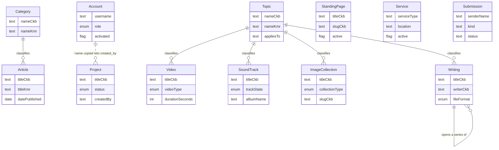
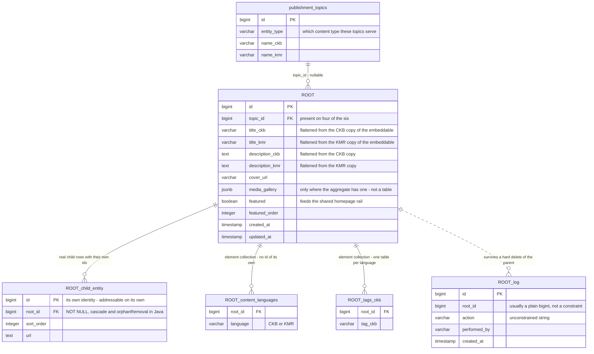
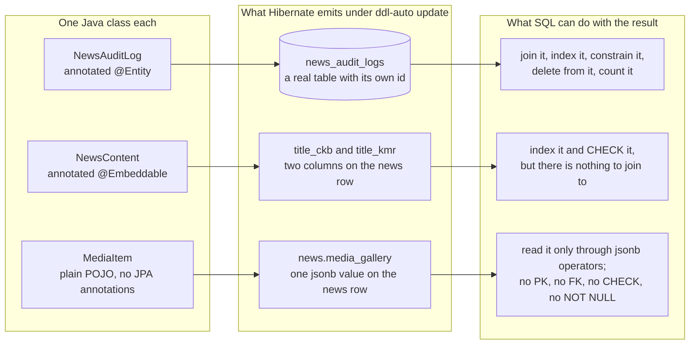
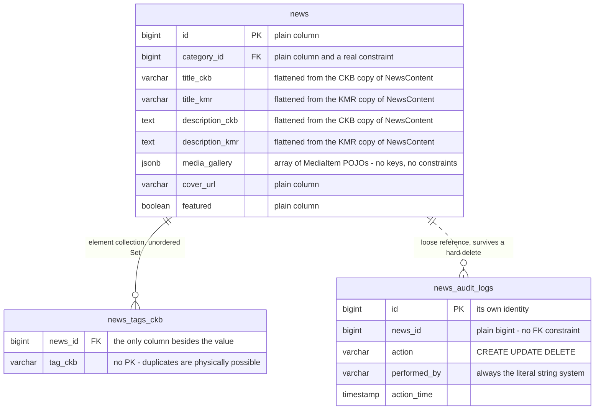
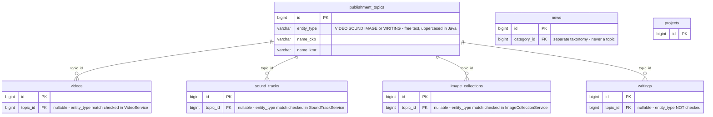
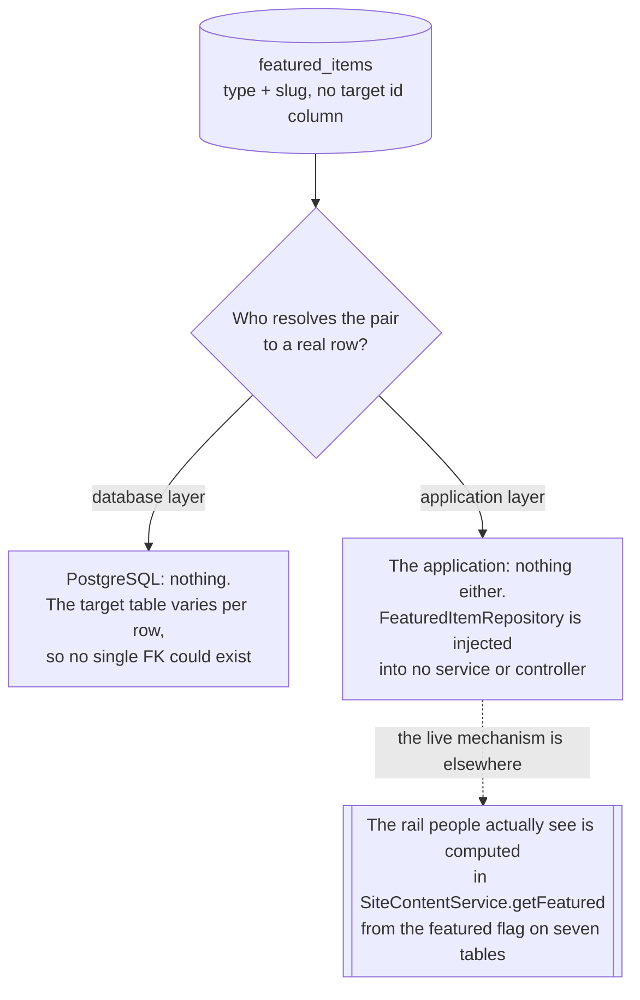
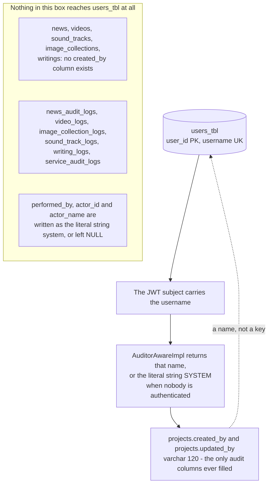
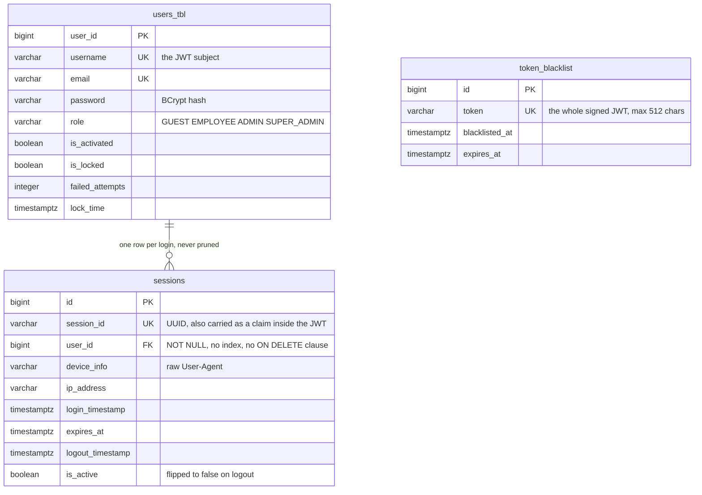
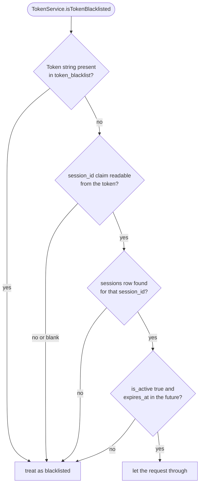

# Entity relationship views

The exhaustive physical reference lives in [`../database/ERD.md`](../database/ERD.md): 14 diagrams,
all 83 tables, every column, every foreign key. This file is deliberately the opposite. It draws
the **conceptual** layer — the business concepts a new person needs before the table names mean
anything — and the **logical** layer — the repeating shape that six different content domains all
instantiate, and the three quite different things that a "field" can turn into in PostgreSQL.

Nothing here restates a table listing. Where a physical detail matters, this file points at
`ERD.md` rather than copying it, so the two cannot drift apart.

Everything below was re-read from the entity classes under
[`src/main/java/ak/dev/khi_backend/`](../../src/main/java/ak/dev/khi_backend/). Where the code
disagreed with the brief this file was built from, the code won; those cases are listed under
[Corrections against the catalogue](#corrections-against-the-catalogue).

---

## Conceptual model

Twelve concepts, no join tables, no side tables, no audit tables, no surrogate keys. Concept names
here are business names, not table names, precisely so this diagram cannot be mistaken for the
physical schema. Two or three defining attributes each. If you read only one diagram in this
repository, read this one.

**What to notice**

- **Three concepts have no relationships at all.** `StandingPage` — the About and Contact pages —
  `Service` and `Submission` are islands. Nothing points at them and they point at nothing. That is
  not a simplification for the diagram; it is true of the physical schema too.
- **Two separate classification systems.** Articles use their own two-level taxonomy
  (`Category` plus a sub-category, both mandatory). The four publishment types share one `Topic`
  registry, and it is optional on all four. Projects have neither.
- **`Account` connects to exactly one concept, by name rather than by key.** Only `Project` records
  who touched it, and it records a `varchar(120)` username, not a user id. See
  [Cross-domain relationships](#cross-domain-relationships).
- **`Submission` is one concept over three tables.** Contact messages, financial donations and
  archive donations are separate tables that share a single status vocabulary and a single
  validator. Their status is a plain string with no transition guard — any value in the vocabulary
  may follow any other.
- **`Writing` is the only self-referencing concept**: a volume points at the book that opens its
  series.

Sources: [`News.java`](../../src/main/java/ak/dev/khi_backend/khi_app/model/news/News.java),
[`Project.java`](../../src/main/java/ak/dev/khi_backend/khi_app/model/project/Project.java),
[`PublishmentTopic.java`](../../src/main/java/ak/dev/khi_backend/khi_app/model/publishment/topic/PublishmentTopic.java),
[`Writing.java`](../../src/main/java/ak/dev/khi_backend/khi_app/model/publishment/writing/Writing.java),
[`SiteContentService.java`](../../src/main/java/ak/dev/khi_backend/khi_app/service/site/SiteContentService.java).

---

## The six content aggregates

News, Projects, Videos, Sound Tracks, Image Collections and Writings are six domains with six sets
of controllers, services, repositories, DTOs and exception types. Structurally they are **one
shape, instantiated six times**. Learn the shape once and every one of the six becomes readable.

### The template

Placeholder names throughout. `ROOT` stands for the aggregate root table; substitute `news`,
`projects`, `videos`, `sound_tracks`, `image_collections` or `writings` and the picture stays true.

**What to notice**

- **Bilingual text never becomes rows.** The CKB and KMR copies of the embeddable land as parallel
  column pairs on the single `ROOT` row. There is no translations table anywhere in this schema.
  Adding a third language would mean adding columns, not rows.
- **Tags and keywords, by contrast, do become rows — one table per language.** `ROOT_tags_ckb` and
  `ROOT_tags_kmr` are separate tables holding bare strings. Only Projects break this rule.
- **Two very different kinds of child.** `ROOT_child_entity` is an `@Entity` with its own primary
  key that the API can address directly. The element-collection tables have no primary key at all
  when the collection is an unordered `Set` — Hibernate emits only the foreign key, so duplicate
  rows are physically possible for anything writing outside JPA.
- **The log edge is dashed on purpose.** Most log tables hold the parent id as a plain `bigint` so
  the history outlives a hard delete. That also means nothing stops it dangling, and nothing
  cascades.
- **`featured` is the one column six aggregates share with each other.** It is what lets one
  in-memory query pool six tables into a single homepage rail. The mechanics are in
  [ERD.md, The featured rail](../database/ERD.md#the-featured-rail).

### The six instances

| Aggregate | Root table | Embedded content class, used twice | Real child entities | Element-collection side tables | Log table |
| --- | --- | --- | --- | --- | --- |
| News | `news` | `NewsContent` — title, description | none | `news_content_languages`, `news_tags_ckb`, `news_tags_kmr`, `news_keywords_ckb`, `news_keywords_kmr` | `news_audit_logs` |
| Projects | `projects` | `ProjectContentBlock` — title, description, location | none | `project_content_languages` | `project_log` |
| Videos | `videos` | `VideoContent` — title, description, location, director, producer | `video_clip_items` | `video_source_files`, `video_cast_members`, `video_highlight_clips`, `video_content_languages`, `video_tags_ckb`, `video_tags_kmr`, `video_keywords_ckb`, `video_keywords_kmr` | `video_logs` |
| Sound Tracks | `sound_tracks` | `SoundTrackContent` — title, description | `sound_track_files` and `sound_track_attachments`; `sound_track_brochures` hangs off a *file*, not off the track | `sound_track_content_languages`, `sound_track_locations`, `sound_track_directors`, `sound_track_tags_ckb`, `sound_track_tags_kmr`, `sound_track_keywords_ckb`, `sound_track_keywords_kmr` | `sound_track_logs` |
| Image Collections | `image_collections` | `ImageContent` — title, description, location, collectedBy | `image_album_items` | `image_collection_languages`, `image_tags_ckb`, `image_tags_kmr`, `image_keywords_ckb`, `image_keywords_kmr` | `image_collection_logs` |
| Writings | `writings` | `WritingContent` — title, description, writer, fileUrl, fileFormat, fileSizeBytes, pageCount, genre | none — series volumes are `writings` rows pointing at `parent_book_id` | `writing_book_genres`, `writing_content_languages`, `writing_tags_ckb`, `writing_tags_kmr`, `writing_keywords_ckb`, `writing_keywords_kmr` | `writing_logs` |

### Where each instance departs from the template

| Aggregate | Topic reference | Departure from the template |
| --- | --- | --- |
| News | **No.** Two mandatory FKs to `news_categories` and `news_sub_categories` instead | Has a `jsonb media_gallery`. Sub-category is a second FK on `news`, not reached through the category |
| Projects | **No.** No classification table at all | The only aggregate that extends `AuditableEntity`, the only one that normalises tags and keywords into shared vocabulary tables with four join tables, and the only one whose log has a real FK with `ON DELETE CASCADE`. Also has a `jsonb media_gallery` |
| Videos | Yes, `entity_type = VIDEO`, validated in Java | Three of its side tables are **ordered** embeddable collections with a composite key `video_id + display_order`, so they behave like real rows. `video_clip_items` is a separate real entity for the `VIDEO_CLIP` shape |
| Sound Tracks | Yes, `entity_type = SOUND`, validated in Java | The only two-level child hierarchy: a track owns files, and each file owns brochure images. Its log declares a real FK and then never populates it |
| Image Collections | Yes, `entity_type = IMAGE`, validated in Java | The plainest instance of the template. Adds `slug_ckb` / `slug_kmr` unique handles, which only About and Contact otherwise have |
| Writings | Yes, `entity_type = WRITING`, **not** validated | The only self-referencing root. Its log is the only publishment log whose FK is actually populated and deliberately NULLed before a delete, kept identifiable by a second snapshot column |

**What to notice**

- **The topic reference is on four of six, not all six.** News and Projects are outside the
  publishment family entirely.
- **Projects is the outlier on almost every axis.** If a rule seems to hold across the codebase,
  check Projects before relying on it.
- **"Child entity" and "side table" are not interchangeable.** News and Projects have zero real
  child entities; Sound Tracks has three across two levels. The API surface follows: only
  aggregates with real child entities expose per-child endpoints.
- **Every one of the six has a log table and none of them agree on its shape.** Column names
  (`performed_by` versus `actor_id` plus `actor_name`), the reference style, and whether the FK is
  real all differ. There is no shared base class.

Sources: [`NewsContent.java`](../../src/main/java/ak/dev/khi_backend/khi_app/model/news/NewsContent.java),
[`ProjectContentBlock.java`](../../src/main/java/ak/dev/khi_backend/khi_app/model/project/ProjectContentBlock.java),
[`Video.java`](../../src/main/java/ak/dev/khi_backend/khi_app/model/publishment/video/Video.java),
[`SoundTrack.java`](../../src/main/java/ak/dev/khi_backend/khi_app/model/publishment/sound/SoundTrack.java),
[`ImageCollection.java`](../../src/main/java/ak/dev/khi_backend/khi_app/model/publishment/image/ImageCollection.java),
[`Writing.java`](../../src/main/java/ak/dev/khi_backend/khi_app/model/publishment/writing/Writing.java).

---

## What is a table and what is not

`NewsContent` is not a table. Neither is `MediaItem`, `StatItem`, `AboutContent`, `VideoContent`,
`WritingContent`, `ImageContent`, `SoundTrackContent`, `ContactContent` or `ProjectContentBlock`.
They look like entities in the Java source — same package, same builders, same field style — and
readers keep assuming they can be joined to. They cannot. This section makes that impossible to
misread.

There are exactly three persistence strategies in this codebase, and the annotation on the class
is the only thing that distinguishes them.

### Three strategies, one example each

**What to notice**

- **The middle lane has no identity.** `NewsContent` is instantiated twice on every `News` — once
  for CKB, once for KMR — and `@AttributeOverrides` renames its columns each time. There is no row,
  no id, and therefore no way to ask "how many NewsContent records exist".
- **The right-hand lane is invisible to the schema.** A `jsonb` array of `MediaItem` has no primary
  key, so a gallery entry cannot be referenced, constrained or cascaded. Deleting an S3 object that
  a gallery entry points at leaves a dangling URL that no database check will ever catch.
- **Only the left lane can be deleted by SQL.** For the other two, the unit of deletion is the
  owning row.
- **All three live in `model/` next to each other.** Package location tells you nothing; read the
  class annotation.

### One `news` row, three origins

The same `news` row mixes all three strategies. Every attribute below is either a plain column, a
column produced by flattening an embeddable, or an opaque `jsonb` blob.

| Java shape | Annotation | Physical result | Own PK | Joinable | Constrainable from SQL |
| --- | --- | --- | --- | --- | --- |
| `NewsAuditLog` | `@Entity` | table `news_audit_logs` | yes | yes | fully |
| `NewsContent` | `@Embeddable` | columns `title_ckb`, `title_kmr`, `description_ckb`, `description_kmr` on `news` | no | no | per column only |
| `MediaItem` | none — plain POJO | one `jsonb` value in `news.media_gallery` | no | no | not at all |
| `Set<String> tagsCkb` | `@ElementCollection` | table `news_tags_ckb` | **no** | yes, on `news_id` | FK only |

**What to notice**

- **An unordered `@ElementCollection` sits between the strategies.** It gets a table but no primary
  key. Uniqueness inside it is a Java `Set` guarantee, not a database one.
- **The same `MediaItem` POJO is serialised into two different columns** — `news.media_gallery` and
  `projects.media_gallery` — and `about_pages.stats` does the identical thing with `StatItem`.
  Three `jsonb` columns, two POJO types, zero tables, and no `ddl-auto` change will ever make one.
- **`news_audit_logs.news_id` carries no `FK` marker on purpose.** It is a plain `bigint`. That is
  what lets a log row outlive the article it describes.

Sources: [`NewsContent.java`](../../src/main/java/ak/dev/khi_backend/khi_app/model/news/NewsContent.java),
[`MediaItem.java`](../../src/main/java/ak/dev/khi_backend/khi_app/model/media/MediaItem.java),
[`StatItem.java`](../../src/main/java/ak/dev/khi_backend/khi_app/model/about/StatItem.java),
[`NewsAuditLog.java`](../../src/main/java/ak/dev/khi_backend/khi_app/model/news/NewsAuditLog.java),
[`About.java`](../../src/main/java/ak/dev/khi_backend/khi_app/model/about/About.java).

---

## Cross-domain relationships

Almost every edge in this schema stays inside one aggregate. Three do not, and each is enforced by
something different — one by the database, one by nothing at all, one by a naming convention.

### publishment_topics, shared by four content types

One table serves the topic lists of Videos, Sound Tracks, Image Collections and Writings, separated
by a free-text `entity_type` discriminator rather than by four tables.

**Enforced by:** the database, but only halfway.

- `topic_id` **is a real foreign key** on all four. Deleting a referenced topic raises a foreign key
  violation — there is no `ON DELETE` clause on any of them.
- The `entity_type` match is **not** a database constraint. Nothing in PostgreSQL stops
  `videos.topic_id` from pointing at a topic whose `entity_type` is `SOUND`.
- Three of the four services check it in Java and throw `topic.type.mismatch`. **`WritingService`
  does not** — [`WritingService.java:353`](../../src/main/java/ak/dev/khi_backend/khi_app/service/publishment/writing/WritingService.java)
  resolves the topic by id and attaches it without inspecting `entity_type`. A writing can be filed
  under a video topic through the normal API.
- `entity_type` itself is unvalidated free text, uppercased on write in
  [`PublishmentTopicService.java`](../../src/main/java/ak/dev/khi_backend/khi_app/service/publishment/topic/PublishmentTopicService.java).
  A topic with `entity_type = 'ANYTHING'` is a legal row.
- Only `VideoRepository` has a `findByTopicId` helper, so only `VideoService` can unlink content
  before deleting a topic. The other three have no safe delete path.

### featured_items, a polymorphic pointer with no target

`featured_items` stores its target as the string pair `(type, slug)`. There is no `entity_id`
column, so the target's primary key is never stored at all.

**Enforced by:** neither layer. `FeaturedItem` is a real `@Entity`, so `ddl-auto: update` creates
the table and its index, but no code reads or writes it. The full `type` to table mapping and the
live rail's ordering rules are in
[ERD.md, The featured rail](../database/ERD.md#the-featured-rail); they are not repeated here.

### users_tbl and the audit columns

The brief this file was built from describes `users_tbl` as being "referenced from audit columns".
It is not, in either sense that phrase could mean.

**Enforced by:** nothing. There is no foreign key from any content table to `users_tbl` anywhere in
the schema, and the string convention that stands in for one is barely populated.

- `AuditableEntity` supplies `created_at`, `updated_at`, `created_by`, `updated_by`, and
  **`Project` is the only entity that extends it** — one class in the whole codebase.
- `created_by` holds `Authentication.getName()`, which is the JWT subject, that is, the
  **username**. Renaming a user silently orphans every historical row: the old name resolves to
  nobody, and nothing detects it.
- Every log table's actor column is hardcoded. `NewsService`, `ServiceService` and
  `ImageCollectionService` write `.performedBy("system")`; `SoundTrackService` writes
  `.actorName("system")` and never sets `actorId`; `WritingService` writes `"system"` / `"System"`;
  `VideoService.logAction` never sets `performedBy` at all, so `video_logs.performed_by` is `NULL`
  in every row. **No log row in this database records which human did anything.**

| Reference | From | To | Real foreign key? | Enforced by |
| --- | --- | --- | --- | --- |
| Topic classification | `videos`, `sound_tracks`, `image_collections`, `writings` | `publishment_topics` | **Yes** | Database, with no `ON DELETE` behaviour |
| Topic type match | the same four | `publishment_topics.entity_type` | No | Java, in three of the four services — not in `WritingService` |
| Featured slide target | `featured_items.type` + `.slug` | any of seven content tables | No | Nothing — the table is never read or written |
| Editor identity | `projects.created_by` / `updated_by` | `users_tbl.username` | No | Convention only; a username string, not an id |
| Log actor | six log tables | nowhere | No | Not populated at all |
| Partner reference | `service_partners.partner_id` | `partners.id` | No | Nothing — see [ERD.md](../database/ERD.md#about-contact-and-services) |

Sources: [`PublishmentTopic.java`](../../src/main/java/ak/dev/khi_backend/khi_app/model/publishment/topic/PublishmentTopic.java),
[`VideoService.java`](../../src/main/java/ak/dev/khi_backend/khi_app/service/publishment/video/VideoService.java),
[`WritingService.java`](../../src/main/java/ak/dev/khi_backend/khi_app/service/publishment/writing/WritingService.java),
[`AuditableEntity.java`](../../src/main/java/ak/dev/khi_backend/khi_app/model/audit/AuditableEntity.java),
[`AuditorAwareImpl.java`](../../src/main/java/ak/dev/khi_backend/khi_app/config/AuditorAwareImpl.java),
[`FeaturedItem.java`](../../src/main/java/ak/dev/khi_backend/khi_app/model/site/FeaturedItem.java).

---

## Identity and access

Three tables, one foreign key, and two independent revocation mechanisms that the same check
consults in sequence. The session policy is `STATELESS`, so nothing about a logged-in user is held
in server memory — `sessions` is the whole of it.

The lifecycle relationship is easier to read as the check that actually runs on every request.
`TokenService.isTokenBlacklisted` is called by `JWTAuthenticationFilter` before the
`SecurityContext` is populated, and it fails closed at every step.

**What to notice**

- **The JWT is joined to `sessions` by a string claim, not by a key.** `session_id` is a UUID minted
  at login, embedded in the token and looked up with `findBySessionId`. That indirection is what
  makes per-device revocation possible: flipping `is_active` to `false` kills one device without
  touching the signing key or the other sessions.
- **Two revocation paths, both consulted.** `token_blacklist` revokes one exact token string;
  `sessions.is_active` revokes a whole device. Logging out does both —
  [`TokenService.blacklistToken`](../../src/main/java/ak/dev/khi_backend/user/service/TokenService.java)
  inserts the blacklist row *and* flips the session.
- **`token_blacklist` has no link to `users_tbl`.** There is no `user_id` column, so "revoke every
  token this user holds" cannot be expressed against this table. It has to go through `sessions`.
- **`sessions.user_id` is `NOT NULL` with no index and no `ON DELETE` clause.** PostgreSQL does not
  auto-index foreign key columns, so every per-user session lookup is a sequential scan. Deleting a
  user works only through
  [`UserService.deleteUser`](../../src/main/java/ak/dev/khi_backend/user/service/UserService.java)
  and
  [`UserProfileService.deleteAccount`](../../src/main/java/ak/dev/khi_backend/user/service/UserProfileService.java),
  which call `sessionRepository.deleteAll(sessions)` first. A `DELETE` from psql fails on the
  foreign key.
- **Neither table is ever pruned.** There is no `@Scheduled` anywhere in `src`, so expired sessions
  and expired blacklist entries accumulate forever and every login adds a row.

Sources: [`User.java`](../../src/main/java/ak/dev/khi_backend/user/model/User.java),
[`Session.java`](../../src/main/java/ak/dev/khi_backend/user/model/Session.java),
[`TokenBlacklist.java`](../../src/main/java/ak/dev/khi_backend/user/model/TokenBlacklist.java),
[`TokenService.java`](../../src/main/java/ak/dev/khi_backend/user/service/TokenService.java).

---

## Corrections against the catalogue

Four places where the source disagreed with the brief this file was written from. In each case the
diagrams above follow the code.

1. **There are six content aggregates, not five.** The brief's heading says five and then names
   six: News, Projects, Videos, Sound Tracks, Image Collections and Writings. All six really do
   instantiate the template, so the section is titled
   [The six content aggregates](#the-six-content-aggregates).

2. **The template's topic reference applies to four of the six, not all six.** `PublishmentTopic`
   is referenced only from `Video`, `SoundTrack`, `ImageCollection` and `Writing`. `News` uses its
   own two-level `news_categories` / `news_sub_categories` taxonomy and `Project` has no
   classification table at all. A repository-wide search for `PublishmentTopic` in `model/` returns
   those four roots and nothing else.

3. **`users_tbl` is not referenced from audit columns in any meaningful sense.** The brief lists it
   alongside `publishment_topic` and `featured_items` as a cross-domain reference. In fact:
   `AuditableEntity` is extended by exactly one class, `Project`; its `created_by` holds a
   `varchar(120)` username rather than a user id; and every log table's actor column is written as
   the literal string `"system"` or left `NULL`. `VideoService.logAction` never sets `performedBy`
   at all. The diagram draws the absence rather than implying an edge.

4. **`SoundType` with values `LAWK` and `HAIRAN` is not what `sound_tracks.sound_type` holds.** The
   enum exists in `khi_app/enums/publishment/` and is referenced by nothing; the column is a
   free-text `varchar(100)`. The same caution applies to reading any of the catalogued enum lists as
   a database constraint — none of them is one, because every enum in this schema is persisted as
   `EnumType.STRING` with no `CHECK`. This is recorded in
   [ERD.md, Sound tracks](../database/ERD.md#sound-tracks) and is repeated here only because it
   changes how the conceptual model should be read.

---

## Related

- [`../database/ERD.md`](../database/ERD.md) — the exhaustive physical reference: 14 diagrams, all
  83 tables, every column and every foreign key, plus the crow's-foot legend used above.
- [`../database/SCHEMA.md`](../database/SCHEMA.md) — column-by-column detail, lengths, nullability,
  indexes and constraint names.
- [`./UML_CLASS.md`](./UML_CLASS.md) — the same model as Java classes: inheritance, the
  `@MappedSuperclass`, the embeddables and the service interfaces.
