# Flowcharts

These are decision-shaped process diagrams: every diamond is a real branch in the code, so you can
trace a concrete case through them and get the right answer. Nothing here is an idealised picture of
how the system ought to work. Where the code does something surprising — a 403 where you expected a
401, a delete that leaves the bucket untouched, a cache that is never evicted — the diagram draws the
surprise and the notes underneath say why it is there.

Read them with a specific request in mind. Pick a method and a path, start at the terminal node, and
follow the diamonds. The endpoint tables in [`../external/`](../external/) and
[`../internal/`](../internal/) tell you what an endpoint accepts and returns; these tell you what
happens to it on the way.

## Contents

- [Request lifecycle](#request-lifecycle) — one HTTP request from the socket to the response body,
  and the three different shapes an error can come back in.
- [Token resolution](#token-resolution) — how `JWTAuthenticationFilter` finds a token and decides
  whether to trust it.
- [Authorization decision](#authorization-decision) — the `SecurityConfig` matcher ladder, rung by
  rung, plus the two gates that run after it.
- [Error mapping](#error-mapping) — from the `throw` to the JSON, with the exact status and
  `ErrorCode` on every exit.
- [Startup sequence](#startup-sequence) — `main()` to first request, and where `ddl-auto: update`
  touches the live schema.
- [Cache read and write](#cache-read-and-write) — the Redis read path, the failure path, and how far
  a single eviction reaches.
- [Media upload pipeline](#media-upload-pipeline) — the two different ways a file gets to S3 and why
  they behave differently.
- [Publishing a content record](#publishing-a-content-record) — why there is no draft state, and
  where the role requirement changes.
- [Bilingual content resolution](#bilingual-content-resolution) — what `contentLanguages` actually
  decides, and the one place the API falls back.
- [Search dispatch](#search-dispatch) — global search versus per-domain search, and what the global
  endpoint does not do.
- [Deleting a content record](#deleting-a-content-record) — what a delete destroys, what it orphans,
  and the three different ways audit history behaves.
- [Adding a new content domain](#adding-a-new-content-domain) — the checklist for the seventh, and
  the shared services that make a domain half-ship if you miss them.
- [Choosing where to document an endpoint](#choosing-where-to-document-an-endpoint) — the rule that
  splits `docs/external/` from `docs/internal/`.
- [Corrections against the catalogue](#corrections-against-the-catalogue)
- [Related](#related)

## How to read these

Every diagram in this file is a Mermaid `flowchart`, drawn top-down (`TD`) unless a short linear
sequence reads better left-to-right (`LR`). Only these shapes appear, and each one means one thing:

| Shape | Written as | Means |
|---|---|---|
| Rounded stadium | `A(["text"])` | A start or an end. The request arrives, or the client gets a response. |
| Rectangle | `A["text"]` | A step that happens. No branch. |
| Diamond | `A{"text?"}` | A real branch in the code. Every outgoing edge is labelled with the condition that takes it. |
| Cylinder | `A[("text")]` | A datastore — PostgreSQL, Redis, the S3 bucket — or a durable side effect left behind in one. |
| Parallelogram | `A[/"text"/]` | An HTTP response written straight back to the client, usually an error. The status and the `ErrorCode` are in the label. |
| Double rectangle | `A[["text"]]` | A call into another diagram in this file. Follow the link in the label. |

Solid arrows (`-->`) are the main path. Dashed arrows (`-.->`) are side effects and exceptional
paths that leave the main flow. Boxed regions (`subgraph`) group steps that run inside one
component — the Spring Security chain, or one stage of a build checklist.

There is no colour anywhere. Shape and position carry all of the meaning, so the diagrams read the
same in a light and a dark theme.

---

## Request lifecycle

One HTTP request, from the socket to the response body. Everything else in this file is a zoom into
one box of this diagram. The part worth reading closely is the split between the two exits on the
right: a request rejected inside the security filter chain and a request rejected inside the
controller layer come back to the client in **different shapes**, with different fields, and only one
of them carries a `traceId`.

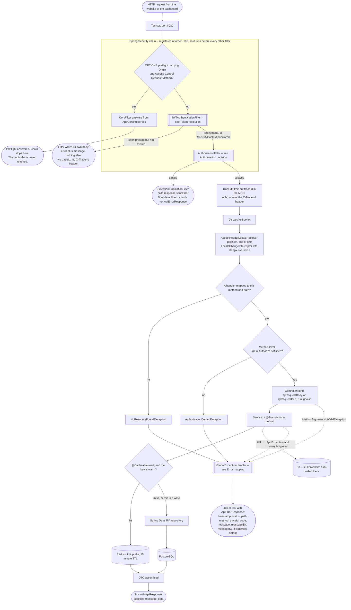

**What to notice**

- **`TraceIdFilter` runs *after* the security chain, not before it.** Neither filter carries `@Order`
  and there is no `FilterRegistrationBean` anywhere, so both are auto-registered at
  `LOWEST_PRECEDENCE`, while Spring Security's chain sits at `-100`. Consequence: any request the
  security chain rejects never reaches `TraceIdFilter`, so it gets **no `X-Trace-Id` header and no
  `traceId` in the body**. If a support ticket has no trace id, that alone tells you the request died
  in authentication or authorization.
- There are **three different error shapes**, not one. `JWTAuthenticationFilter` writes
  `{"error":..., "message":...}` by hand; the `AuthorizationFilter` denial goes through
  `response.sendError` and comes back as Boot's default `/error` JSON; only the third exit produces
  `ApiErrorResponse`.
- A real CORS preflight never reaches `JWTAuthenticationFilter`. `CorsFilter` sits far earlier in the
  chain and terminates the preflight itself. The filter's own `OPTIONS` branch only fires for a
  non-preflight `OPTIONS`.
- `spring.jpa.open-in-view` is `false`. Any lazy association not touched inside the service's
  transaction will not load during serialization — it throws instead.
- The Redis arrow is on the read path for five cache names only (`news`, `projects`, `soundTracks`,
  `imageCollections`, `services`). Every write path on those five *domain services* carries
  `@CacheEvict(allEntries = true)`, so a single edit flushes the whole cache region — but the
  featured toggles live in `SiteContentService`, where only `setServiceFeatured` evicts anything. See
  [Cache read and write](#cache-read-and-write).

Source: [`SecurityConfig.java`](../../src/main/java/ak/dev/khi_backend/user/configs/SecurityConfig.java) ·
[`TraceIdFilter.java`](../../src/main/java/ak/dev/khi_backend/khi_app/config/TraceIdFilter.java) ·
[`I18nConfig.java`](../../src/main/java/ak/dev/khi_backend/khi_app/config/I18nConfig.java) ·
[`CacheConfig.java`](../../src/main/java/ak/dev/khi_backend/khi_app/config/CacheConfig.java)

---

## Token resolution

How `JWTAuthenticationFilter` decides whether there is a token, and whether to trust it. Every exit
below is a real `return` in `doFilterInternal`, and the status codes are the ones the filter actually
writes — which are not the ones the class names elsewhere in the codebase suggest.

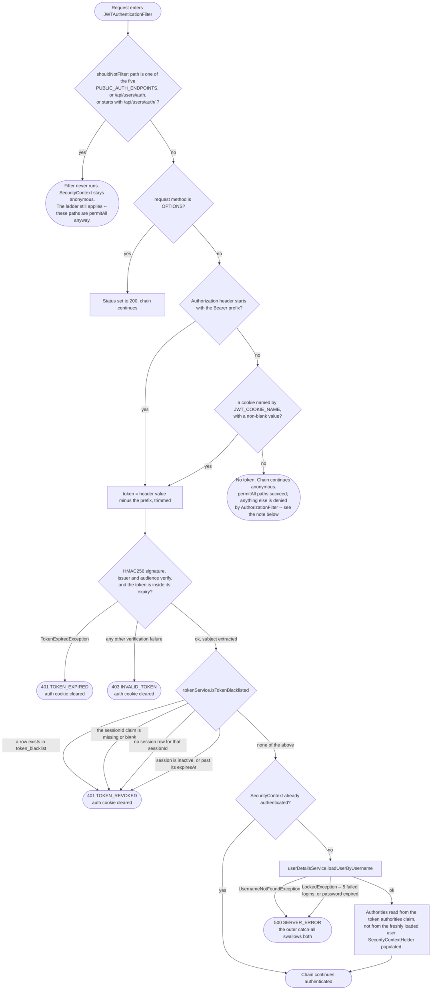

**What to notice**

- **A malformed or wrongly signed token gives 403, not 401.** Only expiry and revocation give 401.
  That is backwards from the usual convention, and a dashboard that refreshes on 401 will loop on a
  403 instead.
- **`isTokenBlacklisted` does far more than read a blacklist.** It also demands a live `Session` row:
  no `sessionId` claim, no matching session, `isActive` false, or a past `expiresAt` all return
  `true`. So "revoked" here means *the session behind this token is no longer usable*, and a logout on
  one device kills the token everywhere.
- **A locked account with a valid token gets 500.** `loadUserByUsername` throws `LockedException`
  inside the filter's outer `try`, whose `catch (Exception ex)` writes
  `500 SERVER_ERROR`. The 423 `ACCOUNT_LOCKED` shape in `GlobalExceptionHandler` is only reachable
  through the login endpoint, never through the filter.
- **Authorities come from the token, not from the database.** `jwtTokenProvider.getAuthorities(token)`
  reads the `authorities` claim that was baked in at login. Promoting a user does not take effect
  until their next login or until their session is revoked.
- **The no-token exit is not a 401.** `SecurityConfig` never calls `.exceptionHandling(...)`, so
  `JwtAuthenticationEntryPoint` and `JwtAccessDeniedHandler` are never registered; Spring Security
  falls back to `Http403ForbiddenEntryPoint`. An anonymous call to a protected endpoint answers
  **403**, not 401.

Source: [`JWTAuthenticationFilter.java`](../../src/main/java/ak/dev/khi_backend/user/jwt/JWTAuthenticationFilter.java) ·
[`JwtCookieService.java`](../../src/main/java/ak/dev/khi_backend/user/jwt/JwtCookieService.java) ·
[`JwtTokenProvider.java`](../../src/main/java/ak/dev/khi_backend/user/jwt/JwtTokenProvider.java) ·
[`TokenService.java`](../../src/main/java/ak/dev/khi_backend/user/service/TokenService.java)

---

## Authorization decision

Given a method and a path, this is exactly how the answer allow-or-deny is reached. `SecurityConfig`
declares its rules as an **ordered ladder**: the first matcher whose method and path both match wins,
and every rule below it is never consulted. Walk the rungs top to bottom and stop at the first `yes`.

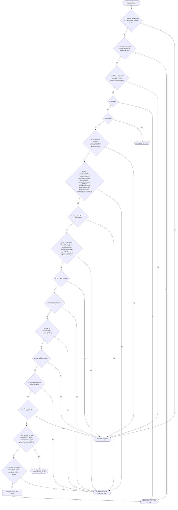

Clearing the ladder is only the first of three gates. The remaining two run inside the
DispatcherServlet, after the handler method has been resolved.

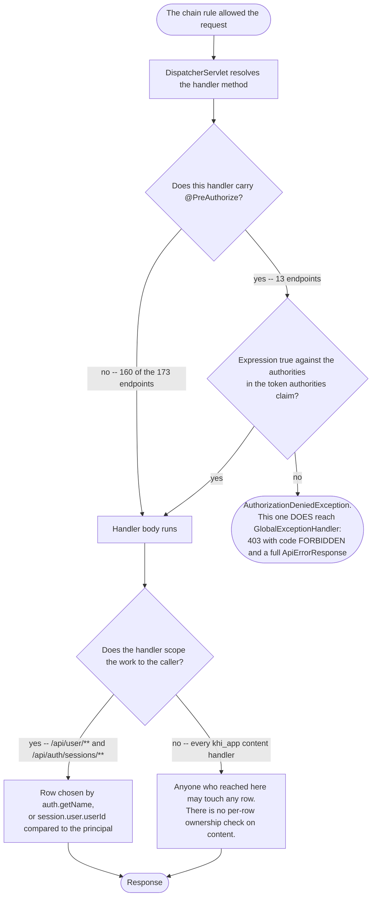

**What to notice**

- **`@PreAuthorize` can only narrow, never widen.** It runs after the ladder has already said yes, so
  a rung that denies a role ends the request before the annotation is ever evaluated.
- **`hasRole('ADMIN')` locks out `SUPER_ADMIN`.** There is no `RoleHierarchy` bean in this codebase.
  `Role.getAuthorities()` grants exactly one role authority, `ROLE_` plus the enum name, so a
  `SUPER_ADMIN` token carries `ROLE_SUPER_ADMIN` and nothing else. Seven of the thirteen
  `@PreAuthorize` expressions in the codebase are the bare `hasRole('ADMIN')` — the six content
  `PATCH /{id}/featured` routes plus `PATCH /api/v1/donations/settings/featured` — and a
  `SUPER_ADMIN` gets 403 on all of them. `GUEST -> EMPLOYEE -> ADMIN -> SUPER_ADMIN` is a naming
  convention enforced by listing every role by hand in each matcher, not an inheritance chain.
- **Rung 12 is a deliberate firebreak.** `/api/v1/media/**` is `ADMIN, SUPER_ADMIN` for *any* method,
  and it sits above the broad `GET /api/v1/**` permitAll. Adding a media read endpoint therefore
  cannot accidentally become public.
- **Trailing segments change the answer completely.** Rung 10 matches `/api/v1/contact` exactly, with
  no `/**`. `/api/v1/contact/active` misses it and falls all the way to rung 23.
- **Two rungs are dead.** Rung 8 guards `GET /featured` at the servlet root, but the only mapping is
  `GET /api/v1/featured` on `PublicSiteController`. Rungs 5 and 7 guard `/api/users/**`, and **no
  controller is mapped under that prefix at all** — so a non-`SUPER_ADMIN` gets 403 for a route that
  does not exist, while a `SUPER_ADMIN` gets 404.

### Three endpoints traced through the ladder

| | `GET /api/v1/contact/active` | `GET /api/v1/contact` | `PATCH /api/v1/videos/{id}/featured` |
|---|---|---|---|
| First rung that matches | rung 23, `GET /api/v1/**` | rung 10, exact path `/api/v1/contact` | rung 26, `PATCH /api/v1/videos/**` |
| Rungs skipped on the way | 1-22 all miss: it is not `/api/v1/contact` exactly, and the `about` and `services` rungs have different prefixes | 1-9 miss; rung 10 lists this exact path | 1-11 miss; the rung-11 `PATCH` list covers contact messages and donations only |
| Chain verdict | `permitAll` | `hasAnyRole('ADMIN','SUPER_ADMIN')` | `hasAnyRole('EMPLOYEE','ADMIN','SUPER_ADMIN')` |
| `@PreAuthorize` on the handler | none | none | `hasRole('ADMIN')` |
| Effective answer | anyone, no token | `ADMIN` or `SUPER_ADMIN` | **`ADMIN` only** — `EMPLOYEE` is denied by the annotation, `SUPER_ADMIN` is denied by the missing role hierarchy |
| Denial produces | n/a | Boot `/error` JSON, no traceId | `ApiErrorResponse`, code `FORBIDDEN`, with traceId |
| Documented in | `docs/external/CONTACT_API.md` | `docs/internal/CONTACT_API.md` | `docs/internal/VIDEO_API.md` |

Source: [`SecurityConfig.java`](../../src/main/java/ak/dev/khi_backend/user/configs/SecurityConfig.java) ·
[`Role.java`](../../src/main/java/ak/dev/khi_backend/user/enums/Role.java) ·
[`VideoController.java`](../../src/main/java/ak/dev/khi_backend/khi_app/api/publishment/video/VideoController.java) ·
[`ContactController.java`](../../src/main/java/ak/dev/khi_backend/khi_app/api/contact/ContactController.java) ·
[`PublicSiteController.java`](../../src/main/java/ak/dev/khi_backend/khi_app/api/site/PublicSiteController.java)

---

## Error mapping

From the `throw` to the JSON the client sees. The first branch is the one people get wrong: whether
an exception reaches `GlobalExceptionHandler` at all depends on which layer threw it, and the two
layers that bypass it produce completely different bodies. Below that first branch, every arrow is one
`@ExceptionHandler` method, and the terminal node names the exact status and `ErrorCode` it writes.

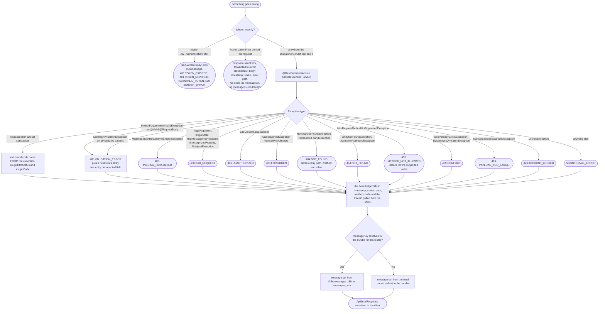

**What to notice**

- **There is only one `@RestControllerAdvice` in the whole application.**
  `user/exceptions/GlobalExceptionHandler.java` contains no handler at all — it holds an empty
  `UserExceptionHandlerPlaceholder` class and a comment explaining that two advices with the same
  simple name collide at startup. Every user and auth exception is handled by the `khi_app` advice, so
  `/api/auth/**` returns the same `ApiErrorResponse` shape as everything else.
- **The `AppException` branch is the only one that does not hard-code its status.** It reads
  `httpStatus` and `code` straight off the thrown object, which is how domain codes like
  `NEWS_NOT_FOUND` (404), `VIDEO_VALIDATION` (400), `VIDEO_MEDIA_INVALID` (400), `IMAGE_CONFLICT`
  (409), `PROJECT_CONFLICT` (409), `WRITING_NOT_FOUND` (404) and `SOUND_MEDIA_INVALID` (400) reach the
  client.
- **`STORAGE_ERROR` is declared, mapped, and unreachable.** `Errors.storage(...)` and all six
  `*StorageException` classes pin it to **502 Bad Gateway**, not 500 — but nothing in
  `src/main/java` ever constructs one. Every real S3 failure is wrapped as a `BadRequestException`
  instead and comes back as 400. See [Media upload pipeline](#media-upload-pipeline).
- **Five `ErrorCode` members can never appear in a response:** `DB_ERROR`, `EXTERNAL_ERROR`,
  `VIDEO_CONFLICT`, `NEWS_MEDIA_INVALID` and `PROJECT_MEDIA_INVALID` are declared but never
  constructed anywhere in `src/main/java`. `VIDEO_MEDIA_INVALID` is *not* one of them — the
  similarly-named `NEWS_MEDIA_INVALID` and `PROJECT_MEDIA_INVALID` are dead while the video one is
  live, which is an easy pair to confuse.
- **The unmapped-URL branch matters.** Without the `NoResourceFoundException` handler, the
  `Exception.class` fallback would answer 500 for a simple typo in a URL. It answers 404 and puts the
  path and method in `details`.
- **`messageEn` is currently never resolved from the bundle**, because the English properties file is
  literally named `" messages_en.properties"` with a leading space and the basename
  `classpath:i18n/messages` cannot find it. There is also no `messages_ku.properties` — `messageKu` is
  resolved against `Locale.forLanguageTag("ku")` while the only Kurdish bundles are `ckb` and `kmr`.
  Both fields therefore fall back to the hard-coded strings in `fallbackByCode`, whose `switch` has no
  case for the video, writing or storage codes and so answers **"Internal error" on a 400**.
- **The same 403 arrives in two different shapes.** Denied at the ladder, it is Boot's `/error` body.
  Denied by `@PreAuthorize`, it is a full `ApiErrorResponse` with a `traceId`. Clients that parse
  `code` must tolerate its absence.

Source: [`GlobalExceptionHandler.java`](../../src/main/java/ak/dev/khi_backend/khi_app/exceptions/GlobalExceptionHandler.java) ·
[`ErrorCode.java`](../../src/main/java/ak/dev/khi_backend/khi_app/exceptions/ErrorCode.java) ·
[`AppException.java`](../../src/main/java/ak/dev/khi_backend/khi_app/exceptions/AppException.java) ·
[`Errors.java`](../../src/main/java/ak/dev/khi_backend/khi_app/exceptions/Errors.java) ·
[`ApiErrorResponse.java`](../../src/main/java/ak/dev/khi_backend/khi_app/exceptions/ApiErrorResponse.java) ·
[`user/exceptions/GlobalExceptionHandler.java`](../../src/main/java/ak/dev/khi_backend/user/exceptions/GlobalExceptionHandler.java)

---

## Startup sequence

What happens between `main()` and the first request being served. The step to look at is the
`ddl-auto` branch: it is the only place in this system where a schema change reaches the database, it
runs with no review and no migration file, and one wrong value in a config file destroys the data.

```mermaid
flowchart TD
    M(["main -- SpringApplication.run on KhiBackendApplication"]) --> ENV["spring-dotenv EnvironmentPostProcessor<br/>merges a .env file into the Environment"]
    ENV --> RES{"Does every placeholder in application.yaml resolve?"}
    RES -->|"no"| FAIL(["Startup aborts.<br/>PGHOST, PGPORT, PGDATABASE, PGUSER, PGPASSWORD,<br/>JWT_SECRET, JWT_EXPIRATION_MS and every JWT_COOKIE_*<br/>are declared with NO default value."])
    RES -->|"yes"| DS["HikariCP opens the PostgreSQL pool<br/>jdbc:postgresql://PGHOST:PGPORT/PGDATABASE"]
    DS --> DSOK{"Database reachable and credentials accepted?"}
    DSOK -->|"no"| FAIL
    DSOK -->|"yes"| HB["Hibernate builds the EntityManagerFactory<br/>and scans every @Entity under ak.dev.khi_backend"]

    HB --> DDL{"spring.jpa.hibernate.ddl-auto"}
    DDL -->|"update -- the value committed in application.yaml"| UPD["Hibernate ALTERs the LIVE schema to match the entities:<br/>creates missing tables, adds missing columns,<br/>creates element-collection side tables.<br/>It never drops and never renames."]
    DDL -->|"create or create-drop"| BOOM(["EVERY TABLE IS DROPPED AND RECREATED.<br/>All production data is lost, with no prompt<br/>and no backup. Never set this value here."])
    DDL -->|"validate or none"| VAL["Schema is checked, or ignored, but not changed"]

    UPD --> RISK["No Flyway. No Liquibase. No migration file, no review step:<br/>merging an entity change IS the migration.<br/>A renamed field leaves the old column behind, still holding the data."]

    RISK --> BEANS["Remaining singletons are created"]
    VAL --> BEANS
    BEANS --> B1["@EnableJpaAuditing wires AuditorAwareImpl<br/>-- created_by falls back to the string SYSTEM when anonymous"]
    B1 --> B2["S3Client built for us-east-1.<br/>DefaultCredentialsProvider.create does NOT resolve credentials here."]
    B2 --> B3["Lettuce connection factory built.<br/>@EnableCaching activates the @Cacheable annotations.<br/>Lettuce does NOT dial Redis here."]
    B3 --> B4["SecurityFilterChain assembled at order -100.<br/>TraceIdFilter and JWTAuthenticationFilter auto-register<br/>as plain servlet filters at LOWEST_PRECEDENCE."]
    B4 --> B5["MessageSource loads classpath:i18n/messages<br/>springdoc scans ak.dev.khi_backend for /api/** paths"]
    B5 --> UP(["Tomcat listens on 8080.<br/>Missing AWS credentials surface on the first upload;<br/>an unreachable Redis surfaces on the first cached read."])
```

**What to notice**

- **`ddl-auto: update` is the migration system.** There is no Flyway and no Liquibase, so the entity
  classes *are* the schema. A field added in a pull request becomes a column in production the moment
  that build boots, in whatever order the deployments happen to run.
- **`update` is one-way.** It adds; it never drops or renames. Rename a Java field and you get a new
  empty column beside the old populated one, and nothing warns you.
- **Two dependencies fail late, not at boot.** `DefaultCredentialsProvider.create()` builds a provider
  without resolving anything, and Lettuce connects lazily — so the app starts happily with no AWS
  credentials and no Redis, then fails on the first upload and the first cached read respectively.
  `CacheConfig`'s own javadoc flags this: before `@EnableCaching` existed, Redis was never on the
  request path at all.
- **The database, by contrast, fails fast.** No datasource means no `EntityManagerFactory` means no
  context, so a bad `PG*` value is caught in seconds.
- **Redis TTL and key prefix live in YAML, not in `CacheConfig`.** Defining a
  `RedisCacheConfiguration` bean would silently replace the property-derived config and drop both the
  `khi:` prefix and the 10-minute TTL.
- **Cached DTOs use JDK serialization.** Every type reachable from a `@Cacheable` return value must be
  `Serializable` with a pinned `serialVersionUID`, or adding a single field makes every entry written
  before the deploy throw `InvalidClassException` until the TTL flushes it.

Source: [`application.yaml`](../../src/main/resources/application.yaml) ·
[`S3Config.java`](../../src/main/java/ak/dev/khi_backend/khi_app/config/S3Config.java) ·
[`CacheConfig.java`](../../src/main/java/ak/dev/khi_backend/khi_app/config/CacheConfig.java) ·
[`AuditingConfig.java`](../../src/main/java/ak/dev/khi_backend/khi_app/config/AuditingConfig.java) ·
[`AuditorAwareImpl.java`](../../src/main/java/ak/dev/khi_backend/khi_app/config/AuditorAwareImpl.java) ·
[`KhiBackendApplication.java`](../../src/main/java/ak/dev/khi_backend/KhiBackendApplication.java)

---

## Cache read and write

Caching was switched on by adding `@EnableCaching`, which activated annotations that had been sitting
inert in the service layer. The read path is unremarkable; the failure path and the eviction blast
radius are what matter operationally.

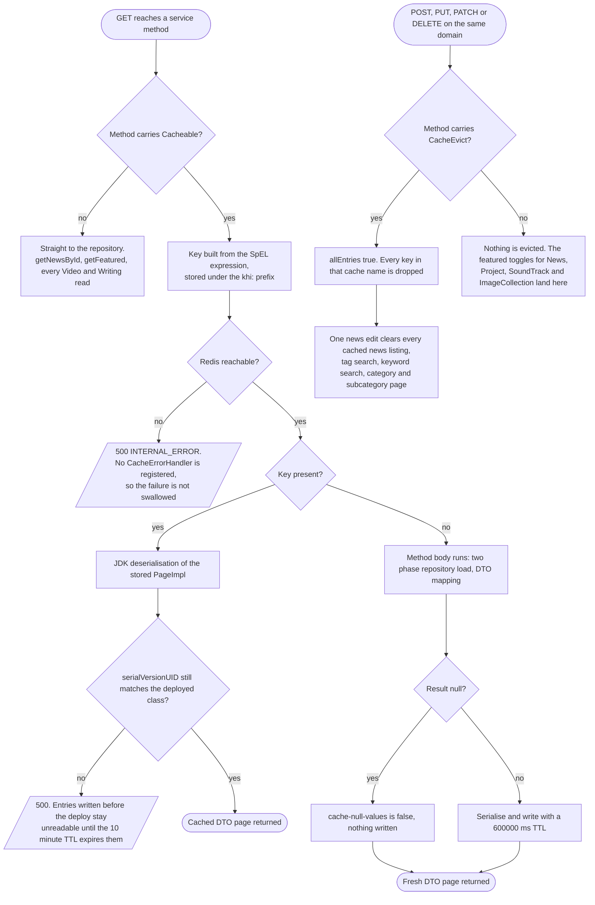

**What to notice**

- Redis is now on the request path. Before `@EnableCaching`, Lettuce connected lazily and nothing
  ever asked it for a value, so the app served traffic with Redis down. Now an unreachable Redis
  turns every cached `GET` into a 500, because no `CacheErrorHandler` or `CachingConfigurer` is
  registered anywhere in the codebase. **`REDIS_HOST`, `REDIS_PORT` and `REDIS_PASSWORD` must be set
  in every environment this deploys to** — the default `localhost:6379` will not save you in a
  container.
- Eviction is `allEntries = true` on a whole cache name. Editing one article invalidates every
  cached news page and every cached news search. That is correct, but it means write-heavy periods
  give you no cache at all.
- **The featured toggles are the gap.** `@CacheEvict` is on the domain services' own writes, not on
  `SiteContentService`, where `PATCH /{id}/featured` is actually implemented. Only
  `setServiceFeatured` carries the annotation; `setNewsFeatured`, `setProjectFeatured`,
  `setSoundTrackFeatured` and `setImageCollectionFeatured` do not, so a cached listing page can serve
  the old `featured` flag and the old `featureImageUrl` for up to the full 10-minute TTL.
- Only five cache names exist: `news`, `projects`, `soundTracks`, `imageCollections`, `services`.
  Videos and Writings have no cache annotations, and `getNewsById` is uncached — a detail page is
  always a live query.
- Serialisation is JDK, not JSON. Every type reachable from a cached return value must implement
  `Serializable` with `serialVersionUID` pinned, or the first write throws
  `SerializationFailedException` and a later field addition throws `InvalidClassException` on read.
  See the contract note in
  [`CacheConfig`](../../src/main/java/ak/dev/khi_backend/khi_app/config/CacheConfig.java).

Source: [`CacheConfig.java`](../../src/main/java/ak/dev/khi_backend/khi_app/config/CacheConfig.java) ·
[`NewsService.java`](../../src/main/java/ak/dev/khi_backend/khi_app/service/news/NewsService.java) ·
[`SiteContentService.java`](../../src/main/java/ak/dev/khi_backend/khi_app/service/site/SiteContentService.java)

---

## Media upload pipeline

There are two ways a file reaches S3, and they behave differently enough that treating them as one
pipeline will mislead you. The shared editor endpoint streams; every per-domain multipart endpoint
loads the whole file into heap first. Both end at the same key layout under `khi-web-folders`, and
neither one reads duration or bitrate.

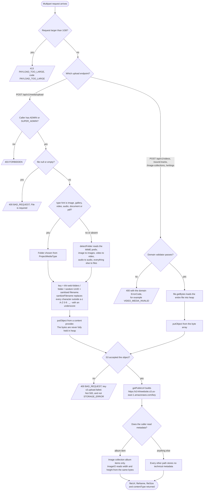

**What to notice**

- `/api/v1/media/**` is `hasAnyRole("ADMIN", "SUPER_ADMIN")` in
  [`SecurityConfig`](../../src/main/java/ak/dev/khi_backend/user/configs/SecurityConfig.java). An
  EMPLOYEE may `POST /api/v1/news` but cannot upload the cover image that article needs. The
  "EMPLOYEE writes" pattern stops at the media endpoint.
- Only [`MediaService`](../../src/main/java/ak/dev/khi_backend/khi_app/service/media/MediaService.java)
  uses the streaming overload. `VideoService`, `SoundTrackService`, `ImageCollectionService` and
  `WritingService` all call `file.getBytes()`, so a 1GB video posted to `POST /api/v1/videos`
  becomes a 1GB `byte[]` on the heap before a single byte reaches S3.
- Every S3 failure surfaces as **400**, not 500 and not 502. Every throw site in
  [`S3Service`](../../src/main/java/ak/dev/khi_backend/khi_app/service/S3Service.java) wraps
  `S3Exception` and `SdkClientException` in a `BadRequestException` carrying `ErrorCode.BAD_REQUEST`.
  The 502 `STORAGE_ERROR` path described in [Error mapping](#error-mapping) is fully built and never
  used.
- The size limit is enforced by Spring's multipart parser, before any controller method runs, so
  the 413 body is produced by the `MaxUploadSizeExceededException` handler and never mentions which
  domain you were posting to.
- `POST /api/v1/media/upload/multiple` wraps a failed file in a plain `RuntimeException`, which
  falls through to the catch-all handler as **500 INTERNAL_ERROR** — a different status for the
  same underlying failure as the single-file endpoint.
- **`MediaMetadataExtractor` is not on this path, or on any path.** The class exists and can derive
  duration, bitrate and dimensions, but nothing injects it. The one real metadata read is
  `ImageCollectionService` calling `ImageIO` directly for album-item width and height.

Source: [`S3Service.java`](../../src/main/java/ak/dev/khi_backend/khi_app/service/S3Service.java) ·
[`MediaService.java`](../../src/main/java/ak/dev/khi_backend/khi_app/service/media/MediaService.java) ·
[`MediaMetadataExtractor.java`](../../src/main/java/ak/dev/khi_backend/khi_app/service/MediaMetadataExtractor.java)

---

## Publishing a content record

Editors ask where the draft state is. There isn't one. For all six content domains a `POST` makes
the record publicly readable in the same request, because `GET /api/v1/**` is `permitAll()` and no
content entity carries an `active` or `published` flag. The only staged step is the homepage
carousel, and that is where the role requirement changes.

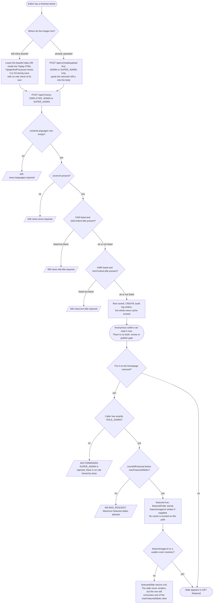

**What to notice**

- The role change is **EMPLOYEE for the body, ADMIN for the flag**. `PATCH /{id}/featured` carries
  `@PreAuthorize("hasRole('ADMIN')")` on all six controllers — News, Project, Video, Image, Sound,
  Writing. `Role.getAuthorities()` grants exactly one `ROLE_` authority and nothing declares a
  `RoleHierarchy`, so a SUPER_ADMIN gets 403 on the one operation the name suggests they own.
- An EMPLOYEE can still get media into S3 without touching `/api/v1/media/**`: leaving a base64
  data URI in the Tiptap description makes
  [`TiptapHtmlProcessor`](../../src/main/java/ak/dev/khi_backend/khi_app/service/media/TiptapHtmlProcessor.java)
  upload it during save. The ADMIN gate on the upload endpoint does not cover that route.
- The featured cap is global. `countAllFeatured()` sums News, Project, Writing, Video, SoundTrack,
  ImageCollection and the donation settings row against
  `SiteSettings.maxFeaturedSlides` (default 7) — featuring a video can block featuring an article.
- A featured record with no resolvable image is counted but not shown. `featuredSlide` returns
  `null` when `imageUrl` is blank and `addCandidate` drops it, yet `countAllFeatured()` still counts
  the row. The carousel can look short while the API refuses to feature anything more.
- Only `setServiceFeatured` evicts a cache. `setNewsFeatured`, `setProjectFeatured`,
  `setSoundTrackFeatured` and `setImageCollectionFeatured` do not, so a cached listing page can show
  the old `featureImageUrl` for up to the 10 minute TTL. This is the same gap drawn in
  [Cache read and write](#cache-read-and-write).

Source: [`NewsService.java`](../../src/main/java/ak/dev/khi_backend/khi_app/service/news/NewsService.java) ·
[`SiteContentService.java`](../../src/main/java/ak/dev/khi_backend/khi_app/service/site/SiteContentService.java) ·
[`TiptapHtmlProcessor.java`](../../src/main/java/ak/dev/khi_backend/khi_app/service/media/TiptapHtmlProcessor.java)

---

## Bilingual content resolution

The catalogue answer — "translations are two embedded column pairs" — is right about storage and
tells you nothing about what the client receives. What actually decides the response is the
`contentLanguages` element collection, and the API almost never falls back.

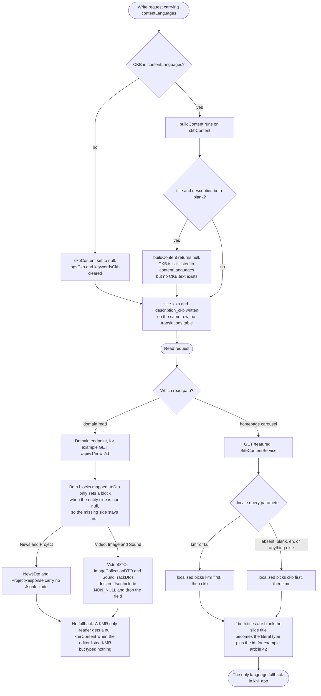

**What to notice**

- Domain endpoints have **no locale parameter at all**. They return both blocks and let the client
  choose. The `lang` query parameter registered by `LocaleChangeInterceptor` in
  [`I18nConfig`](../../src/main/java/ak/dev/khi_backend/khi_app/config/I18nConfig.java) affects only
  the localised `message` on an error body — never which content block comes back.
- `applyContentByLanguages` is destructive on update. Dropping `CKB` from `contentLanguages` nulls
  `ckbContent` and clears `tagsCkb` and `keywordsCkb` in the same save. The Sorani text is gone, not
  hidden.
- Whether the null block is serialised as `"kmrContent": null` or omitted differs per domain, and it
  is decided by the DTO, not by configuration.
  `spring.jackson.default-property-inclusion: non_null` sits in `application.yaml`, but
  [`JacksonConfig`](../../src/main/java/ak/dev/khi_backend/khi_app/config/JacksonConfig.java)
  registers a hand-built `new ObjectMapper()` that never sees those properties. Only the DTOs
  carrying an explicit `@JsonInclude(NON_NULL)` reliably omit the field.
- `resolveFeaturedLocale` collapses everything that is not `kmr` or `ku` down to `ckb` — including
  `en`. There is no English content anywhere in the model, so this is correct, but it means an
  `Accept-Language: en` client silently receives Sorani.

---

## Search dispatch

Two things surprise people about search here: the global endpoint does not merge or rank anything,
and the per-domain endpoints return richer objects than the global one. Choosing between them is a
choice about response shape, not about coverage.

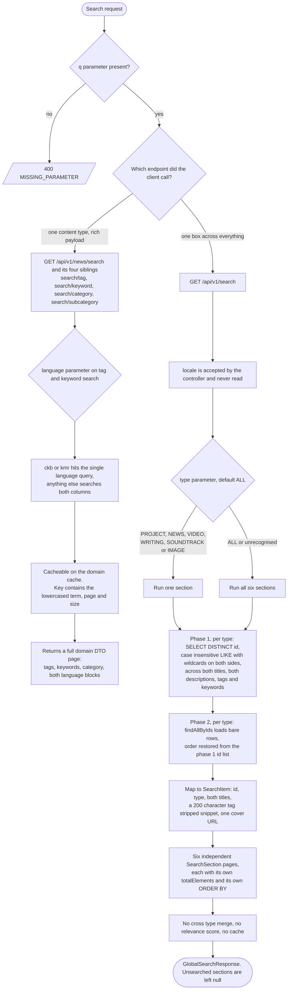

**What to notice**

- Nothing is ranked and nothing is merged. Each section keeps the sort its own repository declares,
  and they disagree: news orders by `datePublished DESC, createdAt DESC`, image collections by
  `publishmentDate DESC, createdAt DESC`, soundtracks by `max(createdAt) DESC`, and projects,
  videos and writings by `id DESC`. Rendering all six in one visual list produces an ordering no
  single query intended.
- `size` is **per section**. `type=ALL&size=10` returns up to 60 items, and
  [`GlobalSearchService`](../../src/main/java/ak/dev/khi_backend/khi_app/service/search/GlobalSearchService.java)
  does not clamp it, unlike the domain services which cap page size at 100 in `buildPageable`.
- An unrecognised `type` falls into the `ALL` branch rather than erroring, because `searchesType`
  tests `"ALL".equals(requested) || target.equals(requested)` and a typo matches neither section
  name but also never trips a validation check.
- The matching is `lower(column) LIKE lower('%q%')`. The leading wildcard rules out any B-tree
  index, and `lower()` is a no-op on Sorani script — case folding only ever matters for
  Latin-script Kurmanji.
- Global search results are **not cached**; the per-domain `/search` paths are. The single-box
  endpoint is the expensive one.

---

## Deleting a content record

A delete here destroys less than you would expect. Row and child rows go; the bucket does not. The
useful question is not "is the S3 delete inside the transaction" but "is there an S3 delete at all",
and for the six content domains the answer is no.

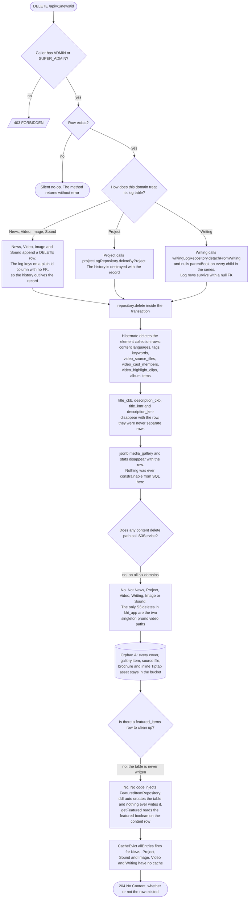

The second orphan shape — a live row pointing at an object that is gone — cannot come from a content
delete, because content deletes never touch S3. It comes from the promo-video replace path, the one
place where a delete and a transaction overlap.

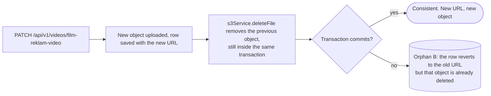

**What to notice**

- No content delete calls `S3Service`. Grepping `s3Service.delete` across
  [`khi_app/service`](../../src/main/java/ak/dev/khi_backend/khi_app/service) returns five hits:
  four on the `FilmReklamVideo` and `SoundReklamVideo` singletons, and one in `MediaService.delete`
  behind `DELETE /api/v1/media?fileUrl=`, which a human has to call by hand with a URL they already
  know. Deleting a sound album with twelve audio files leaves twelve objects in `s3-khiwebsite` with
  nothing referencing them and no record of what those URLs were.
- `S3Service.deleteFile` and `deleteByKey` catch and log every exception rather than rethrowing, so
  even where a delete is attempted a failure is invisible to the caller and to the transaction.
- `featured_items` is dead schema. The entity and repository compile, `ddl-auto: update` creates the
  table, and nothing in `src/main/java` injects the repository. `SecurityConfig` also protects
  `POST`, `PUT` and `DELETE` on `/api/v1/featured/**`, but only a `GET` handler exists.
- The delete is a no-op when the id is unknown, on every domain — no 404. A dashboard that reports
  "deleted" on a stale id is telling the truth about the response and nothing about the database.
- Audit history behaves three different ways across six domains. If you are reconstructing what
  happened to a deleted record, News/Video/Image/Sound will tell you, Writing will tell you without
  saying which record, and Project will tell you nothing.

---

## Adding a new content domain

Six content domains repeat the same shape, and the repetition is the specification. This is the
checklist for the seventh. The steps that people miss are in stage 5 — the new domain is invisible
to search and to the homepage until three shared services are edited by hand.

```mermaid
flowchart TD
    subgraph sg1 ["Stage 1. Persistence"]
        a1["Entity under model, carrying featured, featuredOrder,<br/>featureImageUrl and a contentLanguages ElementCollection"]
        a2["Embeddable content class, embedded twice with<br/>AttributeOverrides producing the ckb and kmr column pair"]
        a3["Log entity. Decide now whether it keeps a real FK<br/>or a plain id column, that decides what survives a delete"]
    end
    subgraph sg2 ["Stage 2. Data access"]
        b1["Repository with findAllIds, findAllByIds<br/>and findByIdWithGraph for the two phase read"]
        b2["findIdsByGlobalSearch over both titles, both descriptions,<br/>tags and keywords, with an explicit ORDER BY"]
        b3["findByFeaturedTrueOrderByFeaturedOrderAscIdDesc<br/>and countByFeaturedTrue, both required by SiteContentService"]
    end
    subgraph sg3 ["Stage 3. Service"]
        c1["Service with validate against contentLanguages,<br/>TiptapHtmlProcessor on every description,<br/>and the id page then hydrate read"]
        c2["Cacheable and CacheEvict allEntries under a new cache name"]
        c3["Every cached DTO implements Serializable<br/>with serialVersionUID pinned to 1L"]
    end
    subgraph sg4 ["Stage 4. API and errors"]
        d1["Controller, request and response DTOs,<br/>and the PATCH id featured route with PreAuthorize"]
        d2["Exception family: NotFound, Validation, Media,<br/>Storage, Conflict, Internal"]
        d3["ErrorCode members and matching Errors factory methods"]
    end
    subgraph sg5 ["Stage 5. Shared wiring, easy to forget"]
        e1["SecurityConfig: add the path to the POST, PUT,<br/>PATCH and DELETE matcher lists"]
        e2["GlobalSearchService: repository, private search method,<br/>a SearchSection field on the response<br/>and the type filter string"]
        e3["SiteContentService: repository, per type mapper,<br/>a setXFeatured method and a line in countAllFeatured"]
        e4["PublishmentTopic entityType string,<br/>if the domain has a taxonomy"]
    end
    subgraph sg6 ["Stage 6. Documentation"]
        f1["docs/external for the permitAll reads"]
        f2["docs/internal for the authenticated writes"]
        f3["docs/database SCHEMA.md and ERD.md"]
    end

    sg1 --> sg2
    sg2 --> sg3
    sg3 --> sg4
    sg4 --> sg5
    sg5 --> sg6
```

**What to notice**

- Stage 5 is where a new domain silently half-ships. `GlobalSearchService` and `SiteContentService`
  both hard-code the six existing repositories; nothing scans or registers. Skip them and the domain
  works perfectly through its own endpoints while being unfindable and unfeatureable.
- `ddl-auto: update` means the entity is the migration. There is no Flyway or Liquibase, so a
  renamed column leaves the old one in place and a dropped field leaves its data behind. Plan the
  column names before the first deploy, not after.
- Pick the log shape deliberately. A plain `Long` id column keeps history after a delete but gives
  you no referential integrity; a real `@ManyToOne` forces you to delete or detach before the hard
  delete, as `WritingService` and `ProjectService` each discovered differently.
- Decide the bilingual storage on purpose. Five domains embed twice, but `service_contents` is a
  real per-language table with `UNIQUE(service_id, language_code)`. That is the only shape that
  accepts a third language without a schema change — a genuine fork in the house pattern, not an
  oversight.
- Add the `@JsonInclude(NON_NULL)` decision to the DTO explicitly. The YAML setting for it does not
  reach the hand-built `ObjectMapper`, so whichever way you want the missing language block to
  serialise, you have to say so on the class.
- Stage 3's `@CacheEvict` covers the domain service only. If the new domain gets a
  `setXFeatured` on `SiteContentService`, put the eviction there too — the six existing ones mostly
  do not, which is the bug drawn in [Cache read and write](#cache-read-and-write).

---

## Choosing where to document an endpoint

This whole documentation set is split by one rule: **can an anonymous visitor call it?** Public goes
in `docs/external/`, everything else in `docs/internal/`. That sounds obvious until you hit a
controller that mixes both, which most of them do. Run a new endpoint through this before writing a
line of prose.

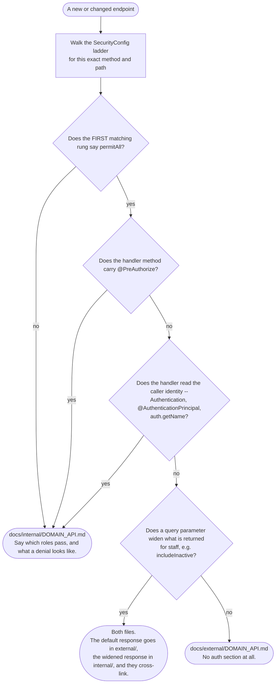

**What to notice**

- **Test the exact path, not the prefix.** `/api/v1/contact` and `/api/v1/contact/active` land in
  different folders. So do `GET` and `PUT` on the same URL.
- **`@PreAuthorize` overrides a `permitAll` rung.** No such endpoint exists today, but nothing stops
  one, and the annotation is what the caller experiences.
- **A controller is almost never wholly one or the other.** Most of the eighteen mix public reads with
  admin writes. Document the reads in `external/`, the writes in `internal/`, and link the two.
- **Both READMEs carry endpoint counts.** `docs/README.md` and both folder READMEs quote "80 public,
  91 authenticated". Adding an endpoint means updating those numbers too.
- **Anything reached only by `anyRequest().authenticated()` is internal by definition** — that is the
  bottom rung and it never permits.

---

## Corrections against the catalogue

Five places where the source disagreed with the brief these diagrams were written from, or where the
two halves of the draft disagreed with each other. In every case the diagrams above follow the code.

1. **`TraceIdFilter` does not run "alongside" the Spring Security chain — it runs after it.**
   [`TraceIdFilter`](../../src/main/java/ak/dev/khi_backend/khi_app/config/TraceIdFilter.java) is a
   bare `@Component` extending `OncePerRequestFilter` with no `@Order` and no
   `FilterRegistrationBean` anywhere in the codebase, so it auto-registers at `LOWEST_PRECEDENCE`
   while the security chain sits at `-100`. That is why the two security-layer exits in
   [Request lifecycle](#request-lifecycle) carry no `traceId` and no `X-Trace-Id` header.

2. **`JwtAuthenticationEntryPoint` and `JwtAccessDeniedHandler` do not handle 401 and 403.** Both
   classes exist and compile, but `SecurityConfig` never calls `.exceptionHandling(...)`, so neither
   is ever registered. Spring Security falls back to `Http403ForbiddenEntryPoint`, which is why an
   anonymous call to a protected endpoint answers 403 rather than 401.

3. **The featured toggles do not evict the cache.** One half of the draft said every write path on
   the five cached services carries `@CacheEvict(allEntries = true)`; the other said only
   `setServiceFeatured` evicts. Both are describing different objects. The domain services
   (`NewsService`, `ProjectService`, `SoundTrackService`, `ImageCollectionService`, `ServiceService`)
   do evict on all their own writes. The featured toggles live in
   [`SiteContentService`](../../src/main/java/ak/dev/khi_backend/khi_app/service/site/SiteContentService.java),
   and only `setServiceFeatured` there carries the annotation. The diagrams draw the second, narrower
   truth and the wider statement is qualified wherever it appears.

4. **`MediaMetadataExtractor` is dead code.** The catalogue lists it as a cross-cutting collaborator
   deriving duration, bitrate and dimensions. The class is real and does all of that, but a
   repository-wide search for its name returns only its own file — nothing injects it and nothing
   calls it. The single genuine metadata read in the system is `ImageCollectionService` calling
   `ImageIO` directly for album-item width and height.

5. **`STORAGE_ERROR` is built and unreachable; `VIDEO_MEDIA_INVALID` is live.** `Errors.storage(...)`
   and all six `*StorageException` classes map `STORAGE_ERROR` to 502, but nothing constructs them —
   every real S3 failure is a 400 `BAD_REQUEST` from `S3Service`. Meanwhile `VIDEO_MEDIA_INVALID` is
   constructed by `VideoMediaException` and does reach clients, unlike its near-namesakes
   `NEWS_MEDIA_INVALID` and `PROJECT_MEDIA_INVALID`, which are dead.

---

## Related

- [`./UML_SEQUENCE.md`](./UML_SEQUENCE.md) — the same paths as message-by-message call flows, with
  the participants and the lifelines these boxes stand for.
- [`./UML_COMPONENT.md`](./UML_COMPONENT.md) — the components each box here runs inside, the filter
  chain as a structure rather than a decision, and the deployment topology.
- [`./UML_STATE.md`](./UML_STATE.md) — the state machines behind the branches above: submission
  status, publication, sessions, tokens and uploads.
- [`./UML_CLASS.md`](./UML_CLASS.md) — the classes named in these diagrams, their inheritance and the
  exception hierarchy behind [Error mapping](#error-mapping).
- [`./ER.md`](./ER.md) — the tables the persistence steps write to, and what is a real table versus
  an embedded column pair or a `jsonb` blob.
- [`../external/`](../external/) — the 80 public endpoints, with request and response shapes.
- [`../internal/`](../internal/) — the 91 authenticated endpoints, with the roles each one requires.
- [`../database/`](../database/) — the physical schema: `SCHEMA.md` for columns and constraints,
  `ERD.md` for the full diagram set, `MIGRATIONS.md` for what `ddl-auto: update` does and does not do.
