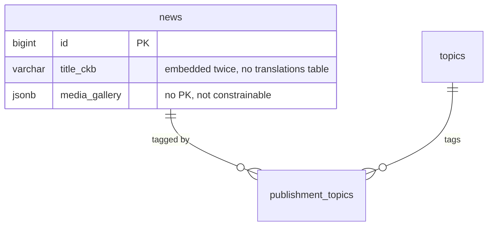
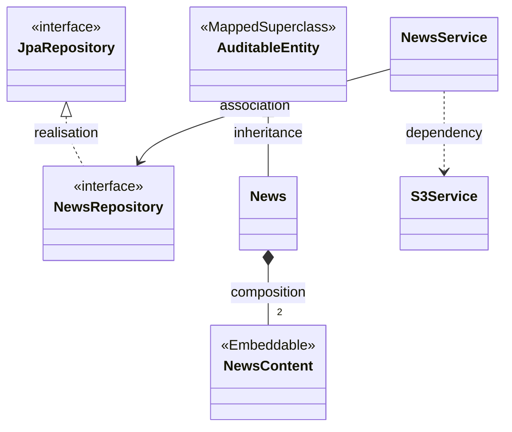
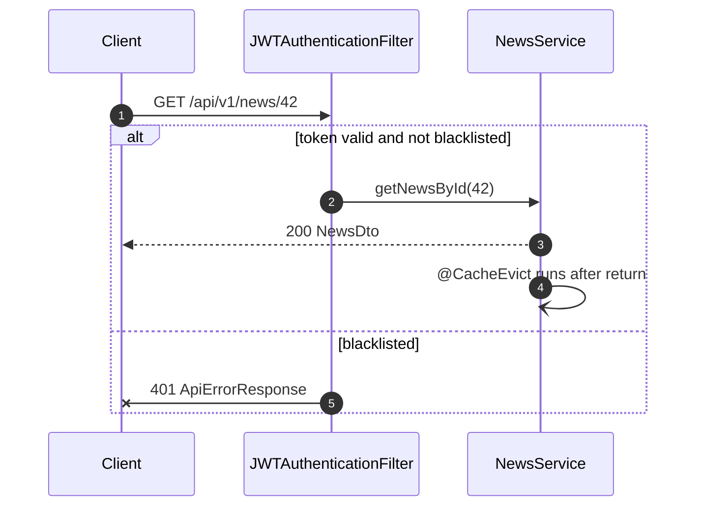
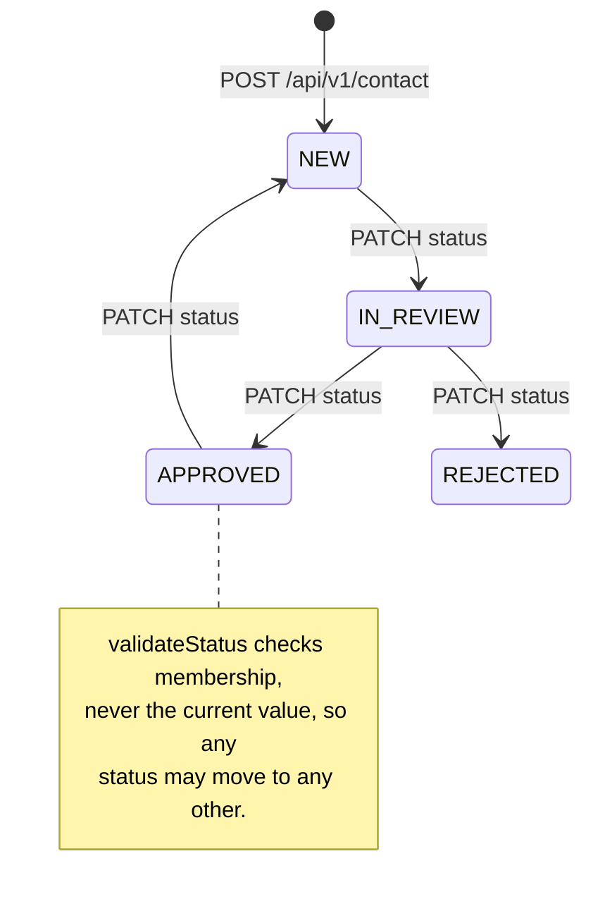
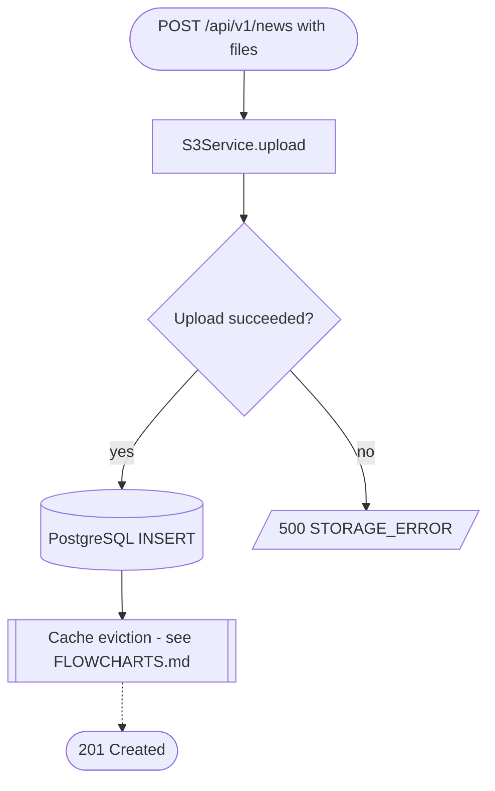

# Diagrams

Visual companions to the written reference in [`../external/`](../external/),
[`../internal/`](../internal/) and [`../database/`](../database/): the same system, drawn as
structure, call order, state and branch logic rather than as endpoint tables. Every diagram is
Mermaid, rendered natively by GitHub, and every one of them was drawn from the source rather than
from the prose — where a diagram and an earlier description disagreed, the code won and the
disagreement is written down next to the picture.

**65 diagrams across 6 documents · verified against source 2026-08-26**

---

## What is in this folder

Listed in the order they are worth reading if you are new. Nothing here restates an endpoint
table; each document answers a question the tables cannot.

| Document | Diagrams | Notations used | Reach for it when |
|---|---:|---|---|
| [`UML_COMPONENT.md`](./UML_COMPONENT.md) | 7 | `flowchart` | You need the map: what runs where, which config class actually does something, and which third-party libraries are on a production code path versus merely on the classpath. |
| [`FLOWCHARTS.md`](./FLOWCHARTS.md) | 15 | `flowchart` | You have a concrete request or a concrete change in mind and want to follow the real branches — authorization, error mapping, cache, upload, delete, startup. |
| [`UML_SEQUENCE.md`](./UML_SEQUENCE.md) | 18 | `sequenceDiagram` | You need call *order*: which write lands in S3 before the first `INSERT`, where the transaction opens, which eviction runs after the method returns. |
| [`UML_STATE.md`](./UML_STATE.md) | 8 | `stateDiagram-v2` | You need to know what a record is allowed to become — submission status, publication, sessions and tokens, account lock, upload, track state — and which states have no exit. |
| [`ER.md`](./ER.md) | 9 | `erDiagram`, `flowchart` | You need the data model as concepts rather than columns: the shape six content domains share, and the three different things a "field" turns into in PostgreSQL. |
| [`UML_CLASS.md`](./UML_CLASS.md) | 8 | `classDiagram` | You need the Java types: what is an entity, what is an `@Embeddable`, which Spring interfaces get implemented, and how the exception hierarchy splits across two handlers. |

The physical schema reference — 14 more diagrams, all 83 tables, every column and foreign key —
lives in [`../database/ERD.md`](../database/ERD.md) and is deliberately not duplicated here.

---

## Where to start

| Goal | Start here | Then |
|---|---|---|
| Understand the system for the first time | [System context](./UML_COMPONENT.md#system-context) | [Internal component structure](./UML_COMPONENT.md#internal-component-structure), [Request lifecycle](./FLOWCHARTS.md#request-lifecycle), [Layered architecture](./UML_CLASS.md#layered-architecture) |
| Trace why a request got a 403 | [Authorization decision](./FLOWCHARTS.md#authorization-decision) | [Token resolution](./FLOWCHARTS.md#token-resolution), [The authenticated request](./UML_SEQUENCE.md#the-authenticated-request), [Error mapping](./FLOWCHARTS.md#error-mapping) |
| Add a new content type | [Adding a new content domain](./FLOWCHARTS.md#adding-a-new-content-domain) | [The content aggregate template](./UML_CLASS.md#the-content-aggregate-template), [The six content aggregates](./ER.md#the-six-content-aggregates) |
| Change an entity | [What is a table and what is not](./ER.md#what-is-a-table-and-what-is-not) | [Startup sequence](./FLOWCHARTS.md#startup-sequence) for where `ddl-auto: update` touches the live schema, then [`../database/MIGRATIONS.md`](../database/MIGRATIONS.md) |
| Change a relationship | [Conceptual model](./ER.md#conceptual-model) | [Deleting a content record](./FLOWCHARTS.md#deleting-a-content-record) for what a cascade will and will not clean up |
| Debug a media upload | [Media upload pipeline](./FLOWCHARTS.md#media-upload-pipeline) | [Creating content with media](./UML_SEQUENCE.md#creating-content-with-media), [Upload lifecycle](./UML_STATE.md#upload-lifecycle) |
| Understand the bilingual model | [Bilingual content resolution](./FLOWCHARTS.md#bilingual-content-resolution) | [The template](./ER.md#the-template), [The content aggregate template](./UML_CLASS.md#the-content-aggregate-template) |
| Work out which status changes are legal | [Submission status](./UML_STATE.md#submission-status) | [Public submission and the admin queue](./UML_SEQUENCE.md#public-submission-and-the-admin-queue) |
| Work out what a delete leaves behind | [Deleting a content record](./FLOWCHARTS.md#deleting-a-content-record) | [Deleting a content root](./UML_SEQUENCE.md#deleting-a-content-root), [The one delete path that cleans up S3](./UML_SEQUENCE.md#the-one-delete-path-that-cleans-up-s3) |
| Understand what is cached and for how long | [Cache read and write](./FLOWCHARTS.md#cache-read-and-write) | [Cached read](./UML_SEQUENCE.md#cached-read), [Cache eviction on write](./UML_SEQUENCE.md#cache-eviction-on-write) |
| Understand login, tokens and revocation | [Login](./UML_SEQUENCE.md#login) | [Session and token lifecycle](./UML_STATE.md#session-and-token-lifecycle), [Identity and access](./ER.md#identity-and-access) |

---

## Reading Mermaid

Five notations appear across this folder. Each example below is tiny, renderable, and uses real
names from this codebase so the shapes attach to something. `UML_SEQUENCE.md` and `FLOWCHARTS.md`
each repeat their own legend at the top of the file; this is the folder-wide version.

### erDiagram — crow's foot

Used in [`ER.md`](./ER.md) and [`../database/ERD.md`](../database/ERD.md). The symbol nearest a box
describes how many of *that* box participate.

| Symbol | Reads as |
|---|---|
| `\|\|` | exactly one |
| `o\|` | zero or one |
| `}o` | zero or more |
| `}\|` | one or more |

So `news ||--o{ publishment_topics` is "one news row, zero or more join rows".

### classDiagram — UML arrows

Used in [`UML_CLASS.md`](./UML_CLASS.md). The arrowhead and the line style together carry the
meaning; `<<Stereotype>>` marks what a type is to Spring or JPA.

Solid line with a hollow triangle (`<|--`) is `extends`; dashed with a hollow triangle (`<|..`) is
`implements`. A filled diamond (`*--`) means the part cannot exist without the whole — which is
exactly what an `@Embeddable` is. A hollow diamond (`o--`) would mean it can.

### sequenceDiagram — arrow styles

Used in [`UML_SEQUENCE.md`](./UML_SEQUENCE.md). Time runs downward, participants are real classes
rather than roles, and the arrow style says whether the caller waits.

`->>` is a synchronous call, `-->>` a reply, `-)` fire-and-forget, and `-x` a rejected or aborted
message. `alt` / `else` are mutually exclusive branches; `opt`, `loop` and `par` also appear.

### stateDiagram-v2

Used in [`UML_STATE.md`](./UML_STATE.md). Boxes are states a stored value can hold, labels on the
arrows name the real trigger, and `[*]` is creation or destruction.

The absence of an arrow is information: if a state has no outgoing edge in
[`UML_STATE.md`](./UML_STATE.md), nothing in the code moves a record out of it.

### flowchart

Used in [`FLOWCHARTS.md`](./FLOWCHARTS.md), [`UML_COMPONENT.md`](./UML_COMPONENT.md) and parts of
[`ER.md`](./ER.md). Shape carries meaning; there is no colour anywhere, so the diagrams read the
same in a light and a dark theme.

Stadium is a start or an end, rectangle a step, diamond a real branch in the code, cylinder a
datastore or a durable side effect, parallelogram an HTTP response written straight back, and a
double rectangle a jump to another diagram. Solid arrows are the main path; dashed arrows are side
effects.

---

## SVG exports

Every diagram is also available as a standalone SVG beside its source document in this folder —
65 files, named `<document>-<NN>-<heading>.svg`, so `flowcharts-03-authorization-decision.svg` is
the third diagram in [`FLOWCHARTS.md`](./FLOWCHARTS.md). Use those for slides, PDFs, printed
handouts, or any wiki that will not render Mermaid.

The 14 SVGs for [`../database/ERD.md`](../database/ERD.md) are not kept here, for the same reason
the diagrams themselves are not: that reference lives with the schema.

The markdown here is the source; the SVGs are build output. Edit the diagram in the markdown, then
regenerate with [`../../scripts/render-diagrams.sh`](../../scripts/render-diagrams.sh).

## Viewing these diagrams

- **GitHub renders them inline.** Open any file in this folder in the web UI and the diagrams
  appear as pictures. No build step, no generated images, nothing to keep in sync.
- **Most IDEs need a plugin.** VS Code needs a Mermaid preview extension; IntelliJ needs the
  Mermaid plugin enabled for its Markdown preview. Without one you will see the fenced source.
- **[mermaid.live](https://mermaid.live) is the quickest way to edit one.** Paste the contents of a
  fenced mermaid block, change it there with live feedback, paste it back. It is also the fastest
  way to confirm a block still parses before you commit.
- **The diagrams are plain text.** They diff line by line, review like code, and a wrong arrow shows
  up in a pull request as a one-line change rather than as a swapped binary image.

---

## Keeping them accurate

A diagram that is quietly wrong is worse than no diagram, because it is believed. When you change
the code, this is the diagram that goes stale.

| You changed | Update | Why |
|---|---|---|
| Added an endpoint | Usually nothing here — document it in [`../external/`](../external/) or [`../internal/`](../internal/). Update [Authorization decision](./FLOWCHARTS.md#authorization-decision) only if it adds a new matcher rung, and [Choosing where to document an endpoint](./FLOWCHARTS.md#choosing-where-to-document-an-endpoint) never changes. | The diagrams draw shapes and branches, not the endpoint list. An endpoint that fits an existing pattern adds no new shape. |
| Changed auth on a path — a `SecurityConfig` matcher or a `@PreAuthorize` | [Authorization decision](./FLOWCHARTS.md#authorization-decision), [The authenticated request](./UML_SEQUENCE.md#the-authenticated-request), [Request filter chain](./UML_COMPONENT.md#request-filter-chain) | Authorization is two layers. Changing one without redrawing the other is how the "403 where you expected 401" cases get lost. |
| Added or removed a filter | [Request filter chain](./UML_COMPONENT.md#request-filter-chain), [Request lifecycle](./FLOWCHARTS.md#request-lifecycle), [Token resolution](./FLOWCHARTS.md#token-resolution) | Filter order is behaviour. The chain diagram is the only place the order is stated. |
| Added an entity | [The six content aggregates](./ER.md#the-six-content-aggregates), [The content aggregate template](./UML_CLASS.md#the-content-aggregate-template), and [`../database/ERD.md`](../database/ERD.md) | The template diagrams claim six domains share one shape. A seventh either fits the shape or breaks the claim, and both need saying. |
| Changed a relationship, a cascade or an `orphanRemoval` | [Conceptual model](./ER.md#conceptual-model), [Deleting a content record](./FLOWCHARTS.md#deleting-a-content-record), [Deleting a content root](./UML_SEQUENCE.md#deleting-a-content-root) | Cascade behaviour is what the delete diagrams are about: what JPA removes, what it orphans, and what stays in S3. |
| Changed a field from a column to `jsonb`, an `@Embeddable` or an `@ElementCollection` | [What is a table and what is not](./ER.md#what-is-a-table-and-what-is-not) | That diagram exists specifically to show which of the three strategies each field uses and what each one costs. |
| Added an enum value | [`UML_STATE.md`](./UML_STATE.md) if it is a state (`TrackState`, publication, submission status); [Shared support classes](./UML_CLASS.md#shared-support-classes) otherwise; [Error mapping](./FLOWCHARTS.md#error-mapping) and [Exception hierarchy](./UML_CLASS.md#exception-hierarchy) for a new `ErrorCode` | A new state with no incoming or outgoing transition drawn is a state nobody knows how to reach. |
| Changed service call order — S3 before or after the transaction, eviction before or after the write | The matching diagram in [`UML_SEQUENCE.md`](./UML_SEQUENCE.md), plus [Media upload pipeline](./FLOWCHARTS.md#media-upload-pipeline) or [Cache read and write](./FLOWCHARTS.md#cache-read-and-write) | Order is the entire point of a sequence diagram. A reordering that leaves the class diagram correct still invalidates the sequence. |
| Added a config class, an environment variable or a dependency | [Configuration map](./UML_COMPONENT.md#configuration-map), [External dependencies](./UML_COMPONENT.md#external-dependencies) | Those two diagrams separate wiring that has an effect from wiring that does not, which only stays true if new entries are classified when they land. |

Two habits keep the folder honest:

1. **Re-read the source before editing a diagram**, not the diagram's own notes. Every file here
   was built that way, and each one carries a "Corrections against the catalogue" section listing
   what the code contradicted.
2. **Paste the edited block into [mermaid.live](https://mermaid.live) before committing.** A block
   that fails to parse renders on GitHub as a red error box, not as the old picture.

---

## Related

- [`../README.md`](../README.md) — documentation index, platform facts, and the rule that splits
  `external/` from `internal/`.
- [`../external/README.md`](../external/README.md) — the 80 public endpoints, with request and
  response shapes.
- [`../internal/README.md`](../internal/README.md) — the 91 authenticated endpoints, with the role
  each one requires.
- [`../database/README.md`](../database/README.md) — the physical schema: `SCHEMA.md` for columns
  and constraints, `ERD.md` for the full diagram set, `FIELDS.md` for the fields people get wrong,
  `MIGRATIONS.md` for what `ddl-auto: update` does and does not do.
