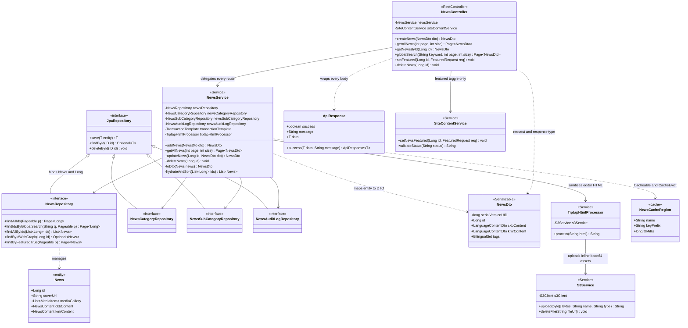
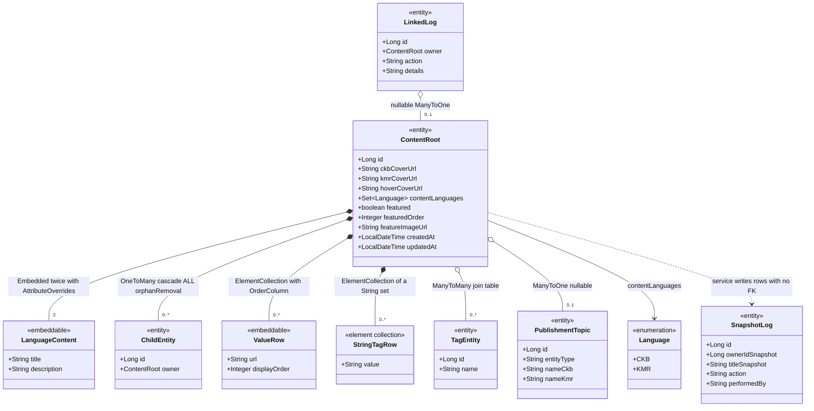
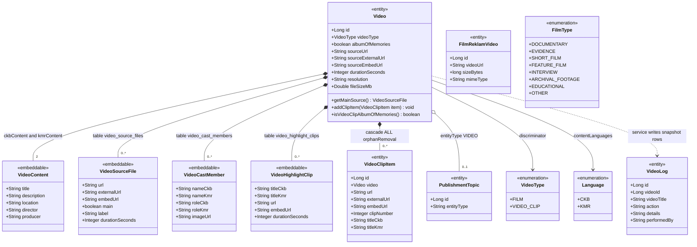
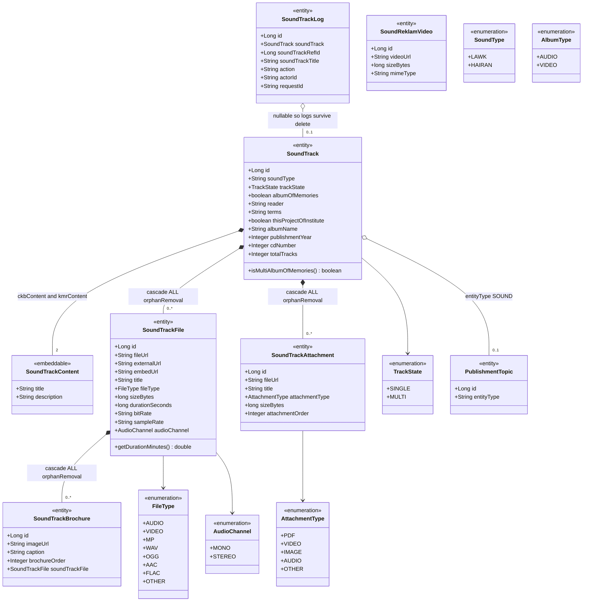
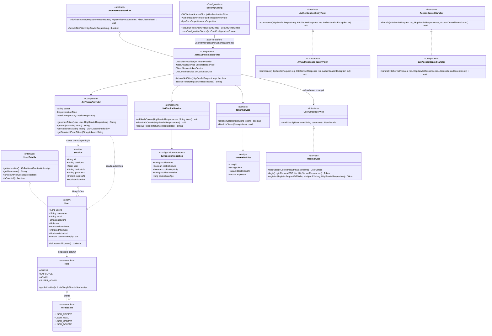
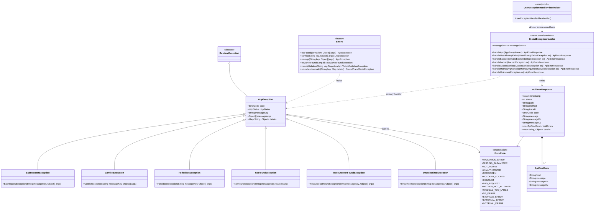

# UML class diagrams

Java types, not database tables. Where [`ER.md`](./ER.md) shows the physical tables,
this file shows the classes that generate them: which type is an entity, which is an
`@Embeddable`, which Spring interfaces get implemented, and how the layers depend on
each other.

Everything below was read out of `src/main/java/ak/dev/khi_backend/` before it was
drawn. Where the code disagreed with the written catalogue, the code won — see
[Corrections](#corrections-made-against-the-catalogue) at the end for the list.

---

## Layered architecture

Every content domain in `khi_app` is built the same way, so it is worth learning the
shape once. This is the News domain with its real class names. The point of the
picture is what the layers do *not* do: the controller never touches a repository, the
service never touches S3 directly, and the repository hands back IDs rather than
entities for every paged query.

**What to notice**

- `NewsService` has no `S3Service` field. Storage reaches it only through
  `TiptapHtmlProcessor`, which rewrites inline `data:` URIs in the editor HTML into
  permanent S3 URLs. The same is true of `ProjectService`, `AboutService`,
  `ContactService` and `ServiceService`. Only the four publishment services plus
  `MediaService` and `UserProfileService` inject `S3Service` directly.
- Every paged search returns `Page~Long~`, not `Page~News~`. `hydrateAndSort` then
  re-loads that ID page through `findAllByIds` and restores the order in Java. This is
  what makes `@BatchSize` on the element collections pay off — see
  [`NewsRepository`](../../src/main/java/ak/dev/khi_backend/khi_app/repository/news/NewsRepository.java).
- The controller injects a second service, `SiteContentService`, purely for
  `PATCH /{id}/featured`. Featuring is cross-cutting site behaviour, not News
  behaviour, so it lives outside `NewsService` in every domain.
- `NewsDto` and all its nested DTOs implement `Serializable` with a pinned
  `serialVersionUID`. That is a hard requirement, not a habit: Spring's Redis cache
  uses JDK serialization, so a non-`Serializable` field anywhere in the graph throws on
  the first cache write.
- The other domains mirror this exactly. Substitute
  `Video` / `SoundTrack` / `ImageCollection` / `Writing` / `Project` for `News` and the
  class list is the same, minus the category repositories and plus a
  `PublishmentTopicRepository`.

Source:
[`NewsController`](../../src/main/java/ak/dev/khi_backend/khi_app/api/news/NewsController.java),
[`NewsService`](../../src/main/java/ak/dev/khi_backend/khi_app/service/news/NewsService.java),
[`NewsDto`](../../src/main/java/ak/dev/khi_backend/khi_app/dto/news/NewsDto.java).

---

## The content aggregate template

Six root entities — News, Project, Video, SoundTrack, ImageCollection, Writing — share
one class shape. This diagram is a template: the boxes are slots, not real class names,
and the table underneath binds each slot to its real class per domain. It is worth
looking at because the slots are filled inconsistently, and the inconsistency is
invisible from the endpoint tables.

Concrete bindings, all verified against the entity source:

| Slot | News | Project | Video | SoundTrack | ImageCollection | Writing |
|---|---|---|---|---|---|---|
| `LanguageContent` | `NewsContent` | `ProjectContentBlock` | `VideoContent` | `SoundTrackContent` | `ImageContent` | `WritingContent` |
| Fields in it | 2 | 3 | 5 | 2 | 4 | 8 |
| `ChildEntity` | none | none | `VideoClipItem` | `SoundTrackFile`, `SoundTrackAttachment` | `ImageAlbumItem` | none |
| `ValueRow` | none | none | `VideoSourceFile`, `VideoCastMember`, `VideoHighlightClip` | none | none | none |
| Tags | `Set~String~` | `ProjectTag` / `ProjectKeyword` entities | `Set~String~` | `Set~String~` | `Set~String~` | `Set~String~` |
| Topic | `NewsCategory` + `NewsSubCategory` | none | `PublishmentTopic` | `PublishmentTopic` | `PublishmentTopic` | `PublishmentTopic` |
| Log | `NewsAuditLog` (snapshot) | `ProjectLog` (linked) | `VideoLog` (snapshot) | `SoundTrackLog` (linked) | `ImageCollectionLog` (snapshot) | `WritingLog` (linked) |
| JSONB gallery | `List~MediaItem~` | `List~MediaItem~` | none | none | none | none |

**What to notice**

- The bilingual slot is filled by embedding the *same* `@Embeddable` class twice —
  `ckbContent` and `kmrContent` — with `@AttributeOverrides` renaming the columns to
  `title_ckb` / `title_kmr`. There is no translations table and no translation entity,
  so a third language means an entity change plus a schema change, not a data row.
- The log slot splits three ways. `NewsAuditLog`, `VideoLog` and `ImageCollectionLog`
  store a bare `Long` owner id with no foreign key, so the rows survive a hard delete.
  `SoundTrackLog` and `WritingLog` keep a *nullable* `@ManyToOne` **and** a snapshot id.
  `ProjectLog` keeps only the `@ManyToOne` — and records a field-level diff
  (`fieldName` / `oldValue` / `newValue`) instead of a free-text `details` string.
- Project is the only root that models tags as entities. Everywhere else a tag is a
  row in a `Set~String~` element collection, which means tags cannot be renamed
  globally or counted across domains without a scan.
- `PublishmentTopic` is shared by four domains and discriminated by a plain
  `entityType` string column (`"VIDEO"`, `"SOUND"`, …), not by subclassing. Nothing in
  the schema stops a Video pointing at a SOUND topic.
- Only `Project` extends `AuditableEntity`. Every other root hand-rolls `createdAt` /
  `updatedAt` in `@PrePersist` / `@PreUpdate`, so `created_by` / `updated_by` exist on
  the projects table alone.

---

## Video domain in full

The richest content type, and the one where class names mislead most. Three of the
types that read like child tables are `@Embeddable` value rows, one is a real entity,
and one class with `Video` in its name has nothing to do with the `Video` aggregate at
all.

**What to notice**

- `VideoSourceFile`, `VideoCastMember` and `VideoHighlightClip` are `@Embeddable`, used
  as `@ElementCollection`. They get real side tables with an `@OrderColumn`, but no
  primary key and no entity identity, so they cannot be loaded, referenced or deleted
  on their own. `VideoClipItem` — the one that reads most like a value object — is the
  only real `@Entity` child.
- `FilmReklamVideo` is not a `Video` and has no relationship to one. It is the single
  site-wide looping background clip for the homepage film section; the repository keeps
  at most one row, which is why its endpoints take no id.
- `VideoType` lives in
  [`model/publishment/video/VideoType.java`](../../src/main/java/ak/dev/khi_backend/khi_app/model/publishment/video/VideoType.java),
  not in `khi_app/enums/publishment/` where every other content enum sits.
- `FilmType` is drawn deliberately unconnected: it compiles, but no entity, DTO,
  repository or service references it anywhere in `src/main/java`. A film's kind is
  currently carried by `PublishmentTopic`, not by this enum.
- `Video` keeps `sourceUrl` / `sourceExternalUrl` / `sourceEmbedUrl` *and* the
  `videoSources` list. The three scalar columns are a denormalised mirror of whichever
  `VideoSourceFile` has `main = true`, kept for older consumers. Two writers, one
  truth — `getMainSource()` is the reconciling read.

---

## Sound track domain in full

Sound is the mirror image of Video: where Video pushed its children down into
`@Embeddable` value rows, Sound made every child a real entity, and nested them two
levels deep. It also carries the largest cluster of enums, three of which are not
actually wired to anything.

**What to notice**

- `SoundType` and `AlbumType` are drawn unconnected on purpose. `SoundTrack.soundType`
  is a plain `@Column(length = 100) String` — free text, no `@Enumerated`, no
  validation — and `AlbumType` has no reference anywhere in the codebase. The `LAWK` /
  `HAIRAN` vocabulary exists only as an unused enum file.
- Brochures hang off `SoundTrackFile`, not off `SoundTrack`. Deleting one audio file
  cascades away its cover art and booklet scans; the album itself keeps its other
  files' brochures. This two-level cascade is unique to Sound.
- `files` and `attachments` are `Set`, not `List`, and the comments in the entity say
  why: Hibernate cannot fetch two `List` bags in one query, so the pair would throw
  `MultipleBagFetchException`. Ordering is recovered with `@OrderBy("id ASC")`.
- `SoundTrackLog.soundTrack` is a nullable `@ManyToOne` sitting *alongside*
  `soundTrackRefId` and `soundTrackTitle`. On delete the service nulls the relation and
  the snapshot columns carry the history — belt and braces, unlike `VideoLog` which has
  the snapshot only.
- `SoundReklamVideo` mirrors `FilmReklamVideo` exactly: a single-row background clip
  for the homepage sound section, unrelated to any `SoundTrack`.

---

## Security and identity classes

Authentication lives entirely in `user/`. The diagram shows which Spring interfaces are
realized and, just as importantly, which declared components are never plugged in.

**What to notice**

- `JwtAuthenticationEntryPoint` and `JwtAccessDeniedHandler` correctly realize their
  Spring interfaces and are `@Component` beans — but no arrow reaches them, because
  `SecurityConfig` never calls `.exceptionHandling(...)`. They are wired to nothing.
  Anonymous 401s and role-refusal 403s are produced by Spring's defaults and by
  `GlobalExceptionHandler.handleAccessDenied`; expired, invalid and revoked tokens get
  a hand-written JSON body straight from `JWTAuthenticationFilter.sendErrorResponse`.
- `User` implements `UserDetails` directly, so the JPA entity *is* the security
  principal. `isAccountNonLocked()` re-computes the lockout window from `lockTime` on
  every call rather than storing an unlock timestamp.
- `Role` is a single column, not a collection, and its `getAuthorities()` returns the
  permission strings **plus** a synthesised `ROLE_<NAME>`. That synthesised authority is
  what `hasRole('ADMIN')` in `SecurityConfig` and `@PreAuthorize` actually match on —
  the four `Permission` values are never checked anywhere.
- The filter reloads the principal through `UserDetailsService` even though the token
  already carries the username and authorities. That extra database read is what makes
  `@AuthenticationPrincipal UserDetails` resolve in controllers.
- Revocation is a database table (`TokenBlacklist`), consulted on every authenticated
  request via `TokenService.isTokenBlacklisted` — so "stateless sessions" still means
  one blacklist lookup per request.

---

## Exception hierarchy

`khi_app/exceptions/` is where every error in the application ends up, including the
ones thrown from `user/`. The structure is flatter than it looks from the package
listing.

### Core types and the advice split

### Per-domain exception families

The boxes below are **packages**, not classes. The member lines are the real class
names inside each package, and every one of them extends `AppException` directly —
none of them extends the generic `NotFoundException` / `ConflictException` pair above.
Reading the member lists side by side shows the gaps.

```mermaid
classDiagram
    class AppException {
        +ErrorCode code
        +HttpStatus httpStatus
        +Map~String, Object~ details
    }

    class exceptions_news {
        <<package>>
        +NewsNotFoundException
        +NewsConflictException
        +NewsValidationException
        +NewsStorageException
        +NewsInternalException
    }

    class exceptions_project {
        <<package>>
        +ProjectNotFoundException
        +ProjectConflictException
        +ProjectValidationException
        +ProjectSearchValidationException
        +ProjectStorageException
        +ProjectInternalException
    }

    class exceptions_publishment_video {
        <<package>>
        +VideoNotFoundException
        +VideoValidationException
        +VideoMediaException
        +VideoStorageException
        +VideoInternalException
    }

    class exceptions_publishment_sound {
        <<package>>
        +SoundTrackNotFoundException
        +SoundTrackConflictException
        +SoundTrackValidationException
        +SoundTrackMediaException
        +SoundTrackStorageException
        +SoundTrackInternalException
    }

    class exceptions_publishment_image {
        <<package>>
        +ImageCollectionNotFoundException
        +ImageCollectionConflictException
        +ImageCollectionValidationException
        +ImageCollectionMediaException
        +ImageCollectionStorageException
        +ImageCollectionInternalException
    }

    class exceptions_publishment_writing {
        <<package>>
        +WritingNotFoundException
        +WritingValidationException
        +WritingMediaException
        +WritingStorageException
        +WritingInternalException
    }

    class ErrorCode {
        <<enumeration>>
        +NEWS_NOT_FOUND
        +PROJECT_CONFLICT
        +VIDEO_VALIDATION
        +SOUND_MEDIA_INVALID
        +IMAGE_CONFLICT
        +WRITING_NOT_FOUND
    }

    AppException <|-- exceptions_news : every member extends
    AppException <|-- exceptions_project : every member extends
    AppException <|-- exceptions_publishment_video : every member extends
    AppException <|-- exceptions_publishment_sound : every member extends
    AppException <|-- exceptions_publishment_image : every member extends
    AppException <|-- exceptions_publishment_writing : every member extends
    AppException --> ErrorCode : one domain member per family
```

**What to notice**

- There is exactly **one** `@RestControllerAdvice` in the application, and it is
  `khi_app`'s. The file `user/exceptions/GlobalExceptionHandler.java` contains only a
  package-private, no-op stub called `UserExceptionHandlerPlaceholder`; its Javadoc
  says two advice beans with the same simple name collide at startup. That is why
  `handleUserAlreadyExists`, `handleBadCredentials`, `handleLocked` and
  `handleUsernameNotFound` — all `user/` concerns — live in the `khi_app` handler.
- `AppException` is **concrete**, not abstract. Nothing stops a caller throwing it
  directly, and `Errors.notFound(...)` / `Errors.conflict(...)` do exactly that,
  returning a bare `AppException` rather than one of the six named subclasses.
- The six generic subclasses and the six domain families are parallel branches, not a
  chain. `NewsNotFoundException` does **not** extend `NotFoundException`; both extend
  `AppException`. So `catch (NotFoundException e)` will not catch a domain 404.
- The families are not symmetric. News and Project have a `Conflict` but no `Media`
  exception. Video and Writing have a `Media` but no `Conflict`. Sound and Image have
  both. Project alone adds a seventh, `ProjectSearchValidationException`.
- Every domain gets all four `*_NOT_FOUND` / `*_CONFLICT` / `*_VALIDATION` /
  `*_MEDIA_INVALID` codes in `ErrorCode` even where no exception class uses them.
  Six members have no thrower anywhere in `src/main/java`: `PROJECT_MEDIA_INVALID`,
  `NEWS_MEDIA_INVALID`, `VIDEO_CONFLICT`, `WRITING_CONFLICT`, `DB_ERROR` and
  `EXTERNAL_ERROR`. A client cannot rely on the enum as a list of reachable states.

Source:
[`AppException`](../../src/main/java/ak/dev/khi_backend/khi_app/exceptions/AppException.java),
[`Errors`](../../src/main/java/ak/dev/khi_backend/khi_app/exceptions/Errors.java),
[`GlobalExceptionHandler`](../../src/main/java/ak/dev/khi_backend/khi_app/exceptions/GlobalExceptionHandler.java).

---

## Shared support classes

The cross-cutting layer. Worth looking at because the dependency edges are narrower
than the names imply: exactly one class talks to S3 on behalf of the editor, exactly
one entity uses the auditing superclass, and one advertised helper is wired to nothing.

```mermaid
classDiagram
    class MediaController {
        <<RestController>>
        -MediaService mediaService
        +upload(MultipartFile file, String type) UploadResponse
        +uploadMultiple(List~MultipartFile~ files, String type) List~UploadResponse~
        +delete(String fileUrl) void
    }

    class MediaService {
        <<Service>>
        -S3Service s3Service
        +upload(MultipartFile file, String type) UploadResponse
        +delete(String fileUrl) void
        -resolveMediaType(String hint) ProjectMediaType
    }

    class TiptapHtmlProcessor {
        <<Service>>
        -S3Service s3Service
        +process(String html) String
        -rewrite(String html, Pattern p, String attr) String
    }

    class S3Service {
        <<Service>>
        -S3Client s3Client
        -String bucket
        -String baseFolder
        -String region
        +upload(byte[] bytes, String name, String contentType) String
        +upload(InputStreamProvider src, long length, String name, String type) String
        +uploadAlbumCover(byte[] bytes, String name, String type, boolean isCkb) String
        +uploadAlbumHover(byte[] bytes, String name, String type) String
        +download(String fileUrl) byte[]
        +deleteFile(String fileUrl) void
        +deleteByKey(String key) void
        +deleteFiles(List~String~ fileUrls) void
        +extractKeyFromUrl(String fileUrl) String
        +getPublicUrl(String key) String
    }

    class InputStreamProvider {
        <<interface>>
        +open() InputStream
    }

    class MediaMetadataExtractor {
        <<Component>>
        +extract(byte[] bytes, String contentType, String filename) MediaFileMeta
    }

    class MediaFileMeta {
        +Integer widthPx
        +Integer heightPx
        +Integer durationSeconds
        +String fileFormat
        +String codec
        +Integer bitrateKbps
        +hasData() boolean
    }

    class ProjectMediaType {
        <<enumeration>>
        +IMAGE
        +VIDEO
        +AUDIO
        +DOCUMENT
        +PDF
        +TEXT
    }

    class AuditableEntity {
        <<abstract>>
        +LocalDateTime createdAt
        +LocalDateTime updatedAt
        +String createdBy
        +String updatedBy
    }

    class AuditorAware {
        <<interface>>
        +getCurrentAuditor() Optional~String~
    }

    class AuditorAwareImpl {
        <<Component>>
        +getCurrentAuditor() Optional~String~
    }

    class Project {
        <<entity>>
        +Long id
        +ProjectStatus status
        +List~MediaItem~ mediaGallery
    }

    class AuditingConfig {
        <<Configuration>>
    }
    class S3Config {
        <<Configuration>>
        +s3Client() S3Client
    }
    class CacheConfig {
        <<Configuration>>
    }
    class TraceIdFilter {
        <<Component>>
        +String TRACE_ID
        +String HEADER_TRACE_ID
    }
    class I18nConfig {
        <<Configuration>>
        +messageSource() MessageSource
        +localeResolver() LocaleResolver
    }

    class TiptapOnlyServices {
        <<package>>
        +NewsService
        +ProjectService
        +AboutService
        +ContactService
        +ServiceService
    }

    class MediaOwningServices {
        <<package>>
        +VideoService
        +SoundTrackService
        +ImageCollectionService
        +WritingService
    }

    class UserProfileService {
        <<Service>>
        -S3Service s3Service
    }

    MediaController --> MediaService
    MediaService --> S3Service
    MediaService ..> ProjectMediaType : folder routing
    TiptapHtmlProcessor --> S3Service
    TiptapHtmlProcessor ..> ProjectMediaType
    S3Service *-- InputStreamProvider : nested functional interface
    S3Config ..> S3Service : provides S3Client bean

    TiptapOnlyServices --> TiptapHtmlProcessor
    MediaOwningServices --> TiptapHtmlProcessor
    MediaOwningServices --> S3Service : direct uploads and deletes
    UserProfileService --> S3Service : profile images

    AuditorAware <|.. AuditorAwareImpl
    AuditingConfig ..> AuditorAwareImpl : EnableJpaAuditing auditorAwareRef
    AuditableEntity <|-- Project : the only subclass
    AuditableEntity ..> AuditorAwareImpl : CreatedBy and LastModifiedBy

    MediaMetadataExtractor ..> MediaFileMeta : returns
```

**What to notice**

- `MediaMetadataExtractor` has no incoming edge. It is a `@Component`, it has unit
  tests, and nothing in `src/main/java` injects it. The metadata it would supply is
  either taken straight from the client DTO — `SoundTrackFile.durationSeconds`,
  `bitRate`, `sampleRate` and `audioChannel` all come from the request body — or
  derived by a separate, narrower path: `ImageCollectionService` reads pixel dimensions
  with `javax.imageio.ImageIO` in its own private `extractAndSetImageMetadata`.
- `AuditableEntity` has exactly one subclass, `Project`. Everywhere else the timestamps
  are hand-rolled `@PrePersist` / `@PreUpdate` methods on the entity, which is why
  `created_by` / `updated_by` columns exist only on the projects table even though
  `AuditorAwareImpl` is registered globally.
- `AuditorAwareImpl` returns `Optional.of("SYSTEM")` for anonymous and unauthenticated
  requests rather than an empty `Optional`, so an unauthenticated write is recorded as
  a real author name rather than left null.
- `CacheConfig` declares no beans at all — it is documentation plus `@EnableCaching`.
  The `khi:` prefix, the 10-minute TTL and `cache-null-values: false` are set in
  `application.yaml` under `spring.cache.redis`. Only `NewsService`, `ProjectService`,
  `ImageCollectionService`, `SoundTrackService` and `ServiceService` carry
  `@Cacheable`; Video and Writing reads are uncached.
- `S3Service.InputStreamProvider` is a nested `@FunctionalInterface`, which is what
  lets `MediaService` pass `file::getInputStream` and stream a large upload straight
  through without buffering the whole file into a `byte[]`.

Source:
[`S3Service`](../../src/main/java/ak/dev/khi_backend/khi_app/service/S3Service.java),
[`TiptapHtmlProcessor`](../../src/main/java/ak/dev/khi_backend/khi_app/service/media/TiptapHtmlProcessor.java),
[`MediaMetadataExtractor`](../../src/main/java/ak/dev/khi_backend/khi_app/service/MediaMetadataExtractor.java),
[`AuditableEntity`](../../src/main/java/ak/dev/khi_backend/khi_app/model/audit/AuditableEntity.java),
[`AuditorAwareImpl`](../../src/main/java/ak/dev/khi_backend/khi_app/config/AuditorAwareImpl.java).

---

## Corrections made against the catalogue

Ten places where the source disagreed with the written brief. The diagrams above show
the code, not the brief.

1. **There is only one `GlobalExceptionHandler`.**
   `user/exceptions/GlobalExceptionHandler.java` holds an intentionally empty
   package-private stub, `UserExceptionHandlerPlaceholder` — not a
   `@RestControllerAdvice`. All user and auth exceptions are handled by
   `khi_app.exceptions.GlobalExceptionHandler`.

2. **`JwtAuthenticationEntryPoint` and `JwtAccessDeniedHandler` are not wired.**
   `SecurityConfig` never calls `.exceptionHandling(...)`; there is no reference to
   either class outside its own file. They exist as beans and do nothing.

3. **`AppException` is concrete, not abstract**, and the per-domain exceptions extend
   it *directly* rather than extending `NotFoundException` / `ConflictException` /
   `BadRequestException`. Those six are a parallel branch used by the `Errors` factory.

4. **Four content enums are orphans.** `FilmType`, `SoundType`, `AlbumType` and
   `WritingTopic` have no reference anywhere in `src/main/java` outside their own
   declaration. `WritingTopic` was superseded by `BookGenre`.

5. **`SoundTrack.soundType` is a `varchar(100)` String, not the `SoundType` enum** — no
   `@Enumerated`, no validation against `LAWK` / `HAIRAN`.

6. **Video's real discriminator is `VideoType` (`FILM` | `VIDEO_CLIP`)**, declared in
   `model/publishment/video/`, not in `khi_app/enums/publishment/` where the brief
   places the content enums.

7. **`AuditableEntity` is extended by exactly one entity, `Project`.** The brief
   implies it is the general base class; it is not.

8. **`NewsService` does not use `S3Service`.** The only direct callers are
   `MediaService`, `TiptapHtmlProcessor`, `VideoService`, `SoundTrackService`,
   `ImageCollectionService`, `WritingService` and `UserProfileService`.

9. **`MediaMetadataExtractor` is unwired in production code.** It is tested but never
   injected. Audio duration and bitrate come from the client DTO; image dimensions are
   derived by `ImageCollectionService` through `javax.imageio.ImageIO` instead.

10. **`SoundTrackBrochure` belongs to `SoundTrackFile`, not to `SoundTrack`**, giving
    Sound a two-level cascade that no other domain has.

Two smaller oddities, noted but not drawn: `ApiResponse.java` declares package
`ak.dev.khi_backend.khi_app.dto` while the file sits in `dto/project/`; and six
`ErrorCode` members are never thrown — `PROJECT_MEDIA_INVALID`, `NEWS_MEDIA_INVALID`,
`VIDEO_CONFLICT`, `WRITING_CONFLICT`, `DB_ERROR` and `EXTERNAL_ERROR`.

---

## Related

- [`./ER.md`](./ER.md) — the same aggregates as physical tables and foreign keys.
- [`./UML_SEQUENCE.md`](./UML_SEQUENCE.md) — how these classes talk to each other over
  the life of a single request.
- [`../database/SCHEMA.md`](../database/SCHEMA.md) — column-level schema generated by
  `ddl-auto: update` from the entities above.
