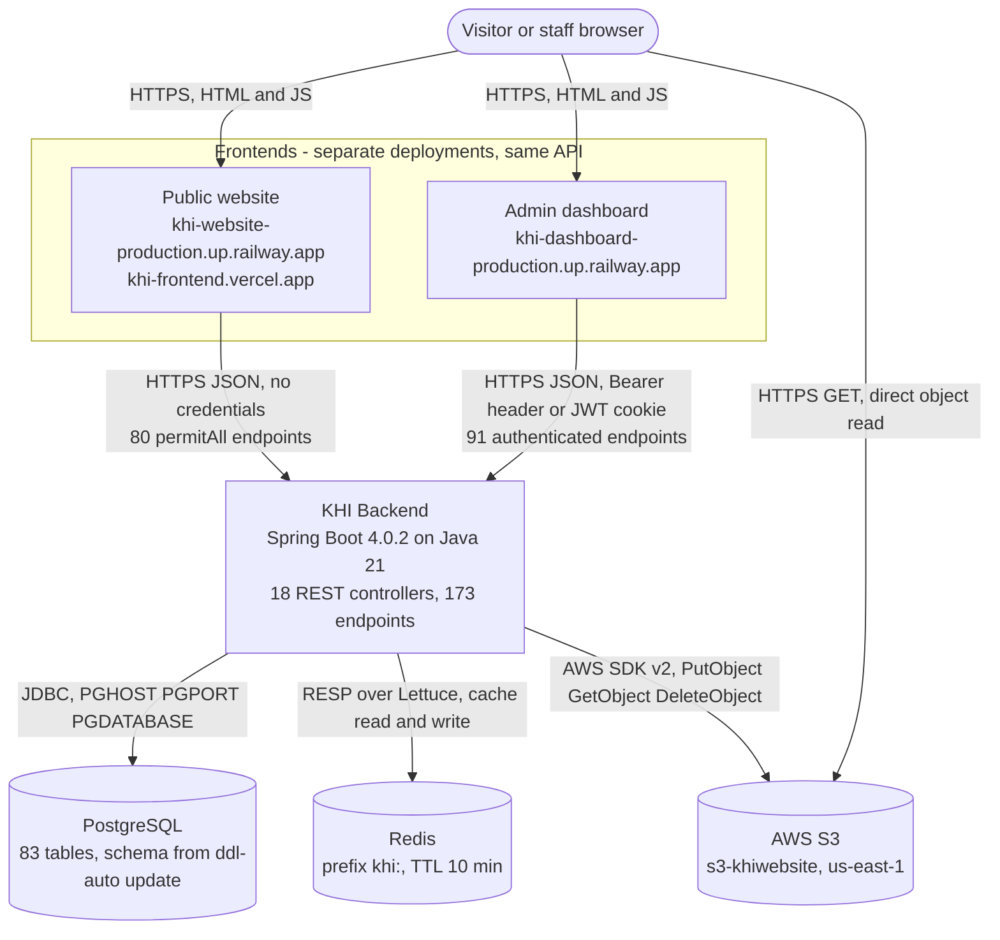
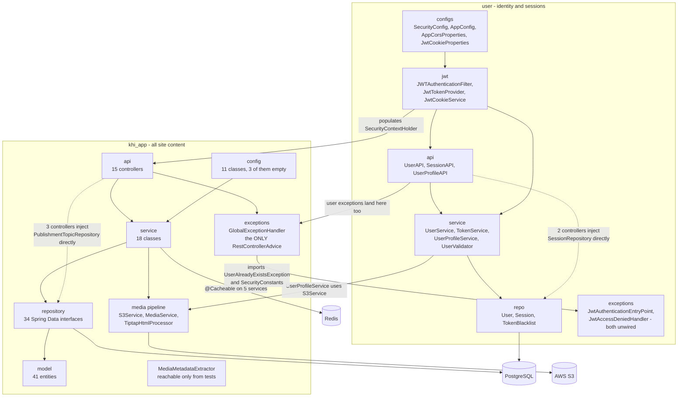
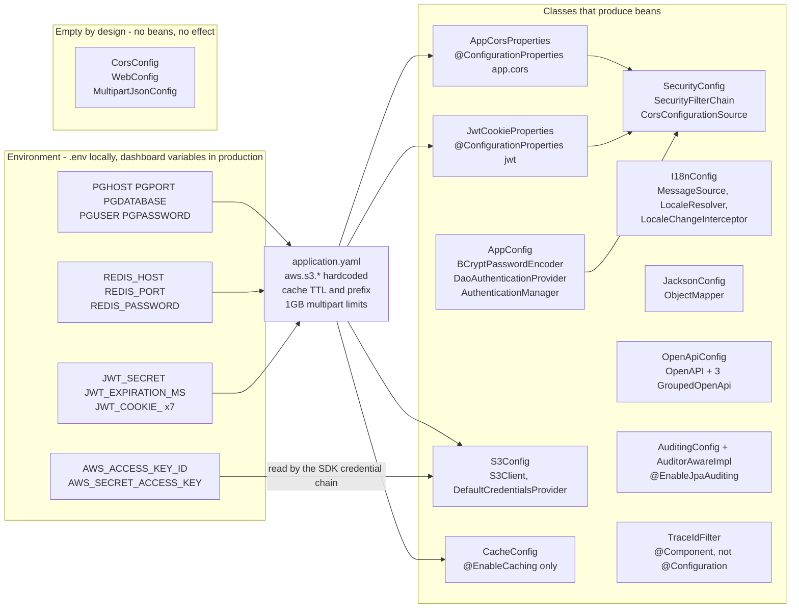
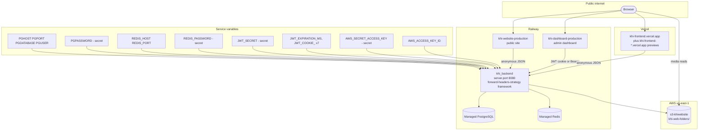
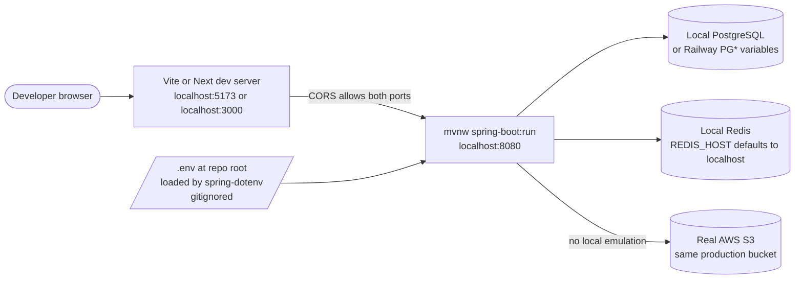
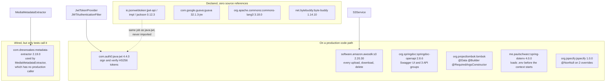

# Component and deployment views

Where the pieces are, what talks to what, and where it runs. Everything below was read out of the
source on 2026-08-26; where the diagram disagrees with an earlier description of the system, the
code won and the disagreement is written down next to the picture.

Companion documents: [`FLOWCHARTS.md`](./FLOWCHARTS.md) for request-level behaviour,
[`UML_CLASS.md`](./UML_CLASS.md) for the type model.

---

## System context

Seven things exist in production, and the interesting part is that the browser talks to two of
them directly. Media is uploaded through the backend but served straight out of S3, because
`S3Service.getPublicUrl` bakes a public bucket URL into the row and that is the URL the frontends
render. The backend is not on the media read path.

**What to notice**

- The two frontends are separate deployments that hit the same API with different auth. Nothing in
  the backend distinguishes them: the split is entirely enforced by
  [`SecurityConfig.authorizeHttpRequests`](../../src/main/java/ak/dev/khi_backend/user/configs/SecurityConfig.java),
  and both origins appear in the same `app.cors.allowed-origins` list.
- The browser reads media from S3 without touching the backend.
  [`S3Service`](../../src/main/java/ak/dev/khi_backend/khi_app/service/S3Service.java) returns
  `https://s3-khiwebsite.s3.us-east-1.amazonaws.com/khi-web-folders/<folder>/<uuid>-<name>` and that
  string is persisted. Rotating the bucket or the region breaks every stored URL, not just new uploads.
- Redis is on the request path for reads only, and only for five services. If Redis is down, those
  reads fail rather than degrade -- the header comment in
  [`CacheConfig`](../../src/main/java/ak/dev/khi_backend/khi_app/config/CacheConfig.java) says so
  explicitly.
- There is no email, SMS or payment integration. `PasswordResetDeliveryService` has exactly one
  implementation, `LoggingPasswordResetDeliveryService`, which writes the reset token to the log.

---

## Internal component structure

The backend is two packages that were meant to be independent subsystems and are not quite. Both
directions of coupling are drawn below, and both are real: `user` reaches into `khi_app` for S3, and
`khi_app` reaches into `user` for two auth types. The single most load-bearing correction on this
page is in the error-handling box.

**What to notice**

- **There is one exception-handling subsystem, not two.**
  [`user/exceptions/GlobalExceptionHandler.java`](../../src/main/java/ak/dev/khi_backend/user/exceptions/GlobalExceptionHandler.java)
  contains no handler at all -- it declares a package-private, empty
  `UserExceptionHandlerPlaceholder` and a comment explaining that two beans with the same simple
  name collide at startup. Every exception in the application, including `UserAlreadyExistsException`
  and `BadCredentialsException`, is handled by the 20 `@ExceptionHandler` methods in
  [`khi_app/exceptions/GlobalExceptionHandler.java`](../../src/main/java/ak/dev/khi_backend/khi_app/exceptions/GlobalExceptionHandler.java).
  That is why `ErrorCode` carries `ACCOUNT_LOCKED` and `UNAUTHORIZED` next to `NEWS_NOT_FOUND`.
- `JwtAuthenticationEntryPoint` and `JwtAccessDeniedHandler` are `@Component` beans that nothing
  references. `SecurityConfig` never calls `.exceptionHandling(...)`, and Spring Security does not
  discover entry points by type, so both are constructed at startup and never invoked. See the
  filter-chain section for what happens instead.
- Layering is Controller to Service to Repository *except* in five places. `ImageCollectionController`,
  `SoundTrackController` and `WritingController` each inject `PublishmentTopicRepository` to serve
  their `/topics` sub-route, and `UserAPI` and `SessionAPI` both inject `SessionRepository`. Those
  are the dotted edges.
- `MediaMetadataExtractor` is a live `@Component` with a working implementation and two test classes,
  and no production caller anywhere. `grep -rn "metadataExtractor"` over `src/main` returns nothing
  outside the class itself. Duration, bitrate and dimensions are not being derived on any upload path
  today.
- The coupling between the two packages is bidirectional and thin: exactly one import each way.

---

## Request filter chain

This is the ordering that actually applies, which is not the ordering the class names suggest. Both
`TraceIdFilter` and `JWTAuthenticationFilter` are annotated `@Component`, so Spring Boot registers
them in the plain servlet chain at `LOWEST_PRECEDENCE`, while `springSecurityFilterChain` registers
at order -100. The whole security chain therefore runs *before* `TraceIdFilter`, and there is no
`FilterRegistrationBean` anywhere in the repository disabling either auto-registration.

```mermaid
flowchart LR
    REQ[/"HTTP request"/]
    CORS["CorsFilter<br/>origins from AppCorsProperties<br/>allowCredentials true"]
    JWT["JWTAuthenticationFilter<br/>added via addFilterBefore<br/>UsernamePasswordAuthenticationFilter"]
    ETF["ExceptionTranslationFilter<br/>Spring Security defaults<br/>no custom handler registered"]
    AUTHZ["AuthorizationFilter<br/>authorizeHttpRequests baseline<br/>per path and method"]
    TID["TraceIdFilter<br/>sets MDC traceId<br/>echoes X-Trace-Id"]
    DS["DispatcherServlet"]
    PRE{"@PreAuthorize<br/>on the handler?"}
    CTRL["Controller method"]
    ADVICE["GlobalExceptionHandler<br/>builds ApiErrorResponse"]
    RESP[/"HTTP response"/]

    REQ --> CORS --> JWT
    JWT -->|"token bad, expired or revoked"| RAW[/"raw JSON<br/>error and message only"/]
    JWT -->|"no token, or token accepted"| ETF
    ETF --> AUTHZ
    AUTHZ -->|"denied"| SE[/"container error page<br/>via response.sendError"/]
    AUTHZ -->|"allowed"| TID
    TID --> DS --> PRE
    PRE -->|"denied"| ADVICE
    PRE -->|"allowed"| CTRL
    CTRL -->|"throws"| ADVICE
    CTRL -->|"returns"| RESP
    ADVICE --> RESP
```

**What to notice**

- **Three different error shapes leave this pipeline.**
  [`JWTAuthenticationFilter.sendErrorResponse`](../../src/main/java/ak/dev/khi_backend/user/jwt/JWTAuthenticationFilter.java)
  hand-writes `{"error":"TOKEN_EXPIRED","message":"..."}`; the authorization layer calls
  `response.sendError` and gets the container's default body; only the third path produces the
  documented `ApiErrorResponse` with `traceId`, `messageEn` and `messageKu`. A client cannot parse
  all three with one shape.
- **`traceId` is absent from everything the security chain rejects.** `TraceIdFilter` runs after the
  security chain, so a 401 or 403 raised by `JWTAuthenticationFilter` or `AuthorizationFilter` is
  committed before the MDC value is set and before the `X-Trace-Id` response header is written.
- Because `SecurityConfig` registers no authentication mechanism and no `.exceptionHandling(...)`,
  `ExceptionTranslationFilter` falls back to Spring Security's default `Http403ForbiddenEntryPoint`.
  An anonymous request to a protected path is refused by the framework default, not by the project's
  own `JwtAuthenticationEntryPoint`.
- The filter has a `shouldNotFilter` escape hatch for five auth endpoints plus `/api/users/auth/**`,
  and it short-circuits `OPTIONS` with a 200 before doing any token work.
- Authentication is stateless in name only. Every authenticated request costs three PostgreSQL reads:
  `token_blacklist` by token, `sessions` by `sessionId`, and the `users_tbl` load inside
  `userDetailsService.loadUserByUsername`. `TokenService.isTokenBlacklisted` is a database check, not
  a Redis one -- `TokenBlacklist` is a JPA `@Entity`.
- Authorization is genuinely two layers, and the second can be *narrower* than the first. There are
  13 `@PreAuthorize` annotations across nine controllers, and seven of them are `hasRole('ADMIN')`
  on `/{id}/featured`
  toggles. No `RoleHierarchy` bean exists, so `hasRole('ADMIN')` does not include `SUPER_ADMIN`:
  a `SUPER_ADMIN` passes the path baseline and is then denied by the method annotation.

---

## Configuration map

Fifteen classes were named for this map. Reading them turns up that only nine of them produce
anything, two are not `@Configuration` at all, three are deliberately empty, and one -- `CorsConfig`
-- is an empty file whose job is done elsewhere. The diagram shows the wiring that has an effect;
the table below is the full inventory.

| Class | Kind | Concern | Environment it reads |
| --- | --- | --- | --- |
| [`SecurityConfig`](../../src/main/java/ak/dev/khi_backend/user/configs/SecurityConfig.java) | `@Configuration @EnableWebSecurity @EnableMethodSecurity` | Filter chain, path/method authorization baseline, CORS source | via `AppCorsProperties` |
| [`AppConfig`](../../src/main/java/ak/dev/khi_backend/user/configs/AppConfig.java) | `@Configuration @EnableMethodSecurity` | Password hashing, `AuthenticationProvider`, `AuthenticationManager` | none |
| [`AppCorsProperties`](../../src/main/java/ak/dev/khi_backend/user/configs/AppCorsProperties.java) | `@Component @ConfigurationProperties` | Allowed origins, methods, headers, credentials, max-age | `app.cors.*` from YAML |
| [`JwtCookieProperties`](../../src/main/java/ak/dev/khi_backend/user/configs/JwtCookieProperties.java) | `@Component @ConfigurationProperties` | Auth cookie name, secure, httpOnly, sameSite, path, max-age | `JWT_COOKIE_NAME`, `JWT_COOKIE_SECURE`, `JWT_COOKIE_HTTP_ONLY`, `JWT_COOKIE_SAME_SITE`, `JWT_COOKIE_PATH`, `JWT_COOKIE_MAX_AGE` |
| [`S3Config`](../../src/main/java/ak/dev/khi_backend/khi_app/config/S3Config.java) | `@Configuration` | `S3Client` bean, region only | `aws.s3.region` from YAML; credentials from `DefaultCredentialsProvider` |
| [`I18nConfig`](../../src/main/java/ak/dev/khi_backend/khi_app/config/I18nConfig.java) | `@Configuration implements WebMvcConfigurer` | `en` / `ckb` / `kmr` message bundles, `Accept-Language` resolution, `?lang=` override | none |
| [`JacksonConfig`](../../src/main/java/ak/dev/khi_backend/khi_app/config/JacksonConfig.java) | `@Configuration` | `ObjectMapper`: JSR-310, ISO dates, tolerate a stray `id` in request bodies | none |
| [`OpenApiConfig`](../../src/main/java/ak/dev/khi_backend/khi_app/config/OpenApiConfig.java) | `@Configuration` | Swagger UI, `bearerAuth` + `cookieAuth` schemes, `public` / `internal` / `all` groups | none |
| [`AuditingConfig`](../../src/main/java/ak/dev/khi_backend/khi_app/config/AuditingConfig.java) | `@Configuration @EnableJpaAuditing` | Turns on `@CreatedDate` / `@CreatedBy` on `AuditableEntity` | none |
| [`AuditorAwareImpl`](../../src/main/java/ak/dev/khi_backend/khi_app/config/AuditorAwareImpl.java) | **`@Component`**, not `@Configuration` | Supplies `created_by` / `updated_by`; falls back to the literal `SYSTEM` | none |
| [`CacheConfig`](../../src/main/java/ak/dev/khi_backend/khi_app/config/CacheConfig.java) | `@Configuration @EnableCaching` | Switches caching on; deliberately defines no `RedisCacheConfiguration` | `REDIS_HOST`, `REDIS_PORT`, `REDIS_PASSWORD` via YAML |
| [`TraceIdFilter`](../../src/main/java/ak/dev/khi_backend/khi_app/config/TraceIdFilter.java) | **`@Component`**, not `@Configuration` | MDC `traceId`, `X-Trace-Id` request/response header | none |
| [`CorsConfig`](../../src/main/java/ak/dev/khi_backend/khi_app/config/CorsConfig.java) | `@Configuration` | **Empty.** CORS is configured in `SecurityConfig` | none |
| [`WebConfig`](../../src/main/java/ak/dev/khi_backend/khi_app/config/WebConfig.java) | `@Configuration` | **Empty.** No body, no beans | none |
| [`MultipartJsonConfig`](../../src/main/java/ak/dev/khi_backend/khi_app/config/MultipartJsonConfig.java) | `@Configuration` | **Empty by design**, documented as such -- Boot handles multipart JSON | none |

**What to notice**

- `@EnableMethodSecurity` is declared twice, on `AppConfig` and again on `SecurityConfig`. It is
  idempotent, so this is noise rather than a bug, but it means neither class is the single place to
  look when tracing method security.
- **The S3 bucket, region and base folder are not environment-driven.** `aws.s3.bucket`,
  `aws.s3.region` and `aws.s3.base-folder` are literals in
  [`application.yaml`](../../src/main/resources/application.yaml), so local development writes into
  the same production bucket unless you override them. Only the AWS *credentials* come from the
  environment, and they arrive through the SDK's `DefaultCredentialsProvider` chain rather than any
  named property this project owns.
- Five of the seven `JWT_COOKIE_*` variables have no default in the YAML. The application will not
  start without them, even though `JwtCookieProperties` carries perfectly good Java-side defaults --
  the YAML placeholder wins and fails first.
- `AuditorAwareImpl` returns `Optional.of("SYSTEM")` for anonymous requests, so a row created by a
  public visitor submission is stamped `created_by = SYSTEM`, not left null.

---

## Deployment topology

There is no deployment manifest in the repository -- no `Dockerfile`, `railway.json`, `Procfile` or
`nixpacks.toml`. The topology below is reconstructed from `app.cors.allowed-origins`, the two
Railway comments in `application.yaml`, and the environment variables the application refuses to
start without.

Local development runs the same jar against a mix of local and remote infrastructure. Note that the
one thing you cannot make local is S3.

**What to notice**

- **`server.port` is the literal `8080`, not `${PORT:8080}`.** Railway injects a `PORT` variable that
  Spring Boot's relaxed binding does not map onto `server.port`, so the application listens on 8080
  regardless of what the platform asks for. If the service routes correctly today, it is because the
  target port is pinned in the dashboard.
- `forward-headers-strategy: framework` is what makes `request.getRemoteAddr()` -- recorded on every
  `Session` row by `JwtTokenProvider.generateToken` -- report the client rather than the Railway proxy.
- `REDIS_HOST`, `REDIS_PORT` and `REDIS_PASSWORD` all have defaults, so a misconfigured production
  service silently starts up and tries `localhost:6379`. The five `PG*` and the `JWT_*` variables
  have no defaults and fail loudly instead. That asymmetry is worth remembering when a deploy comes
  up healthy but every cached read 500s.
- The CORS list uses `setAllowedOriginPatterns`, not `setAllowedOrigins`, which is why the wildcard
  `https://khi-frontend-*.vercel.app` preview entry is legal alongside `allowCredentials: true`.
- Tests do not touch any of this. `application-test.yaml` points at in-memory H2 with
  `MODE=PostgreSQL`, `cache.type: simple`, and Redis repositories disabled -- so `jsonb` columns,
  Redis serialization and real S3 behaviour are all unexercised by the suite. See
  [`../database/MIGRATIONS.md`](../database/MIGRATIONS.md) for the consequences.
- Actuator is on the classpath with no `management.*` block, so only `/actuator/health` is exposed,
  and `springdoc.show-actuator: false` keeps it out of the OpenAPI document.

---

## External dependencies

Eight third-party libraries were named as architecturally interesting. Grepping for each one's
package prefix across `src/main` splits them cleanly into libraries that are load-bearing and
libraries that are only on the classpath. The split is the point of the diagram.

| Library | Version | Why it is here | Verified usage in `src/main` |
| --- | --- | --- | --- |
| `com.auth0:java-jwt` | 4.4.0 | Builds and verifies the HS256 token, including the `sessionId`, `role` and `authorities` claims | [`JwtTokenProvider`](../../src/main/java/ak/dev/khi_backend/user/jwt/JwtTokenProvider.java), [`JWTAuthenticationFilter`](../../src/main/java/ak/dev/khi_backend/user/jwt/JWTAuthenticationFilter.java) |
| `io.jsonwebtoken:jjwt-api` + `-impl` + `-jackson` | 0.12.3 | Nothing. Three artifacts, no import | **none** |
| `software.amazon.awssdk:s3` | 2.20.30 | The whole media pipeline; `S3Client` built in `S3Config` | `S3Config`, `S3Service` |
| `org.springdoc:springdoc-openapi-starter-webmvc-ui` | 2.8.6 | Swagger UI at `/swagger-ui.html`, spec at `/v3/api-docs`, three `GroupedOpenApi` groups | `OpenApiConfig` |
| `com.drewnoakes:metadata-extractor` | 2.19.0 | Pure-Java duration, bitrate and dimensions -- chosen to avoid an `ffprobe` binary on the host | `MediaMetadataExtractor` only, which nothing calls |
| `org.projectlombok:lombok` | managed | Entity, DTO and constructor boilerplate; `provided` scope and excluded from the fat jar | project-wide |
| `me.paulschwarz:spring-dotenv` | 4.0.0 | Lets `PG*`, `JWT_*` and `REDIS_*` come from a gitignored `.env` in local development | property resolution, no imports by design |
| `com.google.guava` | 32.1.3-jre | Declared; no `com.google.common` import exists | **none** |
| `org.apache.commons:commons-lang3` | 3.18.0 | Declared; no `org.apache.commons.lang3` import exists | **none** |
| `net.bytebuddy:byte-buddy` | 1.14.10 | An explicit version pin over Hibernate's transitive copy, not a direct API use | **none** |

**What to notice**

- **Two JWT libraries are on the classpath and only one is used.** `java-jwt` does all the work;
  the three `jjwt` artifacts have no import anywhere in `src/main` or `src/test`. They cost startup
  scan time and add a second CVE surface for the same job. The `jjwt` artifacts are the ones to drop.
- `guava`, `commons-lang3` and `byte-buddy` are similarly unreferenced. `byte-buddy` at least has a
  reason to exist -- pinning it overrides whatever version Hibernate drags in -- but pinning it at
  1.14.10 against a Spring Boot 4.0.2 parent means the pin is now *older* than the managed version,
  which is the opposite of what a pin is usually for.
- `spring-boot-starter-webmvc` rather than `spring-boot-starter-web` is the Boot 4 artifact rename,
  not a different stack. `spring-boot-devtools` is present but disabled in the YAML
  (`restart.enabled: false`, `livereload.enabled: false`).
- `jackson-datatype-jsr310` is declared explicitly at 2.21.0 and registered by hand in
  `JacksonConfig`, even though the Boot parent already manages it and Boot registers it
  automatically. The hand-built `ObjectMapper` bean replaces Boot's auto-configured one wholesale,
  which is why the explicit registration is necessary at all.

---

## Related

- [`FLOWCHARTS.md`](./FLOWCHARTS.md) -- request-level and lifecycle flows through the components drawn here.
- [`UML_CLASS.md`](./UML_CLASS.md) -- the entity, DTO and enum model behind the repository layer.
- [`../database/MIGRATIONS.md`](../database/MIGRATIONS.md) -- how the PostgreSQL schema in the deployment
  diagrams is actually produced, and what `ddl-auto: update` does and does not do.
