# UML Sequence Diagrams

Eighteen diagrams showing the order in which objects call each other for the operations that
matter. The security and identity flows come first, because every other request in the system
passes through them, and the content and media flows come after.

Where [`UML_CLASS.md`](./UML_CLASS.md) shows which classes exist and
[`UML_COMPONENT.md`](./UML_COMPONENT.md) shows how they are wired, this file shows what actually
happens on the wire: which call comes before which, where the transaction opens, which write lands
in S3 before the first `INSERT`, and which branch quietly returns a status nobody expects.

Everything below was re-read from `src/main/java/ak/dev/khi_backend/` before it was drawn. Where
the code disagreed with the written catalogue, the code won; those cases are listed under
[Corrections against the catalogue](#corrections-against-the-catalogue) at the end.

---

## Contents

**Security and identity**

- [The authenticated request](#the-authenticated-request) — the filter chain and the two
  authorization layers, end to end
- [The anonymous request to a public endpoint](#the-anonymous-request-to-a-public-endpoint) — why
  public does not mean unfiltered
- [Registration](#registration) — the `sessions` row that is written before the token exists
- [Registration with a profile image](#registration-with-a-profile-image) — local disk, not S3
- [Login](#login) — the hand-rolled lock counter and its three exits
- [Logout and logout-all](#logout-and-logout-all) — the two writes that kill a stateless token
- [Password reset](#password-reset) — token issue and token redemption
- [Session revocation](#session-revocation) — an owner check standing in for authorization

**Content and media**

- [Creating content with media](#creating-content-with-media) — S3 first, transaction second
- [The Tiptap editor image pipeline](#the-tiptap-editor-image-pipeline) — two routes in, one column out
- [Cached read](#cached-read) — what the Redis key really looks like
- [Cache eviction on write](#cache-eviction-on-write) — the read-through race
- [Deleting a content root](#deleting-a-content-root) — JPA cascades, S3 does not
- [The one delete path that cleans up S3](#the-one-delete-path-that-cleans-up-s3) — and why its
  ordering is wrong
- [Global search](#global-search) — six sections, twelve sequential queries
- [Assembling the featured rail](#assembling-the-featured-rail) — built at request time from seven tables
- [Public submission and the admin queue](#public-submission-and-the-admin-queue) — both halves of
  the authorization model in one round trip

**Reference**

- [Corrections against the catalogue](#corrections-against-the-catalogue)
- [Related](#related)

---

## How to read these

Every diagram here is a Mermaid `sequenceDiagram`. The notation used in this file, and nothing
more:

| Notation | Meaning |
| --- | --- |
| `autonumber` | Steps are numbered in call order. Quote the number when discussing a diagram. |
| `participant Svc as UserService` | The left name is the short id used by the arrows; the right name is the real class, bean or table. Participants are real types, not roles. |
| `A->>B: text` | A synchronous call from A into B. |
| `A-->>B: text` | A reply travelling back. |
| `A-)B: text` | Fire and forget — the caller does not wait. Used for `@CacheEvict`, which Spring runs after the method returns. |
| `A-xB: text` / `A--xB: text` | A rejected or aborted message: an error response, a rollback, a request that never reaches its target. |
| `alt` / `else` / `end` | Mutually exclusive branches. Every branch shown is reachable in the code. |
| `opt` / `end` | A block that runs only under the stated condition. |
| `loop` / `end` | A block repeated per item. |
| `par` / `and` / `end` | Two threads running concurrently. Used once, for the cache race. |
| `Note over A,B: text` | A fact about the span between two participants that is not itself a call. |

Two conventions worth stating once, because they recur in almost every diagram:

- **`ApiErrorResponse` is bilingual.** It carries `messageEn` and `messageKu` always, plus a
  `message` resolved from the request's `Accept-Language`, plus `traceId`, `code` (the `ErrorCode`
  enum) and, for `@Valid` failures, one `fieldErrors` entry per field. Same shape in
  [`ApiErrorResponse`](../../src/main/java/ak/dev/khi_backend/khi_app/exceptions/ApiErrorResponse.java)
  and [`ApiFieldError`](../../src/main/java/ak/dev/khi_backend/khi_app/exceptions/ApiFieldError.java).
- **Not every error is an `ApiErrorResponse`.** Three other error shapes exist, and the diagrams
  distinguish them: the two-field JSON that `JWTAuthenticationFilter` writes itself, the bare
  Spring Security default for a path-matcher denial, and the plain-string bodies that a few `user`
  controllers return by hand.

---

## Security and identity

### The authenticated request

Start here. A single request with a Bearer token crosses two filters, two independent
authorization layers and up to three database reads before the controller sees it, and each stage
rejects differently — with a different status code and a different body shape. Everything below is
the real path through
[`TraceIdFilter`](../../src/main/java/ak/dev/khi_backend/khi_app/config/TraceIdFilter.java),
[`JWTAuthenticationFilter`](../../src/main/java/ak/dev/khi_backend/user/jwt/JWTAuthenticationFilter.java)
and [`SecurityConfig`](../../src/main/java/ak/dev/khi_backend/user/configs/SecurityConfig.java).

The worked example is `PATCH /api/v1/news/42/featured`, because no `authorizeHttpRequests` rule
matches `PATCH` on that path — the only PATCH matcher in the content block covers
`/api/v1/videos/**`. It therefore falls through to `.anyRequest().authenticated()`, and the only
thing that restricts it to admins is the `@PreAuthorize("hasRole('ADMIN')")` on
[`NewsController.setFeatured`](../../src/main/java/ak/dev/khi_backend/khi_app/api/news/NewsController.java).

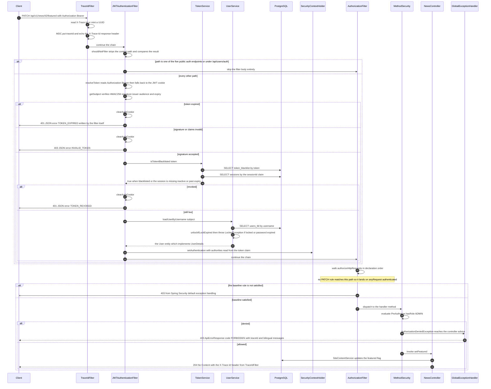

**What to notice**

- `JwtAuthenticationEntryPoint` and `JwtAccessDeniedHandler` never run. They are `@Component`
  beans, but `SecurityConfig` never calls `.exceptionHandling(...)`, so nothing registers them on
  the chain and Spring Security's own defaults handle the filter-level 401 and 403. The practical
  effect is that an unauthenticated request to a protected path returns a bare **403**, not the 401
  that the unused entry point would have sent. This is drawn as it actually behaves.
- The same logical "403 forbidden" therefore has two completely different response bodies. Denied
  by `authorizeHttpRequests`, it is a bare Spring Security error produced outside the
  `DispatcherServlet`. Denied by `@PreAuthorize`, the exception is raised inside the dispatch and is
  caught by the single
  [`GlobalExceptionHandler`](../../src/main/java/ak/dev/khi_backend/khi_app/exceptions/GlobalExceptionHandler.java),
  which returns a full `ApiErrorResponse` with `traceId`, `messageEn` and `messageKu`.
- Authorities come from the **token**, not from the row just loaded.
  `jwtTokenProvider.getAuthorities(token)` reads the `authorities` claim baked in at login, so
  promoting or demoting a user in `users_tbl` changes nothing until that user's token is replaced.
  The freshly loaded `User` is used only as the principal.
- A bad signature returns **403**, an expired token returns **401**. That asymmetry is written into
  `doFilterInternal` and is easy to trip over when debugging a client.
- "Stateless" is nominal. Every authenticated request performs at least three reads: the blacklist
  table, the `sessions` row, and `users_tbl`. Nothing here is cached.
- The filter only populates the context when `SecurityContextHolder.getContext().getAuthentication()`
  is still null, and it never rejects a request merely for lacking a token. Deciding that a missing
  token is a problem is `AuthorizationFilter`'s job, further down.

### The anonymous request to a public endpoint

Public reads still traverse the whole chain. `shouldNotFilter` exempts only five auth paths plus
`/api/users/auth/**`, so `GET /api/v1/news/42` runs through `JWTAuthenticationFilter` like
everything else — and that has a sharp consequence when a stale cookie is still attached to an
otherwise anonymous request.

Source:
[`JWTAuthenticationFilter.shouldNotFilter`](../../src/main/java/ak/dev/khi_backend/user/jwt/JWTAuthenticationFilter.java)
and the `GET /api/v1/**` permitAll rule in
[`SecurityConfig`](../../src/main/java/ak/dev/khi_backend/user/configs/SecurityConfig.java).

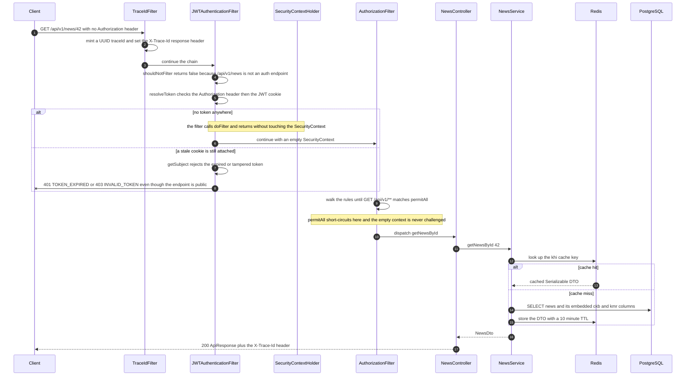

**What to notice**

- `permitAll` is evaluated by `AuthorizationFilter`, which sits *after* `JWTAuthenticationFilter`.
  Public does not mean unfiltered; it means the authorization decision passes without inspecting
  the context.
- The stale-cookie branch is the non-obvious one. Because `shouldNotFilter` covers only
  `/api/auth/register`, `/api/auth/register-with-image`, `/api/auth/login`, `/api/auth/reset-token`,
  `/api/auth/reset-password` and `/api/users/auth/**`, a visitor whose auth cookie has expired gets
  a 401 on a page that anonymous visitors can read fine. The filter does clear the bad cookie on the
  way out, so the retry succeeds.
- `OPTIONS` is short-circuited twice over. `doFilterInternal` sets the response status to 200 and
  passes the request straight down the chain without reading a token at all, and
  `authorizeHttpRequests` then permits `OPTIONS /**` as its very first rule.
- `TraceIdFilter` runs for anonymous traffic too, so every public response carries an `X-Trace-Id`
  that matches the `traceId` in the application log lines for that request.

### Registration

`POST /api/auth/register` takes a JSON body and returns a signed token, but the interesting part is
that it also writes a `sessions` row before the token exists. The JWT is not self-sufficient: every
later request re-reads that row. This diagram shows where the row is created and how the same token
leaves the server twice, once in the body and once in a `Set-Cookie` header.

Source: [`UserAPI`](../../src/main/java/ak/dev/khi_backend/user/api/UserAPI.java),
[`UserService.register`](../../src/main/java/ak/dev/khi_backend/user/service/UserService.java),
[`UserValidator`](../../src/main/java/ak/dev/khi_backend/user/service/UserValidator.java),
[`JwtTokenProvider`](../../src/main/java/ak/dev/khi_backend/user/jwt/JwtTokenProvider.java),
[`JwtCookieService`](../../src/main/java/ak/dev/khi_backend/user/jwt/JwtCookieService.java).

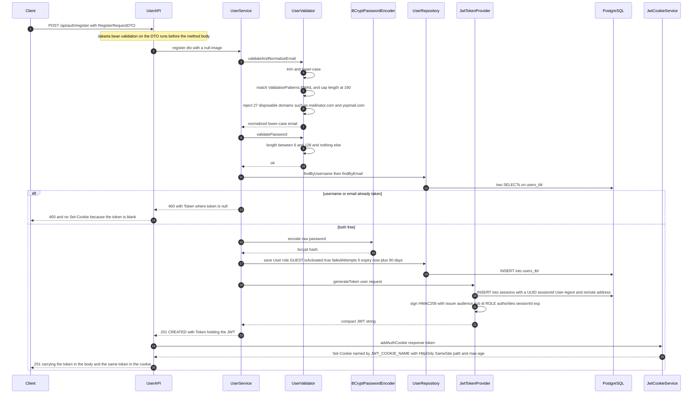

**What to notice**

- The `sessions` row is inserted by `JwtTokenProvider.generateToken` before the JWT is signed,
  because the row's `sessionId` becomes a claim inside the token. Token minting is a write, not a
  pure function.
- `UserValidator.validatePassword` only checks length 6 to 128. Its own Javadoc and the call-site
  comments in `UserService` claim complexity, personal-info and blocklist checks; the method body
  has none of them. The disposable-domain blocklist is real, but it lives in the *email* validator.
- `withAuthCookie` in `UserAPI` is what attaches the cookie, not the service. It only fires when
  the status is 2xx *and* `Token.token` is non-blank, which is why the failure branch above emits
  no cookie even though it also returns a `Token` object. Every cookie attribute comes from
  [`JwtCookieProperties`](../../src/main/java/ak/dev/khi_backend/user/configs/JwtCookieProperties.java),
  whose class defaults are `khi_auth_token`, HttpOnly true, SameSite Strict, path `/`, max-age
  86400 and **Secure false** — `application.yaml` overrides each one from a `JWT_COOKIE_*`
  environment variable, so `JWT_COOKIE_SECURE` must be set to `true` in production.
- The new account is created with `Role.GUEST`. Registration alone grants no write access anywhere
  in `khi_app`; a `SUPER_ADMIN` has to promote the row afterwards.
- A rejected email or a too-short password surfaces to the client as
  `Invalid image: <the real reason>`. `UserService.register` catches `IllegalArgumentException` in
  a block whose message was written for image failures, and both validators throw that same type.

### Registration with a profile image

The multipart variant looks like a small change to the JSON route, but the ordering is the point:
the file is written to disk *before* the `users_tbl` row is built, so a storage failure means the
account is never created at all. This diagram shows where the two multipart parts split and where
the write actually lands.

Source:
[`UserAPI.registerWithImage`](../../src/main/java/ak/dev/khi_backend/user/api/UserAPI.java),
[`UserService.storeProfileImage`](../../src/main/java/ak/dev/khi_backend/user/service/UserService.java).

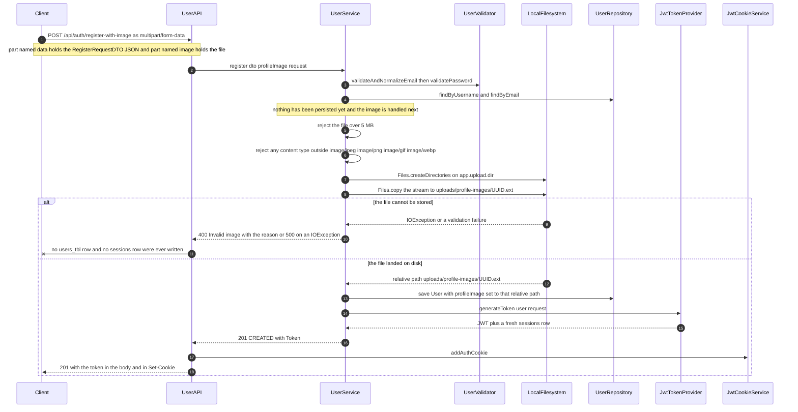

**What to notice**

- Registration does **not** touch S3. `UserService.storeProfileImage` writes to the local
  filesystem under `app.upload.dir`, default `uploads/profile-images`, and stores a *relative path*
  in `users_tbl.profile_image`. S3 only enters the picture later, through
  [`UserProfileService`](../../src/main/java/ak/dev/khi_backend/user/service/UserProfileService.java)
  behind `POST /api/user/profile-image`, which stores a full public HTTPS URL instead. Two
  different storage backends therefore coexist in one column.
- Because the file write precedes `userRepository.save`, the failure case the question usually
  asks about — storage succeeded, user creation failed — is the one that *can* happen. It leaves an
  orphaned file on disk with no row pointing at it, and nothing ever cleans it up.
- The reverse case cannot happen: there is no user row waiting to be repaired when the upload
  fails, so no compensating delete is needed and none is written.
- `UserService` is annotated `@Transactional`, but every failure is caught inside the method and
  converted to a `ResponseEntity`, so the transaction is never marked rollback-only. The rollback
  safety here comes from the ordering, not from the annotation.
- The 5 MB ceiling is a constant in `UserService`; the servlet container's own multipart limits are
  configured separately in `application.yaml`, so the smaller of the two wins.

### Login

Login never goes through Spring Security's `AuthenticationManager`. `UserService.login` compares
BCrypt hashes itself and maintains the lock counter by hand. This diagram shows the three outcomes
and, more usefully, exactly when the counter is incremented, reset and auto-cleared.

Source: [`UserService.login`](../../src/main/java/ak/dev/khi_backend/user/service/UserService.java),
constants in
[`SecurityConstants`](../../src/main/java/ak/dev/khi_backend/user/consts/SecurityConstants.java)
where `MAX_FAILED_ATTEMPTS` is 5 and `LOCK_DURATION_MINUTES` is 1.

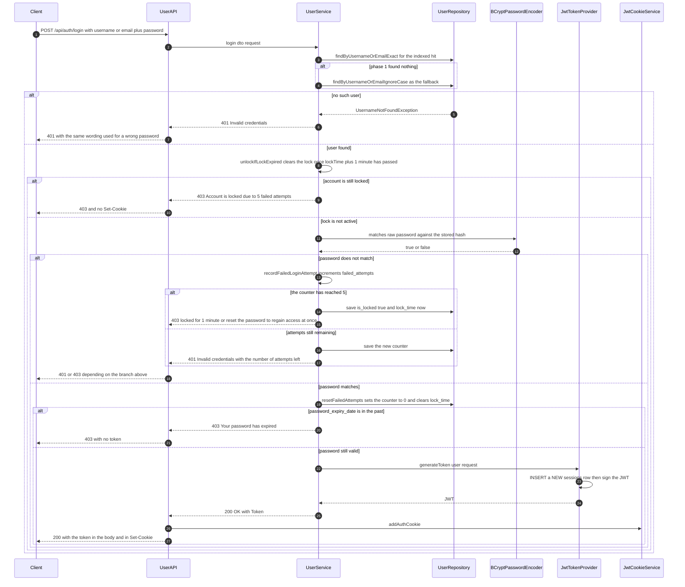

**What to notice**

- The `DaoAuthenticationProvider` and `AuthenticationManager` beans in
  [`AppConfig`](../../src/main/java/ak/dev/khi_backend/user/configs/AppConfig.java) are wired into
  the security chain but the login endpoint never calls them. `UserService` does the hash
  comparison directly, which is why the lock policy is hand-rolled rather than delegated to
  `UserDetails.isAccountNonLocked`.
- The lock is self-healing and short. `unlockIfLockExpired` runs at the top of every login and on
  every `loadUserByUsername`, so after one minute the account silently unlocks and the counter
  resets to zero. There is no admin unlock step.
- A successful password reset also clears the lock. The 403 message says so explicitly, which makes
  `POST /api/auth/reset-token` a supported way around the lockout.
- Every login inserts another `sessions` row. Nothing caps the count and nothing deactivates the
  previous ones, so a user who logs in from five browsers has five live sessions until they revoke
  them.
- The unknown-user and wrong-password branches both return 401 with wording that differs: the
  wrong-password branch leaks the remaining attempt count, the unknown-user branch does not. That
  difference is enough to distinguish a real account from a fake one.

### Logout and logout-all

The point of these two endpoints is not the response body, it is the pair of writes that make a
stateless token stop working on the very next request. This diagram shows both writes and why
`logout-all` does not need to blacklist any token other than the caller's own.

Source: [`UserAPI.logout` and `UserAPI.logoutAll`](../../src/main/java/ak/dev/khi_backend/user/api/UserAPI.java),
[`TokenService`](../../src/main/java/ak/dev/khi_backend/user/service/TokenService.java).

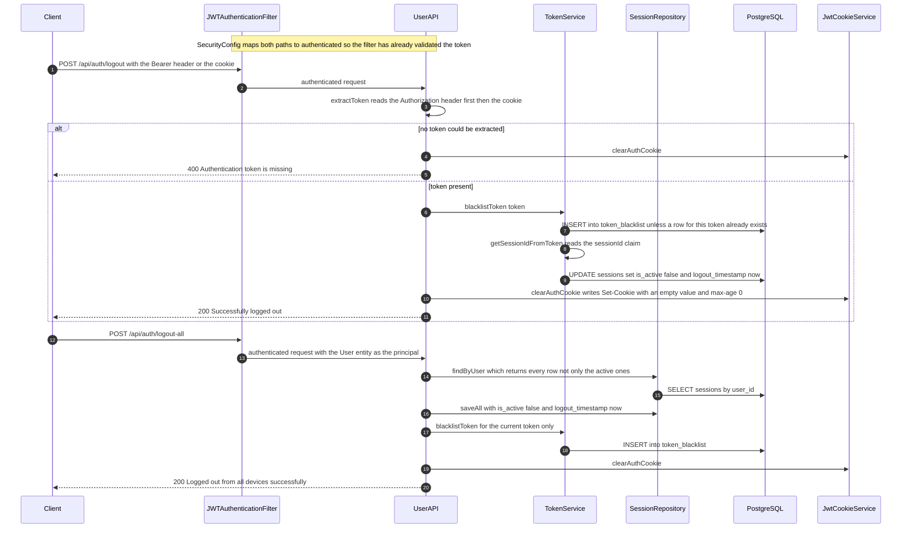

**What to notice**

- A blacklisted token dies immediately because `JWTAuthenticationFilter` calls
  `TokenService.isTokenBlacklisted` on every single request, before it will populate the security
  context. The JWT is still cryptographically valid; it is simply no longer trusted.
- That method returns `true` for four separate reasons: a matching `token_blacklist` row, a missing
  or blank `sessionId` claim, no `sessions` row for that id, or a session that is inactive or past
  its `expires_at`. Only the first is an actual blacklist entry.
- Those extra three conditions are why `logout-all` works. It never sees the other devices' tokens,
  so it cannot blacklist them — it just flips their `sessions` rows to inactive, and the session
  check inside `isTokenBlacklisted` fails those tokens on their next request.
- `logout-all` deactivates rows returned by `findByUser`, which includes already-inactive and
  already-expired rows. It rewrites `logout_timestamp` on all of them, overwriting the historical
  logout time of sessions that ended long ago.
- Clearing the cookie is a courtesy for browser clients. A client holding the raw token in
  JavaScript storage is stopped by the database writes, not by the `Set-Cookie`.

### Password reset

Two endpoints, and the honest version of the second one is more interesting than the first. Note
where the token is checked relative to the password rules, and note that in the default build
nothing is emailed.

Source: [`UserService.createPasswordResetToken` and `resetPassword`](../../src/main/java/ak/dev/khi_backend/user/service/UserService.java),
[`LoggingPasswordResetDeliveryService`](../../src/main/java/ak/dev/khi_backend/user/service/LoggingPasswordResetDeliveryService.java).

Issuing the token:

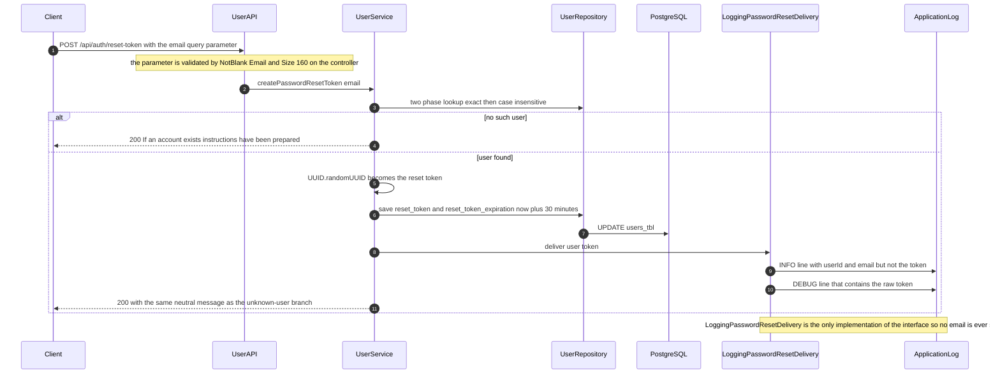

Redeeming it:

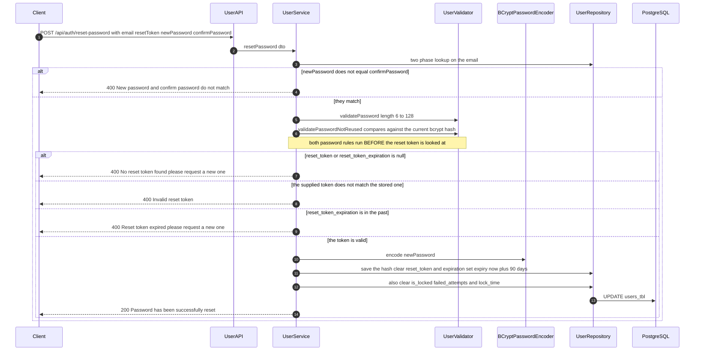

**What to notice**

- Delivery is a log line and nothing more. `LoggingPasswordResetDeliveryService` writes an INFO
  entry naming the user and a DEBUG entry containing the raw token. Whether a reset is usable at
  all therefore depends on the configured log level, and on someone with log access relaying it.
  The `PasswordResetDeliveryService` interface exists so a real provider can be dropped in; nothing
  in the repository implements one.
- Both endpoints return the identical neutral message whether or not the account exists, so the
  request step does not enumerate accounts. The reset step is less careful: an unknown email returns
  `Invalid reset request` while a known email with a bad token returns `Invalid reset token`.
- The token is validated *after* the password rules. A caller with a valid email and a garbage token
  still learns whether their proposed password was reused, because that check runs first.
- `validatePasswordNotReused` throws `IllegalArgumentException`, and `resetPassword` has no catch
  clause for it — it falls into `catch (Exception)` and returns **500**, not the 400 the message
  text implies.
- A successful reset also clears `is_locked`, `failed_attempts` and `lock_time`, which is what makes
  the reset flow a legitimate escape from the five-failed-attempt lockout.
- The reset token lives on `users_tbl` itself, in `reset_token` and `reset_token_expiration`, with a
  30 minute window. There is no separate reset-token table and no cleanup job for expired values.

### Session revocation

`SessionAPI` carries no `@PreAuthorize` at all. `SecurityConfig` only requires that the caller be
authenticated, so the entire protection for someone else's session is a hand-written owner check in
the handler body. This diagram shows the ordering of the four exits.

Source: [`SessionAPI.revokeSession`](../../src/main/java/ak/dev/khi_backend/user/api/SessionAPI.java),
rule `.requestMatchers("/api/auth/sessions/**").authenticated()` in
[`SecurityConfig`](../../src/main/java/ak/dev/khi_backend/user/configs/SecurityConfig.java).

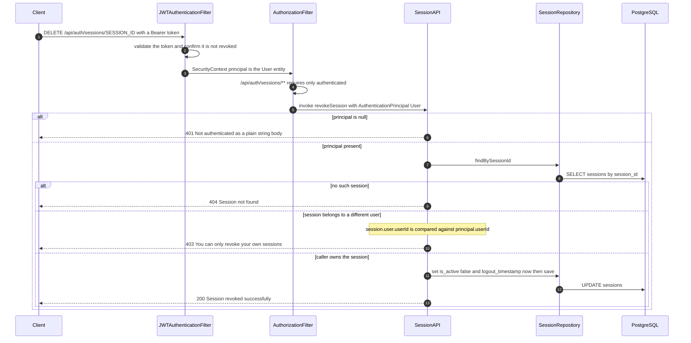

**What to notice**

- Any authenticated role reaches this handler, including a freshly registered `GUEST`. Nothing but
  the `userId` comparison stops one user from revoking another's session, so that one line is the
  authorization control.
- The 404 is returned before the ownership check, so a caller can probe whether an arbitrary
  `sessionId` exists — 404 for unknown, 403 for someone else's.
- The 403 here is a bare string body, not the `ApiErrorResponse` that `khi_app` returns. It is
  produced by the controller rather than raised as `AccessDeniedException`, so the global advice
  never sees it and there is no `traceId` or bilingual message in the payload.
- Revoking does not blacklist the revoked device's token. It does not need to: the next request
  from that device fails inside `TokenService.isTokenBlacklisted`, which treats an inactive
  `sessions` row exactly like a blacklisted token.
- `@AuthenticationPrincipal User` resolves only because `JwtTokenProvider.getAuthentication` sets
  the concrete `User` entity as the principal. If the filter had put a bare username string there,
  as an earlier revision did, this handler would see null and return 401 for everyone.

---

## Content and media

### Creating content with media

The multipart create is the most misread path in the codebase. The endpoint table says
`POST /api/v1/image-collections` takes a `data` part plus files; what it does not say is that every
byte reaches S3 *before* the first `INSERT` is issued, and that S3 has no part in the database
transaction. Image Collections show this most clearly because a single request can touch S3 up to
three times for covers, once more per inline editor asset, and once per album image.

Source:
[`ImageCollectionController`](../../src/main/java/ak/dev/khi_backend/khi_app/api/publishment/image/ImageCollectionController.java),
[`ImageCollectionService`](../../src/main/java/ak/dev/khi_backend/khi_app/service/publishment/image/ImageCollectionService.java),
[`S3Service`](../../src/main/java/ak/dev/khi_backend/khi_app/service/S3Service.java).

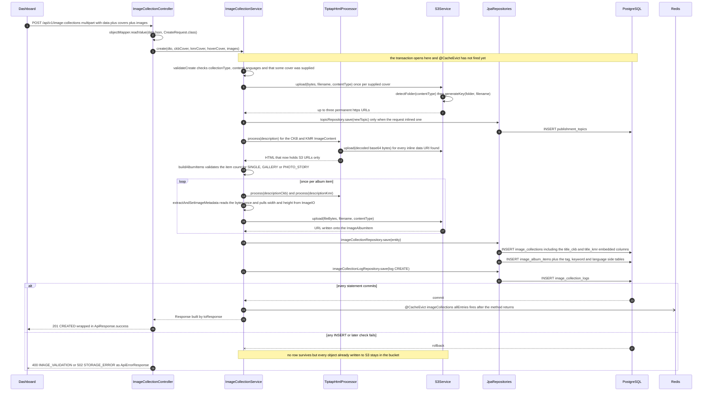

**What to notice**

- S3 comes first, always. `resolveCoverUrl` uploads before `imageCollectionRepository.save` is even
  reached, and the transaction rollback has no compensating delete. A failed create leaves orphaned
  objects under `khi-web-folders/images/`; a failed *upload* by contrast leaves no row, which is the
  safer of the two failures.
- `create` and `update` disagree about validation order. `create` uploads the covers and *then* lets
  `buildAlbumItems` call `validateAlbumItemCount`, so a `SINGLE` collection sent with three images
  orphans its cover before failing. `update` was fixed for this — it calls `validateAlbumUpdate`
  before any upload, with a comment saying exactly why.
- Metadata does **not** come from `MediaMetadataExtractor`. `extractAndSetImageMetadata` uses
  `javax.imageio.ImageIO` inline in the service and only fills `widthPx`, `heightPx`,
  `fileSizeBytes` and `mimeType`. Extraction failure is caught and logged, never fatal.
- The audit row is written through a *different* repository in the same transaction, and it stores
  `imageCollectionId` as a plain `Long` with no foreign key — which is what makes the delete path
  further down leave its history behind.
- `@CacheEvict` carries the default `beforeInvocation = false`, so a create that throws never evicts.
  That is harmless here, but it is the same default that creates the stale window shown later.

### The Tiptap editor image pipeline

An admin writing an article produces HTML with `img` tags in it, and those images can arrive by two
completely different routes. The clean route uploads first and embeds a permanent URL. The dirty
route pastes the picture straight into the editor, which produces a base64 data URI, and it is
`TiptapHtmlProcessor` that stops that binary from ever reaching a `TEXT` column.

Source:
[`MediaController`](../../src/main/java/ak/dev/khi_backend/khi_app/api/media/MediaController.java),
[`MediaService`](../../src/main/java/ak/dev/khi_backend/khi_app/service/media/MediaService.java),
[`TiptapHtmlProcessor`](../../src/main/java/ak/dev/khi_backend/khi_app/service/media/TiptapHtmlProcessor.java).

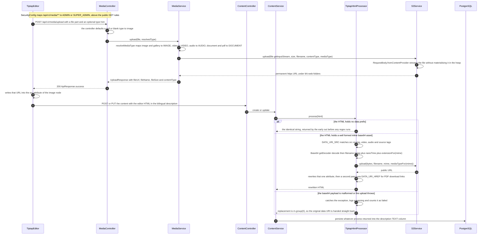

**What to notice**

- The two routes converge but are not equally guarded. `/api/v1/media/**` is **ADMIN or
  SUPER_ADMIN**, while `POST /api/v1/videos/**` and the other content writes are **EMPLOYEE and
  above**. An EMPLOYEE can therefore create an article but gets a denial from the upload endpoint,
  and their only working option is to paste — which lands them on the base64 branch.
- The failure branch is a silent success. A malformed payload does not fail the save; the original
  `data:...;base64,...` attribute is written into the `TEXT` column verbatim. The row is valid, the
  page renders, and the database is now storing binary in a text field with no error anywhere.
- `process` is idempotent by design. Re-saving already-clean HTML costs one `contains("data:")`
  check, which is why every module can call it unconditionally on every write.
- Two regex passes, not one: `src` first for images, video, audio and `source`, then `href` for
  `a` tags carrying PDFs and documents. An asset embedded as a download link is handled by the
  second pass only.
- Nothing ever deletes what this uploads. `MediaController` has a `DELETE` endpoint, but its own
  javadoc calls it reserved for future orphan cleanup; replacing an image in the editor abandons the
  previous object.

### Cached read

`@Cacheable` is only wired on five caches, and the interesting part is what the key looks like on
the wire. The Redis key is not the Spring key — Spring Boot prepends `khi:` **and** the cache name
**and** a double colon. Seeing the composed key is what makes the eviction diagram below legible.

Source:
[`ImageCollectionService`](../../src/main/java/ak/dev/khi_backend/khi_app/service/publishment/image/ImageCollectionService.java),
[`CacheConfig`](../../src/main/java/ak/dev/khi_backend/khi_app/config/CacheConfig.java),
[`application.yaml`](../../src/main/resources/application.yaml).

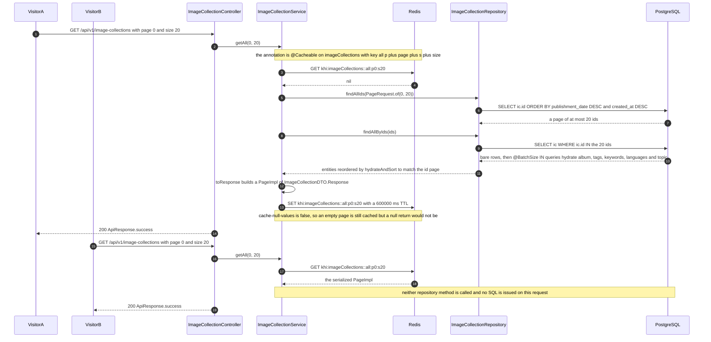

**What to notice**

- The composed Redis key is `khi:` + cache name + `::` + the SpEL key. `use-key-prefix: true` with
  `key-prefix: "khi:"` produces `khi:imageCollections::all:p0:s20`, not `khi:all:p0:s20`.
- Spring Boot's Redis cache serializes with **JDK serialization**, so every type reachable from the
  return value must implement `Serializable` — including `PageImpl`. Each cached DTO pins
  `serialVersionUID = 1L` on purpose: without it the JVM derives the ID from the class structure and
  merely adding a field makes every pre-deploy entry fail to read back with `InvalidClassException`
  until the 10 minute TTL flushes it. `CacheSerializationTests` fails the build if a
  non-`Serializable` field creeps in.
- Only five caches exist — `news`, `projects`, `soundTracks`, `imageCollections`, `services`.
  Videos and Writings have **no** cache annotations at all, so every video listing is a live query.
- `getById`, `getBySlug` and `getFeatured` are deliberately uncached; only the paginated list and
  search shapes are. That keeps single-item reads correct at the cost of a query.
- `CacheConfig` defines no `RedisCacheConfiguration` bean on purpose — declaring one would replace
  the property-derived config wholesale and silently drop both the TTL and the key prefix.

### Cache eviction on write

Every cached service evicts with `allEntries = true` on its write paths, which sounds airtight. It
is not, and the reason is ordering rather than coverage: a reader that misses the cache before the
write can complete its Redis `SET` after the writer's `DEL`.

Source:
[`ImageCollectionService`](../../src/main/java/ak/dev/khi_backend/khi_app/service/publishment/image/ImageCollectionService.java),
[`SiteContentService`](../../src/main/java/ak/dev/khi_backend/khi_app/service/site/SiteContentService.java).

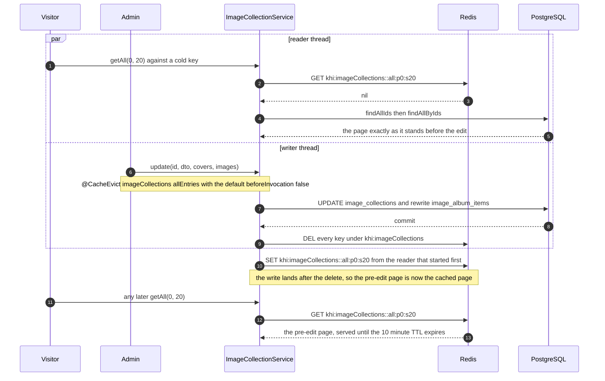

**What to notice**

- `beforeInvocation` is left at its default `false` everywhere, so eviction runs *after* the method
  body, never before it. There is no transaction-aware cache manager configured, so nothing pins the
  eviction to the commit either. The read-through race above is the direct consequence, and its
  worst case is a full TTL of stale data.
- `allEntries = true` means one image-collection edit clears every cached image page — every
  `type:`, `tag:`, `keyword:` and `topic:` key — not just the page that changed. Eviction is blunt
  rather than surgical, which is the right trade for how rarely these write.
- Caches are per-domain and never cross. Editing an image collection does not touch `news`,
  `projects`, `soundTracks` or `services`.
- The featured toggles are the real gap. `setImageCollectionFeatured`, `setNewsFeatured`,
  `setProjectFeatured`, `setVideoFeatured`, `setSoundTrackFeatured` and `setWritingFeatured` carry
  **no** `@CacheEvict` at all. Only `setServiceFeatured` evicts. Since `featureImageUrl` is part of
  the cached `Response`, changing a hero image through
  `PATCH /api/v1/image-collections/{id}/featured` leaves the old URL in Redis for up to ten minutes.
  The hero rail itself is safe because `getFeatured` is uncached.

### Deleting a content root

Deleting a content root is where JPA and S3 part company for good. JPA cleans up thoroughly. S3 is
not consulted at all.

Source:
[`ImageCollectionService.delete`](../../src/main/java/ak/dev/khi_backend/khi_app/service/publishment/image/ImageCollectionService.java),
[`ImageCollection`](../../src/main/java/ak/dev/khi_backend/khi_app/model/publishment/image/ImageCollection.java),
[`SecurityConfig`](../../src/main/java/ak/dev/khi_backend/user/configs/SecurityConfig.java).

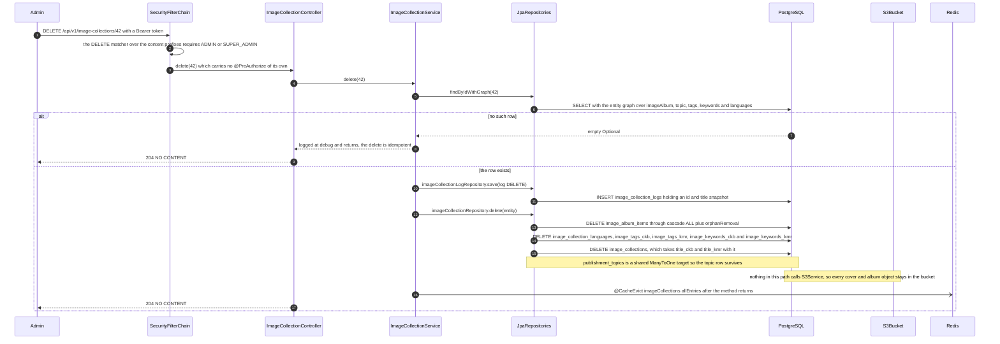

**What to notice**

- **No S3 delete happens here, or on any other content delete.** Across the whole service layer the
  only calls to `deleteFile` / `deleteFiles` / `deleteByKey` are in `MediaService.delete` and in the
  two singleton promo-video paths. Deleting a video, an image collection, a news item, a project, a
  writing or a sound track orphans every object it uploaded, permanently.
- The embedded bilingual content has no table of its own to delete. `title_ckb` and `title_kmr` are
  columns on `image_collections`, so they disappear with the parent row and are invisible in the
  cascade.
- Audit rows deliberately outlive the entity. `image_collection_logs.image_collection_id` is a plain
  `Long` with no foreign key, so the `DELETE` row remains queryable after the collection is gone.
- The log row is written *before* `repository.delete`, so a rollback drops both together — you never
  get a `DELETE` log entry for a delete that did not happen.
- Deleting a non-existent id is a 204, not a 404. Both `ImageCollectionService.delete` and
  `VideoService.deleteVideo` return silently on a missing row.

### The one delete path that cleans up S3

The singleton promo-video endpoints are the only deletes that also remove the object from the
bucket — and they do it in an order that can leave a dead URL behind. This is the exact inverse of
the failure above, which is why it is worth drawing beside it.

Source:
[`VideoService`](../../src/main/java/ak/dev/khi_backend/khi_app/service/publishment/video/VideoService.java).

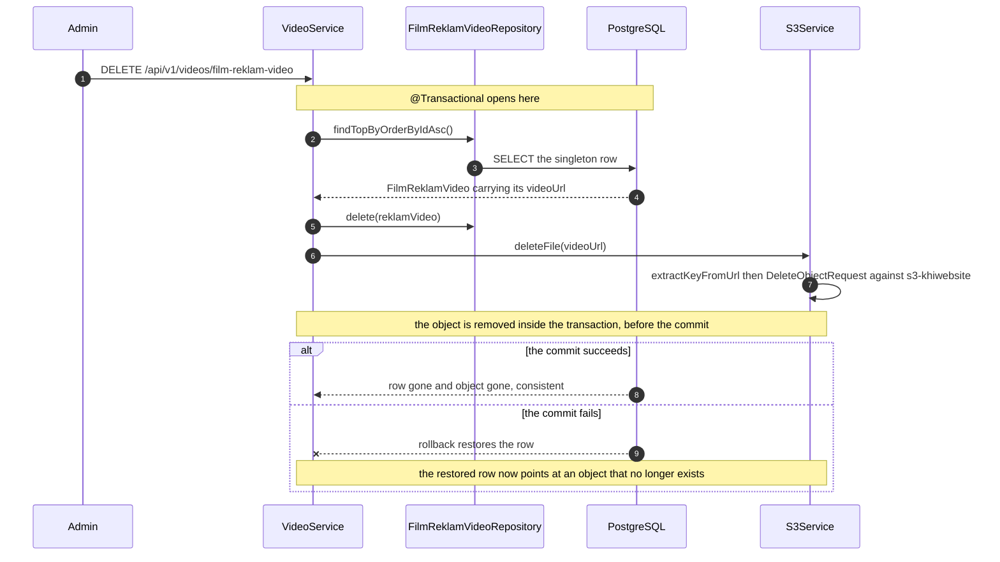

**What to notice**

- The delete is issued *inside* the transaction and cannot be undone by a rollback. This is the dead
  URL case: the row comes back, the object does not.
- `updateFilmReklamVideo` deliberately inverts the order — it uploads the replacement, saves the
  row, and only then deletes the previous object — so a failed upload leaves the existing video
  untouched. That is the safe ordering; the delete path did not get it.
- `SoundTrackService` has exactly the same pair of singleton promo-video methods with the same
  ordering, so the behaviour applies to the sound-reklam video too.

### Global search

One endpoint fans out over six content models. The interesting question is whether the fan-out is
concurrent — it looks like a natural place for `CompletableFuture` — and the answer from the code is
no. Six sections run one after another on the request thread, each doing exactly two queries.

Source:
[`GlobalSearchController`](../../src/main/java/ak/dev/khi_backend/khi_app/api/search/GlobalSearchController.java),
[`GlobalSearchService`](../../src/main/java/ak/dev/khi_backend/khi_app/service/search/GlobalSearchService.java).

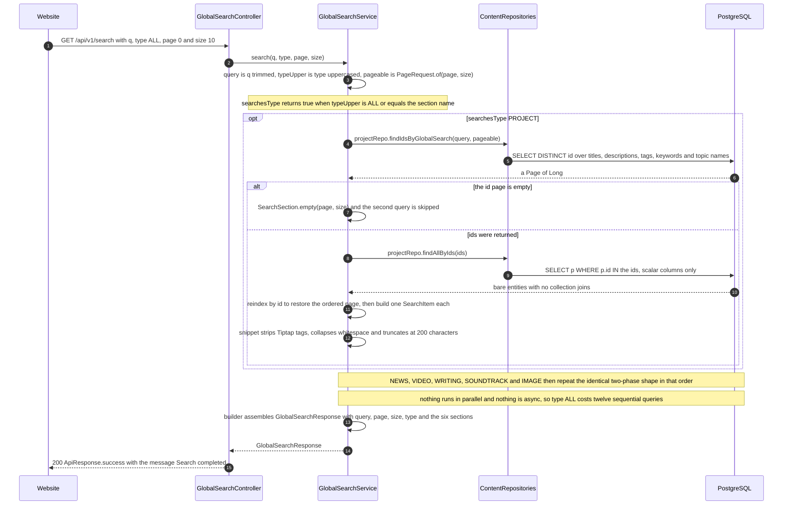

**What to notice**

- **Sequential, not parallel.** The six calls are plain `if` statements against a builder on one
  thread. Latency is the sum of twelve queries, not the max of six pairs.
- Two phases exist to dodge N+1, not to page twice. Phase one returns ids only so `DISTINCT` over
  the tag and keyword join tables stays cheap; phase two loads scalar columns and never touches a
  collection, so the `@BatchSize` annotations are never triggered.
- `size` is per **section**, not per response. `type=ALL` with `size=10` can return sixty items, and
  each section carries its own `totalElements` and `totalPages`.
- Sections not requested are `null`, not empty. With `type=NEWS` the other five fields are absent
  from the JSON entirely, which is a different shape from an empty section.
- Two parameters do less than they look like. `locale` is accepted by the controller and never
  passed to `search`, so every `SearchItem` carries both dialects regardless; and `q` is optional in
  effect, because a null or blank value becomes `""` and the `LIKE %%` pattern matches everything —
  which quietly turns the endpoint into an unfiltered browse.

### Assembling the featured rail

`GET /api/v1/featured` looks like it should read a curated `featured_items` table. It does not. The
rail is assembled at request time from a boolean column on seven different tables, sorted globally,
and then cut to a limit that lives in `site_settings`.

Source:
[`PublicSiteController`](../../src/main/java/ak/dev/khi_backend/khi_app/api/site/PublicSiteController.java),
[`LegacyFeaturedController`](../../src/main/java/ak/dev/khi_backend/khi_app/api/site/LegacyFeaturedController.java),
[`SiteContentService.getFeatured`](../../src/main/java/ak/dev/khi_backend/khi_app/service/site/SiteContentService.java).

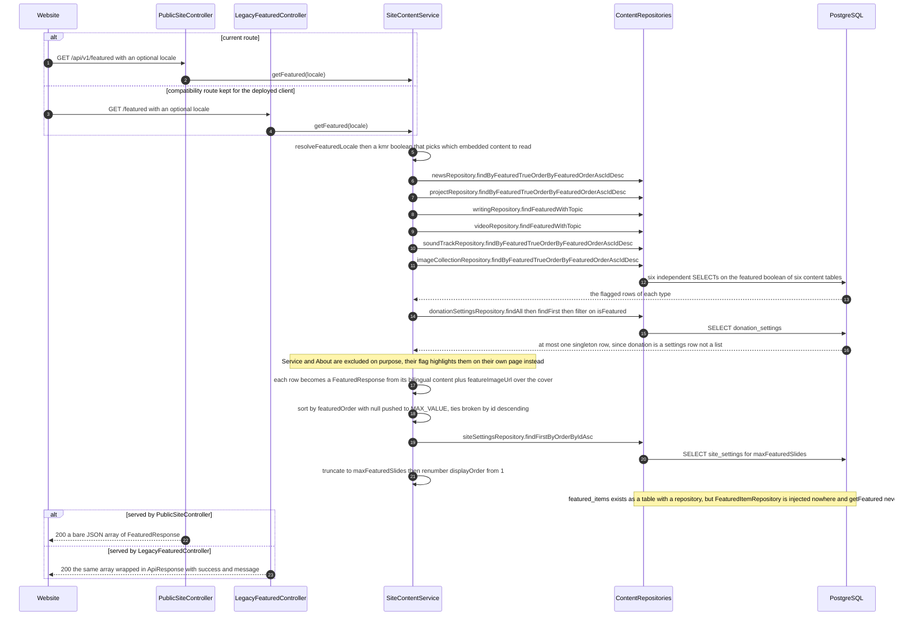

**What to notice**

- **`featured_items` is dead weight.** The entity, the table and `FeaturedItemRepository` all exist,
  but no class injects the repository. The rail is built purely from the per-entity `featured` /
  `featuredOrder` / `featureImageUrl` columns. Anything written into `featured_items` is invisible
  to the site.
- Two controllers, two response shapes, one service. `/api/v1/featured` returns a bare array;
  `/featured` returns the same array inside `ApiResponse`. `GET /featured` is `permitAll` by an
  explicit matcher, `/api/v1/featured` by the blanket `GET /api/v1/**` rule.
- `featured` means two different things depending on the domain. For the six publication types plus
  Donations it means "hero slide". For **Services and About** it means "highlight on your own page"
  — they are never collected here and take no share of `maxFeaturedSlides`.
- The cap is enforced on the **write** side, not the read side. Each `set...Featured` method calls
  `countAllFeatured()` and throws `IllegalStateException` — which `GlobalExceptionHandler` renders
  as `400` with `code = BAD_REQUEST` — when turning a flag on would exceed `maxFeaturedSlides`
  (default 7). Turning a flag *off* skips the check, and an already-featured record skips it too.
- A row with no `featuredOrder` is not dropped; it sorts to `Integer.MAX_VALUE` and competes at the
  back, broken by newest id first. `displayOrder` in the response is recomputed 1..N and is not the
  stored `featuredOrder`.

### Public submission and the admin queue

The contact form is the only write path an anonymous visitor can reach, and it demonstrates both
halves of the two-layer authorization model in one round trip: `permitAll` on the way in, a role
matcher on the way out, and a status field that any admin can move anywhere. The filter steps at
the top are the same ones drawn in
[The authenticated request](#the-authenticated-request); they are repeated here only to show that
an anonymous write is not exempt from them.

Source:
[`PublicSiteController`](../../src/main/java/ak/dev/khi_backend/khi_app/api/site/PublicSiteController.java),
[`SiteContentService`](../../src/main/java/ak/dev/khi_backend/khi_app/service/site/SiteContentService.java),
[`JWTAuthenticationFilter`](../../src/main/java/ak/dev/khi_backend/user/jwt/JWTAuthenticationFilter.java).

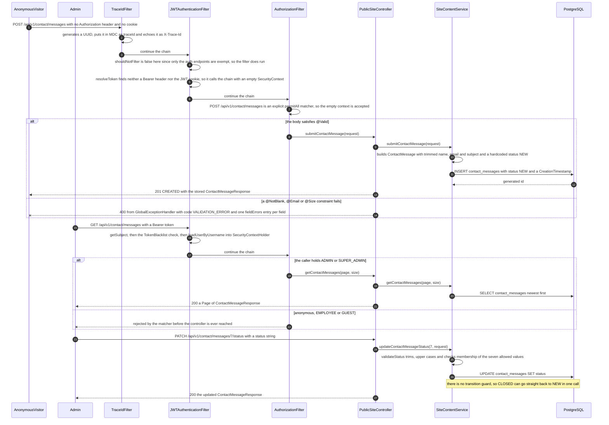

**What to notice**

- The JWT filter still runs on the anonymous request. `shouldNotFilter` only exempts the auth
  endpoints, so `POST /api/v1/contact/messages` passes through `JWTAuthenticationFilter`, which
  simply finds no token and calls the chain with an empty `SecurityContext`. The submission is
  authorized by the `permitAll` matcher, not by skipping the filter.
- Read and write asymmetry is the whole point. `POST` is `permitAll`; `GET` and `PATCH` on the same
  resource are matched to `ADMIN, SUPER_ADMIN`. An EMPLOYEE who can create news articles cannot read
  a single contact message.
- The status column is a plain `varchar(30)`, not an enum, and `validateStatus` only checks
  membership in `{NEW, PENDING, IN_REVIEW, APPROVED, COMPLETED, REJECTED, CLOSED}`. It never looks
  at the current value, so every one of the 49 transitions is legal. The same validator serves both
  donation types, which start at `PENDING` while contact messages start at `NEW`. The state machine
  is drawn in [`UML_STATE.md`](./UML_STATE.md#submission-status).
- An unknown status raises `IllegalArgumentException`, which `GlobalExceptionHandler` renders as
  `400` with `code = BAD_REQUEST` and `details.reason` — not `VALIDATION_ERROR`, which is reserved
  for `@Valid` field failures.
- Path-level denials never produce an `ApiErrorResponse`. `SecurityConfig` registers no
  `.exceptionHandling(...)`, so `JwtAuthenticationEntryPoint` and `JwtAccessDeniedHandler` are never
  installed and a matcher rejection is answered by Spring Security's own defaults. Only a
  `@PreAuthorize` denial reaches `GlobalExceptionHandler.handleAccessDenied` and comes back as a
  proper `403 FORBIDDEN` body with `traceId` and bilingual messages.

---

## Corrections against the catalogue

Everything below was drawn from the code rather than the written brief, and disagrees with it.

1. **The `user` package has no `GlobalExceptionHandler`.**
   `user/exceptions/GlobalExceptionHandler.java` contains only a private placeholder class,
   `UserExceptionHandlerPlaceholder`, with a comment explaining that two beans of that name collide
   at startup. There is exactly one `@RestControllerAdvice` in the application, in `khi_app`, and it
   is unscoped, so it also handles exceptions thrown by `user/api` controllers.
2. **`JwtAuthenticationEntryPoint` and `JwtAccessDeniedHandler` are dead code.** `SecurityConfig`
   never calls `.exceptionHandling(...)`, and nothing else in the source references either class.
   Spring Security's built-in defaults handle filter-level rejection instead, so an unauthenticated
   request to a protected path returns 403 rather than 401.
3. **`JWTAuthenticationFilter` writes its own error responses.** Expired, invalid and revoked tokens
   are answered with a two-field JSON body straight from the filter, never as `ApiErrorResponse`,
   and an invalid signature yields 403 while an expired token yields 401.
4. **Registration writes profile images to local disk, not to S3.**
   `UserService.storeProfileImage` uses `Files.copy` into `app.upload.dir`. S3 is used only by
   `UserProfileService`, behind `POST /api/user/profile-image`. The registration flow stores a
   relative path; the profile flow stores a full HTTPS URL, in the same column.
5. **The image is stored before the user row, not after.** The failure mode is an orphaned file with
   no row, never a user row with a broken image reference.
6. **`UserValidator.validatePassword` enforces length only**, 6 to 128 characters. There are no
   complexity rules, no personal-information checks and no password blocklist, despite the Javadoc
   on the method and the comments at every call site claiming all three. The disposable-domain
   blocklist is real but belongs to `validateAndNormalizeEmail`.
7. **`UserService.register` mislabels validation failures.** Its `catch (IllegalArgumentException)`
   block prefixes every message with `Invalid image: `, and both the email and password validators
   throw that type, so a disposable-email rejection is reported to the client as an image error.
8. **`UserService.resetPassword` returns 500 for a reused password.**
   `validatePasswordNotReused` throws `IllegalArgumentException`, which falls through to the generic
   `catch (Exception)` and produces `An error occurred while resetting your password.`
9. **`MediaMetadataExtractor` is never called in production code.** The brief lists it as a
   cross-cutting concern beside `S3Service` and `TiptapHtmlProcessor`. It is a `@Component`, it does
   work as documented, and it is exercised by `MediaMetadataExtractorTests` and
   `MediaMetadataExtractorRealFileTest` — but no service, controller or configuration class injects
   it. Image dimensions come from `javax.imageio.ImageIO` inline in `ImageCollectionService`
   instead, and no duration or bitrate is derived anywhere on a live request path.
10. **Content deletes never touch S3.** `S3Service` does expose `deleteFile`, `deleteByKey` and
    `deleteFiles`, but the only production callers are `MediaService.delete` and the singleton
    promo-video methods in `VideoService` and `SoundTrackService`. Every other delete orphans its
    objects.
11. **The Redis cache is not cross-cutting.** Only five cache names exist — `news`, `projects`,
    `soundTracks`, `imageCollections`, `services`. Videos and Writings are entirely uncached, and
    within a cached domain only the paginated list and search shapes are annotated.
12. **`featured_items` is an unused table.** The entity and `FeaturedItemRepository` exist and
    `ddl-auto: update` creates the table, but nothing injects the repository.
    `SiteContentService.getFeatured` builds the rail from per-entity `featured` columns.
13. **`ErrorCode` has more members than the brief lists.** Alongside the generic codes it carries a
    full four-member family per content domain — `*_NOT_FOUND`, `*_CONFLICT`, `*_VALIDATION`,
    `*_MEDIA_INVALID` for PROJECT, NEWS, VIDEO, IMAGE, SOUND and WRITING — plus `ACCOUNT_LOCKED`.
    The brief named only a scattered handful of these.
14. **`ApiErrorResponse` is bilingual, not trilingual.** It carries `messageEn` and `messageKu`
    always, plus one `message` resolved from `Accept-Language` — which is one of those two, not a
    third language. Some Javadoc in `GlobalExceptionHandler` calls this "trilingual"; the field set
    in `ApiErrorResponse` and `ApiFieldError` says otherwise, and this file uses "bilingual"
    throughout.

---

## Related

- [`./UML_STATE.md`](./UML_STATE.md) — the state machines these call flows drive: submission status,
  publication lifecycle, session and token lifetime, account lock.
- [`./UML_COMPONENT.md`](./UML_COMPONENT.md) — the same filter chain and the same services drawn as
  components, plus deployment and configuration.
- [`./UML_CLASS.md`](./UML_CLASS.md) — the Java types behind every participant above: the service
  interfaces, the embeddables and the exception hierarchy.
- [`./ER.md`](./ER.md) — the conceptual and logical data model behind every `INSERT` and `SELECT`
  drawn here.
- [`../external/`](../external/) — the endpoint reference: paths, request and response bodies,
  status codes, per-endpoint roles.
- [`../internal/`](../internal/) — service-layer and operational documentation.
- [`../database/`](../database/) — the physical schema: every table, column, index and constraint.
