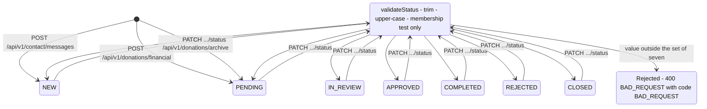
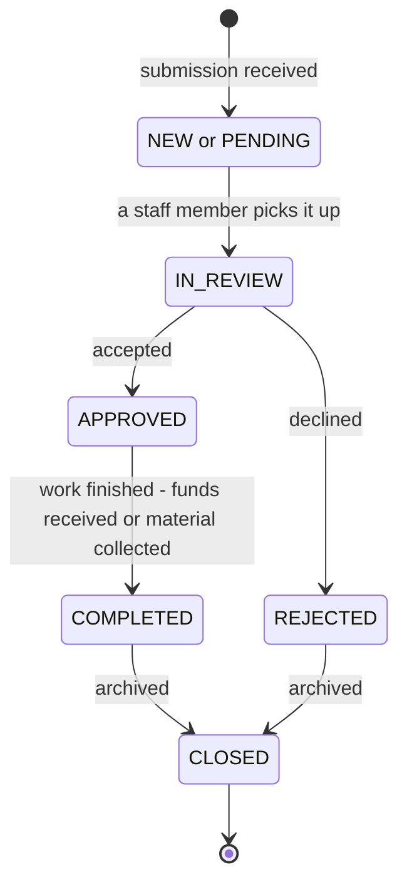
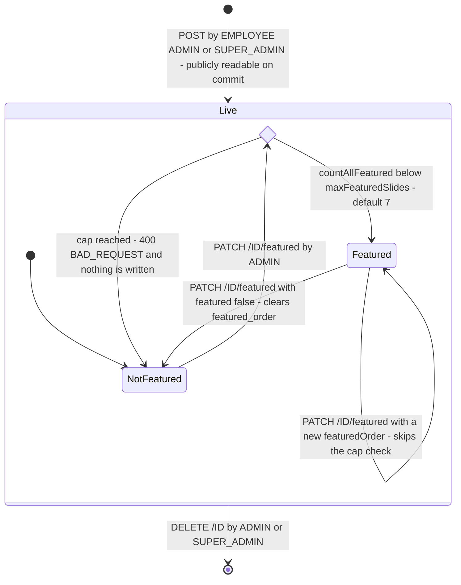
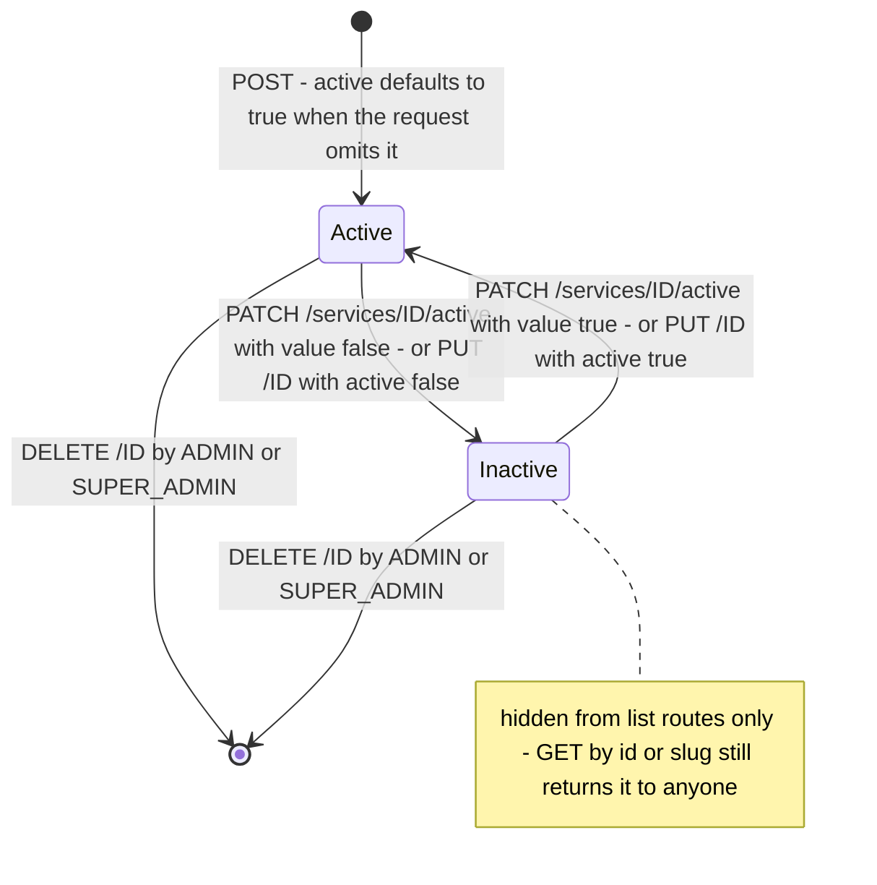
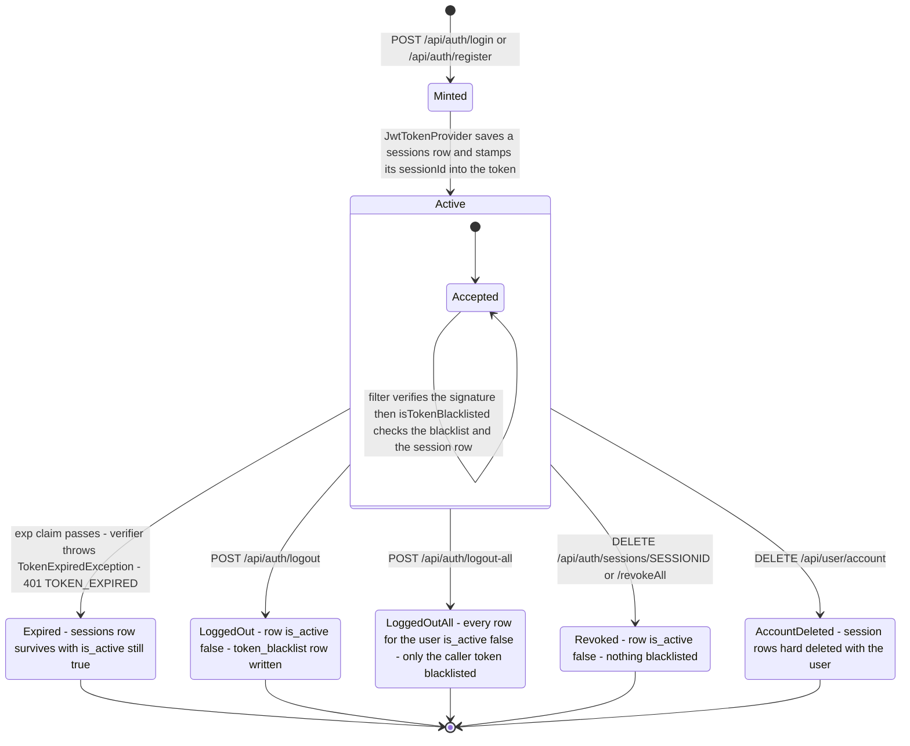
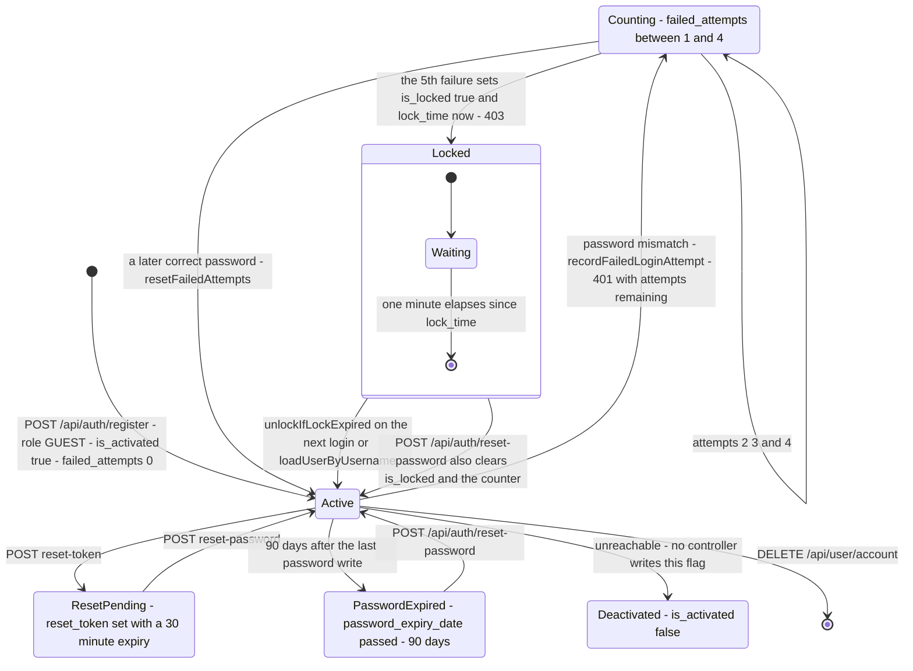
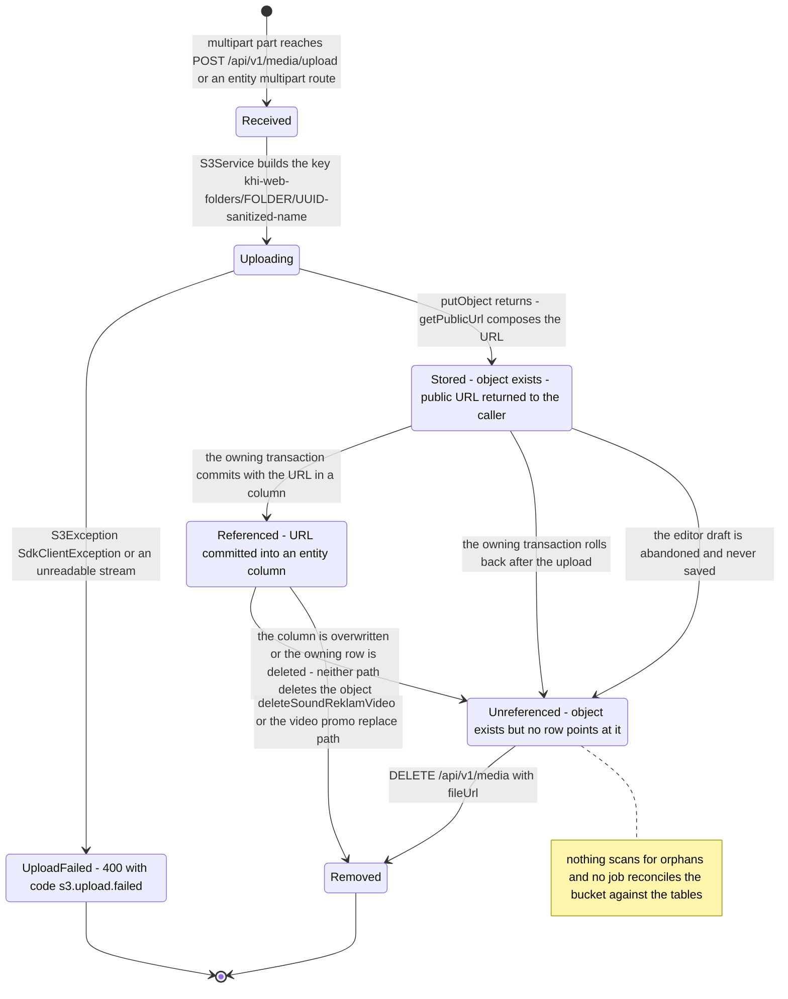
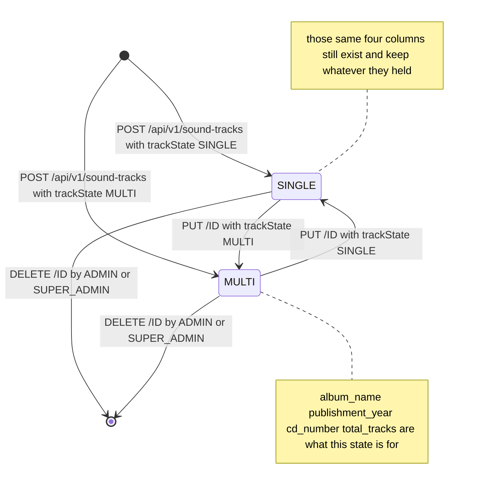

# State machines

Six lifecycles that the endpoint tables in [`docs/external/`](../external/) cannot show you: what
states a record can occupy, what moves it between them, and — more usefully — which states have no
exit at all. Every transition label below names a real trigger: an HTTP route, a service method, or
a clock.

Where the code disagreed with the written brief, the code won. Corrections are called out inline.

---

## Submission status

Contact messages, financial donations and archive donations all store their workflow position in a
plain `varchar(30)` column and all three route their updates through one private helper,
[`SiteContentService.validateStatus`](../../src/main/java/ak/dev/khi_backend/khi_app/service/site/SiteContentService.java).
That helper upper-cases the incoming string and checks it against a seven-element `Set<String>`.
That is the entire guard. It does not look at the current value, so every one of the seven statuses
can move to every other one, including back to the creation status.

### The machine as built

The hub in the middle is not a state — it is `validateStatus`. Drawing it as a hub is the honest
shape, because the helper is the only thing standing between the request and the column, and it has
no idea what the column currently holds.

**What to notice**

- There is no exit to `[*]`. No controller exposes a delete for contact messages, financial
  donations or archive donations —
  [`PublicSiteController`](../../src/main/java/ak/dev/khi_backend/khi_app/api/site/PublicSiteController.java)
  has `POST`, `GET` and `PATCH .../status` and nothing else. Every submission ever received is a
  permanent row. `CLOSED` and `REJECTED` are ordinary states you can walk back out of, not terminal
  ones.
- `COMPLETED --> NEW` is a legal, unlogged, 200-OK transition. So is `APPROVED --> PENDING`. The
  seven names read like a workflow but the code treats them as seven interchangeable labels.
- The column is `@Column(nullable = false, length = 30) private String status` on all three
  entities — see
  [`ContactMessage`](../../src/main/java/ak/dev/khi_backend/khi_app/model/site/ContactMessage.java),
  [`FinancialDonation`](../../src/main/java/ak/dev/khi_backend/khi_app/model/site/FinancialDonation.java)
  and [`ArchiveDonation`](../../src/main/java/ak/dev/khi_backend/khi_app/model/site/ArchiveDonation.java).
  With `ddl-auto: update` and no enum and no check constraint, PostgreSQL will accept any 30-character
  string written by anything that is not this service.
- The two entry points differ: contact messages start at `NEW`, both donation types start at
  `PENDING`. Nothing stops a `PATCH` from putting a donation into `NEW` or a contact message into
  `PENDING`, so after the first edit the two vocabularies are indistinguishable.
- A bad value throws `IllegalArgumentException`, which the `khi_app`
  [`GlobalExceptionHandler`](../../src/main/java/ak/dev/khi_backend/khi_app/exceptions/GlobalExceptionHandler.java)
  turns into a 400 carrying `ErrorCode.BAD_REQUEST` — a generic code, not a submission-specific one.

### The workflow the names imply — a recommendation, not current behaviour

Nothing below is enforced by the code today. This is the shape the seven names suggest the team had
in mind, drawn so there is something concrete to compare the real machine against.

**What to notice**

- To enforce this you need three changes, none of which exist yet: replace the `String` column with
  a `@Enumerated(EnumType.STRING)` field over a real `SubmissionStatus` enum; give `validateStatus`
  the current value as a second argument and have it consult an allowed-successor map; and move
  `IN_REVIEW`, `APPROVED`, `COMPLETED` off the public shape so `NEW` and `PENDING` stay
  creation-only.
- The enum change alone is worth more than the transition guard. Today a typo that survives
  `toUpperCase` — a status written by a migration script or a psql session rather than by this
  service — will be read back and served without complaint.
- `CLOSED --> [*]` in this picture means "no further transitions", not "row deleted". A delete route
  would be a separate decision, and a legal one to avoid: donation and contact records are the kind
  of thing you keep.

---

## Content publication lifecycle

There is no draft state anywhere in `khi_app`. This is the first correction against the brief: the
six carousel-eligible publication types — News, Project, Writing, Video, SoundTrack,
ImageCollection — carry **no `active` or `published` flag at all**. The only lifecycle flag they own
is `featured`. The moment a `POST` commits, the record is served by
`GET /api/v1/**`, which
[`SecurityConfig`](../../src/main/java/ak/dev/khi_backend/user/configs/SecurityConfig.java)
declares `permitAll()`. Creating is publishing.

### The six publication types

The interesting machinery is not "visible or not" — that is settled at insert. It is the homepage
carousel cap, a single global budget shared across six entity types plus the donation settings row.

`PUT /{id}` is not drawn: an ordinary edit by an EMPLOYEE changes the body and leaves both flags
where they were, so it is a self-loop on whichever state the record is in. Unfeaturing clears
`featured_order` but leaves `featureImageUrl` in place, ready for the next time.

**What to notice**

- `PATCH /{id}/featured` with an empty body **features** the record. `FeaturedRequest.featured` is a
  `Boolean` and every setter reads
  `boolean turningOn = request.getFeatured() == null || request.getFeatured()`. The controllers bind
  it with a bare `@RequestBody` and no `@Valid`, so the `@NotBlank` fields on that DTO are never
  checked on this route.
- The cap is global, not per-type. `countAllFeatured()` sums `countByFeaturedTrue()` across all six
  repositories and adds one if the donation settings row is featured. The limit comes from
  `SiteSettings.maxFeaturedSlides`, defaulting to
  [`DEFAULT_MAX_FEATURED_SLIDES = 7`](../../src/main/java/ak/dev/khi_backend/khi_app/model/site/SiteSettings.java).
  A seventh featured video is what stops an admin featuring a news article.
- The `!entity.isFeatured()` half of the guard is deliberate: re-ordering something already featured
  never re-checks the budget, so an admin can always fix the running order of a full carousel.
- **Role correction.** The brief says "ADMIN features", and the baseline in `SecurityConfig` would
  let SUPER_ADMIN through. But all six toggles carry `@PreAuthorize("hasRole('ADMIN')")` and the
  project defines **no `RoleHierarchy` bean** —
  [`Role.getAuthorities()`](../../src/main/java/ak/dev/khi_backend/user/enums/Role.java) grants
  exactly one `ROLE_` authority per user. A SUPER_ADMIN therefore gets 403 on
  `PATCH /api/v1/news/{id}/featured`. That is almost certainly not intended.
- Featuring does **not** evict the entity cache. Only `setServiceFeatured` carries a `@CacheEvict`;
  `setNewsFeatured` and its five siblings do not. `GET /api/v1/news/featured` is uncached and updates
  at once, but the cached list route `GET /api/v1/news` can keep serving `featured: false` on that
  same record for up to the 10-minute Redis TTL.

### The active-flagged types

About pages, Contact pages, Services and the small site rows — team members, partners, social links,
nav menu items, featured items — are the only records with an `active` boolean. It behaves less like
a publication flag than the name suggests.

**What to notice**

- Deactivation hides a row from the index, not from the web. `AboutService.getAllActive` uses
  `findAllByActiveTrueOrderByDisplayOrderAsc`, but `getBySlug` and `getByIdentifier` call
  `findBySlugCkbOrSlugKmr` and `findById` with no `active` predicate — see
  [`AboutService`](../../src/main/java/ak/dev/khi_backend/khi_app/service/about/AboutService.java).
  [`ServiceService.getById`](../../src/main/java/ak/dev/khi_backend/khi_app/service/service/ServiceService.java)
  is the same. Anyone holding the slug of a deactivated page still gets 200 and the full body.
- Only Services get a dedicated toggle route. About, Contact and the site rows flip `active` through
  the ordinary `PUT`, so deactivating a team member means resending the whole object.
- **Role correction.** Writes to `/api/v1/services/**`, `/api/v1/about/**` and `/api/v1/contact/**`
  are `hasAnyRole("ADMIN","SUPER_ADMIN")`, not EMPLOYEE. The "EMPLOYEE writes" pattern covers only
  the seven content prefixes listed in `SecurityConfig`: projects, news, videos, image-collections,
  sound-tracks, albums, writings.
- Featuring is a separate axis here and follows different rules: `setAboutFeatured` and
  `setServiceFeatured` take **no share of the carousel cap** — an About feature is that page's hero
  image, a Service feature is a rail entry on the Services page — and both require a slide image,
  throwing 400 if `featureImageUrl` is blank. Both accept SUPER_ADMIN, unlike the six carousel
  toggles.

---

## Session and token lifecycle

A JWT and its `sessions` row are minted together and die together, but they die in five different
ways and leave five different residues in the database. The token is stateless; the row is what makes
revocation possible at all.
[`TokenService.isTokenBlacklisted`](../../src/main/java/ak/dev/khi_backend/user/service/TokenService.java)
is the choke point — and note that it returns `true` (deny) when the session row is *missing*, so
deleting a row is as good as blacklisting.

**What to notice**

- `isTokenBlacklisted` denies on four separate grounds, and only the first is an actual blacklist
  row: token present in `token_blacklist`; no `sessionId` claim; **no session row for that
  `sessionId`**; or the row is inactive or past its `expiresAt`. That third ground is why account
  deletion works — `UserProfileService.deleteAccount` never blacklists anything, it just deletes the
  rows, and every outstanding token for that user dies on the next request.
- Only `POST /api/auth/logout` writes a `token_blacklist` row. Revoking a session from
  [`SessionAPI`](../../src/main/java/ak/dev/khi_backend/user/api/SessionAPI.java) flips
  `is_active` and nothing else; `logout-all` flips every row but blacklists only the token in the
  caller's own hand. The blacklist table is a redundant second lock on one door.
- **Natural expiry is the leaky end state.** Nothing flips `is_active` when a token's clock runs out
  — the filter rejects the token and returns, the row is untouched. Since
  `GET /api/auth/sessions/getAllSessions` queries `findByUserAndIsActive(user, true)`, that endpoint
  lists long-dead sessions as if they were live devices.
- There is **no `@Scheduled` anywhere in the codebase**. Neither `sessions` nor `token_blacklist`
  is ever pruned, so both grow without bound. Every blacklist row is also dead weight the moment its
  own `expires_at` passes, since the token would fail signature verification anyway.
- Registration mints a session too.
  [`UserService.register`](../../src/main/java/ak/dev/khi_backend/user/service/UserService.java)
  calls `generateToken` before returning 201, so a user who registers and never logs in still owns a
  live session row.
- Changing a password does not end any session. Neither `UserProfileService.changePassword` nor
  `UserService.resetPassword` touches `sessions` or the blacklist, so a stolen token outlives the
  password it was issued against, up to the full `JWT_EXPIRATION_MS` window.

---

## Account state

Registration, the failed-login counter, the one-minute lock, the reset token and deletion. The lock
is drawn as a composite because the only thing that leaves it is a clock, checked lazily on the next
attempt rather than by a timer.

While the lock window is open every login attempt returns 403 without touching the counter. A reset
token that simply runs out of time is not drawn either: `resetPassword` refuses it with a 400 and
the two stale columns stay exactly as they are.

**What to notice**

- The lock has no timer. `unlockIfLockExpired` runs at the top of `login` and of
  `loadUserByUsername`, so the row stays `is_locked = true` until somebody tries again — a locked
  account left alone for a week is still locked in the database, and unlocks itself on the next
  attempt. The window is `LOCK_DURATION_MINUTES = 1` from
  [`SecurityConstants`](../../src/main/java/ak/dev/khi_backend/user/consts/SecurityConstants.java);
  `MAX_FAILED_ATTEMPTS = 5`.
- `User.isAccountNonLocked()` re-derives the same one-minute rule independently of
  `unlockIfLockExpired`. Two implementations of the lock window sit in two files; they agree today
  because both read the same constant.
- **`Deactivated` is unreachable over HTTP.** `is_activated` is written only by
  `UserService.createUser` and `UserService.updateUser`, and **neither has a controller** — nothing
  in the codebase calls them. `SecurityConfig` reserves `/api/users/**` for SUPER_ADMIN, but no
  handler is mapped there. The flag exists, `isEnabled()` reads it, and no request can flip it.
- Consequently the only deletion path is self-service `DELETE /api/user/account`. There is no
  administrative way to remove or disable a user through the API.
- `ResetPending` is drawn as an exclusive state for readability, but `reset_token` is really an
  orthogonal pair of columns — a locked account can hold a live reset token, and using it is the
  documented way out of a lock without waiting.
- An expired reset token is never cleared. `resetPassword` refuses it with a 400 and leaves
  `reset_token` and `reset_token_expiration` populated; only a successful reset nulls them.

---

## Upload lifecycle

A file's journey from multipart part to S3 object to a URL in a column — and the several ways it can
end up as an object nobody references. `Unreferenced` is the state worth staring at: it is reached
by ordinary, non-exceptional behaviour, and nothing in the system ever leaves it on its own.

**What to notice**

- **The upload always commits before the database does.** `SoundTrackService.create` uploads every
  cover and audio file inside the try block and only then calls `repository.save`; the same shape
  appears in the other multipart services. S3 has no transaction to join, so any exception after the
  first `putObject` — a validation failure, a constraint violation, a rollback — leaves objects
  behind with nothing pointing at them.
  [`TiptapHtmlProcessor`](../../src/main/java/ak/dev/khi_backend/khi_app/service/media/TiptapHtmlProcessor.java)
  has the same property and is used by every module with an HTML body.
- **No content delete removes S3 objects.**
  [`SoundTrackService.delete`](../../src/main/java/ak/dev/khi_backend/khi_app/service/publishment/sound/SoundTrackService.java)
  writes an audit log and calls `repository.delete(entity)` — the covers, the audio files and the
  attachments stay in the bucket forever. Grepping `s3Service.deleteFile` across all of `khi_app`
  returns five call sites: four are the sound and video promo-video replace/delete paths, and the
  fifth is `MediaService.delete`. News, Project, Writing, Image, About, Contact and Service never
  delete anything from S3.
- `Removed` is optimistic. Both
  [`S3Service.deleteFile` and `deleteByKey`](../../src/main/java/ak/dev/khi_backend/khi_app/service/S3Service.java)
  catch their exceptions and log them — the comments say so explicitly ("Don't throw - deletion
  failure shouldn't break business logic"). A failed delete returns normally, so a caller can never
  learn the object survived.
- `DELETE /api/v1/media?fileUrl=...` is the only cleanup tool, it takes one URL at a time, and its
  own Javadoc calls it "reserved for future S3-orphan cleanup". It is ADMIN or SUPER_ADMIN, since
  `SecurityConfig` puts all of `/api/v1/media/**` behind those two roles.
- Keys are `khi-web-folders/{folder}/{uuid}-{sanitized name}`, where `folder` is one of `images`,
  `video`, `audio`, `files`, `albums`, `covers` or `hover`. The UUID is generated per upload, so
  re-uploading the same file never overwrites — it adds. There is no content-hash de-duplication.

---

## Track state

`TrackState` is a two-value enum on
[`SoundTrack`](../../src/main/java/ak/dev/khi_backend/khi_app/model/publishment/sound/SoundTrack.java),
`SINGLE` or `MULTI`, stored as `@Enumerated(EnumType.STRING)` in a `varchar(10)` and required at
create time. The question worth answering is whether it can change afterwards. It can.

A `PUT` that omits `trackState` leaves the value alone, so it is a self-loop on both states and is
not drawn.

**What to notice**

- **Switching is allowed and unguarded.** `SoundTrackService.update` contains
  `if (dto.getTrackState() != null) entity.setTrackState(dto.getTrackState());` and that is the
  whole story — no check of the current value, no check of what is attached, no cleanup. This answers
  the open question explicitly: the transition exists, in both directions, at any time.
- Demoting `MULTI` to `SINGLE` leaves `album_name`, `publishment_year`, `cd_number` and
  `total_tracks` populated with stale album metadata, and leaves every `SoundTrackFile` attached.
  Nothing is nulled and nothing is detached.
- Neither state constrains the record's shape. `validateCreate` requires `soundType`, a non-null
  `trackState` and at least one content language, and stops there. A `SINGLE` track may carry twenty
  audio files; a `MULTI` album may carry none. Attachments are explicitly available to both — the
  code comments say so.
- The two helper methods on the entity that encode the intended difference,
  `isMulti()` and `isMultiAlbumOfMemories()`, are **never called anywhere in the codebase**. The
  distinction is real in the data model and entirely unenforced in the service layer.
- The one place `TrackState` genuinely does work is reading:
  `GET /api/v1/sound-tracks/by-state?state=MULTI` filters on the indexed `track_state` column, so a
  mid-life switch silently moves a record between two public listings.

---

## Related

- [`./UML_SEQUENCE.md`](./UML_SEQUENCE.md) — the request-by-request call flows behind these
  transitions, including the filter chain and the multipart upload path.
- [`./FLOWCHARTS.md`](./FLOWCHARTS.md) — branch-level decision logic, including authorization
  resolution and error mapping.
- [`../database/FIELDS.md`](../database/FIELDS.md) — the columns every state above is stored in,
  with their real types and nullability.
